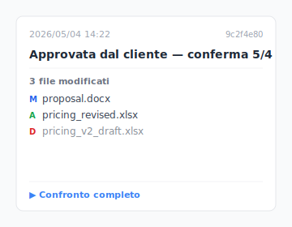

Giovedì sera, le 23:47. Sul desktop stai cercando la versione che il cliente ha firmato oggi pomeriggio. Undici file chiamati `Proposta_v*_FINALE.docx` sono lì, quale è la copia firmata, quale ha le tue annotazioni, quale è la revisione ricevuta su WhatsApp. Hai paura di cancellarne uno. Tenerli tutti significa non trovare quello che ti serve.

Non è un caso isolato. Capita a chiunque lavori con Cmd+S (o Ctrl+S). Prima vediamo il perché, poi tre design di strumenti che lo risolvono.

## Indice

- [Perché finisci a chiamare i file `_v3_FINALE`](#why-naming)
- ["Troppe versioni" sono in realtà 4 dolori diversi](#four-types)
- [Stai facendo la cosa giusta, lo strumento non ha raccolto il testimone](#tool-side)
- [Tre design di strumento che lo risolvono](#three-designs)
- [Quando non è lo strumento giusto](#boundaries)

## Perché finisci a chiamare i file `_v3_FINALE` {#why-naming}

Cmd+S è un'azione permanente. Il momento in cui lo premi, la versione precedente è sovrascritta. Non c'è un pulsante "la versione di mezz'ora fa" che ti aspetta. PSD per i designer, contratti `.docx` per gli avvocati, tesi per i dottorandi, stessa storia ovunque. **Se non lo nomini, lo perdi.** Quindi aggiungi `_v3`, `_FINALE`, `_VERO_FINALE` al nome del file.

Sì, ecco la parte fastidiosa. Quello che fai non è ossessivo. È un riflesso di sopravvivenza contro un OS che non ti ha mai dato un pulsante undo.

## "Troppe versioni" sono in realtà 4 dolori diversi {#four-types}

Apri "troppe versioni" e trovi quattro problemi completamente diversi. Ognuno richiede una soluzione diversa.

| # | Tipo di dolore | Scena tipica |
|---|---|---|
| 1 | **Sovrascrittura utente** | Premi Cmd+S, poi realizzi "aspetta, la versione di mezz'ora fa era quella giusta" |
| 2 | **Loop feedback cliente** | `Contratto_v3_note_cliente.docx` / `Proposta_v5_capo_vuole_modifiche.docx` ping-pong infinito |
| 3 | **Conflitto sync cloud** | Dropbox / OneDrive: entrambi i lati modificano, ottieni `Proposta (copia in conflitto di Bill).docx` |
| 4 | **Residui salvataggio automatico software** | File `.asd` di Word / `.bak` di Premiere / `.psb` di PSD sparsi ovunque |

Pensi di risolvere una cosa, ma in realtà ne sono quattro. Il Tipo 1 ha bisogno di preservazione automatica delle versioni. Il Tipo 2 ha bisogno di freezing dei milestone. Il Tipo 3 ha bisogno di risoluzione conflitti sync. Il Tipo 4 ha bisogno di formazione sullo strumento. **Diagnostica quale hai prima di inseguire una soluzione.**

## Stai facendo la cosa giusta, lo strumento non ha raccolto il testimone {#tool-side}

Aggiungere `_v3_FINALE` a un nome di file è logicamente corretto — devi segnare il significato di ogni versione. L'errore non è tuo; è che il livello dello strumento non ha mai fornito "checkpoint automatici" o "milestone automatici", e quindi scarica la responsabilità sul nome del file. Usi l'unico strumento che hai — il nome del file — perché è l'unica cosa disponibile.

I blog di produttività ti diranno di "avere una convenzione di denominazione," far circolare un PDF di standard di denominazione di 14 pagine, far memorizzare alla squadra l'ordine dei prefissi. Suona ragionevole. In pratica, dura tre giorni.

Il problema: **le regole spingono la responsabilità della gestione versioni sulla disciplina umana.** E la disciplina non vince mai contro l'automazione. Oggi ricordi `2026-05-04_Proposta_v3_firmata.docx`. Domani sei di fretta e diventa `Proposta_v3_FINALE.docx`. Il giorno dopo il cliente manda un altro giro ed è `Proposta_v3_FINALE_v2.docx`.

Stai facendo la cosa giusta. Nominare `_v3_FINALE` è un riflesso di sopravvivenza ragionevole. È solo che questo riflesso di sopravvivenza non avrebbe dovuto essere necessario.

## Tre design di strumento che lo risolvono {#three-designs}

Tre pattern di design che lo strumento può usare. Ognuno risolve uno dei quattro tipi di dolore sopra.

### Design A: Checkpoint automatici (le versioni che salvi vengono conservate)

Salvi una versione e lo strumento conserva silenziosamente la versione precedente. Non devi nominare niente. **Esempi**: macOS Time Machine ([lo strumento integrato di Apple che fa snapshot ogni ora](https://support.apple.com/it-it/104984)), Word AutoSave (torna indietro solo di 1-2 versioni), [Dropbox cronologia versioni 30 giorni](https://help.dropbox.com/delete-restore/version-history-overview). **Keeply** fa questo in background sulla tua cartella di lavoro — conserva le versioni che salvi (manualmente con una nota, o tramite il salvataggio automatico opzionale a intervalli): i file di testo memorizzano solo cosa è cambiato, mentre file di design e immagini conservano per intero ogni snapshot — così i file grandi non saturano il disco. **Risolve Tipo 1.**

E come ritrovi uno di quei checkpoint silenziosi più tardi? Passa il mouse su una riga qualsiasi della timeline e Keeply mostra una scheda fluttuante con i file cambiati in quel salvataggio — non devi aprire niente per confrontarli:

Clicca per aprire il diff completo o tasto destro per ripristinare direttamente. Niente più nomi tipo `_v3_FINALE_v2_definitivo.docx` per ricordare quale versione è quale.

### Design B: Milestone nominati (segni tu "cliente firmato" o "rilasciato")

Marchi attivamente "questa versione è firmata" o "questa versione è andata in produzione", da quel momento, qualunque cosa cambi, il milestone resta. **Esempio**: GitHub Releases (una funzione che gli ingegneri usano per congelare uno snapshot di codice come milestone nominato — territorio per soli sviluppatori). **Keeply** ha una funzione "Release" che fa lo stesso lavoro senza che tu debba imparare terminologia da sviluppatore: prendi una versione dalla cronologia, clicca "congela come release", e quella versione resta recuperabile per sempre. **Risolve Tipo 2.**

### Design C: Ripristino singolo file (tira fuori un file dalla cronologia)

Ripristina un **singolo file** da qualunque versione storica, senza fare rollback dell'intera cartella. **Esempi**: ripristino singolo file Dropbox, ripristino singolo file Time Machine. **Keeply** aggiunge ricerca nel contenuto delle versioni — se ricordi "ho cambiato qualcosa la settimana scorsa", puoi cercare dentro le modifiche passate, individuare la versione, e tirare fuori solo quel file. **Risolve scenari combinati Tipo 1+2.**

Noterai che dei quattro tipi di dolore, solo il Tipo 4 (residui salvataggio automatico software) prende una strada diversa: è un problema di formazione sullo strumento (impara a pulire le cache), non di gestione versioni.

## Quando non è lo strumento giusto {#boundaries}

Keeply non risolve ogni scenario:

- **Materiale video grezzo**: Decine di GB di footage Premiere accumulati ogni giorno. Il disco non basta. Keeply non è una soluzione di archiviazione fredda.
- **Cartelle con oltre 1M di file**: Keeply è progettato per cartelle di lavoro da centinaia a migliaia di file. Oltre rallenta.
- **Conflitti merge cross-team frequenti**: L'UI di risoluzione conflitti di Keeply è ancora limitata.
- **Bloccare versioni finali contratti / consegne cliente**: È uno scenario che dovrebbe essere nominato manualmente. Lo strumento non dovrebbe automatizzarlo.

## Prima di premere Cmd+S la prossima volta

La prossima volta che premi Cmd+S, non avrai paura "e se questa fosse la versione sbagliata", perché il "se" non esiste più. Ogni versione è ancora lì. Devi solo trovarla.

Vuoi vedere come Keeply fa questo? [Continua a leggere "Guida completa alla gestione versioni file".](/it/post/file-version-management-complete-guide/)

---

> A proposito dell'autore: Ting-Wei Tsao, fondatore di Keeply.
> [LinkedIn](https://www.linkedin.com/in/ting-wei-tsao-b57480152/)
