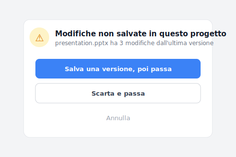

Hai cercato "software di controllo versione." Cosa è uscito: tutorial git, svn, Mercurial. Comandi CLI, schermate terminali, commit/push/merge. Cinque minuti di lettura, poi molli. Non sei uno sviluppatore, sei un designer, un amministrativo, un freelance. Volevi solo un software di controllo versione con un'interfaccia dove puoi vedere il file.

Non è un caso isolato. È il risultato di Google che tratta "controllo versione" come una query 100% sviluppatore. Vediamo perché, poi tre alternative per non-sviluppatori.

## Indice

- [Perché non trovi nulla oltre git](#why-only-git)
- [Quattro requisiti di design che i non-sviluppatori serviono davvero](#four-requirements)
- [La chiave: nascondere il mechanism git dietro l'UI](#hide-git-key)
- [Tre alternative per non-sviluppatori](#three-options)
- [Quando non è lo strumento giusto](#boundaries)

## Perché non trovi nulla oltre git {#why-only-git}

L'intent di ricerca "software di controllo versione" è in realtà **misto**: metà è dev (vuole confrontare git/svn/Mercurial), metà è non-sviluppatore (vuole un'UI dove i file sono visibili).

Ma il SERP di Google **mostra il 100% della metà dev**: Atlassian, GitHub, Stack Overflow occupano i top. La domanda non-sviluppatore è invisibile.

Non è ovvio finché non ci sbatti: non trovi nulla perché gli strumenti di cui hai bisogno sono spinti nell'angolo del SERP, non perché stai cercando male.

## Quattro requisiti di design che i non-sviluppatori serviono davvero {#four-requirements}

Apri "cosa dovrebbe fare un software di controllo versione" e trovi quattro requisiti che git/svn non soddisfa:

| # | Requisito | Perché git/svn non lo soddisfa |
|---|---|---|
| 1 | **UI a livello file** | git è unità commit/blob, non mappa direttamente ai file |
| 2 | **No CLI richiesta** | git è CLI-first (wrapper GUI esistono ma curva di apprendimento ripida) |
| 3 | **Supporto file binari** | git è ottimizzato per testo, soffre con PSD/DWG/MP4 (LFS richiede setup separato) |
| 4 | **UI di ripristino intuitiva** | i concetti git checkout/reset/revert sono confusi |

git è stato **progettato per codice testuale**. I casi d'uso designer / amministrativo per gestione file sono incompatibili dall'inizio.

## L'industria software ha risolto il controllo versione 20 anni fa — perché non è arrivato ai non-sviluppatori? {#hide-git-key}

L'industria software ha risolto il controllo versione 20 anni fa: un ingegnere preme salva, l'intera storia del progetto è preservata in modo pulito. Il problema è che quel livello di strumenti non è mai arrivato ai non-sviluppatori.

Non è che la tecnologia non si possa applicare. È che le assunzioni di design non sono mai passate. Il vocabolario (branch, merge, HEAD), il flusso di default (commit prima di cambiare), l'UI (terminale nero) — tutto presuppone che l'utente sia già un ingegnere. Se non lo sei, quel toolset non ha nulla da dirti.

Quello che i non-sviluppatori servono davvero è **un controllo versione progettato per loro dal primo giorno**, non strumenti da ingegnere con una palette di colori diversa. Keeply prende questa strada: non presume che tu conosca git, non ti insegna git, progetta la cronologia versioni dalla prospettiva del livello file da zero.

Persino l'unico strato che gli strumenti da ingegnere ti costringono a imparare — `git stash` — qui viene saltato. Quando hai modificato questo progetto senza salvare una versione e provi a passare alla cartella di un altro cliente, Keeply ti ferma con una domanda in linguaggio quotidiano:

«Salva una versione, poi passa» è esattamente il `git stash` + `git checkout` che dovresti digitare nel mondo da ingegnere — ripiegato in due pulsanti in italiano corrente.

È la parte fastidiosa. Atlassian, GitHub, Stack Overflow parlano tutti agli sviluppatori. Nessuno ha risposto alla domanda ovvia — come sarebbe un controllo versione se fosse stato costruito per i non-sviluppatori in primo luogo?

## Tre alternative per non-sviluppatori {#three-options}

Tre opzioni per non-sviluppatori, ognuna con trade-off:

### Opzione A: macOS Time Machine (integrato in Mac)

Strumento integrato di Apple dal 2007: collega un disco esterno e il sistema [fa snapshot automatico dell'intero disco ogni ora](https://support.apple.com/it-it/104984), aprire un file di 3 mesi fa sono due click. **Pros**: gratis, UI a livello file, no comandi, funziona con tutto. **Cons**: solo Mac, ripristino con animazione timeline leggermente goffo, niente "congela come milestone". **Adatto a**: utenti Mac individuali, recupero occasionale.

### Opzione B: Dropbox version history (limite 30 giorni)

[Versioni preservate automaticamente fino a 30 giorni](https://help.dropbox.com/delete-restore/version-history-overview), ripristino via click destro "Versioni precedenti" sul file. **Pros**: cross-platform, condivisione facile. **Cons**: spariscono dopo 30 giorni, no diff a livello cella, problema copia in conflitto ([vedi altro articolo](/it/post/dropbox-conflicted-copy/)). **Adatto a**: editing collaborativo entro 30 giorni.

### Opzione C: Keeply

Costruito per non-sviluppatori dal primo giorno: le versioni che salvi conservate automaticamente (manualmente con una nota, o tramite il salvataggio automatico opzionale a intervalli), cronologia versioni mostrata come "data + cosa è cambiato", zero terminologia ingegneristica nell'UI. **Pros**: UI a livello file, niente CLI, file grandi gestiti, niente limite di tempo, puoi congelare una versione come "Release" così i salvataggi successivi non possono sovrascriverla. **Cons**: desktop-first (più debole su mobile), sync istantaneo non è il suo forte, non per editing multi-persona in tempo reale. **Adatto a**: designer, dottorandi, freelance, piccoli team, esigenze di versioning a lungo termine, lavoro con molti file di design.

Scegli per use case: (1) solo recupero ad-hoc → Time Machine, (2) collab team entro 30 giorni → Dropbox, (3) lungo termine + individuale + file design → Keeply.

## Quando non è lo strumento giusto {#boundaries}

Onestamente, Keeply non è per tutti:

- **Sviluppatori veri**: vogliono usare il terminale e vedere la struttura grafica della cronologia versioni — Keeply nasconde troppo apposta
- **Aziende grandi**: nessuna integrazione SSO / Active Directory
- **Utenti mobile-first**: Keeply è desktop-first
- **Editing multi-persona in tempo reale**: il co-editing di Microsoft 365 / Google Docs è più forte

## Prima di cercare "software di controllo versione" la prossima volta

Non resterai bruciato dai tutorial git. Non sei uno sviluppatore, e va bene, le alternative per non-sviluppatori esistono, Google semplicemente non te le mostra.

Vuoi la mappa completa? [Continua a leggere "Guida completa alla gestione versioni file"](/it/post/file-version-management-complete-guide/).

---

> A proposito dell'autore: Ting-Wei Tsao, fondatore di Keeply.
> [LinkedIn](https://www.linkedin.com/in/ting-wei-tsao-b57480152/)
