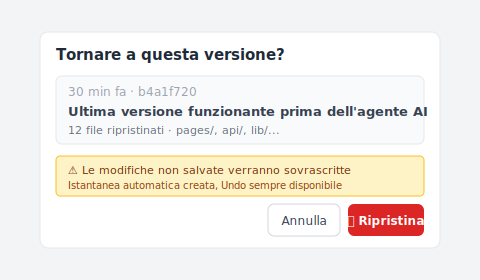
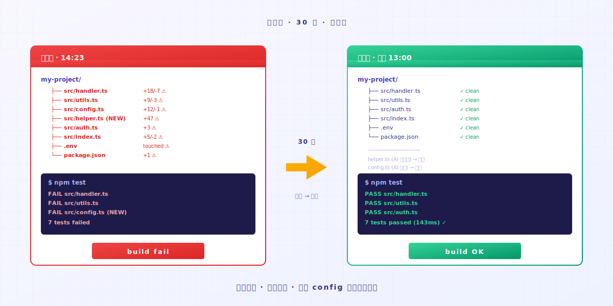

# 【2026 Gestione file】Vibe coding fuori controllo? Un'azione per tornare a una versione funzionante

> L'agente AI corre avanti, il codice non parte. Apri la Timeline di Keeply. L'ultima versione funzionante è ancora lì.

## Indice

1. [Com'è il momento in cui l'AI sfora?](#ai-overshoot)
2. [Un'azione: apri la Timeline, clicca l'ultimo punto funzionante](#one-action)
3. [Perché l'AI non si farà rientrare da sola](#ai-doesnt-rollback)

---

L'ingegnere A apre Cursor e dice all'AI di sistemare un bug. L'AI finisce. Il codice non parte. Le dice di sistemarlo di nuovo. L'AI tocca un terzo file. Ancora rotto. Ne modifica un quinto. A questo punto l'ingegnere A non è più sicuro di quali file l'AI abbia cambiato.

A questo punto probabilmente stai pensando: stop, tornare allo stato che almeno girava un attimo fa.

Il problema è questo: **come fai a sapere quale versione era quella che girava?**

Ci sono passato anch'io. Quando l'AI aveva toccato il quinto file, non sapevo più quale versione girasse. Per fortuna la timeline di Keeply ricordava ancora l'ultima che avevo eseguito a mano.

---

## Com'è il momento in cui l'AI sfora? {#ai-overshoot}

Stai facendo vibe coding. Dai all'AI un obiettivo. L'AI scrive un pezzo.

Esegui. OK.

Giro successivo, dici "aggiungi un'altra funzionalità". L'AI tocca 3 file. Esegui. Errore.

Dici "sistema quell'errore". L'AI tocca 5 file, modifica la configurazione, aggiunge una funzione di supporto che non avevi mai chiesto. Esegui. Altri errori.

L'AI sta ancora sistemando con sicurezza. **Non si offrirà di dire "potrei aver fatto un disastro".**

La sua memoria è solo la finestra di contesto attuale. **Non sa che 5 prompt fa il tuo codice era a posto.** Ma i file sul tuo computer lo sanno. Finché qualcuno se lo ricorda.

---

## Un'azione: apri la Timeline, clicca l'ultimo punto funzionante {#one-action}

### Passaggio 1: apri la Timeline di Keeply

Prima scheda nella barra laterale a sinistra. Vedrai ogni cambiamento di oggi, ordinato per orario.

### Passaggio 2: trova l'ultimo punto in cui il codice "girava ancora"

Ogni voce sulla Timeline è un punto di salvataggio automatico di Keeply o un momento che hai marcato a mano. Apri ogni punto per vedere le modifiche al suo interno, e trova la versione che ricordi come "testata OK in quel momento".

Di solito 30-60 minuti fa. L'ultimo test prima che l'AI iniziasse ad andare di lato.

### Passaggio 3: tasto destro su quella voce, scegli Ripristina

Keeply apre un dialogo di ripristino che mostra l'impatto e un avviso chiaro, così puoi leggerlo prima di cliccare:

L'intera cartella torna a quel punto nel tempo entro 30 secondi. **Tutti i file, l'intero albero delle directory, ogni configurazione. Tornano indietro tutti insieme.** Non solo un file.

Questo include la funzione di supporto che l'AI ha intrufolato, la configurazione che ha modificato, il .env che non avrebbe dovuto toccare. **Tutto torna indietro.**

Poi lo esegui. Funziona.

L'intero processo richiede meno di un minuto. **Non devi ricordarti quali file l'AI abbia toccato. Keeply se li è ricordati tutti.**

---

## Perché l'AI non si farà rientrare da sola {#ai-doesnt-rollback}

Gli agenti AI sono progettati per **andare avanti**. Ricevono un prompt, producono una modifica. Non si fermeranno a guardarsi indietro e a chiedere "quel giro ha appena peggiorato il progetto?".

Quella responsabilità non sta sull'AI. È un limite architetturale.

La responsabilità sta su di te: **ti serve una rete di sicurezza che giri in background.** Lascia che l'AI corra fin dove vuole, perché tu puoi farla rientrare.

Keeply non è qui per sostituire la parte in cui scrivi codice. È qui perché quando fai vibe coding non devi appoggiarti alla memoria per ripercorrere i tuoi passi. La memoria perde contro la velocità con cui l'AI modifica i file.

---

## Per chiudere

Prima che la sessione AI di oggi vada fuori controllo, apri [Keeply](https://keeply.work/) e trascina dentro la cartella del tuo progetto.

La prossima volta che sfora, apri la Timeline e clicca l'ultima voce. **Problema chiuso in 30 secondi.**

---

## Letture correlate

- [Come usare Keeply, l'app per le note dei file: salta il tour delle 30 funzioni, parti con 2 azioni](/it/post/keeply-getting-started-from-zero/) (PILLAR 3, la guida completa all'onconsiglioing di Keeply)

---

> Sull'autore: Ting-Wei Tsao, fondatore di Keeply.
> [LinkedIn](https://www.linkedin.com/in/ting-wei-tsao-b57480152/)
