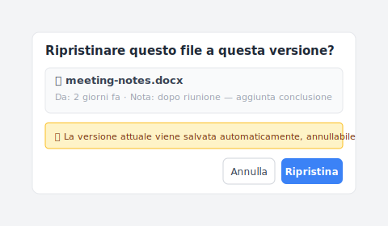

# 【2026 Gestione file】Pensi di avere il backup. In Windows «backup» significa tre cose diverse.

> Tre funzionalità Windows rispondono al nome di «backup». Non sono intercambiabili. Probabilmente ne hai una.

Hai configurato Cronologia file quando hai preso il portatile. Ti senti coperto. Tre mesi dopo, sovrascrivi un documento con la modifica sbagliata e cerchi la versione di ieri.

Si apre la finestra di dialogo. Ti offre una copia di martedì scorso. Non è quello che volevi.

Hai assunto che «backup» fosse una cosa. Erano tre cose, e avevi quella sbagliata attiva per questa specifica esigenza.

## Cosa intende Windows quando dice «backup»

Tre funzionalità che Microsoft include in Windows vanno sotto nomi che suonano tutti come backup. Non lo sono.

| Funzionalità | Cos'è davvero | A cosa serve |
|---|---|---|
| **Cronologia file** | Snapshot pianificato delle cartelle utente su un drive esterno | Recuperare una copia precedente di un documento — a granularità oraria |
| **Backup di Windows** (Backup e ripristino) | Immagine di sistema a un istante | Ripristinare un'intera macchina dopo guasto disco o degrado di sistema |
| **Cronologia versioni** (tramite OneDrive / sincronizzazione cloud) | Cronologia salvataggi per file nel cloud | Tornare indietro su modifiche di singoli file entro una finestra di retention |

Tre forme diverse. Tre lavori diversi. Ciò che condividono è la parola «backup», ed è per questo che la gente avvia una di esse e assume che le altre siano coperte.

## I tre assi diversi

È più facile vederlo se le mappi come tre assi di protezione.

**Asse 1 — Livello disco/sistema.** Quando il tuo drive muore o Windows si rifiuta di avviarsi, ti serve un'immagine di sistema — l'intera macchina, ripristinabile a uno stato buono noto. Backup di Windows fa questo. Cronologia file no. OneDrive no.

**Asse 2 — Livello cartella nel tempo.** Quando una cartella esiste e vuoi una copia di essa di prima questo mese, ti servono snapshot di cartella pianificati. Cronologia file fa questo. Backup di Windows è troppo grossolano (immagine intera, non versioni di cartella). OneDrive lo fa per i file sincronizzati su OneDrive, con limite di retention del piano.

**Asse 3 — Eventi di salvataggio per file.** Quando vuoi lo specifico salvataggio che hai fatto ieri alle 14:47 — quello prima di rompere la formula — ti serve versioning per salvataggio. Né Cronologia file, né Backup di Windows, né OneDrive lo fanno pulitamente. Cronologia file ti dà lo snapshot pianificato più vicino (che potrebbe essere a ore di distanza, o giorni, se il drive era scollegato). La cronologia versioni di OneDrive può farlo solo per file sincronizzati cloud e solo entro la finestra di retention. Non c'è uno strato per-save generale in Windows.

Lo schema: ogni strumento risponde bene a un asse, fa fatica sugli altri, e il terzo asse è essenzialmente non indirizzato da nulla di ciò che Microsoft fornisce di default.

## Cosa ti salva ciascuna in concreto

Scenari concreti, mappati sulle tre funzionalità Windows:

| Scenario | Cronologia file | Backup di Windows | Cronologia versioni OneDrive |
|---|---|---|---|
| SSD si guasta fisicamente | ❌ | ✅ | ✅ per file sincronizzati |
| Windows non si avvia | ❌ | ✅ | ❌ (nessuno stato di sistema) |
| Ransomware cripta tutto | ⚠️ se il drive era offline | ✅ se l'immagine è offline | ⚠️ dipende dal timing della sync |
| Hai sovrascritto un documento Word, vuoi la versione di ieri | ⚠️ snapshot orario più vicino se il drive è connesso | ❌ troppo grossolano | ✅ se il file è in OneDrive, entro retention |
| Vuoi la versione di 3 mesi fa | ⚠️ solo se Cronologia file era attiva e il drive online quel giorno | ❌ l'immagine è di tutto il sistema | ❌ di solito oltre retention |
| Cancellato per errore file 2 settimane fa | ✅ se ricordi che era in una cartella monitorata | ✅ se è stata fatta un'immagine | ✅ Cestino se entro 30 giorni |

Le cose che non vedi se conosci solo una:

- Un lettore con **solo Cronologia file**: coperto per il caso «bozza di ieri» (per lo più), esposto quando il drive muore o Windows si rompe.
- Un lettore con **solo Backup di Windows**: coperto per fallimento catastrofico, esposto per sovrascritture e modifiche quotidiane.
- Un lettore con **solo OneDrive**: coperto per file sincronizzati cloud in retention, esposto quando i file sono solo locali, quando la retention è passata, e per il ripristino dello stato di sistema.

L'articolo su [iCloud vs Dropbox cronologia versioni](/it/post/cloud-version-history-cliff/) cammina sul lato retention cloud in profondità; questo pezzo è il lato nativo Windows.

## Il quarto asse che nessuno include di default

Guarda di nuovo la tabella. L'angolo in basso a destra — «la versione specifica che ho salvato deliberatamente» — non ha una spunta pulita.

Cronologia file ti dà uno snapshot pianificato, non il tuo salvataggio. Backup di Windows ti dà il disco, non un file. OneDrive ti dà la cronologia cloud, ma solo per file sincronizzati cloud e solo entro la finestra di retention.

Uno strato di cronologia versioni per-save guidato dall'intenzione — ogni Cmd+S diventa un punto recuperabile, localmente, senza limite temporale — è l'asse mancante.

[Keeply](https://keeply.work) è un'implementazione. Osserva le cartelle che gli punti e cattura ogni salvataggio come la sua versione, senza pianificazione e senza limite di retention. Tira fuori la bozza di ieri alle 14:47, non lo snapshot pianificato più vicino.

Dopo una riunione premi "Salva versione" e si apre la finestra — attacchi una nota tipo "aggiunte conclusioni dopo la riunione" e salvi:

Sei mesi dopo, la Timeline mostra ogni salvataggio come una riga a sé — i salvataggi automatici in background accanto a quelli manuali con la nota che hai scritto sul momento:

Quando devi davvero ripristinare una versione specifica, la finestra è più diretta della scheda "Versioni precedenti" di Esplora file di Windows — anteprima della nota, timestamp di origine e una rete di sicurezza con snapshot automatico prima dello scambio:

Questa non è una sostituzione per Cronologia file o Backup di Windows — quelli coprono ancora i loro assi. Keeply aggiunge l'asse che Windows non include.

Cluster sibling: [Ho chiesto a Windows File History la bozza di ieri. Mi ha restituito un file del 2019.](/it/post/windows-file-history-wrong-version/) — la versione narrativa di perché il terzo asse conta.

## Quando questo articolo non è la tua soluzione

Alcune situazioni in cui il framework dei tre assi non aiuta:

**Sei in un ambiente IT enterprise gestito.** L'IT gestisce SCCM, Veeam, o un altro backup centralizzato. I tuoi tre assi sono decisi dalla policy. Parla con l'IT prima di aggiungere strati personali.

**Sei su Windows Home senza drive esterno.** Cronologia file vuole un drive esterno o una posizione di rete. Senza, l'unica cosa attiva è OneDrive (se sei loggato). Compra un drive esterno, o accetta di avere solo un asse.

**Ti serve archivio immutabile per conformità.** I backup in questo articolo non sono archivi di conformità. La retention SOX / HIPAA / GDPR ha bisogno di strumenti di archivio adeguati (Veeam, Acronis, specifici del settore). Il framework dei tre assi è protezione del workflow, non regolamentare.

## Letture correlate

L'articolo pilastro [guida completa alla gestione versioni file](/it/post/file-version-management-complete-guide/) copre le 4 ragioni strutturali per cui il tuo strumento non è stato progettato per conservare la cronologia dei file — utile sfondo sul perché queste tre funzionalità Windows si dividano così.

Articolo sibling: [Ho chiesto a Windows File History la bozza di ieri. Mi ha restituito un file del 2019.](/it/post/windows-file-history-wrong-version/) cammina una specifica modalità di fallimento in dettaglio.

Parallelo Mac: [Time Machine vs Dropbox: backup, sync, e il terzo asse che nessuno dei due è](/it/post/time-machine-vs-dropbox/) — stesso framework a tre assi, OS diverso.

---

La parola «backup» tira tre cose in un solo secchio. Configuri una, ti senti coperto, e le altre due mancano silenziosamente. Tre mesi dopo qualcosa fallisce su un asse che non stavi guardando.

Scegli cosa eseguire su ogni asse. Poi sai quale non hai.

---

> Sull'autore: Ting-Wei Tsao, fondatore di Keeply.
> [LinkedIn](https://www.linkedin.com/in/ting-wei-tsao-b57480152/)
