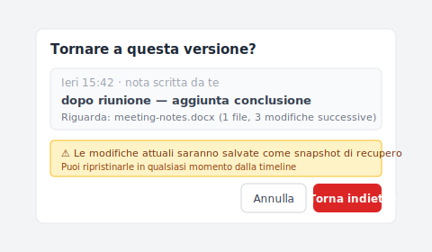

# 【2026 Gestione file】Ho chiesto a Windows File History la bozza di ieri. Mi ha restituito un file del 2019.

> File History non si è rotto. Ha restituito quello che aveva. La domanda aveva la forma sbagliata per lo strumento.

Martedì sera. Mi serviva la bozza di ieri di un documento Word — quella con la conclusione che ho scritto durante la riunione, prima della revisione di stasera che non sono sicuro mi piaccia.

Tasto destro → Ripristina versioni precedenti. Si apre la finestra.

La versione più recente disponibile è del 2019.

C'era un divario di un anno e mezzo che non avevo notato. Il drive esterno che teneva i miei snapshot di File History era scollegato dalla trasferta col portatile dell'estate scorsa. File History non aveva niente da darmi di ieri. Mi ha dato quello che aveva — lo snapshot di quando il drive era ultimamente collegato. L'ultima volta che il drive era collegato era appena prima di comprare il nuovo portatile.

Non era rotto. Gli stavo facendo una domanda per cui non è stato costruito a rispondere.

## Perché File History mi ha restituito il 2019

File History prende snapshot secondo pianificazione. Predefinito: ogni ora. Gli snapshot accadono solo quando il drive esterno (o posizione di rete) è raggiungibile.

Quando il drive è scollegato — portatile in viaggio, drive prestato a un'altra macchina, drive semplicemente dimenticato — non viene scritto nessun nuovo snapshot. File History continua a funzionare internamente, ma non ha dove scrivere. Il catalogo delle versioni smette di crescere.

Quando il drive torna, File History riprende da dove si era fermato. Un nuovo snapshot va nella running queue corrente. Ma non c'è backfill per i giorni in cui il drive mancava.

Quindi quando ho chiesto «ieri», File History ha camminato all'indietro nel suo catalogo e ha offerto lo snapshot più recente che aveva: quello di prima che il drive andasse offline. Diciotto mesi prima.

Non è un bug. È esattamente ciò che il meccanismo è costruito a fare. Il bug era la mia assunzione che «ieri» fosse una domanda a cui File History potesse rispondere.

## Guidato dalla pianificazione vs guidato dall'intenzione

La distinzione che nessuno ha spiegato quando ho configurato File History:

**Guidato dalla pianificazione** — il sistema decide quando catturare. File History è guidato dalla pianificazione. Time Machine su Mac è guidato dalla pianificazione. Sincronizzazione cloud che gira ogni N minuti è guidata dalla pianificazione. Il sistema dice «ogni ora» o «ogni 10 minuti» o «ad ogni cambiamento rilevato», ma l'unità è tempo o rilevamento di cambiamento — non la tua intenzione.

**Guidato dall'intenzione** — la tua azione (premere Cmd+S) attiva la cattura. La versione salvata è esattamente il file al momento in cui ti sei impegnato. Git è guidato dall'intenzione (punti di salvataggio espliciti). La cronologia versioni della sincronizzazione cloud è in parte guidata dall'intenzione (ogni salvataggio crea una versione, limitato dalla retention). Strumenti come Keeply sono progettati guidati dall'intenzione.

La mismatch: quando penso «bozza di ieri», intendo «la versione che ho salvato deliberatamente ieri dopo aver aggiunto la conclusione». È una domanda guidata dall'intenzione. File History è guidato dalla pianificazione. La corrispondenza più vicina che può darmi è «lo stato del disco al prossimo punto di snapshot», che può o meno includere il mio salvataggio deliberato, a seconda del timing e della disponibilità del drive.

File History ti darà un'approssimazione vicina a ieri — se tutto è andato bene. Quando tutto non è andato bene (drive era offline), ricade sullo snapshot più vicino che ha, che può essere arbitrariamente vecchio.

## Cosa File History è costruito a fare bene

Vale la pena essere giusti con File History — ha un vero lavoro, e lo fa.

È backup folder-level continuo su un drive esterno. Se l'SSD del tuo portatile muore, File History ti restituisce Documents, Pictures, Desktop, e altre cartelle monitorate, ripristinate allo snapshot più recente. Quello è un lavoro completo e utile.

Va bene quando:

- Vuoi una copia recente (di ore fa) di un file dopo che l'originale viene corrotto o perso
- Le cartelle monitorate coprono ciò che ti interessa
- Il drive esterno è connesso in modo affidabile (desktop, dock sempre attivo, condivisione NAS)
- Non ti servono versioni precise per-save, solo «la copia buona più recente»

Fa fatica quando:

- Viaggi col portatile e il drive non segue
- Ti serve una versione specifica che hai salvato a un orario specifico
- Ti aspetti che «ogni salvataggio» sia catturato (non è — è ogni snapshot)
- Speri in retention di anni con precisione

L'articolo non è una lamentela contro File History. È una chiarificazione di quale forma di domanda risponde davvero.

## Aggiungere uno strato guidato dall'intenzione

Se il tuo scenario di perdita comune è «ho fatto un salvataggio alle 14:47 ieri e voglio esattamente quella versione», File History non te la darà in modo affidabile. Ti serve uno strato diverso.

[Keeply](https://keeply.work) gira localmente e cattura ogni Cmd+S come la sua versione, indipendentemente da pianificazione o connessione del drive. Le catture vivono col progetto, non su un drive esterno separato che potrebbe essere offline. Quando chiedi «bozza di ieri», Keeply cammina all'indietro tra i salvataggi, non tra snapshot pianificati, e restituisce quello che hai effettivamente fatto.

Quando premi «Salva versione» a mano, si apre una finestra dove attacchi una nota di una riga — «dopo riunione» o «approvata dal cliente» — che riconoscerai davvero a distanza di mesi:


La Timeline poi si presenta così — il salvataggio manuale con la nota sta sulla sua riga, accanto alle versioni automatiche in background, distribuite su due giorni:


```
Keeply timeline — meeting-notes.docx

13 maggio — martedì
─────────────────────────────────
● 19:42   meeting-notes.docx   (revisione di stasera)
● 14:47   meeting-notes.docx   ★ «Dopo riunione» — conclusione aggiunta
● 09:30   meeting-notes.docx   (bozza mattutina)

12 maggio — lunedì
─────────────────────────────────
● 17:15   meeting-notes.docx
● 14:22   meeting-notes.docx
```

Ogni salvataggio è la sua riga. «Bozza di ieri» mappa a una riga specifica, non a una ricerca su calendario contro snapshot inaffidabili.

Quando decidi di tornare indietro, non rimetti in dubbio il timestamp — clicchi la riga con la nota che hai scritto e ripristini direttamente. Keeply scatta uno snapshot automatico dello stato attuale prima dello scambio, quindi un click sbagliato si recupera comunque:



Keeply non è una sostituzione per File History. Tieni File History per quello che fa — backup folder continuo su drive esterno. Aggiungi Keeply per la granularità a livello di salvataggio. I due rispondono a forme di domanda diverse.

Cluster sibling — [Pensi di avere il backup. In Windows «backup» significa tre cose diverse.](/it/post/windows-file-history-vs-backup/) — cammina il framework a tre assi per intero.

## Quando File History basta

Alcune situazioni in cui aggiungere uno strato per-save è eccessivo:

**Il tuo lavoro è a ciclo breve.** Se non hai bisogno di recuperare salvataggi di più di qualche ora fa, la cadenza oraria di File History catturerà la maggior parte di ciò che ti serve. Nessun aggiornamento necessario.

**Il tuo drive è connesso in modo affidabile.** Dock sempre attivo, condivisione NAS, drive di backup dedicato che non lascia mai la scrivania — File History raramente ha lacune in questa configurazione, e i suoi snapshot pianificati si allineeranno abbastanza vicino ai tuoi salvataggi.

**La sincronizzazione cloud copre i tuoi file importanti.** Se tutto ciò che è importante vive in OneDrive / Dropbox / Google Drive e sei entro le loro finestre di retention, hai già una sorta di strato guidato dall'intenzione nella cronologia versioni cloud (anche se con limite — vedi [lo strapiombo della cronologia versioni](/it/post/cloud-version-history-cliff/)).

Se nessuna di queste si applica — utente portatile, drive a volte offline, lavoro importante oltre i 30 giorni — è allora che aggiungere uno strato guidato dall'intenzione ripaga.

## Letture correlate

L'articolo pilastro [guida completa alla gestione versioni file](/it/post/file-version-management-complete-guide/) scompone 4 ragioni strutturali per cui il tuo strumento non è stato progettato per conservare la cronologia dei file.

Articolo sibling: [Pensi di avere il backup. In Windows «backup» significa tre cose diverse.](/it/post/windows-file-history-vs-backup/) — il framework di confronto a tre assi.

Parallelo Mac: [Time Machine vs Dropbox: backup, sync, e il terzo asse che nessuno dei due è](/it/post/time-machine-vs-dropbox/) — stessa distinzione pianificazione-vs-intenzione su Mac.

---

File History non mi ha tradito. Ha restituito quello che aveva. Il file del 2019 era un fatto sulla storia di connessione del mio drive, non un difetto.

La lezione è sapere quale forma di domanda risponde ogni strumento. Snapshot orario su drive esterno, quando presente, è una forma. Il salvataggio che ho fatto ieri alle 14:47 è una forma diversa. Lo strumento che risponde al secondo non è incluso in Windows per impostazione predefinita.

Puoi continuare a usare File History. Solo non fargli domande che non può vedere.

---

> Sull'autore: Ting-Wei Tsao, fondatore di Keeply.
> [LinkedIn](https://www.linkedin.com/in/ting-wei-tsao-b57480152/)
