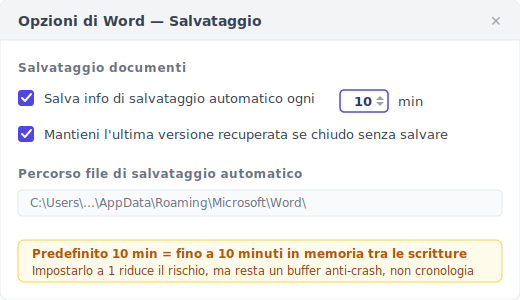
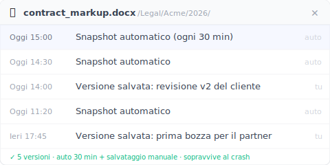

Il ripristino automatico è un buffer anti-crash, non una cronologia delle versioni. Word integra solo il salvataggio della copia andata in crash.

> Venerdì, ore 15. Hai scritto novanta minuti di annotazioni a un contratto per una riunione delle 17. Word si è bloccato. Hai aspettato tre minuti e l'hai chiuso forzatamente.
>
> Riapri Word. Si apre il riquadro Ripristino documenti. Ci clicchi pieno di speranza, **ed è vuoto**.
>
> Novanta minuti, spariti. Il cliente lo legge alle 17.

Non è sfortuna. Il ripristino automatico non è mai stato progettato per salvare quel file.

I cinque casi qui sotto sono ricostruiti dalla documentazione ufficiale Microsoft, dai post di chi chiede aiuto quando il ripristino automatico lo abbandona, e da come funziona davvero il meccanismo. Ognuno smonta un'assunzione che facevi senza saperlo.

---

## Caso 1: non hai mai premuto Ctrl+S {#case-1-never-saved}

Apri un nuovo Word, clicchi "Documento vuoto", scrivi per trenta minuti e il computer va in crash. Riapri Word. Il riquadro Ripristino documenti è vuoto.

Non è un bug. **Perché il ripristino automatico tracci un documento, quel documento deve avere un nome e un percorso.** Mai premuto Ctrl+S = nessun nome = nessun percorso = il ripristino automatico non sa dove scrivere il file temporaneo.

La [guida ufficiale](https://support.microsoft.com/it-it/office/recuperare-i-file-di-office-dc01156a-be1c-43e6-b3f1-bd4a01a93cf9) Microsoft lo dice chiaro: il ripristino automatico, per iniziare a tenere i salvataggi .asd, ha bisogno che il file sia stato salvato almeno una volta.

Nuovo → trenta minuti di scrittura → crash. In questa sequenza il ripristino automatico non è mai stato richiamato, nemmeno una volta.

> **Abitudine da prendere:** la prima cosa che fai con un documento nuovo è Ctrl+S → dagli un nome → *poi* inizia a scrivere. Trenta secondi che ti tolgono da tutta questa categoria.

---

## Caso 2: Word si è bloccato e hai chiuso forzatamente {#case-2-force-quit}

È la scena delle annotazioni al contratto dell'inizio. Word non è andato davvero in crash facendo comparire una finestra di ripristino. Si è bloccato, non rispondeva, e **tu** hai scelto di chiuderlo forzatamente.

Per impostazione predefinita, il ripristino automatico scrive un file .asd **ogni 10 minuti**. In quell'intervallo, tutto ciò che scrivi è in memoria. Chiusura forzata = il contenuto in memoria non è arrivato al .asd = dal .asd recuperi al massimo fino all'ultima scrittura su disco.

Quell'"ultima scrittura" può essere di nove minuti fa o di un minuto fa. Dipende da dove ti trovavi nel ciclo dei 10 minuti. Caso peggiore: scrivi un paragrafo lungo alle 9:59, Word si blocca alle 10:00, e quel paragrafo non è finito nel .asd.

I 10 minuti predefiniti sono il compromesso di Microsoft tra carico di scrittura su disco e rischio di perdita dati. Per te, quei 10 minuti di latenza significano fino a 10 minuti di lavoro esposto in ogni momento.

Puoi accorciarlo: File → Opzioni → Salvataggio → "Salva informazioni di salvataggio automatico ogni X minuti", imposta 1. Il costo è più attività su disco; un portatile vecchio se ne accorge.

> Il ripristino automatico non salva "gli otto minuti che hai appena scritto", salva "la versione di otto minuti fa già arrivata sul disco". Differenza piccola. Decide chi sopravvive.

---

## Caso 3: il Ripristino documenti si è aperto. Ma era vuoto {#case-3-blank-recovery}

È quello che spezza di più. Word mostra davvero il riquadro Ripristino documenti, ci clicchi pieno di speranza. E **il file è vuoto** o pieno di caratteri illeggibili.

Cosa è successo sotto: il ripristino automatico impacchetta lo stato attuale in un file .asd e lo scrive su disco, e quella scrittura richiede tempo. Se manca la corrente a metà, o il programma muore durante l'impacchettamento. Resta sul disco un .asd scritto a metà che non si può analizzare. Word vede che il .asd esiste, quindi offre il riquadro di ripristino. Ma all'apertura l'analisi fallisce, e ottieni un vuoto o caratteri illeggibili.

Il forum di Microsoft ha un thread proprio su questo: ["My recovered unsaved word document is entirely blank" (il documento Word non salvato recuperato è completamente vuoto)](https://learn.microsoft.com/en-us/answers/questions/5285105/my-recovered-unsaved-word-document-is-entirely-bla). Lo chiede la community ufficiale di Microsoft. Non è un caso limite. È comune.

> Il riquadro di ripristino che compare non significa ripristino riuscito. Il ripristino automatico promette un *tentativo*, non una garanzia.

---

## Caso 4: l'hai aperto su un altro computer {#case-4-cross-machine}

Ieri hai scritto un documento sul desktop dell'ufficio. Oggi lo apri sul portatile a casa e trovi solo la versione salvata a mano sabato scorso. **Le otto ore di modifiche di ieri sono sparite.**

I file .asd del ripristino automatico stanno sulla macchina locale:

- **Windows:** `%LocalAppData%\Microsoft\Office\UnsavedFiles` e `%AppData%\Microsoft\Word`
- **macOS:** `~/Library/Containers/com.microsoft.Word/Data/Library/Preferences/AutoRecovery`

**Questi percorsi non si sincronizzano con OneDrive, Dropbox o iCloud Drive.** Per progettazione sono una cache locale.

Potresti chiedere: "ma il mio Word non è collegato a OneDrive?" Magari sì. Ma OneDrive sincronizza il *file in sé*, non il buffer .asd del ripristino automatico. Anche con AutoSave attivo (serve un abbonamento Microsoft 365 e il file su OneDrive), AutoSave manda il corpo del file nel cloud mentre il ripristino automatico scrive un buffer .asd locale. **Due sistemi affiancati che non si parlano.**

Apri il file su una macchina nuova, e la macchina nuova non legge il .asd della vecchia.

> Il .asd è il bigliettino locale che il ripristino automatico tiene per quella macchina. Non viaggia.

---

## Caso 5: hai cliccato "Non salvare" {#case-5-dont-save}

Chiudendo Word compare la finestra "Salvare le modifiche?" e clicchi "Non salvare" senza pensarci. Perché davi per scontato di aver già salvato. Tre secondi dopo ti ricordi di aver cambiato un paragrafo importante senza salvarlo.

Cliccare "Non salvare" è un'azione deliberata dell'utente. Word la legge come "l'utente ha scelto esplicitamente di scartare le modifiche di questa sessione". **Il ripristino automatico è progettato per cancellare subito il buffer .asd di quel file**. Perché tenerlo andrebbe contro ciò che hai appena chiesto.

Il risultato inglese che sta all'8° posto per questo caso è un piccolo sito, [integrisit.com/accidentally-clicked-dont-save](https://integrisit.com/accidentally-clicked-dont-save/) (autorità di dominio appena 41). Perché un sito con così poca autorità entra nei primi dieci? Perché questo è un caso che **la documentazione Microsoft non copre**. Ammettere "hai cliccato Non salvare, quindi abbiamo cancellato subito il buffer" va contro la narrazione del prodotto stesso.

> "Non salvare" non è un errore di battitura. È un doppio comando interno di Word: "conferma scarto + cancella subito il buffer".

---

## L'altro strato: una cronologia delle versioni che resta {#keeply-fills-gap}

Dopo cinque casi, vedi che il ripristino automatico è una rete fatta per un disegno preciso. Prende "stai scrivendo, sei tra due scritture, Word va davvero in crash" e manca gli altri cinque. Il filo comune: il buffer del ripristino automatico **si usa e si cancella**. Cancellato a una chiusura pulita, cancellato col Non salvare, magari nemmeno finito di scrivere in una chiusura forzata.

Ciò che colma il buco è uno strato che **non viene cancellato**: una cronologia in cui ogni versione è un file salvato completo, conservato in modo permanente, intoccato da chiusure forzate e Non salvare. Arriva da due fonti ,  **uno snapshot automatico in background ogni 30 minuti**, più un **pulsante "Salva versione" che premi tu, con una nota** per segnare una tappa (tipo "questa è quella approvata dal cliente").

Passa i cinque casi attraverso questo strato:

| Caso | Ripristino automatico | Cronologia permanente (auto 30 min + salvataggio manuale) |
|---|---|---|
| 1. Mai salvato | Nessun punto di partenza = nessun record | Non aiuta nemmeno. Il file non è arrivato sul disco, questo strato non lo vede (vedi limiti) |
| 2. Chiusura forzata | Il buffer può essere vuoto o scritto a metà | L'ultimo snapshot automatico o salvataggio manuale si apre intatto (perdi al massimo 30 min, ma riavi un file completo, non un vuoto) |
| 3. Riquadro di ripristino vuoto | Buffer scritto a metà, danneggiato | Ogni versione è uno snapshot salvato completo, non un mezzo buffer |
| 4. Computer diverso | Il .asd locale non si sincronizza | Le versioni si sincronizzano nel cloud, apribili tra macchine |
| 5. Cliccato Non salvare | Buffer cancellato subito | L'ultimo snapshot/salvataggio è già scritto; Non salvare scarta solo le modifiche non salvate dopo |

Keeply è un'implementazione di questo strato. Una volta installato, sorveglia la tua cartella di Word e fa uno snapshot in background ogni 30 minuti; puoi anche premere "Salva versione" quando vuoi per registrarne una subito con una nota. La barra laterale mostra il timestamp di ogni versione e ne ripristina una qualsiasi con un clic.

**Il punto non è "più spesso"**. 30 minuti è più grossolano dei 10 del ripristino automatico. Il punto è **permanente + si apre intatto + intoccato da chiusura forzata e Non salvare**. Il ripristino automatico può ancora tenere contenuto più recente nella finestra stretta "stai scrivendo, prima della prossima scrittura, crash improvviso", perciò Keeply **non sostituisce** il ripristino automatico. È lo strato sotto.

---

## Dove nemmeno Keeply ti salva {#limits}

Per essere chiari sui limiti:

**1. Un file mai arrivato sul disco, nemmeno Keeply lo salva.** Keeply sorveglia una cartella sul disco. Il file deve essere stato salvato una volta, scritto in quella cartella, perché Keeply lo veda e inizi a tenere versioni. Un documento nuovo mai salvato è invisibile a Keeply quanto al ripristino automatico. Quindi quell'abitudine di prima. Prima azione su un documento nuovo: salva e dai un nome. Vale per entrambi.

**2. Un .docx danneggiato si ripristina solo all'ultima versione sana.** Se il file era già danneggiato nel momento in cui uno snapshot o un salvataggio l'ha registrato (raro, ma capita), è quello che Keeply ha tenuto. La cronologia da sola non torna a uno stato sano; ripristini una versione precedente integra.

**3. Un file non sincronizzato su un'altra macchina resta su quella macchina.** Keeply scrive le versioni in un archivio locale, e la sincronizzazione cloud è un passo a parte. Se hai scritto otto ore su un portatile con la rete giù e non hai sincronizzato, il desktop non vede quelle otto ore. Non è un guasto di Keeply, la catena di sincronizzazione semplicemente non è finita.

Questi tre sono più onesti dei cinque casi del ripristino automatico: puoi verificarli. L'ho salvato? il file è danneggiato? la rete era giù?. Senza ricostruire un meccanismo.

---

## Quando non ti serve Keeply per Word {#when-not-needed}

Non tutti hanno bisogno di questo strato.

**1. Sessioni brevi (una risposta o un promemoria sotto i 10 minuti).** L'intervallo dei 10 minuti del ripristino automatico non è nemmeno scattato, e il prossimo snapshot di Keeply nemmeno. Per il lavoro leggero gli strumenti integrati bastano.

**2. Salvi già ogni cinque minuti e tieni i file su OneDrive.** Le 25 versioni / 30 giorni di OneDrive più il tuo salvataggio frequente già si avvicinano a uno strato di cronologia. Keeply aggiunge valore solo quando vuoi tornare oltre i 30 giorni. Tipo un cliente che dopo tre mesi chiede "c'è ancora quella v2?".

**3. La tua azienda usa SharePoint con la cronologia versioni.** SharePoint conserva le versioni più a lungo, con controllo amministratore e tracciamento. Uno strumento personale come Keeply integra, non sostituisce. Tu resti su SharePoint.

Keeply è per chi è stato morso da uno dei cinque casi e non vuole esserlo di nuovo. Se non sei mai stato morso, o l'azienda l'ha già coperto, vai bene così.

---

## Domande frequenti {#faq}

**Q1. Se installo Keeply sulla mia cartella di Word, va in conflitto con il ripristino automatico?**

No. Sono due strati diversi. Keeply guarda il .docx sul disco (dopo che l'hai salvato una volta nella cartella che sorveglia) e fa uno snapshot ogni 30 minuti; il ripristino automatico scrive il suo .asd in `%LocalAppData%`. Nessuno tocca l'archivio dell'altro.

**Q2. Posso impostare l'intervallo del ripristino automatico di Word a 1 minuto?**

Sì. File → Opzioni → Salvataggio → "Salva informazioni di salvataggio automatico ogni X minuti", imposta 1. Un intervallo più breve significa contenuto più recente recuperabile dopo un crash, al costo di più attività su disco che un portatile vecchio può sentire. Ma resta un buffer anti-crash. Cancellato a una chiusura pulita o col Non salvare. Se vuoi una cronologia permanente che sopravvive a crash e Non salvare, è un'altra strada: uno strumento come Keeply, snapshot in background ogni 30 minuti più un pulsante salva-versione manuale, indipendente dall'intervallo del ripristino automatico.

**Q3. Perché chiudendo Word normalmente il riquadro Ripristino documenti non compare?**

Perché una chiusura pulita = nessun crash = il ripristino automatico presume "l'utente ha salvato" = cancella il buffer .asd. La volta dopo non resta nulla da ripristinare. È per progettazione: il ripristino automatico conserva il .asd solo dopo un'uscita anomala.

**Q4. OneDrive AutoSave sostituisce il ripristino automatico?**

No. AutoSave sincronizza il corpo del file nel cloud (serve un abbonamento Microsoft 365 e il file in un percorso OneDrive); il ripristino automatico scrive un buffer .asd locale. AutoSave risolve "la sincronizzazione in tempo reale tra dispositivi", il ripristino automatico risolve "gli ultimi minuti prima di un crash". Coesistono senza parlarsi. Sotto entrambi puoi aggiungere un terzo strato: una cronologia permanente (come Keeply), snapshot in background ogni 30 minuti più salvataggi manuali, indipendente dallo stato di sincronizzazione cloud.

**Q5. Keeply può recuperare un file Word che ho eliminato e non avevo mai salvato?**

No. Il punto di partenza di Keeply è il primo salvataggio del file sul disco (lo salvi e gli dai un nome). Fanne un'abitudine: documento nuovo → prima salva e dai un nome → poi scrivi. Una volta che il file è nella cartella che Keeply sorveglia, fa uno snapshot ogni 30 minuti in background, e tu puoi premere "Salva versione" quando vuoi.

---

## Letture correlate

- [La cronologia versioni di Excel torna solo di 1-2 versioni: è un disegno Microsoft, non un bug](/it/post/excel-version-history-limits/)
- [Hai salvato sopra la vecchia versione di un file Word/Excel/PPT? Il divario nel meccanismo di recupero](/it/post/recover-overwritten-file/)
- [Il salvataggio automatico di Photoshop ti salva dai crash, non dal salvare sopra la versione sbagliata](/it/post/photoshop-autosave-not-version-history/)
- [La guida completa alla gestione delle versioni dei file](/it/post/file-version-management-complete-guide/)

---

*Di [Ting-Wei Tsao](https://www.linkedin.com/in/ting-wei-tsao-b57480152/). Fondatore di Keeply, costruisce gestione versioni file per chi non è ingegnere.*
