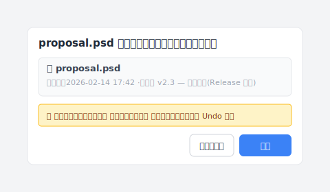

# 【2026 ファイル管理】2026年、3-2-1 バックアップでは足りないもの

> 3-2-1 ルールは 20 年変わっていない。けれど、あなたが恐れているものは変わった。

2005 年、写真家 **Peter Krogh** は自分のためにバックアップ規則を定めました。3 つのコピー、2 種類のメディア、1 つは別の場所。守るべき相手はテープの劣化、落としたハードドライブ、サーバー室の火災でした。

20 年後のあなたが恐れているのは、**⌘+S をもう一度押してしまうこと**です。

3-2-1 ルールは動いていません。でも、あなたの痛みは入れ替わりました。

## 要点

**3-2-1 バックアップ原則** は必要です。3 コピー、2 メディア、1 オフサイト。これでハードウェア故障、火災、ランサムウェアといった災害からは守れます。しかし、設計上 **操作ミス** には対応していません。自分で上書きする、同僚が間違ったバージョンを編集する、クラウド同期で誤ったバージョンが 3 か所すべてに伝わる。3-2-1 は救えません。本記事は 3-2-1 が守るもの、守れないもの、そして埋めるべき層について解説します。

## 目次

1. [3-2-1 バックアップとは？](#3-2-1-バックアップとは)
2. [3-2-1 が守るもの、守れないもの](#3-2-1-が守るもの守れないもの)
3. [なぜ 3-2-1 をやってもファイルを失うのか？](#なぜ-3-2-1-をやってもファイルを失うのか)
4. [3-2-1 とバージョン履歴、ひとつのツールで両方できるか？](#3-2-1-とバージョン履歴ひとつのツールで両方できるか)
5. [よくある質問](#よくある質問)

---

## 3-2-1 バックアップとは？

3-2-1 ルールは、Peter Krogh が 2005 年に[《The DAM Book》](https://www.oreilly.com/library/view/the-dam-book/9780596008550/)（O'Reilly Media）で定めたバックアップ規則です。

- **3 コピー**：原本に加えてバックアップ 2 つ
- **2 種類のメディア**：例：ローカルドライブ + クラウド、NAS + 外付け SSD
- **1 オフサイト**：物理的に別の場所に 1 つ

2005 年当時、主流メディアはテープ、CD/DVD、機械式 HDD でした。故障率は高く、メディアの劣化も速い。ルールの設計意図は明確です：**いかなる単一のハードウェア故障、メディア劣化、施設災害でもファイルを全滅させない**こと。

{{IMAGE-1: 3-2-1 のビジュアル。3 つのファイルコピー、2 種類のメディアアイコン、1 つのオフサイト矢印。}}

## 3-2-1 が守るもの、守れないもの

3-2-1 が守るのは、ファイルが *消える* シナリオ——HDD 故障、事務所火災、ランサムウェア暗号化のような災害。守れないのは、ファイルはあるのに中身が間違ってしまうシナリオ——自分で上書きしてしまう、同僚が共有フォルダで誤編集する、3 か月前のバージョンを取り戻したい。一覧で並べると：

3-2-1 が成立するかどうかは、「ファイルを失う」シナリオを並べて見ます。

| シナリオ | 3-2-1 で救える？ | 理由 |
| --- | :---: | --- |
| HDD が故障 | ✅ | 3 コピーが別メディアに |
| 事務所が火災 | ✅ | 1 つはオフサイト |
| ランサムウェア暗号化 | ✅（オフサイト分は無事） | オフサイト隔離 |
| **自分で上書き** | ❌ | 3 コピー全てが新版に同期 |
| **同僚が共有フォルダで誤編集** | ❌ | 同上 |
| **3 か月前の旧版が必要** | ❌ | 3-2-1 はバージョン履歴ではない |

そう、ここがイライラの原因です。3-2-1 は「ファイルが消えた」を防ぎます。「ファイルはあるけど中身が間違っている」には対応しません。

## なぜ 3-2-1 をやってもファイルを失うのか？

20 年間、誰もはっきり言わなかった盲点があります。**「3 コピー」の「3」は空間冗長性であって、時間冗長性ではない**ということです。

2005 年は HDD の寿命が短く、メディアも壊れやすかった。複数コピーは物理的劣化と戦うためのもの。「3」はその問題に対する妥当な答えでした。

2026 年は HDD が信頼できて、クラウド同期も即時です。「3」は何になるのか？同じ間違いがリアルタイムで 3 か所に複製されるだけになります。

最もよく見られるのが、このシナリオです。

A さんはデザイナーです。月曜日の朝 10:32、クライアントから 3 か月前にサインオフした提案バージョンを送ってほしいと電話がありました。NAS を開くと、12 のバージョンと、3 つのクラウドコピーが全部「最新」を示しています。

でも A さんが欲しいのは最新ではありません。3 か月前のバージョンです。

しかも最悪なのは、バックアップが終わってから「最新」が望むものではないと気づくことです。3-2-1 が、誤ったバージョンを忠実に 3 回守ってくれた格好です。

## 3-2-1 とバージョン履歴、ひとつのツールで両方できるか？

できます。[Keeply](https://keeply.work) は 3-2-1 を位置レイヤーとして組み込んでいます。

- **ローカルワークコピー**：あなたの PC 上の作業版（3-2-1 の「1 コピー」に相当）
- **正本（プロジェクト位置）**：NAS やクラウドの 正本（「2 メディア」のひとつ）
- **バックアップ位置**：プロジェクト全体を別の物理位置に同期（「1 オフサイト」）

これに、保存のたびに自動でバージョンを残す履歴機能と、「リリース」凍結機構——あるバージョンを「このバージョンをクライアントに送った」とマークし、その後の保存で上書きされない仕組み——が加わります。ひとつのツールで 3 層の保護です。

3 ヶ月後にクライアントから「2 月 14 日に承認した版を送って」と連絡が来たら、タイムラインからその版を選んで「復元」を押すだけです：

「復元」を押す前に、Keeply は今の版を新しいスナップショットとして自動保存します——だから違う版を選んでしまっても、すぐに元に戻せます。「復元自体もバージョン化される」というこの設計があるので、何度も確認しなくても安心です。3-2-1 のどの位置からでも復元できます。

Keeply はバックアップ位置の場所を決めません。ローカルとバックアップを同じ事務所に置けば、火事で両方失います。これはどのツールでも救えません。「オフサイト」原則の判断はあなたに委ねられます。

ただし、空間冗長性のためのツールと時間冗長性のためのツールを別々に持つ必要はありません。Keeply ひとつで、ローカルからバックアップまで、この瞬間から先週まで、すべて見えて取り戻せます。

{{IMAGE-2: 3 層保護のビジュアル。位置層（ローカル + 正本 + バックアップ）、時間層（バージョン履歴）、凍結層（リリース 用途分類）。}}

## よくある質問

**Q1: 3-2-1 ルールと 4-2-1-1-0 ルールの違いは？**

4-2-1-1-0 は 3-2-1 の拡張です。不変バックアップを 1 つ追加し、検証エラーゼロを目指します。本質はやはり空間冗長性。**バージョン履歴問題は解決しません。**

**Q2: クラウドバックアップは 3-2-1 の「オフサイト」に該当しますか？**

該当します。ただし iCloud、OneDrive、Google Drive は同期（同期）であってバックアップ（backup）ではありません。ローカルで削除や上書きをすると、クラウドも秒単位で同じ変更を同期します。**操作ミス には対応しません。**

**Q3: NAS は 2 メディアに数えられますか？**

NAS とローカル HDD で 2 メディアと数えられます。ただし RAID はバックアップではありません。RAID は HDD 故障に対応するもので、誤削除には対応しません。

**Q4: Keeply はすでに 3-2-1 ですか？**

はい。Keeply は 3-2-1 を位置レイヤー（ローカルワークコピー + 正本 + バックアップ位置）として組み込み、バージョン履歴と「リリース」凍結機能（あるバージョンをマイルストーンとして印を付け、後の保存で上書きされないようにする）を加えています。ひとつのツールで 3 層を同時に処理します。

**Q5: 個人作業者にも 3-2-1 は必要ですか？**

ファイルの重要度次第です。失って痛むなら必要です。判断基準は「失って痛むかどうか」であって、個人か企業かは関係ありません。

## 関連記事

全体像は [ファイルバージョン管理 完全ガイド](/ja/post/file-version-management-complete-guide/) で 4 つの構造的理由を分解しています。

---

2005 年の Peter Krogh が 3-2-1 を定めたとき、彼が守ろうとしたのは床に落とす HDD でした。

あなたは 2005 年の Peter Krogh ではありません。あなたが恐れているのは ⌘+S をもう一度押してしまうことです。

ツールは 2 つも要りません。3 層を同時に扱えるツールがひとつあればいい。

---

> 著者について：Ting-Wei Tsao、Keeply 創業者。
> [LinkedIn](https://www.linkedin.com/in/ting-wei-tsao-b57480152/)
