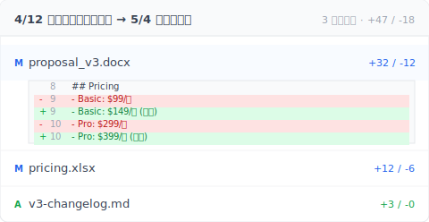

# 【2026 ファイル管理】Word は版を残せても、3 ヶ月後の記憶は残せない

> ソフトの内蔵版数履歴は保存層レスキュー。3 ヶ月前に納品した版を取り戻すにはツール層が要る。

土曜の夜 11:23、クライアントから連絡が入る。「3 月にお送りいただいた提案、もう一度送ってもらえますか？」

OneDrive の版数履歴を開く。直近 1 週間しか残っていない。Word の 自動回復 はファイルを閉じたときに消えた。手元には末尾 `_v` のファイルが 7 つ。3 月の納品とどれも一致しない。

3 ヶ月前に ⌘+S を押したあの版を、ツールは覚えていなかった。

Keeply ユーザーから最もよく聞くのは、この夜 11:23 のメッセージのシナリオです。

## 要点

Microsoft Word の「**版数履歴**」、自動回復、OneDrive 版数スナップショットはすべて**保存層レスキュー**として設計されています。「打っている最中にクラッシュした」場面のためのもので、保持期間は短い：ファイルを閉じれば消える、クラウドの版数履歴で約 500 版。これは保存事故レスキューで、納品追跡ではありません。3 ヶ月後にクライアントが「あの版を」と聞いてきたら、ツール層に独立した常時稼働版数履歴と、納品時点のメタデータ印が必要です。

## 目次

1. Word 内蔵版数履歴ができることは？
2. 自動回復 / OneDrive / Time Machine：それぞれ何日保つ？
3. なぜ 3 ヶ月後には届かないのか？
4. 3 ヶ月前に納品した版を取り戻すには？
5. よくある質問

---

## Word 内蔵版数履歴ができることは？

Word と Office 全体には 3 種類の「**版数復元**」機構があります：

- **自動回復**：クラッシュ時に未保存の内容を救う。既定で 10 分ごとに自動退避。ファイルを正常に閉じると消える。
- **AutoSave**（OneDrive / SharePoint オンライン Word）：入力中に逐次クラウドへ書き込む。
- **OneDrive 版数履歴**：保存ごとのスナップショットを残し、任意の時点に戻せる。Microsoft の [SharePoint バージョン管理ドキュメント](https://learn.microsoft.com/ja-jp/sharepoint/document-library-version-history-limits) は既定で 500 主要版を保持（個人 Microsoft アカウントは [25 版](https://support.microsoft.com/en-us/office/restore-a-previous-version-of-a-file-stored-in-onedrive-159cad6d-d76e-4981-88ef-de6e96c93893)）と記載。

エクセル バージョン履歴も同じ設計の延長線上にあります — [Microsoft が言わない 4 つの制限](/ja/post/excel-version-history-limits/) に、表計算側の同じ罠が並びます。

設計意図は明確です。「**打っている途中でクラッシュした**」「**さっき上書きしてしまった**」という**短期の保存事故**に備えるもの。「**3 ヶ月後にクライアントがあの版を聞く**」場面の設計目標ではありません。

## 自動回復 / OneDrive / Time Machine：それぞれ何日保つ？

保持期間 の数字を並べてみます。

| 機構 | 既定 保持期間 | 削減 条件 | 想定シーン |
| --- | --- | --- | --- |
| Word 自動回復 | ファイル閉時に消える | ファイル閉、Word 再起動 | クラッシュ救援 |
| OneDrive AutoSave | 入力中に書込 | 即時同期上書き | リアルタイム共同編集 |
| OneDrive 版数履歴 | 既定で約 [500 版](https://learn.microsoft.com/ja-jp/sharepoint/document-library-version-history-limits)（個人アカウントは 25 版） | 500 超で古いものから 削減 | 短期ロールバック |
| Mac [Time Machine](https://support.apple.com/en-us/HT201250) | hourly 24h + daily 30 日 + weekly ディスク満まで | ディスク満 | システムレベルバックアップ |
| Windows ファイル履歴 | 設定可変 | 設定可変 | システムレベルバックアップ |

そう、どの機構にも上限があります。ファイル閉時の消去から約 500 版まで、3 ヶ月の線は越えられません。

現場では、ファイルのバージョン一つひとつが最終的な納品物を決めます。納品版が見つからないということは、管理者の記憶の限界を試すこと。

両方の版が見つかったあと、次に気になるのは「2 つの版で何が変わったか」です。Keeply は左右に並べて差分を出すので、1 行ずつ目で追う必要がありません：

赤と緑の対比で価格変更が一目瞭然です。このスクリーンショットをクライアントに転送すれば、説明文を書く手間が省けます。

## なぜ 3 ヶ月後には届かないのか？

ここで誰もはっきり言わない区別があります。**保存層** vs **ツール層**。

ソフトの内蔵版数履歴は **保存層** に住んでいます。存在意義は「直近の書き込みが失敗したらロールバック」。だから 保持期間 が短い。ファイル閉時の消去から 500 版まで、設計の参照点は「平均的な利用者が 1 ヶ月以内に振り返る回数」。3 ヶ月以上は設計目標に入っていません。削減 されるのは合理的です。

A さんはコンサルタント。土曜 11:23 にクライアントから 3 月のレポートを送ってほしいと連絡。OneDrive の版数履歴を開くと最古は 4 月 28 日。自動回復 はとっくに切ってある。手元には `_v` 始まりの .docx が 8 つ。どれもファイル更新日が 3 月の納品週と一致しない。

そして最悪なのは、A さんは後で気づきます。3 月のあの送付は当日エクスポートした PDF を添付しただけ。元の .docx は数週間前に上書きで消えている。**送った PDF はクライアントの受信箱にあるけれど、その PDF からあの版の .docx に戻って続きを書くことはできない。**

## 3 ヶ月前に納品した版を取り戻すには？

2 層必要です：

- **常時稼働版数履歴**：あなたが保存したバージョンが残り、削減されない。Word や OneDrive の保持期間ポリシーに依存しない。
- **納品時点のメタデータ**：エクスポート時に「誰が、いつ、どの版に対応するか」のメタデータを自動で埋め込む。3 ヶ月後にツールへ戻せば、原点が見える。

[Keeply](https://keeply.work) はこの 2 層を提供します。

B さんは Keeply を半年使っている。月曜の朝、クライアントから 4 月のデザインを再送依頼。クライアントの メール にあった添付の .pdf を Keeply にドロップする。Keeply が「これは 2026-04-12 の v3 提案です」と表示。元 .docx の 保存ポイント ハッシュ と用途分類「業主核定版」付き。「この版に戻る」をクリックすると 3 秒後に Word が 4/12 のあの版を開く。

ただし Keeply は 自動回復 を置き換えません。打っている最中のクラッシュは 自動回復 が第一線です。Keeply は遡及できません：納品時点で Keeply を使っている必要があり、そうでなければ メタデータ は埋め込まれません。Keeply 導入前の納品は本記事では救えません。今日からの納品はすべて救えます。

ここがほっとできるところです。

## よくある質問

**Q1: Word 自動回復 は既定でオンですか？**

既定でオン。設定経路：「ファイル → オプション → 保存 → 10 分ごとに自動回復用データを保存する」。ただし 自動回復 はファイルを正常に閉じると消えます。長期保持ではありません。

**Q2: OneDrive 個人版とビジネス版で版数保持数は同じですか？**

完全に同じではありません。OneDrive 個人は既定で約 500 版。OneDrive for Business（Microsoft 365）も既定 500 版だが管理者が調整可能。上限到達で最古から 削減。

**Q3: Time Machine はバックアップですか、版数管理ですか？**

Time Machine はシステムレベルのバックアップで、ファイル単位の版数管理ではありません。ディスク全体のスナップショットを保つもので、「proposal.docx の保存ごとの版」を追跡するわけではありません。Time Machine から特定版を救うことは可能ですが手間がかかります。

**Q4: Google Docs の修訂版はどれくらい保持されますか？**

Google は明確な 保持期間 数字を公開していません。[公式ドキュメント](https://support.google.com/docs/answer/190843) には「古い修訂版は容量節約のため統合されることがあります」とあります。実務上は 3 ヶ月超の修訂版は自動で統合・削減 されることが多い印象。

**Q5: Keeply は Git と同じカテゴリのツールですか？**

いいえ。Git はソフトウェアエンジニア向けに作られたバージョン管理ツール——インターフェースは黒い画面のターミナルで、語彙（branch、merge、commit）を覚えないと使えません。Keeply は非エンジニア向けに最初から設計された版数管理ツール：インターフェースはファイルウィンドウで、表示される言葉は「版を保存 / ワークコピー / プロジェクト位置に同期」、エンジニアの専門用語は一切出ません。両者とも似た問題（ファイル履歴の保持）を解きますが、対象、インターフェース、メンタルモデルが異なります。

---

11:23 のあのメッセージ、次にいつ来るかは分かりません。

でもひとつ分かっていること：5 分前の版と 3 ヶ月前の版を、ツールに同じに扱わせてはいけない。

今日からの納品ごとに、ツールにあの一つを覚えてもらうことはできますか？

---

> 著者について：Ting-Wei Tsao、Keeply 創業者。
> [LinkedIn](https://www.linkedin.com/in/ting-wei-tsao-b57480152/)
