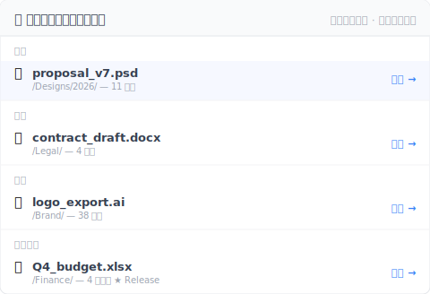

# 【2026 ファイル管理】iCloud と Dropbox を比較する前に:4 社のクラウドが共有するバージョン履歴の崖

> 容量と価格は間違った軸。Retention こそ、すべての比較記事が役に立たなくなる地点。

金曜の午後 4:23、クライアントからメール:「2 か月前の段階での v3 提案版、送ってもらえますか?価格を変更する前の版です。」

Dropbox を開く。バージョン履歴は 30 日前まで。クライアントが欲しいのは 60 日深く沈んだバージョン。

消えている。

これは特定のクラウド 1 社の問題ではありません。これは 4 社のクラウド共通の問題で、比較記事が一度も伝えてこなかったものです。

## 比較記事があなたに見せないバージョン履歴の表

容量、共有、月額——すべての「iCloud vs Dropbox vs OneDrive vs Google Drive」記事の落としどころ。retention のルールを並べた記事はありません。ここに置いておきます:

| クラウド | 汎用ファイルのバージョン履歴 | Retention の形 | 実際の 上限 |
|---|---|---|---|
| **iCloud Drive** | ❌ Apple ネイティブ以外には露出しない | 「最近削除」フォルダのみ | 削除復元 30 日;PSD / Word / PDF にバージョン履歴の画面なし |
| **Dropbox** | ✅ あり | 時間制 | [30 日(Basic / Plus / Family)/ 180 日(Pro / Business)/ 365 日(Enterprise)](https://help.dropbox.com/files-folders/restore-delete/version-history-overview) |
| **OneDrive** | ✅ あり | 計数制 + 削除ウィンドウ | [500 メジャーバージョン 保持](https://learn.microsoft.com/en-us/sharepoint/document-library-version-history-limits);ごみ箱 personal 30 日 / business 93 日 |
| **Google Drive**(ネイティブ以外) | ✅ あり | 時間 + 計数(先に発動するほうが勝つ) | [30 日 OR 100 versions](https://support.google.com/drive/answer/2409045)、ただし「Keep forever」を押した場合は除く |

この表を 10 秒見つめてください。4 社の形が根本的に違います。apple-to-apple で比較しようとしてもできません。

## 3 種類の「retention」メカニズム、1 つの共通盲点

バージョン履歴を露出する 3 社のクラウドは、それぞれ完全に異なる 上限 を使います。

**時間制(Dropbox)**——あなたに与えられるのはウィンドウ。30 / 180 / 365 日。ウィンドウの外のバージョンは、何個あっても消えます。2 か月前に 1 回だけ触ったファイルと、2 か月前に 50 回触ったファイル、結末は同じ:どちらも消えます。

**計数制(OneDrive)**——あなたに与えられるのは枠数。500 メジャーバージョン 保持。500 を超えると、最古のバージョンが削除されて新しいバージョンに場所を譲ります。2 年で 500 バージョン蓄積するかもしれないし、1 週間で 500 回編集して 1 月に見たバージョンが 2 月にはもう消えているかもしれません。

**ハイブリッド制(Google Drive)**——先に発動するほうが勝つ。30 日 OR 100 versions。静かに編集される PSD は 30 日時点でわずか 15 バージョンで履歴が消えるかもしれないし、激しく編集される文書は 2 週間で 100 バージョンの上限に達するかもしれません。Google は「Keep forever」per-version override を提供——ただし保存時に押すことを覚えておく必要があります。

**4 社目の iCloud Drive**——まったく別の問題:**汎用ファイルにバージョン履歴の画面がない**。Pages、Numbers、Keynote にはネイティブのバージョンブラウザがあります(Apple は macOS の文書アーキテクチャから継承)。Word、PSD、PDF、iCloud Drive 内のそれ以外のすべて:最新版だけ同期し、旧版は保持されません。Apple は Apple 以外のファイルタイプに対する明確な retention 方針を公開したことがありません——そもそも公開すべき方針がないためです。

4 社共通の盲点:**どのクラウドにも 上限 がある。Cap の形は違う。比較記事は、どの形があなたの仕事に合うかを一度も伝えていない。**

## なぜ比較記事は retention を扱わないのか?

Retention はスペック表で表示するのが難しいからです。

容量は 1 つの数字:GB。価格は 1 つの数字:月額 $X。共有 UX はスクリーンショット 1 枚。

Retention は条件のツリー:プラン階層、ファイルタイプ、バージョン数、経過時間、「Keep forever」のような手動 override。だからレビューサイトはスキップする——スペック表のフォーマットに合わないため。

これが買い手の盲点:比較記事でクラウドの retention を買うのは、トランクのサイズだけで車を買うようなもの。トランクは買えても、合う車は買えません。

あなたが本当に必要とするバージョンは、比較表に値段がついていません。あなたが本当に必要とするバージョンは、選び終わった 2 か月後に現れます。

## クラウドの機能の中にはないあのバージョン履歴レイヤー

リフレームしましょう:クラウドを乗り換えなくてもこの問題は解けます。あなたのクラウドは同期には問題ありません。足りないのは**別レイヤー**——ファイル層レベルのバージョン履歴、時間 上限 なし、毎回の保存で自動発動。

具体的に:

- **クラウド(4 社のうちどれでも)** は同期 + オフサイトコピーを担当
- **バージョン履歴レイヤー(Keeply または同類)** は毎回の保存、時間 上限 なし、計数 上限 なし、保存時に「Keep forever」を決める必要なし

Dropbox や iCloud を置き換えるわけではありません。クラウドが本来設計されていなかったレイヤーを上に重ねるだけです。

[Keeply](https://keeply.work) は iCloud Drive、Dropbox、OneDrive、Google Drive、Synology / QNAP NAS、Finder のフォルダとそのまま組み合わせられます——システムを乗り換えるのではなく、既存システムの上にレイヤーを追加するだけです。

Keeply はこのレイヤーのリファレンス実装:毎回の保存をローカルに保持、時間 上限 なし、計数 上限 なし、加えて「Release」凍結機構——あるバージョンを「これがクライアントに送った版」とマークすると、その スナップショット は後で 50 回保存しても永遠に残ります。2 か月前のバージョンの回復は約 2 クリック。

```
Keeply タイムライン — proposal.psd
────────────────────────────────
● 2026-05-12 14:23   (現在)
● 2026-04-15 09:11   ◀ 27 日前
● 2026-03-08 17:42   ◀ 65 日前  ★ Release:client-signoff
● 2026-02-14 11:30
```

65 日前のバージョンに付いた Release マークは、OneDrive の 500 バージョン 上限、Dropbox の 30 日ウィンドウ、Google Drive の 100 バージョン計数、いずれも超えても引き戻せることを意味します——Keeply はクラウドのように 上限 を適用しないためです。

削除も同じ理屈です。クラウドのごみ箱は 30 日の時計が来たら空になりますが、Keeply の「最近削除」パネルにはその時計がありません——ローカル保管です：



「先月」にある `logo_export.ai` は 38 日前に削除されたもので、クラウドの 30 日ウィンドウはとっくに過ぎている——Dropbox は 410 Gone、OneDrive も 410 Gone を返します。Keeply のパネルではまだ生きていて、復元を押せば戻ってきます。「それ以前」にある Q4 budget は 4 ヶ月前に削除された Release 凍結版で、どのクラウドの retention でも救えない——Keeply には残ったままです。

## この記事が足りない場面

この記事はすべての retention シーンを解決しません。3 つの境界を明確に:

**ただの削除復元、深い履歴ではない**:「うっかりファイルを削除した」が懸念なら、各クラウドの 30 日ごみ箱で足ります。この記事が説明するレイヤーは不要です。

**規制レベルの不変アーカイブ(GDPR / SOX / HIPAA)**:バージョン履歴は immutable archive ではありません。コンプライアンスが「原本は変更不可」を要求するなら、正規のアーカイブツール——Veeam、Acronis、業界認定プロバイダーが必要です。Keeply と同類ツールは作業中のバージョンレイヤーであり、アーカイブシステムではありません。

**Cloud-native の個人ワークフロー(Pages / Numbers / Sheets)**:仕事がすべて Apple ネイティブ形式または Google ネイティブ Docs / Sheets で完結するなら、内蔵のバージョン履歴で足りるかもしれません。代償はファイルタイプの lock-in——Pages ファイルを Word でそのまま開けず変換が必要です。人によって価値ある取引、人によって割に合わない取引。

## 関連記事

全体像は [ファイルバージョン管理 完全ガイド](/ja/post/file-version-management-complete-guide/) で 4 つの構造的理由を分解しています。

[3-2-1 バックアップ原則](/ja/post/3-2-1-backup-rule/) は空間冗長性の半分を扱います——3 コピー、2 メディア、1 オフサイト。この記事は時間冗長性のもう半分:ファイルが時間の中で取り出せ続ける方法。

[Keeply は何を保存する?バックアップ・クラウドとの違い](/ja/post/what-keeply-saves-vs-backup-cloud/) は Keeply とバックアップツールとクラウドストレージを 3 つの異なるレイヤーとして比較します(競合製品 3 つではなく)。

---

比較記事のフレーミングはあなたをループに閉じ込めます:大きな容量、良い共有、多い機能。実際に壊れるもの——60 日前のバージョン——はスペック表に一度も出てきません。

共有ニーズと価格に合うクラウドを選んでください。それから崖を塞ぐレイヤーを加えてください。

2 か月後にクライアントが尋ねたとき、答えは「はい、あります」——「あれ、ちょっと、消えてました」ではなく。

---

> 著者について:Ting-Wei Tsao、Keeply 創業者。
> [LinkedIn](https://www.linkedin.com/in/ting-wei-tsao-b57480152/)
