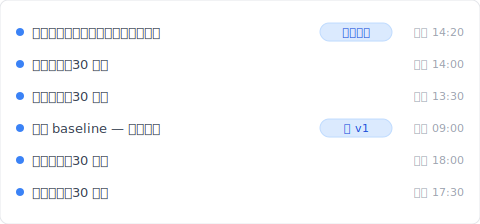
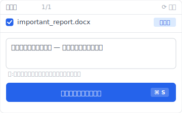

ファイルを削除して、ゴミ箱を開けたら——「ない」。

「えっ、確かに右クリックで削除したのに」と焦って、Shift キーは押していないか、容量を超えていないか、思い出そうとする。心臓が静かに沈んでいく感じ。

落ち着いてほしい。多くの場合、ファイルはまだディスク上にあります。「ゴミ箱から消えた」と「完全に消えた」は別の話です。問題は、Windows と macOS と OneDrive がそれぞれ違う仕様で「ゴミ箱を経由しない削除」を起こすこと。原因さえ突き止めれば、戻せる確率はかなり高い。

ただ、その前に——絶対にやってはいけないことが 4 つあります。まず 5 つの原因のどれに当てはまるかを確認してから、復元方法に進んでください。順番が大事です。

## 削除したファイルがゴミ箱にない 5 つの原因

ゴミ箱にファイルがない理由は、おおよそ次の 5 つに分類できます。それぞれ別の仕組みで起こるので、まず自分のケースを特定するのが復元の第一歩です。

もし Keeply のような常駐型のバージョン履歴ツールがバックグラウンドで動いていれば、これら 5 種類のうちどれが起きていてもファイルの過去バージョンは Keeply のタイムラインに残っています。とはいえ原因を理解しておくと、次の対処が早く決まります。

### 1. Shift+Delete で削除した（Windows 標準仕様）

Windows では `Shift` キーを押しながら `Delete` を押すと、ゴミ箱を経由せずに直接ファイルが削除されます。誤って Shift キーを押してしまっただけでも、ゴミ箱に痕跡は残りません。

この場合でもファイルの実体はディスクの未割当領域に残っていることが多いので、復元ソフトで救える可能性があります。ただし新しいデータがそこに書き込まれると上書きされて消失するので、後述の「復元前にやってはいけないこと」を必ず先に確認してください。

### 2. ゴミ箱の最大サイズを超えて自動削除された

Windows のゴミ箱には「最大サイズ」設定があり、デフォルトでは各ドライブ容量の約 5% が割り当てられています。容量を超えると古いものから自動的に完全削除されるため、大きなファイルを削除した直後に他のファイルも削除すると、知らないうちに最初の大きいファイルが完全削除されることがあります。

ゴミ箱の最大サイズは、デスクトップでゴミ箱を右クリック → プロパティから確認できます。

### 3. ネットワーク共有ドライブや USB から削除した

ファイル サーバー、NAS、USB メモリ、SD カードといった「ローカル C ドライブ以外」から削除したファイルは、Windows のゴミ箱には入りません。これは Windows の仕様で、ローカル NTFS ドライブ以外からの削除は「即時完全削除」になります。

これに気づかず、社内ファイルサーバーから誤削除した翌日に「ゴミ箱を見たけれどない」と気づくケースは、企業 IT サポートで最も多い問い合わせの一つです。

### 4. OneDrive・SharePoint で同期削除された

OneDrive または SharePoint で同期されているフォルダから削除したファイルは、ローカルのゴミ箱には入らず、OneDrive クラウド側の「ごみ箱」に移動します。ローカルのゴミ箱を開けても見つからないのは、削除がクラウド側に同期されているからです。

OneDrive 個人版のごみ箱保存期間は 30 日、ビジネス版（SharePoint）は 93 日。期間を超えると自動的に完全削除されます。

### 5. ゴミ箱の保存期間が過ぎた

最近の Windows 10 / 11 では「ストレージ センサー」機能がデフォルトで有効になっており、ゴミ箱内のファイルが 30 日経過すると自動的に完全削除される設定が初期値です。

この機能は設定アプリ → システム → 記憶域 → ストレージ センサーから無効化できますが、初期設定のままの PC では「1 ヶ月前に削除したファイル」が静かに消えていることになります。

## 【重要】復元を試す前にやってはいけない 4 つのこと

ファイルが消えた直後、復元ソフトをすぐにダウンロードしたくなる気持ちはわかります。でも、その行動自体が復元の成功率を下げる可能性があります。次の 4 つは、原因を特定してから対処方法に進む前に、絶対に避けてください。

これら 4 つの禁止事項は「事前のバックアップが何もない」前提で書いています。Keeply のような常駐スナップショットが動いていれば、削除前のバージョンは既にタイムラインに残っているので、この 4 つの圧力はほぼ感じません。それでも復元ソフトに頼らざるを得ない場面で困らないよう、知っておきましょう。

### 1. 削除元のドライブに新しいデータを書き込まない

ファイルの実体は削除直後はディスクの未割当領域に残っています。ですが、その領域に新しいデータが書き込まれると、上書きされて完全消失します。

つまり、削除後にブラウザを開く、ファイルをダウンロードする、メールを送るといった操作は、すべて何らかの新しい書き込みを発生させ、復元したいファイルを上書きする可能性があります。原因の確認以外は、PC の操作を最小限に抑えてください。

### 2. SSD では TRIM 機能で痕跡が消えていることがある

SSD には「TRIM」という機能があり、ファイル削除時に OS が「この領域はもう使わない」と SSD に通知して、内部でデータを物理的にクリアする仕組みです。HDD では削除されたデータの実体が残りやすい一方、SSD では TRIM が走った後では復元ソフトでも救えないことが多くなります。

SSD で Shift+Delete した場合、数秒～数分以内に TRIM が走ることが多いので、復元の難易度は HDD より格段に高くなります。

### 3. 復元ソフトを削除元と同じドライブにインストールしない

これは初心者が最もよくやる失敗です。慌てて復元ソフトをダウンロードして、デフォルト設定のまま C ドライブにインストールすると、復元したかったファイルの未割当領域に復元ソフト自身が書き込まれ、上書きされてしまいます。

復元ソフトを使う場合は、必ず別の USB メモリやポータブル版を使うか、別のドライブにインストールしてください。

### 4. PC の再起動・初期化を急がない

「再起動すれば直るかも」「初期化すれば元に戻るかも」と思いがちですが、削除されたファイルにはまったく逆効果です。再起動は OS のシステムファイル書き込みを発生させ、初期化に至っては該当ドライブ全体に新しいデータが書き込まれます。

復元したいファイルがあるなら、まず PC を最低限の操作に留め、原因を特定し、適切な復元方法を選んでから動いてください。

## 自力で復元する 4 つの方法

原因を特定し、上記の禁止事項を理解した上で、復元方法に進みます。あなたの状況に応じて、次の 4 つから順に試してください。

これら 4 つはすべて「事後に取り戻す」アプローチで、事前に対応機能を有効化していたことが前提です。何も設定していなかった場合は、次のセクションで紹介する Keeply の「事前保存」設計の方が現実的な答えになるかもしれません。

### 1. Windows File History（Windows 10 / 11）

Windows には「ファイル履歴」という標準バックアップ機能があり、事前に有効化していれば、特定のフォルダ（ドキュメント、デスクトップ、ピクチャなど）の過去のバージョンを復元できます。

エクスプローラーで該当フォルダを開き、リボンメニューから「履歴」をクリック。事前にファイル履歴が有効化されていれば、過去の特定の時点のフォルダ状態に戻すことができます。

注意点は「事前に有効化されていれば」です。デフォルトでは無効化されており、多くのユーザーは削除してから初めてその存在を知ります。これからの予防として有効化しておくことをおすすめします。

### 2. macOS Time Machine

Mac には「Time Machine」という時系列バックアップ機能があり、外付け SSD やネットワークストレージを接続しておけば、自動的にスナップショットが取られます。

メニューバーから Time Machine アイコンをクリック →「Time Machine を起動」を選択。過去の時点のフォルダに戻り、目的のファイルを選んで「復元」をクリックすれば、現在のフォルダに復元されます。

Time Machine は事前設定とストレージ接続が必要なので、デスクトップ作業のみで外付けドライブを接続していない場合は使えません。

### 3. OneDrive ごみ箱・バージョン履歴

ファイルが OneDrive または SharePoint 同期フォルダにあった場合、OneDrive Web 版から「ごみ箱」を確認できます。OneDrive 個人版で 30 日以内、SharePoint で 93 日以内なら、削除されたファイルが残っている可能性が高いです。

OneDrive Web → 左メニューのごみ箱 → 該当ファイルを選択 →「復元」で元のフォルダに戻ります。

また、ファイル自体は存在しているが「中身が破損した」場合は、OneDrive の「バージョン履歴」から過去のバージョンに戻すことも可能です。これは [Microsoft Learn](https://learn.microsoft.com/ja-jp/sharepoint/document-library-version-history-limits) によれば、デフォルトで最大 500 バージョン保存されます。

### 4. 復元ソフト（Recuva、Disk Drill など）

上記 3 つに該当しないなら、専用の復元ソフトを試すことになります。代表的なのは [Recuva](https://www.ccleaner.com/recuva)（無料）と [Disk Drill](https://www.cleverfiles.com/recover-deleted-files.html)（無料お試し版あり）。

ただし、復元ソフトの成功率は条件によって大きく変わります：

- HDD で削除直後 → 70-90% の成功率
- SSD で TRIM 後 → 10-30% に低下
- ファイル断片化していた場合 → さらに低下

復元ソフトは「最後の手段」で、根本的に消失を防ぐ仕組みではありません。

## そもそも消えない設計：常駐型 バージョン履歴という選択肢

ここまで読んで気づいたかもしれません——救援ソフトを呼ぶ、業者に依頼する、復元成功率を上げるために PC の操作を止める、これらはすべて「事後対応」の話です。

でも、本当に必要なのは「事前にコピーが取られている」設計ではないでしょうか。

Windows File History も Time Machine も、その思想自体は正しい。問題は、ほとんどのユーザーがそれらの存在に気づいていないこと、そして気づいた頃には削除した後である、ということです。

Keeply はその「気づかない時に既にコピーが取られている」設計に振り切ったツールです。

仕組みはシンプルです：

- 30 分ごとに、選択したフォルダの全ファイルを自動的にスナップショット保存（15 / 30 / 60 分から選べる）
- 任意の時点に手動で「保存」ボタンを押せば、その瞬間のスナップショットに名前を付けて記録
- 削除・上書き・破損が起きても、過去のタイムラインから戻せる

「ここの状態は残しておきたい」と思ったタイミングで、手動でスナップショットを取ることもできます。

つまり、ゴミ箱から消えても、Shift+Delete されても、OneDrive 同期で削除されても——Keeply が独立に保存していたバージョンは無事です。これは「事後復元」ではなく「事前保存」の考え方です。

ただし、Keeply で解決できないこともあります：

- 物理障害（HDD の磁気ヘッド故障、SSD のチップ故障）には対応していません
- そのケースでは [a1d](https://www.a1d.co.jp/) などのデータ復旧専門業者が必要です

Keeply は「ユーザー操作起因（誤削除・誤上書き・破損保存）」の事故をカバーするツールで、「ハードウェア故障」は守備範囲外です。この線引きは明確にしておきます。

## よくある質問

### Q1. Keeply の自動保存って、削除されたファイルも戻せるんですか？

はい、戻せます。Keeply は 30 分（または 15 / 60 分）ごとに、指定フォルダ内の全ファイルをタイムラインに保存します。削除されたファイルは「最後の保存スナップショット」から復元可能で、ゴミ箱に依存しません。Windows・macOS どちらでも動作します。

### Q2. Shift+Delete で完全削除したファイルは戻せますか？

Windows の仕様上ゴミ箱に入らないため、標準機能では戻せません。File History や Time Machine が事前有効化されていれば過去バージョンから復元可能。それ以外は復元ソフトで試すしかなく、SSD では TRIM の影響で成功率が下がります。事前に Keeply のような 常駐型 履歴ツールを動かしておくのが確実です。

### Q3. 復元ソフトは安全ですか？

Recuva（CCleaner 系）と Disk Drill は世界的に使われている主要ツールで、ソフト自体は安全です。ただし、削除元と同じドライブにインストールすると復元したいファイルを上書きしてしまう問題があるので、必ず別ドライブ・USB から実行してください。

### Q4. SSD では復元の成功率は HDD より低いって本当ですか？

本当です。SSD には TRIM という機能があり、ファイル削除時に OS が「この領域はもう使わない」と通知すると、SSD 内部で物理的にデータがクリアされます。HDD では削除データの実体が残りやすいですが、SSD では TRIM 後の復元はほぼ不可能です。

### Q5. 業者に依頼する場合、いくらかかりますか？

論理障害（誤削除など）で 3 万 ~ 10 万円、物理障害（HDD 故障など）で 10 万 ~ 50 万円が相場です。完全成果報酬制を採用する業者なら、復旧できなかった場合は費用ゼロのことが多いので、まず無料診断を依頼するのが安全です。

---

**著者**：Ting-Wei Tsao｜Keeply 創業者
[LinkedIn](https://www.linkedin.com/in/ting-wei-tsao/)｜[Keeply](https://keeply.work/)

Keeply は「ファイルの履歴を常に残し続ける」ためのデスクトップツールを作っています。ゴミ箱に頼らなくても、Cmd+Z に頼らなくても、過去のあらゆる時点に戻れる——そんな普通の体験を、すべてのファイル作業者に届けたいと考えています。

関連記事：

- [削除されたファイルが見つからない時に：iOS や Outlook にあって Finder にない「最近削除した項目」リスト](/ja/post/deleted-files-recovery-list/)
- [ファイル版本管理の完全ガイド：Mac、Windows、クラウドの違いから Keeply まで](/ja/post/file-version-management-complete-guide/)
