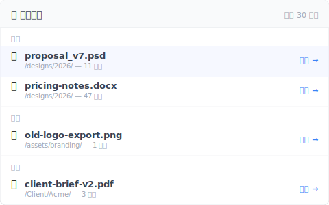

# 【2026 ファイル管理】復元ソフトはいらない、必要なのは「最近削除した項目」リスト

> iOS は削除したものを見せる、Finder は見せない。一番必要なツールに限って欠けているパターン。

水曜日の午前 11:14、間違った重複ファイルだと思って Delete を押す。2 分後、消したのが正しいファイルのほうだったと気づく。

ゴミ箱を開く。空。先週金曜日に空にしたばかり。

Google で「Mac 削除したファイル 復元」と検索。最初の結果: [Disk Drill](https://www.cleverfiles.com/help/disk-drill-pro-subscription.html)、年額 $89 米ドル(買い切りは $149)、SSD のフォレンジックスキャンが必要。すでに「SSD でフォレンジック復元は安全か」を Google している。

フォレンジックツールはいらない。リストがいる。

## すでにこれをやっているツール、やっていないツール

iOS 写真には「最近削除した項目」アルバムがある。iCloud Drive にもある。メモにもある。Outlook には「削除済みアイテムの回復」がある。Gmail には 30 日のごみ箱。

ところがコラボツールには必ずしもない。Slack 無料プランでは[削除したメッセージは戻ってこない](https://slack.com/help/articles/203457187-Customize-data-retention-in-Slack)——あの「90 日」は表示できる履歴の上限であって、取り消しボタンではない。「削除したものを取り戻す」という一見基本的なことを、Slack ですらやっていない。

そして表の下半分——あなたが実際に作業している場所。

| ツール | 「最近削除した項目」リスト? |
|---|---|
| iOS 写真 | ✅ 30 日アルバム |
| iCloud Drive | ✅ [「最近削除した項目」30 日](https://support.apple.com/guide/icloud/recover-deleted-files-mmae56ea1ca5/icloud) |
| メモ(iOS / macOS) | ✅ 30 日フォルダ |
| Outlook | ✅ 削除済みアイテムの回復 |
| Gmail | ✅ 30 日ごみ箱 |
| Slack | ⚠️ [「削除の取り消し」機能はない：90 日は表示上限であって復元ではない](https://slack.com/help/articles/203457187-Customize-data-retention-in-Slack) |
| **macOS Finder** | ⚠️ ゴミ箱 30 日、ただしフォルダ単位のリストなし |
| **Windows エクスプローラー** | ⚠️ ごみ箱のみ、空にしたら消失 |
| **Dropbox ローカルフォルダ** | ❌ ローカルから消える（[オンライン版 Basic 30 日 / Pro 180 日](https://help.dropbox.com/delete-restore/recover-deleted-files-folders)なら復元可） |
| **Google Drive ローカル同期** | ❌ Dropbox と同じ |
| **一般的なバージョン管理ツール** | ❌ 「履歴を見る」が必要 |

下半分のツールこそ、あなたが本当の仕事を保存している場所。上半分のツールは、むしろこの機能がなくても何とかなる場所。

## なぜこのパターンは一番必要な場所に欠けているのか?

「最近削除した項目」という affordance は、**キュレートされたコンテンツモデル**を持つアプリ(写真、メモ、メール)に存在します。ファイルを「ファイルシステムの透過的ミラー」として扱うツールには欠けています。

**キュレートされたアプリ**(iOS 写真、Outlook、メモ): あなたは「ファイルを管理」しているのではなく、「コンテンツとやり取り」しています。「最近削除した項目」はコンテンツ管理のプリミティブ——メンタルモデルがそれを要求し、デザイナーは当然それを作りました。

**ファイルシステムのミラー**(Finder、エクスプローラー、Dropbox ローカル同期): これらは**ディスクの内容を透過的に反映する**ために作られました。「最近削除した項目」ビューを追加するとこの透過性契約に違反します——ファイルがディスクにないのに、なぜフォルダが表示するのか?

その透過性の代償: あなたは OS レベルのゴミ箱 / ごみ箱だけを継承します。空にした後、ファイルはどこにいても消えたように見えます——バージョン管理やクラウド同期にはまだコピーがあっても。復元経路は「タイムラインを開く → 日付を探す → ファイルを探す → 復元」になります。摩擦が大きく、スキップしやすく、フォレンジックツールに頼ってしまいやすい。

それで Disk Drill の価格ページにたどり着く——フォレンジック復元が正しいツールだからではなく、正しいツール(あのリスト)がツールに露出されていなかったから。

## UI が露出しなかったあの 30 秒復元経路

ツールが「最近削除した項目」リストを露出するとき、復元は約 5 秒。露出しないとき、復元は 5 分のタイムライン掘り、または $89 米ドルと 2 時間のフォレンジックスキャン——しかも SSD では復元できるとは限らない。

このパターンをうまく実装したツールの姿:

- **トップレベルに露出**——サイドバー入口またはメインタブ、3 クリック奥に埋めない
- **時間でグループ化**——「今日 / 昨日 / 今週 / それ以前」、200 件の削除のフラットリストではない
- **元のパスを表示**——このファイルはどのフォルダから削除されたか? 「そう、これだ」と確認するために重要
- **ワンクリック復元**——バージョン選択なし、3 ステップの「本当によろしいですか」ウィザードなし。クリック → 元のパスへ復元
- **フォレンジック不要**——これは自分の意図的な保存履歴からの復元であり、raw ディスクセクタからの復元ではない

[Keeply](https://keeply.work) はこれを「🗑️ 削除リスト」パネルとして実装: 追加したプロジェクト内、過去 30 日に削除されたファイルのリスト、時間でグループ化、元のフォルダへワンクリック復元。復元という動作自体が新しい保存ポイントを作る——だから undo もバージョン化され、もう一度 undo できる。

```
Keeply — 最近削除

今日
─────────────────────────
🗑️ proposal_v7.psd       ◀ 11 分前      /designs/2026/
🗑️ pricing-notes.docx    ◀ 47 分前      /designs/2026/

昨日
─────────────────────────
🗑️ old-logo-export.png   ◀ 1 日前       /assets/branding/
```

実際のパネルはこんな見え方になります。各ファイルに元のパスと復元ボタンが並んでいます。



フォレンジックツールではない。復元ボタン付きのリスト。

Keeply に追加した任意のフォルダの中で動作します——Dropbox ローカルフォルダ、iCloud Drive フォルダ、Synology NAS のプロジェクトディレクトリ、ノート PC のプレーンなフォルダ。システムを乗り換えるのではなく、リストをレイヤーとして既存システムの上に重ねるだけです。

## このリストでは足りない場面

このパターンはすべての削除シーンを解決しません。3 つの境界を明確に:

**6 か月前にゴミ箱を空にし、当時バージョン管理を走らせていなかった**: この記事のパターンは適用外——本物のフォレンジック領域に入っています。Disk Drill や Recuva が役立つかもしれませんが、[なぜこれらすらしばしば失敗するか](/ja/post/restore-without-panic/) に別記事があります(SSD TRIM が短い答え)。

**削除があなたの管理外のリモート共有で発生**: IT 管理者やチームリーダーが SharePoint ごみ箱を [93 日ウィンドウ](https://learn.microsoft.com/en-us/sharepoint/retention-and-deletion)を超えて空にした場合、リストはあなた側に最初から存在しません。解決は管理者ポリシーの会話で、ソフトウェアのインストールではありません。

**ファイル全体ではなくファイル内部の編集を復元したい**: Excel の単一セルロールバック、Word の特定段落の取り消し——これは別問題で、[Excel](/ja/post/excel-version-history-limits/) と [Word](/ja/post/client-asked-which-version/) でそれぞれ扱っています。

## 関連記事

全体像は [ファイルバージョン管理 完全ガイド](/ja/post/file-version-management-complete-guide/) で 4 つの構造的理由を分解。

[削除したファイルがゴミ箱にない時の復元方法: 4 つのケース](/ja/post/restore-without-panic/) — 本記事のフォレンジック角度対照版: 「リスト型復元」が間に合わなかった時、その代替がなぜ失敗するか。

[上書き 復元の限界: 自動回復 が消えた後でも間に合う方法](/ja/post/recover-overwritten-file/) — 別の復元シナリオ(削除ではなく上書き)、同じテーマ: ツールは「何のために作られたか」で分類されている。

---

ファイル復元の摩擦は技術的限界ではなく、UI 設計の選択です——削除したものを見せるか見せないか。

見せるツール(iOS、Outlook、iCloud) はあのパニックスパイラルを救ってくれます。見せないツール(Finder、エクスプローラー、一般的な同期クライアント)はあなたを入る必要のなかったフォレンジック領域へ押しやります。

このパターンを露出するツールを選んでください。あるいはそれをするレイヤーを追加してください。水曜の朝、間違った Delete の 2 分後、答えは「クリック、クリック、復元」——「Disk Drill いくらか Google で調べる」ではなく。

---

> 著者について: Ting-Wei Tsao、Keeply 創業者.
> [LinkedIn](https://www.linkedin.com/in/ting-wei-tsao-b57480152/)
