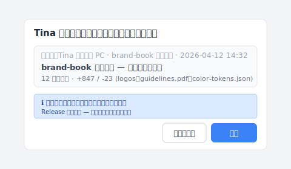

# 【2026 ファイル管理】退職社員のデータ持ち出しはどこまで防げる？「同期」を「バックアップ」と混同しているから

> 退職前の土曜日、社員が brand-book フォルダを空にした。Dropbox は素直に同期しただけ。法律でも DLP でもなく、「同期はバックアップではない」が本当の教訓。

## 目次

- [あの土曜日の夜 11 時 03 分](#hook)
- [弁護士は間に合わない、DLP も間に合わない](#alternatives)
- [なぜ彼女はこんなに簡単に削除できたのか](#why)
- [Keeply に乗り換えるとは：不可逆な履歴](#keeply)
- [Keeply で解決できないこと](#limits)

---

## あの土曜日の夜 11 時 03 分 {#hook}

あの土曜日の夜 11 時 03 分、Tina は自宅で `brand-book` フォルダを丸ごとゴミ箱にドラッグして、そのまま空にした。

1 分も経たないうちに、Dropbox はその動作を忠実にクラウドへ同期した。

月曜日、クライアントから原稿の依頼が入り、フォルダを開けると——空。まだ救えると思った。だが、彼女が手動でゴミ箱を空にした行為は、Dropbox のバージョン復元機構を丸ごと迂回していた。

（Dropbox Personal の保持期間は 30 日、Business は 180 日。だがどちらも「ユーザーが自分でゴミ箱を空にする」行為は救えない。詳しくは [Dropbox 公式の説明](https://help.dropbox.com/delete-restore/recover-deleted-files)を参照。データ復元ソフトも同じく [4 つのケースには届きません](/ja/post/restore-without-panic/)。）

彼女がファイルをコピーして持ち出したかどうかも分からない。クライアントに何も納品できない。

---

## 弁護士は間に合わない、DLP も間に合わない {#alternatives}

こういう事態に直面すると、ネットで解決策を探す。

法的手段？弁護士は不正競争防止法と営業秘密の話を始めるだろう。だが現実は、今あなたには証拠を提出することすらできない。仮に 1〜2 年かけて勝訴したとしても、その `brand-book` は古びて誰の役にも立たない。

法律が火を消せないとなると、次は企業向けセキュリティソフト（DLP）に目が向く。そちらはさらに深い穴だ。DLP はコピーを止められる、確かに。だが月額費は 12 人のチームに見合うレベルではないし、システムをお守りする専任のエンジニアも要る。最も致命的なのは、DLP が守れるのは未来だけだということ。Tina が週末に済ませてしまったことは、今からどんなに高い DLP を契約しても取り返せない。

両方とも「事が起きた後」を解こうとしている。誰も一番根本の問いを聞かない。

---

## なぜ彼女はこんなに簡単に削除できたのか {#why}

**なぜ彼女はこんなに簡単に削除できたのか？**

ツールを間違えていたからだ。

Dropbox、Google Drive、OneDrive のどれも壊れていない。それらの中核設計は「両端一致」だ。あなたが削除すればクラウドも削除する。あなたが変更すればクラウドが上書きする。それらの仕事はあなたの動作を映すことであって、あなたの資産を守ることではない。

同期ツールをファイル保管庫として使うのは、会社の命脈そのものを、保険のかかっていない裸の倉庫に置くようなものだ。

私が Keeply を作ったのは、まさにこの機制の空白を埋めるためだ。

---

## Keeply に乗り換えるとは：不可逆な履歴 {#keeply}

だからこそ、本物のファイル・バージョン管理ツールが必要なのだ。その底の論理は同期ではなく、不可逆な履歴だ。

Keeply に乗り換えると、Tina がファイルを削除しても、ゴミ箱を漁る必要はない。タイムラインを開いて前のバージョンに戻すだけだ。仮に彼女に管理者権限があっても、Release として印を付けたマイルストーンは消せない。彼女が何に触ったかも、軌跡として固定されている。後から探偵のように繋ぎ合わせる必要はない。

引き継いだ担当者は、Tina のノート PC にあったバージョンを実際にどうやって自分の手元に持ってくるのか。Keeply には「cherry-pick」という対話画面があり、別のマシンや別の保管庫から特定のバージョンを取り込んで適用できます。

引き継いだ担当者は Keeply を開き、Tina のノート PC の brand-book 保管庫を選び、4 月 12 日の納品版の行に「brand-book 業主納品 — 完全承認版」と書いて「適用」を押す。logos、guidelines.pdf、color-tokens.json を含む 12 ファイルが、新しいマシンの作業フォルダに一度に入ってくる。Release 凍結の属性もそのまま付いてくるので、後で誰かが誤って消すこともない。

---

## Keeply で解決できないこと {#limits}

正直に言う。Keeply は万能薬ではない。

「リアルタイムで監視して USB メモリにロックをかける」のが欲しいなら、それは DLP の仕事だ。Slack や Figma のアクセスを剥奪したいなら、それは普通のアカウント引き継ぎ。法的助言が欲しいなら、弁護士に相談すべきだ。

先に一つ決めなければならない：あなたが欲しいのは、大金を払って社員のミスを防ぐことか、それとも**「社員が何をしても、1 秒で復元できる」**ことか？

私が Keeply を作ったのは、後者を解くためだ。

次の社員が退職を申し出るとき、月曜の朝 9 時 14 分にシステムを開いてみる。その人がこの 6 か月で触ったすべてのファイル、すべての意味ある変更が、タイムライン上に静かに並んでいる。

退職前の最後の週末に何をしたかを心配する必要はない。記録はとっくに固定されているから。

---

> 著者：Ting-Wei Tsao、Keeply 創業者。
> [LinkedIn](https://www.linkedin.com/in/ting-wei-tsao-b57480152/)
