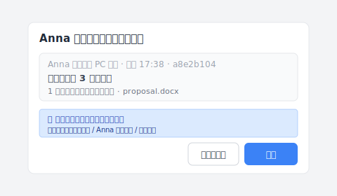
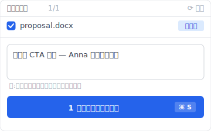
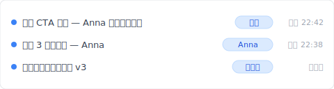

木曜日の夜 10:30、同僚 Anna と共有 Dropbox で同じ提案書を編集中。彼女は 3 段落追加。あなたは同時に末尾の CTA を追加。二人とも Cmd+S。翌朝フォルダを開くと、`提案 (Anna の競合コピー 2026-05-02).docx` が増えている。彼女の編集はあなた側になく、あなたの編集は彼女側にない。1 時間かけて手動で統合、30 分かけて漏れがないか確認。

これはバグじゃない。Dropbox に衝突検知層がない結果です。先に競合コピーが出る本当の 仕組み を見て、それから 3 つの 同期 設計でどう根本解決するか紹介します。

## 目次

- [競合コピーが出る場面](#when-it-happens)
- [Dropbox がこう設計した理由](#why-dropbox-design)
- [手動で 2 つのファイルを統合するのは対症療法](#why-manual-merge-fails)
- [3 つの 同期 設計で根本解決](#three-designs)
- [Keeply が向かない場面](#boundaries)

## 競合コピーが出る場面 {#when-it-happens}

「競合コピーが何度も出る」を分解すると、4 つの完全に異なる場面、それぞれが引き金になります：

| # | 場面 | 仕組み |
|---|---|---|
| 1 | **二人同時編集** | 両端とも Cmd+S でアップロード、Dropbox は前に変更されたか分からない |
| 2 | **オフライン編集後オンライン** | 電車内で編集、Wi-Fi で同期した時にクラウド版とずれる |
| 3 | **複数デバイス切替** | ノート PC で途中まで→スマホで続き→ノート PC が後で同期して衝突 |
| 4 | **OS 間の時計ずれ** | Mac と Windows のシステム時刻が数秒ずれ、Dropbox が衝突と判定 |

意外と知られていない：4 つのうち一つでも踏めば競合コピーが出ます。**あなたの普段の働き方は少なくとも 2 つは踏みます。**

## Dropbox がこう設計した理由 {#why-dropbox-design}

Dropbox は「後から保存した版が勝ち、前の版を別保存する」設計：二人同時編集、後からアップロードした版が勝ち、前の版は `(競合コピー)` として残る。

衝突検知が技術的に難しいわけじゃない。商業上のトレードオフです：

- **リアルタイム体験優先**：同期 があなたの仕事をブロックできない。毎回「マージ方式を選んでください」が出たら Dropbox は使いにくくなる。
- **競合解決をユーザーに押し付け**：もう一版を別保存 = 「全部残しておきます、自分で決めて」
- **設計者の選択**：誰も失わないが、あなたが手間を払う。

そう、ここがイラつくところです。Dropbox はツールがやるべきこと（衝突検知層）をユーザーの規律に押し付ける。そして規律は自動化に永遠に勝てません。

Keeply を作る前、自分でも Dropbox で同じことに何百回もぶつかり、後になって、これは自分の不注意ではなく Dropbox がそう設計されているからだと分かりました。

## 手動で 2 つのファイルを統合するのは対症療法 {#why-manual-merge-fails}

Dropbox Help Center が教える 対処：「2 つのファイルを開く、差分を比較、メインに手動統合、競合コピーを削除。」一聴合理的。

しかしこの 対処 は **仕組み を変えない**。来週また 同期 衝突、新しい競合コピー生成、また手動統合。一ヶ月後にこれを 4-5 回やっています。

統合が下手なんじゃない。**衝突をブロックしないように設計されたツール** を使っています。解は 同期 仕組み を変えることで、自分が早く統合できるよう訓練することじゃない。

Google 上位 3 位（Dropbox Help / EaseUS / Wondershare）と比較：全て対症療法ガイド。誰も 仕組み 角度から切らない。この記事は切ります。

## 3 つの 同期 設計で根本解決 {#three-designs}

同期 設計ができることを 3 つのパターンに分けます。それぞれ異なる 衝突 場面を解決：

### 設計 A：検知 + 確認（同期時にユーザーに聞く）

両端で同じファイルを編集、同期時に衝突を検知、UI 画面で「A を残す / B を残す / 両方統合」を選ばせる。**例**：エンジニア圏で使われるバージョン管理ツールがこの仕組み。**Keeply** は同じ検知をオフィス系ツールに持ち込む：衝突発生時、「Anna の版 / あなたの版 / 両方合わせる」のような日常語で選ばせる、専門用語は出さない。

実際の動きはこうです。Anna がプロジェクトの保管庫に一版プッシュした。Keeply は「彼女の変更を適用するか」をダイアログとして開き、あなたに判断させます：

「適用」を押す前に、Keeply は現在の版を自動でスナップショットします（押し間違えても元に戻せる）。両者が同じ段落を編集していれば、第二段階のプロンプトが出ます：あなたの版を残す / Anna の版を使う / 両方残す。**場面 #1 + #2 を解決**。

### 設計 B：ファイルロック（先に開いた人が使う）

ファイルを開くとツールが自動でロックする。同僚が開くと「Anna が編集中」と表示され、変更できず、待つ必要あり。**例**：SharePoint、Adobe Creative Cloud Files、Bentley ProjectWise（建設・エンジニアリング業界で使われるプロジェクト管理システム）。**場面 #1 + #3 + #4 を解決**、トレードオフ：同僚は待つ必要あり。

### 設計 C：ローカルコピー + 能動的プッシュ（Keeply モデル）

作業版はあなたのマシン上、同期はあなたが「プッシュ」を能動的に押す（Dropbox のリアルタイム鏡像ではない）。衝突はプッシュ時に検知し、日常語の UI で確認させる。**Keeply** はこの路線：ローカルで編集、差分を見て、問題なければ NAS / SharePoint / 共有フォルダにプッシュ——「Dropbox が知らないうちにあなたの版を上書きする」サプライズを省く。

末尾の CTA を書き終えたら、Keeply のメインウィンドウの「版を保存」を押すと、このダイアログが出ます：

「末尾 CTA を追加——Anna のマージを待つ」のような 1 行を書いて、版を保存。Anna も同じ操作をします。両方の版は共有保管庫のタイムラインに別々に並び、互いに上書きしません：

2 つの版が並び、それぞれに変更内容のメモがついている。マージの仕方はあなたが決める——`(conflicted copy)` という静かなファイル名も、3 週間後に気づく驚きもありません。**場面 #1-#4 を解決**、トレードオフ：Dropbox ほど即時じゃない。

ここで気づくはず、場面 #4（OS 間の時計ずれ）が最も難解です、純粋な時計問題だから。設計 A と C は検知できるが、解決はやはりユーザー介入が要る。

## Keeply が向かない場面 {#boundaries}

Keeply は全ての Dropbox 場面を解決しません：

- **大きいファイルのリアルタイム同期**：Premiere プロジェクトを編集しながら同期、Keeply のローカルコピーモデルは不向き（プッシュに数分かかる）。
- **モバイルデバイスからのアクセス**：Keeply はデスクトップ優先、Dropbox アプリのほうがスマホでずっとスムーズ。
- **外部共有リンク**：Dropbox の「Share link」は Keeply に対応機能なし。
- **超高頻度コラボ**（1 時間以内に複数人が交互に編集）：Keeply は Dropbox より遅い、その場面は Google Docs 共同編集を使うべき。

## 次に `(競合コピー)` を見る前に

次にフォルダに `(競合コピー)` ファイル名 が増えても、もう 1 時間手動統合に費やさない。それが 仕組み 問題だと知っているし、別の選択肢があると知っているから。

Keeply が 同期 競合をどう解くか見たいですか？[「ファイルバージョン管理 完全ガイド」を続きで読む。](/ja/post/file-version-management-complete-guide/)

---

> 著者について：Ting-Wei Tsao、Keeply 創業者。
> [LinkedIn](https://www.linkedin.com/in/ting-wei-tsao-b57480152/)
