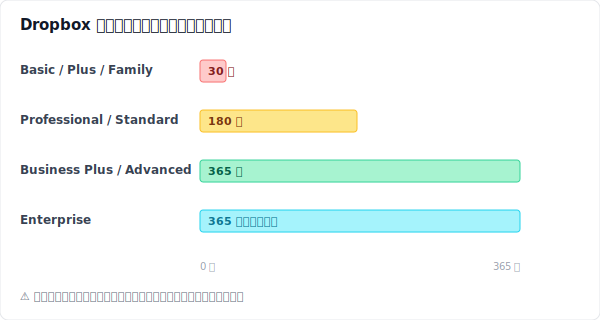
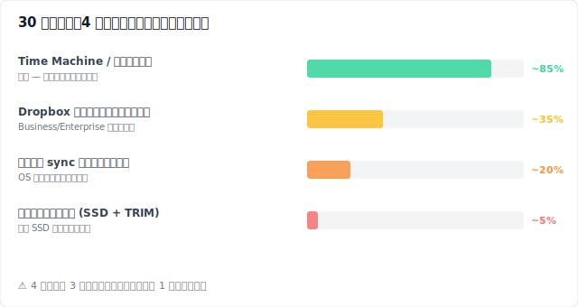
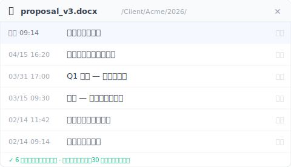
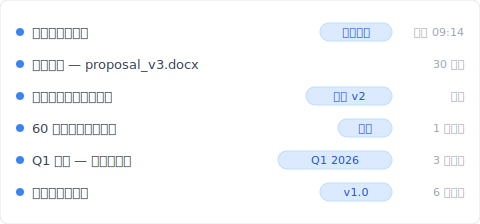

# 【2026 ファイル管理】Dropbox は 30 日以内なら復元できる — 60 日後の依頼までは持たない

> Dropbox の 30 日ウィンドウは昨日のミスは救うが、2 ヶ月前のバージョンを救えない。クライアントが 60 日後に求める版をどう守るか。30 日目以降に残る選択肢と、次回からは時計に頼らない方法。

これは復元ガイドではありません。Dropbox の 30 日タイマー上の異なる地点にいる 3 人と、それぞれにまだ何ができるか、という話です。

3 人の名前は架空のものです。状況は [Dropbox コミュニティ](https://community.dropbox.com/) で繰り返し見かける削除ファイル復元スレッドのパターンを合成したものです。発見される仕組みのほうは、すべて実在します。

## Sarah — 5 分前

> **【合成例】**Sarah はフリーランスのデザイナー。水曜の午前 11 時 14 分。彼女は `proposal_v3_FINAL.docx` の Delete を押したばかり。古いほうの重複ファイルだと思い込んでいた。新しいほうは `proposal_v3_FINAL_FINAL.docx` だったはず。彼女の手が止まる。あれ、本当にそう？

彼女は dropbox.com を開き、左サイドバーの **削除済みファイル** をクリックします。ファイルはそこにあり、11 時 14 分の日付。3 クリック：**⋯** → **復元**。完了。ファイルは元のパスに戻り、ノート PC が同期し直し、2 分後にはスマートフォンも追いつきます。

Sarah の復元が簡単だったのは、保持期間の内側にいたからです。Basic / Plus / Family の各プランで、Dropbox は削除されたファイルを 30 日間保持します（出典：[help.dropbox.com の削除ファイル復元ページ](https://help.dropbox.com/delete-restore/recover-deleted-files-folders)）。この 30 日以内なら、ウェブクライアントで 3 クリックの作業です。

ただし、Sarah が気づいていないことが 1 つあります。彼女の復元が成功したのは、偶然 3 つのことを正しくやっていたからです。

彼女はデスクトップのファイルマネージャではなく、dropbox.com を使いました。もし `proposal_v3_FINAL.docx` が [セレクティブシンク](https://help.dropbox.com/sync/selective-sync-overview)（特定のフォルダをローカルに置かないことで容量を節約する Dropbox の機能）で除外されたフォルダの中にあったら、削除はローカルのごみ箱を経由せず、クラウド側だけで起きていたはずです。多くの人がここで取りこぼします。先にローカルを探し、見つからないので「もともと無かったのだろう」と諦めるのです。

それからもう 1 つ、彼女が復元したのは特定のバージョンではなく、ファイルそのものでした。もし Sarah が 3 週間前の火曜日の `proposal_v3` ——今日のバージョンではなく——を欲しかったとしたら、必要なのはバージョン履歴のレイヤーで、これは削除履歴とはまったく別の枝です。復元というのは、削除された瞬間の姿でファイルが戻ってくることを意味します。昨日のうちに行った 3 回の保存は、その中に焼き込まれてしまっています。

さらに、Sarah はこのフォルダで「競合コピー」を見たことがありませんでした。もし `proposal (Marco's conflicted copy 2026-04-15).docx` のような、Dropbox が [同期の衝突](../dropbox-conflicted-copy/) のときに作るマーカー付きファイルがあって、同僚が「いらないやつだ」と削除していたら——彼女は削除済みファイルの中で、間違ったファイル名を探すことになっていました。

Sarah はこんなことを一つも考えていません。ファイルが戻った。お昼を食べた。午後は何ごともなく過ぎていきます。

## Marco — 35 日前

> **【合成例】**Marco は Dropbox Plus を使っている B2B コンサルタント。今日、彼のクライアントから「価格を変える前のあの提案書——1 ヶ月くらい前のやつ——を送ってほしい」とメールが来た。Marco は削除済みファイルを開く。空。日付で並び替える。直近 1 ヶ月の中にもない。送信済みメール、下書き、デスクトップを確認する。そこで思い出す。5 週間前にこのフォルダを片付けた。たぶんその時に、今ほしいファイルを消した。

Marco はサポートチケットを開きます。48 時間後、返信が届きます。Plus アカウントでは、30 日の保持期間を超えたファイルを Dropbox は復元できません、と。担当者は「今後のために」Professional への切り替え（180 日の保持期間）を提案します。Marco はわらをもつかむ思いでアップグレードし、確認します。ファイルは戻りません。

ここから先が、Dropbox の保持期間の物語のうち、マーケティングが前面に出さない部分です。プランの保持期間は、**削除した瞬間に契約していたプラン**に対して適用されます。Plus で削除したなら 30 日。1 週間後に何のプランに変えていようと関係ありません。削除と同時に動き出した時計は、その後のアップグレードを無視します。このパターンに引っかかったユーザーの声は、[Dropbox コミュニティ](https://community.dropbox.com/en/discussion/477149/can-i-recover-files-deleted-more-than-30-days-ago-if-i-upgrade-my-account) のあちこちに繰り返し出てきます。

Marco に残された現実的な選択肢は 3 つです。

1 つ目は、Dropbox サポートへの個別交渉。Business と Enterprise の顧客で、保持期間を過ぎてから数日以内ならば、サポートが何らかの方法を見つけてくれることがあります。Dropbox の公式ポリシーでも、これは保証ではなくケースバイケースとされています。Marco は Plus。チケットは丁寧に閉じられました。

2 つ目は、古いノート PC にファイルが同期されていなかったかを確認すること。OS の同期キャッシュにローカルコピーが残っていて——そして OS がそのキャッシュ領域をまだ再利用していなければ——影のような形で見つかる可能性はあります。彼は `~/Dropbox/.dropbox.cache/` や `~/Library/Application Support/` の中を漁ります。使えるものは何もありません。再起動した時点でキャッシュは消えていました。

3 つ目は、Marco が実際に次にやることです。彼は記憶と、その週に送ったメールから、価格改定のセクションを書き直します。同じ提案書ではありません。クライアントは気づきます。サインオフは 3 日遅れます。

Dropbox 全プランの保持期間を、1 つにまとめると下のようになります。

数字の出典はいずれも [バージョン履歴](https://help.dropbox.com/files-folders/restore-delete/version-history-overview) と [データ保持ポリシー](https://help.dropbox.com/account-settings/data-retention-policy) の公式ページです。Marco の復元できる保持期間が 30 日だったのは、削除時点のプランが Plus だったから。その後アップグレードしても、過去は変わりません。

## Linh — 75 日前

> **【合成例】**Linh は博士課程の研究者で、論文を執筆中。指導教官からメールが届く。「2 月中旬に送ってくれたバージョンの方法論の章を見たい——コホートを絞り込む前のやつ」。それは 2 ヶ月半前のこと。Linh は 6 週間前、第 4 章を確定したときに、その下書きを削除した。彼女のプランは Dropbox Family（パートナーと共有しているから）。30 日の保持期間。とっくに過ぎている。

Linh は Dropbox 側の選択肢を使い尽くしました。残るのはローカル側です。

彼女は Windows マシンで [Recuva](https://www.ccleaner.com/recuva)（無料）を開き、SSD をスキャンします。数百個のファイル断片が出てきますが、彼女が必要としている日付に合うものはありません。次に [Disk Drill](https://www.cleverfiles.com/)（89 ドルの試用版）でより深いフォレンジックスキャンを試みます。結果は同じ。原因はソフトウェアではありません。TRIM です。

TRIM（OS から SSD コントローラへ「このブロックはもう削除した」と事前に伝える仕組み）は最近の SSD の機能です。OS が事前に「削除済みブロック」を SSD コントローラに伝え、SSD は新しい書き込みに先回りしてそのブロックを消去します。[Microsoft Learn の API ドキュメント](https://learn.microsoft.com/en-us/windows/win32/w8cookbook/new-api-allows-apps-to-send--trim-and-unmap--hints-to-storage-media) にはこうあります。「TRIM ヒントは、以前に割り当てられていた特定セクタがアプリにとってもう不要であることをドライブに通知し、それらを消去できるようにする」。macOS は OS X 10.10.4 以降、Apple 純正 SSD で TRIM をデフォルト有効化しており、サードパーティ製 SSD では `sudo trimforce enable` で有効化できます。結果として、削除から数分以内に TRIM がセクタに走った後は、復元ソフトウェアには探すべきものが何もない状態になります。Linh の論文の下書きは、6 週間前にシリコンレベルで消去されました。どんなツールも届きません。

下の図は、Linh が検討した 4 つの道を、現実的な成功率順に並べたものです。

4 つのうち 3 つは、削除する**前から**準備されているべき仕組みです。残りの 1 つ——あとから Recuva や Disk Drill を走らせる道——は、誰もがまず試して、最近のノート PC ではほぼ役に立たない道です。

Linh は指導教官に「ノートと前のバージョンの下書きから方法論の章を再構成します」とメールします。本来なら土曜日は別のことに使うはずでした。

## なぜ 3 人とも同じ罠に落ちたのか

Sarah と Marco と Linh は、仕事も違えば、ファイルも違えば、タイムスタンプも違います。共通していたのは、Dropbox の削除復元機能を、バージョン履歴のレイヤーであるかのように扱ってしまっていたこと。実際にはそうではありません。あれは**最後の救済ネット**であって、昨日捨ててしまった「間違ったほうの重複ファイル」を拾うように設計されています。

最後の救済ネットには期限が必要です。ストレージにはお金がかかる。すべての削除を永遠に保持するクラウドは、課金を変えるか、こっそりアカウントに上限をかけるか、どちらかになります。30 日の保持期間はバグではなく、設計通りに動いている製品です。マーケティングは「捕まえてくれるもの」を強調します。「捕まえてくれないもの」のほうは強調しません。

最後の救済ネットがカバーしないものを拾うのは、別の場所に住むバージョン履歴のレイヤーです。同期エンジンになろうとせず、安さを売りにせず、12 のことを同時にやろうとしない場所。1 つの仕事のためだけに存在するレイヤー——あなたのドライブの上で、ストレージが安く時間が敵でない場所で、すべての保存を期限なく残し続けることだけのために。

## 並行世界

> 時間を巻き戻しましょう。同じ Sarah、同じ Marco、同じ Linh。3 人とも Dropbox にサインアップした同じ日に Keeply をインストールしていたとします。

Sarah は間違った重複ファイルの Delete を押します。彼女の復元は同じ——Dropbox が 30 日以内に拾い、3 クリック、終わり。Keeply はバックグラウンドで動いていましたが、今回は出番がありませんでした。

Marco のクライアントは、価格改定の下書きが Dropbox から消えてから 35 日後にメールを送ってきます。Marco はその提案書について Keeply のファイル履歴パネルを開きます。5 週間前のバージョンがそこにあり、当時彼が書き残したメモが付いています：「価格改定を適用」。コピーして渡す。11 秒。

Linh の指導教官は、絞り込み前のコホート版についてメールを送ってきます。Linh は Keeply のプロジェクト全体タイムラインを開きます。2 月中旬の「初期方法論 — 全コホート」というタグの付いたエントリを見つける。復元。完了。土曜日は彼女のものに戻ります。

3 件とも仕組みは同じです。Keeply は Dropbox の上流で動き、ローカル保存のすべてを永続的な履歴に残します。あなたがそのとき書いたメッセージが、検索できるラベルになります。Dropbox は引き続きデバイス間同期、共有リンク、オフサイトコピーを担当します。そこは何も変わりません。変わるのは、必要なバージョンがまだ手元にあるかどうかを、30 日の時計が決めないということです。それはあなたのドライブの上にあります。いつでもそこに。

**いま使っているクラウドの隣で動きます。**Keeply は Dropbox、OneDrive、Google Drive、iCloud、あるいは同期しているどんなフォルダの上流でも動きます。移行はいりません。どちらか一方を選ぶこともいりません。ローカルのレイヤーが履歴を持ち、クラウドが同期を持つ。比較検討するすべての人の [崖](../cloud-version-history-cliff/) と同じ構図です。

## Keeply ができないこと（今日できる一つのこと）

Keeply が解決しないことのリスト、正直に：

- **リアルタイムのデバイス間同期** は Dropbox の仕事で、Keeply の仕事ではありません。
- **過去バージョンへのモバイルアクセス** は Keeply の機能ではありません。デスクトップアプリです。
- **外部共有リンク** でクライアントに最新版を送るのは Dropbox。
- **チーム管理ダッシュボードと監査ログ** は Dropbox Business。
- **ドライブが死んだときのオフサイト冗長性** のためにも、Dropbox は走らせ続けてください。

Keeply は Dropbox の代わりではありません。Dropbox の下に置く層です。ローカル保存のすべてを永続的に残すことで、60 日後に必要になる提案書がまだあるかどうかを、30 日の時計に決めさせないための層です。

もしあなたが今、30 日目を過ぎたところにいるなら、選べる選択肢は Linh が試したものと同じで、どれも望み薄です。まだ救えるバージョンは、次に保存するバージョンです。ローカル履歴のレイヤーをインストールするのに最適な日は、それが必要になる前日です。今から 2 分後でも十分間に合います。

---

**著者**: Ting-Wei Tsao は [Keeply](https://keeply.work) の創業者。Git を学びたくない人のためのローカル版本履歴レイヤーを作っています。 [LinkedIn](https://www.linkedin.com/in/ting-wei-tsao/)
