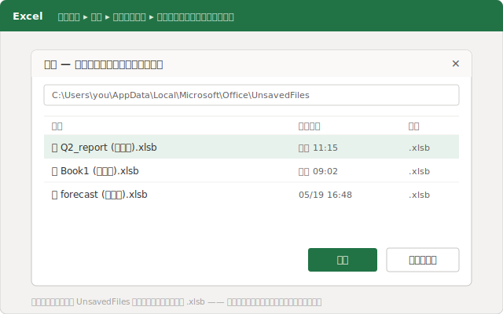
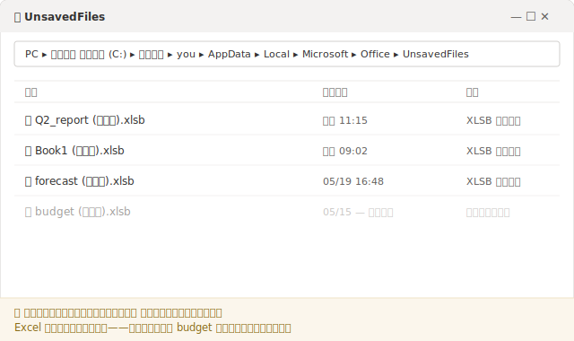
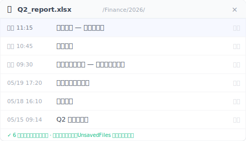

# 【2026 ファイル管理】エクセルで保存してないファイルを復元する方法と、せっかく救った一本が消える理由

*エクセルの「保存されていないブックの回復」は、隠れた `UnsavedFiles` キャッシュから一本を取り出します。中身は一時的な `.xlsb` で、Excel が自分のタイミングで消します。だから、せっかく救ったファイルが数日後には消えている。必要なのは「もっと速く救う方法」ではなく、そのキャッシュにそもそも置かれない版（バージョン）の層です。*

火曜日に未保存のシートを取り戻して、ほっとした。週末にはもう消えていた。Excel が失くしたわけではありません。あの回復用のキャッシュは、最初から時間制限つきだったのです。

たった今、保存せずにエクセルを閉じて血の気が引いた ── そんな人は、まずここから。救出は本物で、30 秒ほどで終わります。ただ、これから復元するファイルが実際に*どこに*いるのかを知っておくと得をします。同じ理由で、また消えてしまうからです。

## まず今すぐ取り戻す：保存されていないブックの回復 {#h2-1}

何より先に、これをやってください。

- **ファイル → 情報 → ブックの管理 → 保存されていないブックの回復。**（または **ファイル → 開く → 保存されていないブックの回復**。最近使ったファイルの一覧の一番下にあるボタンです。）
- フォルダーが開きます。`.xlsb` で終わる、見慣れない名前のファイルが並びます。それが未保存のブックです。
- 日時の合うものを開いたら、すぐに**名前を付けて保存**で、ちゃんとした名前と場所に保存します。

この `.xlsb` の一覧は、どこかの「復元ウィザード」が出してくれているわけではありません。Excel は、あなた自身のドライブにある 1 つのフォルダーを読んでいるだけです ── `%LocalAppData%\Microsoft\Office\UnsavedFiles`。閉じるときに保存しなかったときや、クラッシュしたときに何かを返せるよう、Excel が黙って未保存の作業のコピーを置いておく場所です。

ファイルは戻りましたか。よかった。では、ここからが誰も教えてくれない話です。

## なぜ、たった今救ったファイルが週末には消えているのか {#h2-2}

あの `UnsavedFiles` フォルダーは、ただの預かり場所であって、金庫ではありません。Excel が代わりに管理してくれる ── ということは、Excel が自分のタイミングで、断りもなく中身を消すということでもあります。

**Microsoft は、未保存のファイルがそこに何日残るのかを公表していません。** よく言われる「4 日」という数字も、Microsoft がどこかに書いているわけではありません。[公式の手順](https://support.microsoft.com/ja-jp/office/office-%E3%83%95%E3%82%A1%E3%82%A4%E3%83%AB%E3%81%AE%E4%BB%A5%E5%89%8D%E3%81%AE%E3%83%90%E3%83%BC%E3%82%B8%E3%83%A7%E3%83%B3%E3%82%92%E5%9B%9E%E5%BE%A9%E3%81%99%E3%82%8B-169cb166-e7e2-438e-8f39-9a8927828121)も、「保存されていないブックの回復」の開き方を見せたら、そこで止まります。明日もそのファイルが残っているとは、ひとことも約束していません。実際には、数日のうちに、あるいは再起動のあとに、または新しい項目がたまった時点でキャッシュが消えていた、という報告が広く見られます。

ここが肝心です。「復元できた」と「残せた」は、まったく別の出来事です。復元したブックを開いて、ちらっと眺めて、**名前を付けて保存**でちゃんとしたフォルダーに置かないまま、また閉じてしまったなら ── それは保存していません。時間制限の進む一時コピーを、ただ覗いただけです。金曜日に戻ってきたら、もう消えているかもしれない。今度はフォルダーの中に、復元できるものが何も残っていません。

復元のステップが解決するのは、これからの 10 分です。来週は解決してくれません。

## 「未保存」には 2 種類ある ── 同じキャッシュで処理される 2 つの災難 {#h2-3}

ここで多くの人がつまずくのは、「エクセルの保存してないファイルが消えた」が、実は同じ言葉をまとった別々の問題だからです。そして Excel は、その両方を「保存されていないブックの回復」という同じ入り口へ流し込みます。

**問題 A ── 一度も保存していない。** 新規のブックに 3 時間ぶんの数式を入れて、そこでクラッシュ、あるいは間違えて「保存しない」を押した。ディスク上に本物のファイルは一度も存在しなかったので、`UnsavedFiles` キャッシュが本当に最善で唯一の頼みの綱です。まさにそのための仕組みで、たいていは冒頭のステップ 1 で取り戻せます。

**問題 B ── 一度は保存したのに、それ以降の変更を失った。** これは何百回も開いてきた月末レポート。午前中ずっと作業して、保存せずに閉じた。ファイル自体は残っています。消えたのは*ここ数時間*ぶんだけ。この場合、キャッシュには使えるものがないことがよくあります。Excel はあなたの編集を「復元可能なセッション」として追っていたのであって、「ファイルの永続的なバージョン」として残していたわけではないからです。

> 月曜の朝、先月の数字を確定しようと月末レポートを開く。9 時 14 分から作業を始め、列を組み直し、3 つのピボットを作り直す。昼前、別件で呼ばれて慌てて閉じ、ダイアログが出たので反射的にエンターを押した。午後に開き直すと、午前中の作業がそっくり消えている。ファイルはある。けれど中身は昨日のままだ。

問題 B にはいくつか親戚がいて、キャッシュはそのどれにも手が届きません。**別のパソコン**でファイルを開いた場合、そのローカルのキャッシュはそちらには存在しません。あるいは OneDrive の自動保存が、同期されたコピーを黙って上書きしてしまった場合（これは別の落とし穴で、対処法も別です ── [共同編集中の Excel データが消えるとき](/ja/post/excel-data-vanished-postmortem/)を参照）。表面は違っても、根は同じです。あなたを救うはずだったものが、一時的か、ローカル限りか、その両方だった、というだけのことです。

クラッシュを生き延びるために作られたキャッシュは、もとからファイルの履歴になるようには作られていません。

## 一時キャッシュには住まない、もう一つの層 {#h2-4}

問題 B の答えは、「`UnsavedFiles` をもっと速く掘り返す方法」ではありません。ファイル自身の履歴を、Excel が掃除できない場所に持っておくことです ── つまり、あなたのシートが実際に置かれているフォルダーを見張り、作業の進みに合わせてタイムスタンプ付きのコピーを残していくバージョンの層。Excel が使い回す一時バッファの中ではなく。

ここが [Keeply](https://keeply.work) の出番です。シートが置いてあるフォルダーを指定しておくと、あなたが決めた間隔で ── 15 分・30 分・60 分から選べて、既定は 30 分 ── バックグラウンドで自動保存します。それに加えて、節目を残せる手動の**バージョン保存**ボタンと、一行のメモ。今朝の編集が消えても、もう消えているかもしれないキャッシュを探りに行く必要はありません。ファイルのタイムラインを開いて、11 時 15 分のバージョンを選ぶだけです。

`UnsavedFiles` キャッシュは、進行中のファイルのための Excel の短期セーフティネット。バージョンのタイムラインは、ファイルの長期記憶です。片方は期限切れになる。もう片方はなりません。これらの層がどこまで守り、どこで途切れるのか、全体像は[ファイルのバージョン管理 完全ガイド](/ja/post/file-version-management-complete-guide/)で整理しています。

## それでもバージョンの層が救えないところ {#h2-5}

これですべてが片づく、というふりをするのは不誠実なので、救えないところもはっきり書きます。

- **追跡フォルダーに一度も保存していない、まっさらな新規ブック。** 見張っているフォルダーにファイルが一度も書き込まれていなければ、残せるバージョンも存在しません ── これは依然として Excel の `UnsavedFiles` キャッシュの領分（問題 A）で、相変わらず短い時間制限の上にあります。
- **静かに壊れる破損。** ファイルが気づかぬうちに壊れ、見た目はきれいなバージョンが良いものの上に保存されてしまった場合、タイムラインは壊れたコピーも忠実に残します。
- **見張っているフォルダーの外にあるファイル。** バージョンの層が知っているのは、あなたが指定したフォルダーだけです。一度も追加していない USB メモリーの中のシートは対象外です。

バージョンのタイムラインが解決するのは「持っていたのに、変更を失った」です。どこにも保存していなかったファイルを、魔法で生み出すわけではありません。

## Excel の標準機能だけで足りるとき {#h2-6}

いつでももう一層が必要なわけではありません。次のときは省いて構いません。

- 喜んでやり直せる、使い捨ての計算シートのとき。
- **ファイルが OneDrive や SharePoint にあり、自動保存がオンのとき。** これでかなりの範囲がカバーされます ── クラウドのバージョン履歴が、編集中の上書きの多くを拾ってくれます。ただし、できないことも知っておいてください。対象は同期されたコピーに限られ、保存される履歴には上限があり、自動保存はその場で（断りなく）上書きしていきます。その制限を読んだうえで自分には刺さらないと思えるなら、もう一層は要りません。
- 午前中の作業を失うのが、間に合わなくて困る締め切りではなく、飲み込める程度の面倒で済むとき。

それがあなたなら、「保存されていないブックの回復」までの道筋を覚えて、ファイルが存在するように早めに保存して、あとは仕事を進めてください。もう一層が値打ちを発揮するのは、そのシートの中身が「気持ちよく作り直せない」種類の仕事のときだけです。

## よくある質問 {#faq}

**一度保存したエクセルを午前中ずっと作業して、保存せずに閉じてしまった。午前中ぶんは取り戻せますか？**

Excel のキャッシュからは戻らないことが多いです。「保存されていないブックの回復」は、一度も保存していないファイル向けの仕組みで、すでに保存したファイルの未保存セッションの変更は確実には残りません。「すでにあるファイルのここ数時間ぶん」を取り戻すのは、永続的なバージョンの層（Keeply など）の役目です。ファイル自体のタイムスタンプ付きバージョンを残すので、タイムラインを開いて午前遅くのコピーを選べます。

**エクセルの未保存ファイルは何日残りますか？**

Microsoft は固定の保持期間を公表していません。未保存のコピーは Excel が自分で消す一時キャッシュに置かれ、数日のうちに、再起動のあとに、あるいは新しい項目がたまった時点で消えていた、という報告が多くあります。復元したファイルは、ちゃんとしたフォルダーに「名前を付けて保存」するまでは一時的なものとして扱ってください。

**エクセルの未保存ファイルはどこに保存されていますか？**

Excel の UnsavedFiles キャッシュ、%LocalAppData%\Microsoft\Office\UnsavedFiles にあり、.xlsb で終わるファイルとして保存されています。ファイル → 情報 → ブックの管理 → 保存されていないブックの回復、からたどれます。

**復元したのに数日後に消えてしまった。なぜですか？**

「保存されていないブックの回復」は永続的なコピーではなく一時キャッシュを読んでいるからです。復元したファイルをちゃんとした場所に「名前を付けて保存」しないまま放っておくと、キャッシュに残ったまま、あとで消去されます。復元したら、必ずすぐに「名前を付けて保存」してください。

**自動保存をオンにすれば解決しますか？**

自動保存（OneDrive/SharePoint）はクラウド保存のファイルには役立ちますが、その場で上書きしていく仕組みで、バージョン履歴にも独自の上限があります。ローカルに置いているファイルは対象外で、ファイルを一覧して選べる「残るバージョンのタイムライン」とは別物です。

## 関連記事 {#related}
- [ファイルのバージョン管理 完全ガイド](/ja/post/file-version-management-complete-guide/)（ピラー）
- [保存していない Word 文書を復元する ── 自動回復が救えない 5 つのケース](/ja/post/word-unsaved-recovery/)
- [Excel のバージョン履歴：誰も言わない Microsoft の上限](/ja/post/excel-version-history-limits/)
- [共同編集中の Excel データが消えるとき](/ja/post/excel-data-vanished-postmortem/)

---
*文：Ting-Wei Tsao（Keeply 創業者）── [LinkedIn](https://www.linkedin.com/in/ting-wei-tsao-b57480152)*
