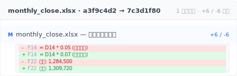

金曜日の夕方 5:47、月末締めのエクセルを修正中。さっき数式を一段消して別の計算法を試したら、間違いだった。Cmd+Z で 元に戻す の上限に到達、戻れない。「ファイル > 情報 > バージョン履歴」を開く。グレーアウト。そこで気づく：このシートはデスクトップ保存、OneDrive に上がっていない。30 分の数式作業が消えた。

これは特殊なケースじゃありません。エクセルで仕事する人なら誰でも遭遇します。Microsoft がバージョン履歴をクラウド購読の餌として設計した結果です。先にあなたが当たる 4 つの制限を見て、それから 3 つのツール設計でどう解くか紹介します。

## 目次

- [エクセル バージョン履歴がグレーアウトする本当の理由](#why-grayed-out)
- [Microsoft AutoSave が言わない 4 つの制限](#four-limits)
- [なぜ Microsoft はこう設計したのか](#why-microsoft)
- [3 つのツール設計で本当に解く](#three-designs)
- [Keeply が向かない場面](#boundaries)

## エクセル バージョン履歴がグレーアウトする本当の理由 {#why-grayed-out}

「ファイル > 情報 > バージョン履歴」というボタンは、**4 つの条件すべてが満たされた時にだけ動く**：(1) ファイルが OneDrive または SharePoint にある (2) AutoSave がオン (3) 商用版ライセンス (4) デスクトップ（web ではない）。一つでも欠ければグレーアウト。

意外と知られていない：あなたの普段の働き方は **4 つすべて当てはまらない** 可能性が高い。デスクトップ保存、AutoSave デフォルト オフ、個人版、デスクトップと web を行き来。だからグレーアウトはデフォルト状態で、あなたが何か間違ったわけじゃない。

## Microsoft AutoSave が言わない 4 つの制限 {#four-limits}

「エクセル バージョン履歴が足りない」を分解すると、設定をどう調整しても回避できない 4 つの不変の制限が見えてきます：

| # | 制限 | 結果 |
|---|---|---|
| 1 | **デスクトップ AutoSave は 1-2 バージョンしか戻れない** | 30 分前のミス = 復旧不可 |
| 2 | **OneDrive/SharePoint は 30 日で期限切れ** | 四半期レビューで顧客が 60 日前のバージョンを欲しがる = 消失 |
| 3 | **ローカルファイルは履歴ゼロ** | プライバシー目的でデスクトップ保存 = 履歴なし |
| 4 | **セルレベルの差分なし** | 「新しい列は残して古い数式を戻したい」が不可能 |

一番効くのは 4 番目です。Excel のバージョン履歴はファイル全体のロールバックしかくれません、F14 のセルが何に変わったかは教えてくれない。Keeply のバージョン比較ならセル単位の差分をそのまま見せてくれます。

F14 が 5% から 7% になっているのを見れば「ああ、売掛金率が上がったんだな」と一目でわかります、Excel を 2 つ並べて目で追う必要はありません。どの制限も Microsoft が **意図的に解決していない** 選択です、技術的に不可能なわけじゃない。次のセクションがその理由。

## なぜ Microsoft はこう設計したのか {#why-microsoft}

完全なファイル履歴の仕組みを作るのは技術的に難しくありません。Apple は 2007 年から Mac に Time Machine を内蔵してきました——1 時間ごとに自動でスナップショットを取り、3 ヶ月前のファイルを 2 クリックで開ける、全部無料。技術はもう成熟しています。Microsoft はできる、選ばないだけ。

理由は商業設計：バージョン履歴は OneDrive 購読の差別化機能。デスクトップ Excel がそれ自身で完全な履歴を持ち、ローカルファイルにもあり、時間制限なしだったら、OneDrive 購読は囲い込みの理由を一つ失います。

そう、ここがイラつくところです。あなたが当たっているのはバグじゃない、ペイウォールです。Microsoft はそうフレーミングしないだけ。バージョン履歴はユーザーにとって **ファイルの安全網**；Microsoft にとって **購読の餌**。同じ機能で二つの役割があり、行動を決める人はあなたじゃない。

## 3 つのツール設計で本当に解く {#three-designs}

ツールができることを 3 つの設計パターンに分けます。それぞれが上の 4 つの制限のいくつかを解決します。

### Design A：自動バージョンスナップショット（クラウド非依存）

ファイルがどこに保存されていても、ツールが前のバージョンを保存しておく。**例**：macOS Time Machine（システム層、ディスク全体）、Keeply（ファイル層、指定した作業フォルダだけ）。**Keeply の違い**：あなたが保存したバージョンを——手動でメモを添えて、または任意の自動保存で 15〜30 分ごとに——完全保存、時間制限なしで残し、OneDrive の 30 日のように消えない。**制限 #1 + #2 + #3 を解決。**

### Design B：自動マイルストーン（月末/四半期凍結）

「このバージョンは月末締め v3」「このバージョンは Q2 締め」と能動的にマーク。マークされた点は、それ以降どう変わっても残ります。**例**：GitHub Releases（特定時点のコードを名前付きマイルストーンとして凍結する、開発者向けの機能）。**Keeply** には「リリース」機能が組み込まれていて、開発者の用語を覚える必要なく同じことができる：履歴から 1 バージョンを選んで「リリースとして凍結」を押せば、永久に戻せます。**制限 #2 の延長場面を解決**：四半期レビューでも当時のバージョンを見つけられる。

### Design C：バージョン内容検索

履歴上の任意のバージョンから内容を検索（ファイル名だけでない）。**Keeply** は過去のバージョン内のテキスト内容を検索できる。**制限 #4 の一部を解決**：セルレベルの差分ではないが、「あの 100 円の数字が最後に出現したのはどのバージョンか」を見つけられる。

ここで気づくはず、4 つの制限のうち #4（セルレベル差分）が本当の境界。次のセクションが正直になぜか。

## Keeply が向かない場面 {#boundaries}

Keeply はすべての Excel シーンを解決しません：

- **セルレベル差分**：Keeply は「ファイル全体 v3 → v4」を表示、「セル B7 が 100 から 105 に変わった」は表示しない。セル差分は Microsoft 365 共同編集や スプレッドシート 差分 ツールが必要。
- **数式の論理エラー**：Keeply は「前のバージョンの数式」を救う、「数式自体が間違い」は救わない。後者は Excel デバッグツールの場。
- **複数人の同時編集**：Microsoft 365 リアルタイム共同編集が Keeply より優れる（別のシーン）。
- **ファイルサイズはディスク限界**：100 個 × 50MB モデル = Keeply でも 5GB。

## 次に Cmd+S を押す前に

次にエクセルがグレーアウトしたら、もう自分を責めなくていい。Microsoft の意図的な設計だと知っているし、別の選択肢があると知っているから。

Keeply がエクセルのバージョンをどう扱うか見たいですか？[「ファイルバージョン管理 完全ガイド」を続きで読む。](/ja/post/file-version-management-complete-guide/)

---

> 著者について：Ting-Wei Tsao、Keeply 創業者。
> [LinkedIn](https://www.linkedin.com/in/ting-wei-tsao-b57480152/)
