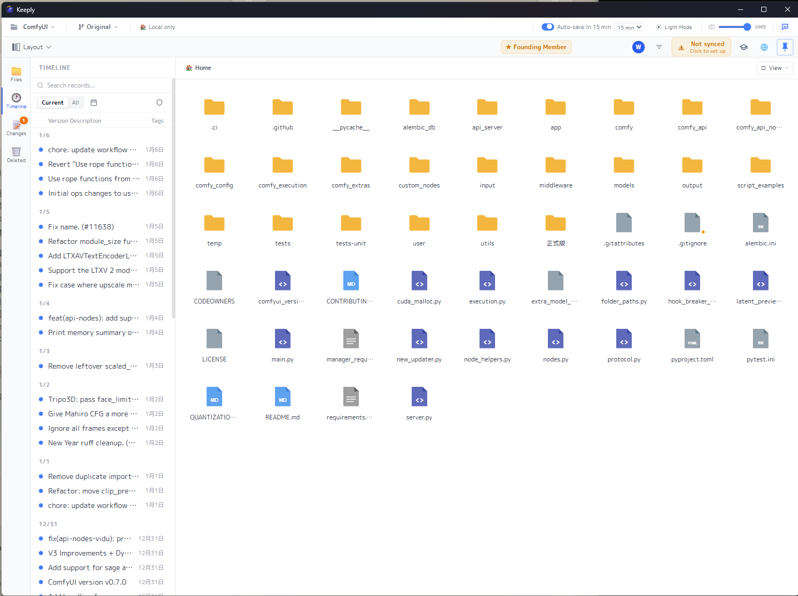
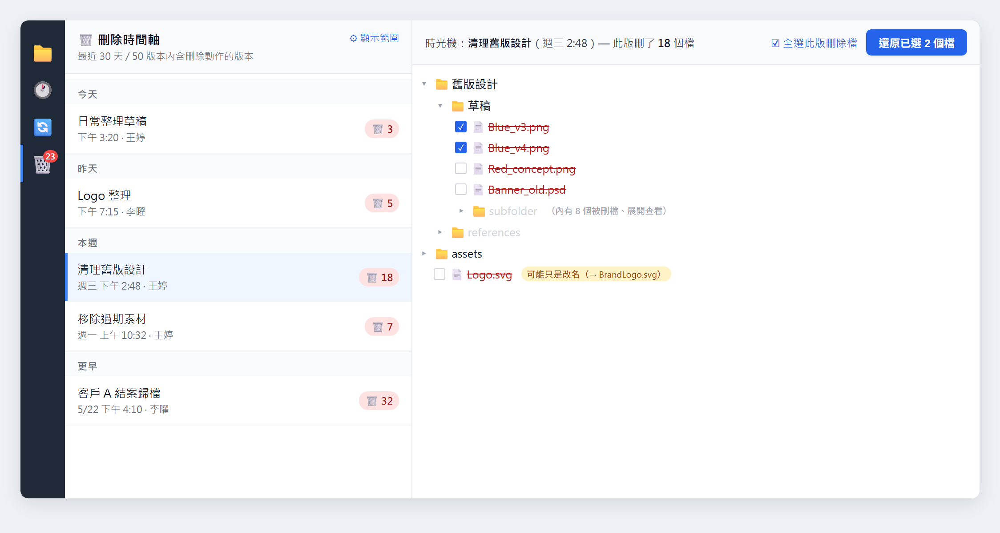
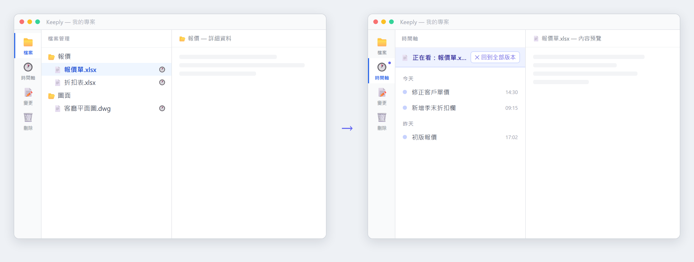
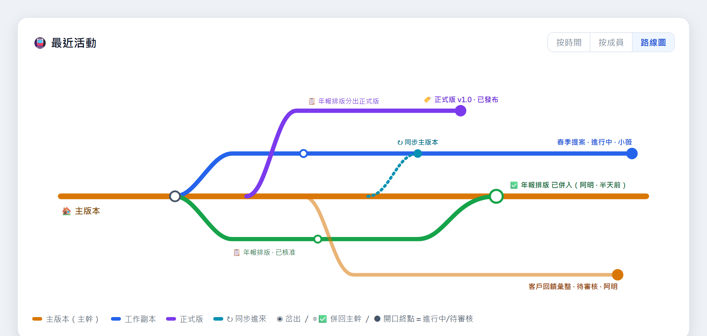

1.0.12 から 1.0.13 へ。今回いちばん力を入れたのは、「うっかり消してしまったファイルを取り戻す」という体験を、安心して使えるひとつのパネルに仕上げることでした。それと並行して、長く温めてきたチーム機能も完成間近です。今回はその姿をひと足先にお見せします。

Keeply を開くと、見慣れたフォルダ画面が広がります。マス目状に並んだファイルとフォルダ、そして左側には、あなたが保存したバージョンを一つずつ記録したタイムライン。今回の新機能もこの流れに沿っています。ファイルを選べばその履歴が見え、消してしまってもタイムラインからたどって取り戻せます。

## 🆕 新機能

### 削除タイムマシン：消したファイルを取り戻す

これまでは、うっかり消したファイルがゴミ箱にも残っていなければ、たいていあきらめるしかありませんでした。今回は専用のパネルを用意しました。左のツールバーの 🗑️ を押すと「削除タイムライン」が現れ、今日 / 昨日 / 今週 / それ以前にまとめて表示されます。各項目の右側には「🗑️ N」と、そのとき何個のファイルを消したかが示されます。

ある項目を押すと、右側がタイムマシンのようにその時点のファイルツリーを展開し、消えたファイルがあった場所まで自動でたどり着きます。本当に削除されたファイルは赤い取り消し線で示されます。実は名前を変えただけの場合は、隣に「名前変更かもしれません」という小さな目印が付くので、無駄に探さずに済みます。

戻したいファイルにチェックを入れ（そのとき消したファイルをまとめて全選択もできます）、「選択した N 個を復元」を押し、置き場所のフォルダを選べば（初期設定はデスクトップ）、元のフォルダ構成のまま復元してくれます。ファイル名がぶつかるときは、初期設定で自動的に `_restored` を末尾に付けるので、今あるファイルを上書きすることはありません。

### ファイルを選ぶと、そのファイルだけのバージョン履歴

タイムラインはこれまで、フォルダ全体のバージョンを表示していました。でも実際には、「このファイルだけ、どのバージョンで変わったのか」を知りたい場面も多いものです。これからは、そのファイルを一回クリックするだけで、左のメインタイムラインがそのファイルの履歴だけになります。見終わったら「すべてのバージョンに戻る」を一度押せば、完全なタイムラインに戻ります。

### ファイル管理が、もっと見やすく使いやすく

- **どのファイルが変わったかひと目で**：「変更」タブでは、手を加えていないファイルはグレーに沈め、変更したファイルは目立つように。一つずつ見比べる必要はありません。
- **フォルダのカード化 + 選択状態**：フォルダをカード型のアイコンに変え、選んだときの見た目もはっきりさせました。
- **右クリックメニューを統一**：どのビューでも、ファイルでもフォルダでも、右クリックメニューが同じになりました。
- **F5 でかんたん再読み込み**：いつもどおり、F5 を押せば今の画面を更新できます。

## 🔭 まもなく公開：チーム機能（先行紹介）

はじめにお伝えしておくと、チーム機能は**今回はまだ正式公開していません**。これから向かう方向を、先にひと目お見せしたいと思っています。1.0.13 で社内がいちばん力を注いだ部分で、協働の流れをひと続きの線としてつなげました。磨き上がったら、みなさんに開放します。

これから公開する予定の内容です。

- **提出から統合までひとつながりに**：メンバーは作業中のコピーを管理者に提出し、説明を添えます。管理者はファイルごとにコメントを残し、承認するか差し戻します（差し戻しには理由を明記）。承認後は統合し、メンバー側はワンクリックで仕上げます。提出の記録は端末をまたいで同期され、一台のパソコンだけに残ることはありません。
- **タスクの割り当てと追跡**：管理者がタスクを割り当て、メンバーはワンクリックで着手。タスクは小項目に分けてチェックしながら進み具合を確認できます。提出 / 承認 / 差し戻しに合わせて、タスクの状態も自動で動きます。
- **チームの動きを「路線図」で**：路線図のような一枚の図で、本線がメインのバージョン、各メンバーの作業コピーがそこから分かれる支線になります。誰が動いているか、どれが統合済みか、どれがまだ審査中か、ひと目で見渡せます。
- **今のフォルダを「チームの正本」に**：すでに Keeply で管理しているフォルダを、そのままチームの正本に設定できます。メンバーは加わるだけで権限を引き継ぐので、一人ずつ買い直す必要はありません。

公開時期はまだ決まっていません。準備ができたらお知らせします。チーム機能を待っていた方は、ぜひ「問題を報告」から、どの部分をいちばん先に使いたいか教えてください。

## ✨ 体験の改善

- バージョンの保存・同期・復元を、すべてバックグラウンドで行うようにしました。操作した瞬間に画面が固まることはありません。
- お知らせ系の通知を右下の浮き表示に変え、メイン画面を圧迫しなくなりました。
- タイムラインの絞り込みの文言から専門用語を取り除き、誰でも分かる言い方に変えました。
- 問題を報告するとき、Keeply が正しいバージョン番号を自動で添えるようにしました。どのバージョンの状況かを、私たちがより早く把握できます。

## 🛡️ 修正とセキュリティ

- 削除機能の公開後、実際の利用から見つかった不具合をまとめて修正しました。
- バックアップ先：ドライブレターをネットワークパスに変換するとき、「上限に達して固まる」問題と、「古い場所がもう存在しないのに赤字で誤って警告する」問題を直しました。
- 安全なバージョン保存の見張りをより厳格に：事前のスナップショットが本当に失敗したときは、リスクのある操作を中止し、無理に進めないようにしました。
- 土台となる部品を定期的に更新し、既知のセキュリティ上の弱点をまとめて修補しました。

## 🔒 プライバシーについて

今回、「匿名の利用統計」に関する同意設定を追加しました。これはあなたが同意した場合にのみ、個人情報を含まない利用シグナルを送信し、どの機能が使われているかを私たちが把握する手助けをします。初期設定ではいつでも設定からオフにできます。そして、これが実際に動き始めるのは **2026 年 7 月 15 日から**です。それまでの間、アプリ内で 30 日前に予告し、何の知らせもなく始めることはありません。

## ⬇️ ダウンロードとアップデート

[keeply.work](https://keeply.work) にアクセスすれば 1.0.13 をダウンロードできます。すでにインストール済みの場合は、自動で更新が届きます。

今回から **Intel 版 Mac** にも対応しました。Apple Silicon に加えて、Intel プロセッサの Mac 向けのインストーラーも用意しています。

削除からの復元や、1ファイルだけのタイムラインは、すでにあなたの手元にあります。チーム機能ももうすぐです。次に何を作るかは、あなたの声に大きくかかっています。使ってみて何か感じたことがあれば、Keeply の「問題を報告」から直接教えてください。きっと目を通します。

---

> 著者について：Ting-Wei Tsao、[Keeply](https://keeply.work) 創業者。[LinkedIn](https://www.linkedin.com/in/ting-wei-tsao-b57480152/)
