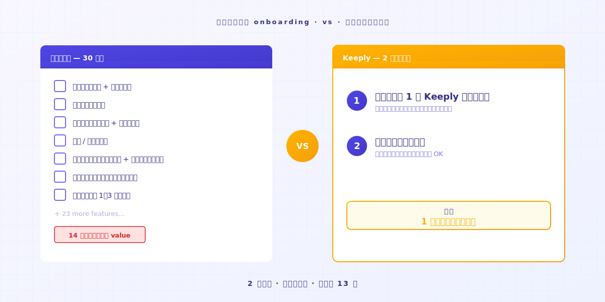
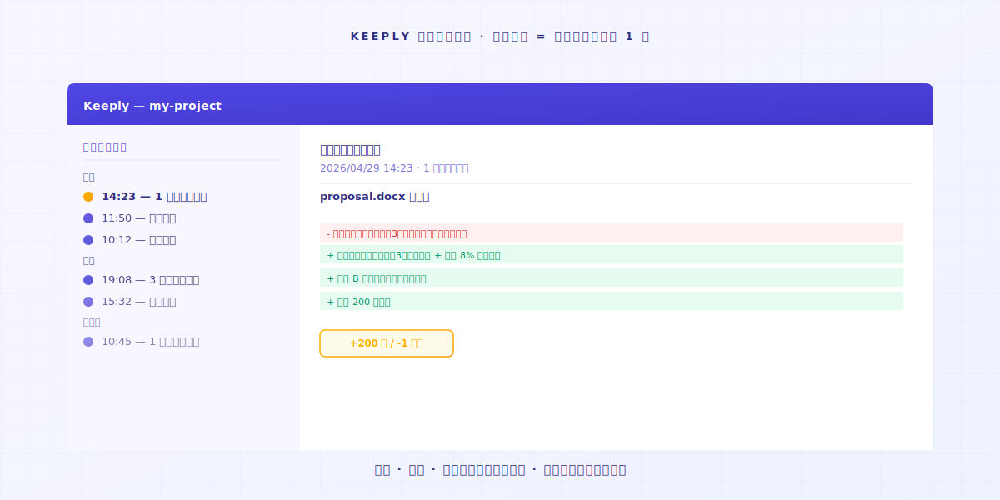
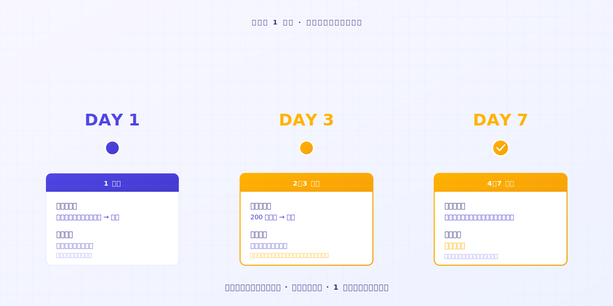

# 【2026 ファイル管理】Keeply の使い方：30機能を学ばず、2アクションで使いこなせる

> 先に専門家になる必要はありません。フォルダをドラッグして入れて、仕事を続けるだけ。バージョン履歴がもう動いています。

## 目次

1. [なぜ新しいツールに抵抗を感じてしまうのか？](#why-resist-new-tools)
2. [なぜツールを途中で諦めてしまうのか？](#why-give-up-a-tool)
3. [その2アクションとは？](#what-are-the-two-actions)
4. [最初の一週間、どんな体験になるのか？](#first-week-natural)
5. [Keeply が向いていない場面](#when-keeply-isnt-right)

---

Aさんはたくさんのプロジェクトを抱えていて、毎日やったことをメモ帳に記録しています。最近、Keeply というとても使いやすいファイル記録ソフトがあると聞きました。公式サイトを開くと「3ステップで開始」「7日間無料体験」と書かれています。前に試したツールは14日経っても使いこなせず、価値が見える前に忍耐が尽きてしまいました。**今回は10分で判断したい**、と思っています。

頭が悪いのではありません。従来のソフトの学習曲線が、あなたが今日手を止めて14日間生徒になることを前提にしているだけです。

---

## なぜ新しいツールに抵抗を感じてしまうのか？ {#why-resist-new-tools}

新しいツールに抵抗を感じるのは、たいていのツールが「今日の仕事を止めて 14 日間生徒になってくれる」を前提にしているから。でも明日には納品があって、何かを学ぶための 14 日の空きなんて、あなたにはない。

昨日、新しいツールをインストールしてみました。マニュアルは50ページ。新しい用語が30個。明日はプロジェクトの納品日。

「来週ゆっくり読もう」と思います。そしてもう二度と開きません。

多くのソフト企業は「14日で学び終える」を当たり前のように設計しています。[業界調査](https://userpilot.com/blog/time-to-value-benchmark-report-2024/)によると、オンボーディング手順を半分も完了していないユーザーの14日以内の離脱率は、全工程を完了したユーザーの**3倍**です。

言い換えると、ソフトはあなたに14日の余裕があると思い込んでいます。あなたの仕事が、ソフトを覚え終わるまで待ってくれると思い込んでいます。

その 14 日間という前提のなかに、あなたの次のプロジェクトは入っていません。

---

## なぜツールを途中で諦めてしまうのか？ {#why-give-up-a-tool}

新しいツールを身につけるには、だいたい 14 日かかります。その 14 日のほとんどは、まだ手探りの時間です。

探索期間の途中で、多くの人は閉じたくなるかもしれません。

Keeply を作る前、私自身も多くの新しいツールを学びました。1日目で面倒だと感じて、結局元のやり方に戻したものがたくさんあります。

そのうちに気づきました。私を引き止めたツールは、**直感的に使えるかどうかが鍵だった**、と。

ある日、AI でコードを書いていたら、AI が暴走したんです。どこまで書いたかも、もう覚えていない。**良かった、ファイル記録を取っておいて**。

履歴を開く。**自分でコントロールできる状態に戻す**。

その瞬間に分かりました。良いツールは「機能が多い」のではなく、**シンプルで使いやすい**ということ。何の機能も学んでいないのに、そっとファイルを受け止めてくれた。その時点で、このツールの価値はもう証明されています。

ツールに問題があるのではありません。**この種類のツールは、もともと「学んでから使う」設計ではない**、それだけです。

---

## その2アクションとは？ {#what-are-the-two-actions}

アクションは 2 つだけ：**フォルダを 1 つ Keeply にドラッグして、節目でバージョンを保存する**。覚えるコマンドも、30 ページのマニュアルもありません。バージョンの保存はワンクリック——Keeply の「バージョンを保存」ボタン（または Keeply ウィンドウ内で Cmd+S）——で、いちいち考えたくなければ自動保存をオンにすれば、Keeply が 15〜30 分ごとに変更を取り込みます。

### アクション1：フォルダを1つ Keeply にドラッグして入れる

本当にドラッグして入れるだけです。**名前を変えない、分類しない、構造を考えない**。

### アクション2：節目でバージョンを保存する

今日やる予定だったことを、そのまま続けてください。区切りがついたとき、クライアントが版を承認したとき、大きな変更を加える前に——Keeply の「バージョンを保存」をクリックして、一行メモを添えます（例：「クライアント承認版」）。その瞬間が左側のタイムラインに残ります。

クリックを覚えておくのが面倒なら、自動保存をオンにしてください。Keeply が 15/30/60 分ごと（あなたが選べます）に変更を取り込みます——手動で保存した版にはメモが、自動の版にはタイムスタンプが付き、どちらも同じタイムラインに並びます。

ファイル名も変える必要はありません。`_v3_本当に最終.docx` のままで構いません。Keeply はあなたの習慣を変えません。

1日目が終われば、1日分のファイルノートが手元にあります。**7日目が終われば、1週間分**。

直感的に使う、それ以外の方法はありません。

---

## 最初の一週間、どんな体験になるのか？ {#first-week-natural}

### 1日目

プロジェクトを1つドラッグして入れて、保存する。

### 2-3日目

元のファイルを200文字書き換えて、保存する。

タイムラインから、自分のファイルノートが増えていくのが見えます。**ノートをクリックすれば、何を消して、何を足したかが分かる**。

### 4-7日目

ファイルノートがどんどん増えていきます。

ある日、ふと思うはずです。**このソフトがあって良かった**、と。

---

## Keeply が向いていない場面 {#when-keeply-isnt-right}

Keeply はすべての場面を取りに行きません。次の4つの状況では、別のツールのほうが適しています。

- **デバイスをまたぐクラウド同期が必要なら**、[IDrive](https://www.idrive.com/) または [Backblaze](https://www.backblaze.com/) を選んでください。Keeply はあなたのパソコン上に保存します。クラウドネイティブではありません。
- **システム復元やディスク全体のバックアップが必要なら**、[Acronis True Image](https://www.acronis.com/) を選んでください。Keeply はそれをやりません。
- **IT プロとして50台以上のマシンを管理しているなら**、[MSP360](https://www.msp360.com/) を選んでください。Keeply は個人や小さなチーム向けです。
- **個人ファイルを失いたくないだけなら**、Windows 標準の「ファイル履歴」（File History）が入っていて十分です。新しいツールを入れる必要はありません。

ツールを選ぶのは、同僚を選ぶのに似ています。それぞれが得意な場面を持っています。正直に見極めれば、14日の試行錯誤を減らせます。

---

## 最後に

新しいツールを試したい、でも14日を無駄にしたくない。もっともなことです。

フォルダを [Keeply](https://keeply.work/) にドラッグして入れて、今日やる予定の仕事を続けてください。

7日目にタイムラインを開いて見れば、**分かります**。

---

## 関連記事

- [ファイルバージョン管理 完全ガイド](/ja/post/file-version-management-complete-guide/)（PILLAR 1、バージョン管理がなぜ重要かを理解する）
- [Keeply 最初の一週間：7 日間の観察日記で 3 つの実信号を確かめる](/ja/post/keeply-first-week-workflow/)（インストール後の一週目の動き方）
- [Keeply は何を保存するのか？バックアップ・クラウドツールとの違い](/ja/post/what-keeply-saves-vs-backup-cloud/)（Keeply vs Dropbox / Time Machine の実用的な差）
- [Vibe Coding が暴走したら？1 つの動作で動いていた版に戻す](/ja/post/vibe-coding-rollback/)（AI がファイルを壊した典型シナリオ）

---

> 著者について：Ting-Wei Tsao、Keeply 創業者。
> [LinkedIn](https://www.linkedin.com/in/ting-wei-tsao-b57480152/)
