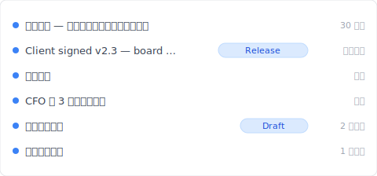
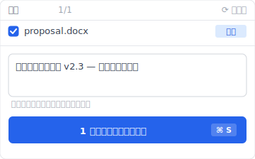
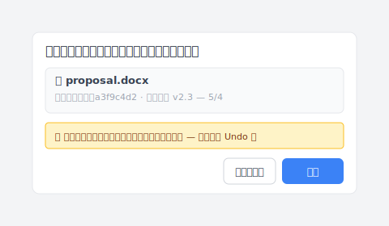

# 【2026 ファイル管理】OneDrive バージョン履歴は無制限じゃない：500 個の上限 + 30 日の救援窓は Microsoft 公式が明記

> Microsoft Learn は 500 + 30 日と明記。なのに 90% の解説記事は使い方だけ教えて、どこで壁にぶつかるかは書かない。

「OneDrive はあなたを 200 回救った。そして 501 回目、最も古いバージョンを静かに削除した — 通知もなしに。」

これはバグではありません。[Microsoft Learn 公式ドキュメント](https://learn.microsoft.com/en-us/sharepoint/document-library-version-history-limits) に最初から書かれている 500 メジャーバージョン の上限です。しかし 90% の OneDrive バージョン履歴チュートリアルは**使い方**を教えて、**どこで壊れるか**を教えません。本記事はそのギャップを埋めます — 3 つの OneDrive メカニズム（バージョン履歴 500 上限 / ごみ箱 30 日 / 自動回復）を分解し、[Keeply](https://keeply.work) が 上限超過シナリオをどう受け止めるか。

## 目次

1. [Keeply で OneDrive 履歴を「501 回目に消えない」状態にする](#keeply-timeline)
2. [OneDrive の 3 メカニズム：500 / 30 日 / 自動回復 の違い](#three-mechanisms)
3. [500 version 上限：Microsoft 公式数字と、あなたが当たるタイミング](#500 上限)
4. [ごみ箱 30 / 93 日：削除後の時間窓、バージョン履歴の延長ではない](#recycle-bin)
5. [自動回復：Office クライアントのクラッシュ救援、バージョン履歴とは別物](#autorecover)
6. [Keeply のカバー：上限超過後の リリース凍結 + ファイル単位ノート](#keeply-fills)
7. [Keeply が要らない 3 つの OneDrive シナリオ](#when-not-needed)
8. [FAQ](#faq)

---

## Keeply で OneDrive 履歴を「501 回目に消えない」状態にする {#keeply-timeline}

実際の場面を見せます。Tina はコンサルタント、`proposal.docx` を OneDrive に保存、半年で 200 版以上蓄積しました。クライアントが今日承認、来年 3 月に当初の提案版を見返したい — OneDrive にまだ残っているでしょうか？

[Keeply](https://keeply.work) ではこのプロジェクトのタイムラインがこう見えます：

「Client signed v2.3 — 取締役会承認」が自分の行を持ち、Release tag が付いている — 今日の午後、クライアント承認後に Tina が Keeply メインウィンドウで「バージョン保存」を押し、ノートを書いて保存したものです：

「Client signed v2.3 — 取締役会承認」と一行書いて保存。来年 3 月にタイムラインで tag を見れば即見つかる — OneDrive 500 上限 の影響を受けず、自動削除されない。

操作は 2 ステップだけ：

1. **保存**——Word で Ctrl+S。OneDrive がクラウドに同期（通常通り）、Keeply はバックグラウンドで 30 分以内に変更を検知して自動でタイムラインに 1 バージョン保存。
2. **マイルストーンをタグ付け**——クライアント承認後に Keeply メインウィンドウで「バージョン保存」を押してノートを書く。

下では OneDrive 自身の 3 メカニズム — なぜ 501 回目に消えるか — を分解します。

## OneDrive の 3 メカニズム：違うもの、よく混同される {#three-mechanisms}

OneDrive が「バージョン履歴」と言うとき、実は 3 つの違うものが 1 つの言葉に混ぜられています。**分解しましょう**：

| メカニズム | 内容 | 上限 | トリガー |
|---|---|---|---|
| **バージョン履歴** | クラウドファイルの各バージョン | **500 メジャーバージョン**（[MS Learn](https://learn.microsoft.com/en-us/sharepoint/document-library-version-history-limits)） | 保存ごとに自動 |
| **ごみ箱** | 削除後の保管窓 | 個人 30 日 / 法人 93 日（[MS Support](https://support.microsoft.com/en-us/office/restore-deleted-files-or-folders-in-onedrive-949ada80-0026-4db3-a953-c99083e6a84f)） | 手動 / 同期削除 |
| **自動回復** | Office クライアントのクラッシュ救援 | デフォルト 10 分間隔 | アプリクラッシュ / 強制終了 |

3 つの違うもの — 1 つに混同すると、間違った層を探すことになります。「6 ヶ月前のファイルが見つからない」は、バージョン履歴 500 上限 かもしれない、ごみ箱 30 日窓が閉じたかもしれない、自動回復 がとっくに上書きされたかもしれない。問題ごとに違う層で解く必要があります。

## 500 version 上限：Microsoft 公式の数字 {#500 上限}

[Microsoft Learn](https://learn.microsoft.com/en-us/sharepoint/document-library-version-history-limits) はこう明記しています：SharePoint / OneDrive ドキュメントライブラリは 1 ファイルあたり最大 **500 メジャーバージョン**（major/マイナーバージョンing 有効時は追加で 511 マイナーバージョン まで）。

**超過後の挙動**：新規バージョンの保存先を確保するため、最古バージョンを自動削除。通知なし、キャンセル不可。

**当たる人**：

- **コンサルタント**——1 日 3 回 proposal を保存 × 22 営業日 = 月 ~66 版 → **7-8 ヶ月**で 上限
- **デザイナー**——1 日 5-8 回デザインファイルを保存 → **3-4 ヶ月**で 上限
- **ライター / 弁護士**——1 日 10+ 回原稿を保存 → **3 ヶ月未満**で 上限

保存頻度が高く + 半年以上のプロジェクト = 上限に当たる可能性大。Microsoft は警告しない、UI も表示しない。当たって初めて気づきます。

## ごみ箱 30 / 93 日 {#recycle-bin}

ごみ箱は「**削除回収窓**」であり、バージョン履歴の延長ではありません。よくある誤解：「30 日以内なら救える」≠「6 ヶ月前のバージョンに戻せる」。

[MS Support](https://support.microsoft.com/en-us/office/restore-deleted-files-or-folders-in-onedrive-949ada80-0026-4db3-a953-c99083e6a84f) 公式数字：

- **個人アカウント**：30 日保持
- **法人 / 学校アカウント**：93 日保持

期限後は第 2 段階ごみ箱から完全削除、復元不可。

バージョン履歴とごみ箱は**独立した 2 システム**です。`proposal.docx` を v200 から v201 に変更 → 旧版がバージョン履歴に入る（ごみ箱ではなく）。`proposal.docx` を削除 → ファイル全体がごみ箱に入る（バージョン履歴ごと）。前者は 500 上限、後者は 30/93 日 上限 に当たります。

## 自動回復 はバージョン履歴ではない {#autorecover}

Word / Excel / PowerPoint デスクトップクライアントの 自動回復 は `.asd` 一時ファイルを保存 — デフォルト **10 分間隔** — 以下の場合のみ有用：

- アプリのクラッシュ（ブルースクリーン / ハング）
- 強制終了 / システム電源断
- 未保存で閉じた後、次回起動時の「復元しますか？」プロンプト

OneDrive クラウドバージョン履歴とは**完全に別**、同じ系統ではありません。Office が「未保存版があります」と表示するのは 自動回復、クラウド履歴ではない。

関連する別パターンは [Photoshop 自動保存 はバージョン履歴ではない](/ja/post/photoshop-autosave-not-version-history/) を参照 — Adobe デザイン空間の同種の混同。

## Keeply のカバー — OneDrive 上限超過後 {#keeply-fills}

Tina の `proposal.docx` は 500 上限 に到達、クライアントが急に 8 ヶ月前の提案版を欲しがる — OneDrive にもうありません。

[Keeply](https://keeply.work) なら 3 つが 1 つのツールに：

- **リリース凍結**：2 月 14 日のクライアント承認時、Tina が「バージョン保存」を押して「Client signed v2.3」とタグ付けすると、そのバージョンが独立スナップショットに凍結、以後 500 回の保存でも上書きされず、永久保持。OneDrive 500 上限 は適用されません。
- **ファイル単位ノート**：各バージョンに 1-2 行のノートを書ける。3 ヶ月後、Tina がタイムラインで「CFO 第 3 ラウンド修正」「クライアント承認」のタグを見れば、12 個の `_FINAL` ファイル名を当て推量する必要なし。
- **クロスツール移植性**：Keeply は OneDrive 依存ではない。Dropbox / NAS / 新ノートに切り替えても — タイムラインはローカル + Keeply 自身のバックアップ場所に残り、どのクラウドベンダーの 上限 にも縛られない。

クライアントからのメールが届いた瞬間、Tina は Keeply のタイムラインを開き、2 月 14 日の「Client signed v2.3」の行を見つけて右クリックで復元 — こんなダイアログが出ます：

「復元」を押す。3 秒で `proposal.docx` は 2 月の状態に戻り、現在のバージョンは自動でスナップショット化されているので、Undo はいつでもワンクリック。OneDrive は得意なこと（共有同期）を継続、Keeply はファイル単位の無制限バージョン履歴を提供。

## Keeply が要らない 3 つの OneDrive シナリオ {#when-not-needed}

正直に書きます — Keeply は万能ではありません：

**エンタープライズコンプライアンスアーカイブ**。SOX、HIPAA、GDPR は監査チェーン + 暗号化 + 保持期間管理が必要 — [Microsoft 365 Backup](https://www.microsoft.com/en-us/microsoft-365/business/microsoft-365-backup) / Veeam / Acronis を選択。Keeply は日常バージョン管理であり、コンプライアンスツールではない。

**契約署名 / 法務監査**。署名 + 改ざん不可記録には DocuSign / Adobe Sign を使う。Keeply はバージョン軌跡を追跡しますが、署名認証はしません。

**1 日 1 回未満の保存、個人利用**。`notes.docx` を週 1 回しか編集しないなら — OneDrive 500 上限 に 10 年経っても当たらない、Keeply は不急。

## FAQ {#faq}

**Q1: OneDrive バージョン履歴は最大何個保存される？**

500 メジャーバージョン（[Microsoft Learn](https://learn.microsoft.com/en-us/sharepoint/document-library-version-history-limits)）。超過後は最古を自動削除、通知なし。

**Q2: OneDrive バージョン履歴の保存期間は？**

バージョン履歴自体に時間制限なし（500 上限 のみ）。時間制限があるのはごみ箱：個人 30 日、法人 93 日。

**Q3: OneDrive バージョン履歴と 自動回復 は同じ？**

違います。バージョン履歴は OneDrive クラウドの各バージョン保存、自動回復 は Office デスクトップのクラッシュ救援（10 分間隔）。別ストレージ層。

**Q4: 6 ヶ月前の OneDrive ファイルが見つからないのはなぜ？**

2 つの可能性：(a) 500 上限 超過で自動削除、(b) 検索したのがごみ箱で 30 日窓が閉じた。ヘビーユーザーは 7-8 ヶ月で 上限。

**Q5: 500 個を超えるとどうなる？**

OneDrive が黙って最古を削除、警告なし。解決には 上限 の無いツールが必要 — [Keeply](https://keeply.work) の リリース凍結 など。

**Q6: Keeply は OneDrive と競合する？**

競合しません、並行動作。OneDrive は共有同期、Keeply は無制限のファイル単位バージョン履歴 + ノート + リリース凍結 を提供。

## 関連記事

メイン [ファイルバージョン管理完全ガイド](/ja/post/file-version-management-complete-guide/) — ツールがこの仕事のために設計されなかった 4 つの構造的理由。

サイドリーディング：
- [Excel バージョン履歴の限界](/ja/post/excel-version-history-limits/) — Excel の同様 500 メカニズム + 兄弟シナリオ
- [Keeply とバックアップ・クラウドツールの違い](/ja/post/what-keeply-saves-vs-backup-cloud/) — 3 つの違うもの、完全比較
- [クライアントがどのバージョンが定稿か聞いてきた](/ja/post/client-asked-which-version/) — Word バージョン履歴 + クライアントが特定版を要求するシーン

---

Tina の `proposal.docx` は OneDrive で 500 上限 に到達、来月クライアントが 8 ヶ月前のバージョンを欲しがる — Microsoft 自身のルールに従って、公式ドキュメント通りに削除されました。

しかし Keeply で「Client signed v2.3」Release を付けていた。半年後クライアントが要求 — 3 秒で見つかります。

Microsoft はもう 500 をドキュメントに書いている。あなたに必要なのは OneDrive が変わらないことではなく、OneDrive が遅くなったときに受け止めるツールです。

---

> 著者について：Ting-Wei Tsao、[Keeply](https://keeply.work) 創業者。
> [LinkedIn](https://www.linkedin.com/in/ting-wei-tsao-b57480152/)
