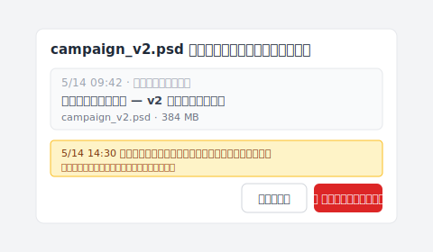

Cmd+S を押した。カーソルが一度点滅した。

そして気づく——いま上書きしたのは、クライアントが指定したバージョンだ。

ブリーフには「v2、ただし色は v3 から」と書いてあった。あなたは v2 を開いていた。v3 の色を選んだ。保存した。

詰んだ。

置き換わったレイヤーが、いま手元にある唯一の v2 だ。あなたは慌てて「photoshop 自動保存 location」を Google で検索する——Photoshop はどこかに副本を残しているはずだと思いながら、自動保存フォルダを開く。先週火曜日のファイルがある。今日のものは何もない。

開いたフォルダは間違っていない。問題は、そこで行われていることが、あなたが思っていたことと違うだけだ。

## フォルダを開いても、何もない

自動保存フォルダはあなたのファイルを隠しているのではない。最初から預かっていないだけだ。

空のフォルダを前にして、多くのデザイナーは同じ二つのことをする：もう一度「photoshop 自動保存 場所」を Google で検索し、それからフォルダを見つめて十分間ぼーっとする。両方とも空振りに終わる——自動保存は最初から別の仕組みだからだ。Photoshop が自分のために用意した緊急パラシュートで、傘が開くのは「プログラムやシステムが突然死ぬとき」、傘の下にいるのは Photoshop 自身であって、あなたのバージョン履歴ではない。

この緊急パラシュートは実際に何をしているのか？Photoshop が監視しているのは「異常終了」という出来事——クラッシュ、強制終了、システムの kernel panic。これらが起きたとき、メモリ上の作業状態を `.psb` のリカバリファイルに書き出す。次に Photoshop を起動すると、そのファイルを復元するかどうかのダイアログが出る。

仕事はそこで終わる。Cmd+S で自分の前のセーブを上書きする？それは Photoshop の中ではまったく別の出来事だ——プログラムは正常に動いていて、ユーザーが自発的に保存コマンドを実行している。自動保存のメカニズムは発火すらしない。クラッシュしていないので救うべきものがなく、リカバリフォルダにも何も書き込まれない。

フォルダの中を自分で確かめたい？実際のパスは Mac が `~/Library/Application Support/Adobe/Adobe Photoshop {version}/AutoRecover/`、Windows が `%AppData%/Adobe/Adobe Photoshop {version}/AutoRecover/`（フォルダ名は英語の `AutoRecover`）。過去のセッションの古い `.psb` ファイルがまだ残っているかもしれないが、今日の作業はそこに書き込まれた瞬間が一度もないので、復元しようがない。

なら、なぜ今でも「自動保存フォルダはどこ」を教える記事が何千本も存在するのか？

## Photoshop の自動保存はクラッシュ用——それだけのため

正直に言うと、これが Google の 1 ページ目で誰も区別したがらない違いだ：

| 仕組み | 発火条件 | 何を救うか | Photoshop に内蔵されているか |
|---|---|---|---|
| **自動保存** | Photoshop が異常終了を検知 | クラッシュ時のメモリ上の作業状態 | ✅ |
| **バージョン履歴** | Cmd+S のたび | 保存したすべてのバージョンを永続的にスナップショット | ❌ |

**クラッシュ救援** が自動保存の仕事だ——プログラムが死んで、ファイルが未保存、その時点まで戻したい。一つの仕事、一つのスロット。Adobe の `環境設定 > ファイル管理` パネルで間隔（5、10、15、30 分）を選べるが、どれを選んでも保存先は同じ一つの「上書きされるスロット」だ——新しいものが古いものを覆い、履歴ではなく「いちばん最近のリカバリポイント」だけが残る。

**上書き救援** は別の仕組みに属する——Photoshop が作っていない、バージョン履歴という機能だ。Cmd+S は前のバージョンを直接覆い書きする。「別名で保存…」は新しいファイルを生むが、元のファイルもすでに最後に保存した状態になっているので、古い内容も同じように消えている。ヒストリーパネルは？すぐ後で出てくるが、同じ仕事はこれもこなせない。

「何千本もの記事」の話に戻ると——それらが答えているのは別の、もっと答えやすい問いだ。「自動保存フォルダはどこ」は技術 FAQ、「上書きした前のバージョンを取り戻すには」はデザインの問題。前者には答えがある。後者は、Photoshop の内部には答えがない。

最も興味深いのは Adobe 自身は隠していないことだ。この機能の公式名称は「**バックグラウンド保存と自動回復**」——*回復*であって*履歴*ではない。Adobe は「回復」と呼んでいる。私たちが勝手に「履歴」と読んでいる、その差からズレが始まる。

## ヒストリーパネルもあなたを救わない

自動保存が履歴でないなら、次にデザイナーが試すのは大抵ヒストリーパネルだ——名前がいちばんバージョン履歴に近い。

ヒストリーパネルを開いて、スクロールして、今朝の 20 ステップが並んでいる。昨日のものは何もない。

ヒストリーパネルは「セッション内のアンドゥ記憶」だ。動作中の Photoshop プロセスのメモリに住んでいて、ファイルを閉じた瞬間（または Photoshop を終了した瞬間）に全履歴が蒸発する。翌朝同じ PSD を開き直すと、ヒストリーパネルには「開く」の一行だけが残っている。昨日のすべての筆致、すべてのレイヤー調整、すべての作業——履歴からは消えている。ピクセルはファイルの中にある。そこへたどり着いた軌跡はもうない。

「ヒストリーパネルがあるじゃないか」——これは直感的な反応だ。作業中はたしかに問題ないが、昨日の作業はファイルを閉じれば消える。セッションが終われば全部リセットされる。これは履歴というより付箋紙に近い——一度使って捨てるもの。

Photoshop はデフォルトで 50 ステップ保持する。`環境設定 > パフォーマンス` で増やせるが、その数字はあなたの問題には関係ない——この履歴はファイルを閉じれば死ぬ。いくつに設定しても結果は同じだ。

ヒストリーパネルは厳密には「操作ログ」だ——「あなたがこの順番でこれをやった」。記録しているのは動作の連なりで、ファイルの状態ではない。Cmd+S はこのログに何の印も残さない。そのために作られていない。

つまりあなたの手元には、救ってくれそうに見える三つのものがある：自動保存（クラッシュのため）、リカバリフォルダ（自動保存がクラッシュ時にダンプを置く場所）、ヒストリーパネル（セッション内アンドゥ、ファイル閉じれば蒸発）。

四つ目はない。**ファイル単位のバージョン履歴は Photoshop に内蔵されていない**。この欠けた層が、あなたをこの記事に連れてきた。

## あなたが本当に必要なのはファイル単位のバージョン履歴

欠けた層は Photoshop の外側に住んでいる——独立したプロセスで、Cmd+S のたびに監視している、アプリケーションよりも一段上の層だ。

必要なものを正確に定義しよう。PSD を保存するたびに、何かがそのバイト完全なスナップショットを静かに保存し、上書きしない。今日 20 回保存すれば 20 個のスナップショットが積み重なる。明日クライアントが指定した v2 を上書きしてしまった？30 分前のスナップショットに戻る——いまのファイルはそのまま、過去のバージョンが横に復元されてくる。

Photoshop はなぜこの層を作らないのか？Adobe は自身を描画ツールと位置づけている。「このファイルがディスク上でどう変遷したか」はファイルシステム層、OS、あるいは第三者のツールが扱う問題なので、Adobe はその層を別のツールに任せる。

この空白を埋めようとしているツールは一つではない。Apple の Time Machine も挑んでいる——でも Time Machine は時間単位のシステムスナップショットで、保存ごとのスナップショットではない。1 時間以上前に保存した v2 なら捕まえているかもしれないし、すでに上書き後の状態を捕まえているかもしれない。タイミング次第だ。OneDrive と SharePoint はバージョン履歴を提供する——デフォルトで [500 メジャーバージョン保持](https://learn.microsoft.com/ja-jp/sharepoint/document-library-version-history-limits)、上限を超えると古い順に自動削除される（個人 Microsoft アカウントは 25 バージョンと、さらに少ない）。Google Drive はさらに厳しい：各ファイルにつき [最大 100 リビジョン](https://developers.google.com/workspace/drive/api/guides/manage-revisions)、30 日経過した古いリビジョンは自動削除される（「Keep Forever」を手動でマークしない限り。これも 200 個上限）。[3 ヶ月後の納品物追跡に届かない理由は別記事で分解している](/post/client-asked-which-version/)。どれも部分的な答えだ。

残った空白を、Keeply が埋めようとしている。仕組みは単純：Keeply フォルダの中の PSD を Cmd+S で保存すると、Keeply はその瞬間のバージョンをまるごと背景で保存する——ライブファイルとは別の場所に、現在の作業に触ることなく。重い PSD（500MB クラスの単一ファイルでも）も背景で適切に処理される。Keeply は大容量ファイル向けの仕組みでディスクを膨らませない。保存間隔の設定もなく、「いますぐスナップショット」ボタンもない——あなたはいつも通り Photoshop で作業し、それがバックグラウンドで毎回の保存を記録する。

クライアントが指定した v2 を上書きしたと気づいたら、Keeply を開いて「クライアント確認版」の行までスクロールし、復元をクリックする。出てくるダイアログはこんな感じ：

赤い「このバージョンに戻す」ボタンの下にある一文に注目——5/14 14:30 以降に編集した分は消えず、新しいバージョンとして保存される。新旧どちらもタイムラインに残り、何も失われない。両者を視覚的に並べて比較し、v3 の色を復元した v2 にコピーする——元なら 1 時間のレイヤーやり直しだった作業が、30 秒のクリックで終わる。

ついでに言うと：Keeply はあなたがすでに使っている Adobe Creative Cloud、Time Machine、各種のクラウド同期と並行して動く。どれも置き換えない。それらが対応していない一つの空白だけを埋める——二進制のクリエイティブファイルのための、保存ごとに監視される永続的なファイル単位バージョン履歴。

これは[より広いファイルバージョン管理問題](/post/file-version-management-complete-guide/)の中で、デザイナーが最も強く感じる部分でもある。PSD は大きく、編集は破壊的で、クライアントはどの v2 を指していたか変わる。

## Keeply が解決しないこと

機能の話が一通り済んだので、境界もはっきりさせておきたい。Keeply はもうそこに存在しないものを救えない。正直な制約をいくつか挙げる。

**ハードディスク故障——これは私たちの領域ではない**。ディスクの物理破損、セクタ破損、`.psd` 拡張子が壊れた——それは EaseUS、Disk Drill、Stellar Phoenix の領域だ。Keeply はあなたのファイルがディスク上に残っていることを前提としていて、中身が望んだ状態ではないだけ。ファイル自体が消失している場合、必要なのはディスク復旧ツールであって、バージョン履歴ツールではない。

**Keeply インストール前に上書きされたファイル**も救えない。Keeply はタイムマシンではない——インストールした瞬間からバージョンを記録し始める。昨日上書きされた v2、今日インストールした Keeply——戻すための履歴はない。これが間抜けに聞こえるのは認めるが、バージョン履歴ツールの本質はそういうものだ——記録するのは今から先に向かう時間軸で、その前の時間帯のことは知らない。

**Photoshop の自動保存が対応するクラッシュ**も Keeply の担当ではない。Photoshop 編集中にクラッシュして 20 分間 Cmd+S を押していなかった——その未保存の作業状態は、いまでも Photoshop のリカバリダイアログで受け止めるべきものだ。

Keeply が記録するのは「Cmd+S を押した後」の時間軸——一度押すたびに一つの還元ポイントを残す。「Cmd+S を押す前」のあの瞬間は、Photoshop 内蔵の自動保存が担当する。二つの仕組みがそれぞれ別の区間を、並行して受け持っている。

## 次の Cmd+S の前にできること

冒頭の場面に戻ろう。クライアントは v2、色は v3 から、と言った。あなたは v2 にいて、v3 のスウォッチを選び、Cmd+S を押した。バックグラウンドでファイル単位のバージョン履歴が走っていれば、それを開いて、30 分前の v2（色を触る前）を見つけて、別ファイルとして復元する。いま両方が目の前にある：クライアントが参照していた色なしの v2 と、あなたがいま v3 の色を塗った v2。比較する、決める、納品する。

パニック全体が解ける。

自動保存は悪い設計ではない。それが設計された仕事——クラッシュからの復帰——では、ちゃんと機能している。最初から解決するために作られていない問題を解いてくれと期待されたら困るだけだ。バージョン履歴は別の層の仕事——別のツールの担当。

次の Cmd+S の前にこの層を PSD に追加するには、[Mac か Windows に Keeply をインストール](/post/install-keeply-windows-mac/)。

---

*執筆: [Ting-Wei Tsao](https://www.linkedin.com/in/ting-wei-tsao-b57480152)、Keeply 創業者。Keeply はデザイナー、建築家、ナレッジワーカーのためのファイルバージョン履歴ツール——Git を学ばずに個別ファイルを過去のバージョンに戻すことができる。*
