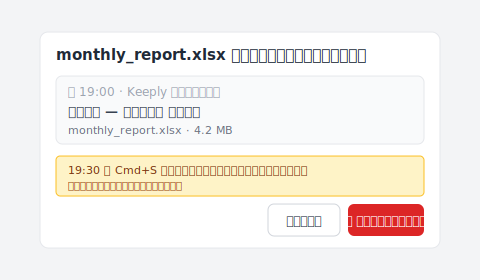

# 【2026 ファイル管理】上書き 復元の限界：自動回復 が消えた後でも間に合う方法

> 自動回復 はクラッシュ救援のためのもの。上書き保存後に必要なのは事前防御。

金曜日の夜 19:30、月末の決算書類を Excel で編集中、間違って前のシートに上書き保存してしまった。

Ctrl+Z はもう使えない（さっき閉じた）。自動回復 ファイルも消えた。

月曜の朝までに復元しなきゃ。でも、間に合うのか？

## 要点

「**上書き 復元**」を検索する人の多くは事後救援を求めます。けれど Microsoft 自動回復 はクラッシュ用、データ復元ソフトは上書き直後の数分以内が勝負。どれも「正常閉じ後の上書き」には届きません。**事後救援ではなく事前防御**。ツール層に 常時稼働 版数履歴を置けば、上書き保存が 破壊的 な動作ではなくなります。

## 本記事の目次

1. [自動回復 は本当は何のため？](#autorecover-は本当は何のため)
2. [自動回復 / 以前のバージョン / 復元ソフト：それぞれ何を救える？](#autorecover--以前のバージョン--復元ソフトそれぞれ何を救える)
3. [なぜ「上書き保存後」では間に合わないのか？](#なぜ上書き保存後では間に合わないのか)
4. [あなたのファイルはどこにあった？](#storage-locus)
5. [本当に消えてしまったら：被害を最小限にする](#damage-control)
6. [事後救援を超えて：常時稼働 版数履歴という選択肢](#事後救援を超えてalways-on-版数履歴という選択肢)
7. [よくある質問](#よくある質問)

---

## 自動回復 は本当は何のため？

Microsoft Office 内蔵には 3 種類の「**版数復元**」機構があります：

- **自動回復**：クラッシュ時に未保存内容を救う。既定で 10 分ごとに自動退避。**ファイル正常閉じで即削除**。
- **以前のバージョン**（Windows）：シャドウコピー機能で過去スナップショットへ戻す。事前設定が必要。
- **OneDrive 版数履歴**：保存ごとのスナップショット。ただし [Microsoft 公式文書](https://learn.microsoft.com/ja-jp/sharepoint/document-library-version-history-limits) によれば、管理者が設定した上限を超えた古い版は完全に削除され、ごみ箱からも復元できません。

設計意図は明確です。これら 3 機構は「**クラッシュ救援**」や「**直近の保存事故**」のためのもの。「**正常に閉じた後、上書き間違いに気づく**」場面の設計目標外です。

## 自動回復 / 以前のバージョン / 復元ソフト：それぞれ何を救える？

これらの機構の境界線を、対比で見てみます。

| 機構 | 救えるシナリオ | 救えないシナリオ | 注意点 |
| --- | --- | --- | --- |
| 自動回復 | クラッシュ中の未保存 | 正常閉じ後の上書き間違い | ファイル閉じで即削除 |
| OneDrive [版数履歴](https://learn.microsoft.com/ja-jp/sharepoint/document-library-version-history-limits) | 設定された保持上限内の版 | 上限を超えて削除された版・ローカル専用ファイル | クラウド保存必須 |
| Windows 以前のバージョン | シャドウコピーが取れていれば | 設定なし・SSD 環境 | 事前設定が必要 |
| データ復元ソフト | 上書き直後・セクター未上書き | 上書き後しばらく経過・SSD TRIM 後 | 成功率は環境依存 |
| Mac [Time Machine](https://support.apple.com/ja-jp/HT201250) | 直近のスナップショット | スナップショット間隔外 | 別途設定 |

そう、これが厄介。どの機構も「正常閉じ後の上書き」という典型的なシナリオには、構造的に届きません。

Keeply ユーザーから最も多く報告されるのは、ほぼこのシナリオです。

## なぜ「上書き保存後」では間に合わないのか？

ここで、誰もはっきり言わない区別があります。**保存層** vs **ツール層**。

これらの機構は **保存層** に住んでいます。設計目標は「直近の書込失敗をロールバック」。だから 保持期間 は短い。500 版や 30 日という数字は、「平均ユーザーが 1 ヶ月以内に振り返る回数」を参照点にしています。3 ヶ月以上は設計外、削減 は合理的です。

A さんは経理担当。金曜の夜 19:30、月末の決算書類を Excel で上書きしてしまった。自動回復 ファイルを探したが見つからない。データ復元ソフトを試したが「セクターが既に上書きされている」と表示。月曜の朝まで残り 60 時間。

ここが、本当の問題。A さんが事後気づいたのは、もし金曜の昼間に上書きしていたなら、自動回復 の 30 分間隔で取得できた可能性があった。**けれど「気づいた時点」がもう遅かった。事後救援は「気づくタイミング」に依存します。事前防御なら、そもそも「気づき」自体が要らない。毎回保存が版を残しているから。**

## あなたのファイルはどこにあった？「上書き保存 戻す」が効くかは、ここで決まる {#storage-locus}

「**上書き保存 戻す**」が効くかどうかは、復元ソフトの種類ではなく、ほぼ **ファイルがどこにあったか** で決まります。上書きした瞬間の保存場所を確認すれば、答えは次の 3 つのどれかに収まります。

| ファイルがあった場所 | 戻せる？ | 最初の一手 |
| --- | --- | --- |
| クラウド（Dropbox / OneDrive / Google Drive / SharePoint） | ✅ ほぼ可能 | バージョン履歴から上書き前の版を復元 |
| ローカル＋バックアップ（Time Machine / ファイル履歴 / 以前のバージョン） | ✅ ほぼ可能 | 上書き前のスナップショットを復元 |
| ローカル SSD・バックアップなし | ❌ ほぼ消失 | 復元ソフトにお金を使わない（下の被害対策へ） |
| ローカル HDD・バックアップなし | ⚠️ わずかな猶予 | すぐドライブの使用を止め、専門ラボに相談 |

驚かれるのは 3 行目です。**ローカル SSD 上で上書きし、バックアップがなければ、実質的に戻せません**——SSD の TRIM が解放されたブロックを数分以内に消去するため、復元ソフトが読む対象がもう残っていないからです。そして **クラウドのバージョン履歴は、ローカルディスクや NAS 上のファイルには及びません**。冒頭の A さんが戻せなかったのも、まさにこの行（ローカル＋上書き＋バックアップなし）に当てはまっていたからでした。

## 本当に消えてしまったら：被害を最小限にする {#damage-control}

判定が ❌ なら、やることは「復元」から「再構築」に変わります。上書きが届かなかった一番近いコピーから組み直し、関係者には早めに、落ち着いて伝える——これが残り時間の正しい使い方です。上書きが触れていない場所に残った版を探します。

- **先週クライアントに送ったメールの添付**
- **書き出した PDF / PNG**
- **同僚がダウンロードした版**
- **OS がキャッシュしたサムネイル / プレビュー**

どれも元ファイルそのものではありませんが、ゼロから作り直すより圧倒的に速く大半を取り戻せます。そして「隠して後で発覚」より「早めに一報」のほうが、関係を守れます。再構築できるファイルは「納期の問題」ですが、隠したファイルは「信頼の問題」になります。

## 事後救援を超えて：常時稼働 版数履歴という選択肢

事後救援の限界を超えるのは、**事前防御**。ツール層に 常時稼働 版数履歴を置くことです。

毎回保存 = 1 つの版として保持される。削減 なし。Word/OneDrive の 保持期間 ポリシー に依存しない。

[Keeply](https://keeply.work) はあなたが指定した作業フォルダのバックグラウンドで動きます：保存を押すたびに、Keeply が版数履歴にタイムスタンプ付きのバージョンを追加する。戻したい版は 2 クリックで開けます。「上書き保存」が **破壊的 な動作ではなくなります**——前バージョンは常に保持されている。

B さんは Keeply を半年使っています。月曜の朝、月末の決算書類が前のシートに上書きされていることに気づく。Keeply を開く。金曜 19:00 のシート、19:15 のシート、19:30 の上書き後シートはすべて版として保持されています。「19:00 のシートに戻る」をクリックすると、復元ダイアログはこのような形になります：

青いヒント行に注目してください——19:30 の上書きは破棄されず、独立した版として版数履歴に残ります。3 秒後に Excel が金曜 19:00 のシートを開く。月曜の出社前に徹夜で作り直す必要はもうありません。

ただし Keeply は 自動回復 の代替ではありません。クラッシュ中の救援はやはり 自動回復 が第一線。Keeply は遡及できません：上書き発生時点で稼働している必要があり、Keeply 導入前の上書きは本記事では救えません。今日からの保存は、すべて版として残せます。

ここがほっとできるところです。

## よくある質問

**Q1: 自動回復 は既定でオンですか？**

既定でオン。設定経路：「ファイル → オプション → 保存 → 10 分ごとに自動回復用データを保存する」。ただし 自動回復 はファイルを正常に閉じると消えます。長期保持ではありません。

**Q2: データ復元ソフトの成功率は？**

上書き直後の数分以内なら成功率がありますが、SSD（多くの現代 PC）では TRIM コマンドにより上書きされたセクターは即時消去されるため、成功率は HDD より低い。HDD でも数日経過すれば成功率は急降下します。削除の場合も[復元ソフトが届かない 4 つのケース](/ja/post/restore-without-panic/)が同じ構造で並びます。

**Q3: OneDrive 個人版とビジネス版の版数保持数は同じ？**

完全には同じではない。OneDrive 個人は既定で約 500 版。OneDrive for Business（Microsoft 365）も既定 500 版だが管理者が調整可能。上限到達で最古から 削減。

**Q4: Time Machine は使えますか？**

Mac の Time Machine はシステムレベルバックアップ。スナップショット間隔（既定 1 時間）の中で上書きが発生したら救えません。ファイル単位の版数管理でもないため、特定時点の単一ファイル復元は煩雑です。

**Q5: Keeply は 自動回復 の代替ですか？**

代替ではありません。自動回復 はクラッシュ中の救援、Keeply は正常保存後の版保持。両方は補完関係です。Keeply は事前に稼働している必要があります（遡及不可）。

---

19:30 に「あ、上書きしちゃった」と気づく瞬間は、これからもやってきます。

でも、知っていてほしいことが 1 つ。事後救援には限界がある。事前防御は、気づくタイミングに依存しない。

今日からの每回の保存、ツールに版を残してもらえますか？

---

> 著者について：Ting-Wei Tsao、Keeply 創業者。
> [LinkedIn](https://www.linkedin.com/in/ting-wei-tsao-b57480152/)
