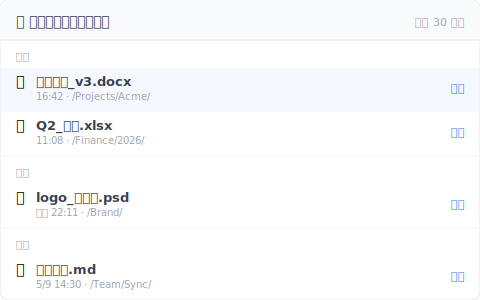

# 【2026 ファイル管理】削除したファイルがゴミ箱にない時の復元方法：復元ソフトが効かない 4 つのケース

> Delete を押したらゴミ箱は空？SSD TRIM と復元ソフトの盲点を解き、なぜ事前防御が事後フォレンジックより信頼できるかを示す。

## 目次

- [復元ソフトが言いたがらない致命傷：SSD + TRIM](#trim)
- [そもそもゴミ箱に入っていない 4 つのケース](#scenarios)
- [本当に頼れる復元は、ファイル層にある](#file-layer)
- [正直な境界：Keeply ができないこと](#limits)

---

Delete を押した。ゴミ箱を開けた。空だ。

そこで「ファイル復元」を Google する。最初のページの広告が Recoverit や Disk Drill のダウンロードを勧めてくる。ちょっと待て。私が Keeply を作る前にも Recoverit を一度買った。誤って削除した家族の写真を救おうとしたのだ。結論を先に言う：ほとんどの状況で、5000 円のライセンスではファイルは戻ってこない。

多くの場合、OS には復元のための痕跡が残っていない。

---

## 復元ソフトが言いたがらない致命傷：SSD + TRIM {#trim}

復元ソフトがやっているのは「セクタースキャン (Sector Scanning)」だ——ディスク上で上書きされていないバイト列を探し、ファイルを再構成しようとする。10 年前の HDD 時代なら理にかなった話だが、現代のコンピューターではこの道はほぼ封じられている。

現代のコンピューターは多くが SSD（ソリッドステートドライブ）で、Windows 7 以降は TRIM がデフォルトで有効になっている（[Microsoft Learn 公式ドキュメント](https://learn.microsoft.com/en-us/windows-hardware/drivers/storage/standard-inquiry-data-vpd-page)）。ファイルを削除すると、OS はすぐに TRIM コマンドを発し、その領域を「再利用可能」と SSD に伝える。

つまり、復元ソフトがスキャンしても見えるのはゼロの羅列だけだ。データ復元会社 Hetman は率直にこう書いている。「TRIM 有効な SSD から削除済みファイルを復元できると謳う復元会社は、無能か顧客を欺いているかのどちらかだ。」（[Hetman 公式記事](https://hetmanrecovery.com/recovery_news/data-recovery-is-impossible-ssd-cloud-and-online-services.htm)）私自身も後でデータ復元エンジニアと何度か話したが、答えは皆同じだった。

加えて、Windows Update、クラウド同期、ブラウザキャッシュは毎分のように新しいデータを書き込んでいる。削除後 1 時間放置するごとに、セクターが上書きされる確率は急上昇する。ディスクに BitLocker 暗号化がかかっていれば、復元確率は実質ゼロだ。

---

## そもそもゴミ箱に入っていない 4 つのケース {#scenarios}

ハードウェアの限界に加えて、ファイルがゴミ箱を完全に迂回してその場で消える 4 つの日常的なシナリオがある：

1. **共有ドライブの罠**：NAS、SharePoint、会社のネットワークドライブでファイルを削除した。システムは直接消去し、ローカルのゴミ箱には戻らない（[Microsoft 公式ドキュメント](https://learn.microsoft.com/en-us/windows/win32/shell/recycle-bin)）。チームでよくある悲劇：「ゴミ箱から拾えると思っていたが、IT 担当に NAS から直接消えたと告げられた」。
2. **手が滑って Shift+Del**：OS のネイティブな設計だ。このショートカットを押せば、痕跡なしの物理削除になる。
3. **クラウドのゴミ箱が期限切れ**：OneDrive は既定 30 日、Google Drive も 30 日、Dropbox Basic も 30 日。期限を過ぎれば、クラウド側でも自動的に消える（[OneDrive 公式ドキュメント](https://support.microsoft.com/en-us/office/restore-deleted-files-or-folders-in-onedrive-949ada80-0026-4db3-a953-c99083e6a84f)）。
4. **昨日ちょうどゴミ箱を空にしたばかり**：OS から見れば掃除コマンドは完了済みで、そのファイルは追跡対象から完全に外れている。

要するに、市場の復元ソフトが効くのは「古い HDD + 削除直後 + ディスクに新規書き込みがない」という極めて狭い完璧な条件のときだけだ。オフィスで実際に直面するのは、その条件ではない。

---

## 本当に頼れる復元は、ファイル層にある {#file-layer}

事後の「ディスクフォレンジック」を信仰するのはやめよう。本当の答えは、ファイルシステムの上に、静かな「バージョン記録層」を一枚被せることだ。

それが Keeply の立ち位置だ。クラウドにも外付けドライブにも依存しない。あなたが保存を押すたびに、自動的にバックグラウンドで一つバージョンを残す。

- **共有ドライブに強い**：NAS や SharePoint 上で作業していても、履歴が残る。
- **Offline-first**：常時オンライン同期は不要。
- **30 日の崖がない**：クラウドの厳しい保持期間の上限がない。3 か月前のバージョンも、タイムライン上にちゃんと残っている。

バージョン履歴だけではありません。Keeply には独立した「最近削除した項目」パネルもあって、過去 30 日にあなたが削除したファイルを、削除した時期ごとにグループ分けして並べてくれます：

「いつ消したか」を先に思い出さなくても、パネルを開いて名前をひと目見れば見つかります。右側の「復元」を押せば、元の場所に戻る。システムのゴミ箱を漁るより、こちらの経路があなたが慌てて Cmd+S を押す前に救ってくれます。

バージョン履歴設計のより深い理論は [Pillar：ファイルバージョン管理 完全ガイド](/ja/post/file-version-management-complete-guide/) を参照。

---

## 正直な境界：Keeply ができないこと {#limits}

いつものように、Keeply の限界も正直に書く：

- **SD カードや携帯の写真は救えない**：それは別領域のツールだ。専用アプリを探してほしい。
- **ディスク全体の物理破損は防げない**：それはバックアップツールの仕事だ。外付けドライブを買って [3-2-1 バックアップ原則](/ja/post/3-2-1-backup-rule/) に従ってほしい。
- **「インストール前」のファイルは救えない**：Keeply は事前防御のツールであって、事後フォレンジックのソフトではない。インストールする前に削除されたものは、どうにもできない。

次の Delete が災害を引き起こす前に、[今日のうちに Keeply をインストール](/ja/post/install-keeply-windows-mac/)しておこう。

---

> 著者：Ting-Wei Tsao、Keeply 創業者。
> [LinkedIn](https://www.linkedin.com/in/ting-wei-tsao-b57480152/)
