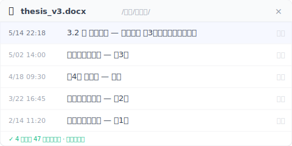

# 【2026 ファイル管理】修士論文 バックアップ・版本管理 4 ステップ：2 年分をノート PC 1 台に賭けない

> 水曜日の午後 3 時、指導教員から「前のバージョンの第 3 章、あの論証の方が良かった。どこ行った？」 thesis_final_v7 を開いても、v5 と v6 が何が違ったか思い出せない。修士・博士課程向けの 4 ステップ版本管理：ワークフローを変えず、専門用語も要らない、2 年分の思考に軌跡を残す方法。

水曜日の午後 3 時。カフェにいて、アメリカーノはまだ半分残っている。指導教員から LINE の通知：「前のバージョンの第 3 章、あの論証の方が良かったよ。どこに行った？」

ノート PC を開く。Google Drive には `thesis_final.docx`、`thesis_final_v2.docx`、`thesis_修正版_0415.docx` が並んでいる。一つずつ開いて第 3 章までスクロールし、いま画面にあるものと見比べる。

前のバージョンとの違いがまったく思い出せない。

指導教員に返信を打つ：「探してみます。」でも心の奥ではもう分かっている。見つからない。

論文の最大の敵は締切だと思っていた。この午後を境にそうではなくなる。

## 目次

- [「前のバージョン、どこ行ったの？」](#h2-1)
- [クラウド同期や Word の版本履歴では論文を救えない理由](#h2-2)
- [論文は 1 つのファイルではない、1 本のタイムラインだ](#h2-3)
- [修士論文の版本管理 4 ステップ実戦](#h2-4)
- [この一切を必要としない学生もいる](#h2-5)

---

## 「前のバージョン、どこ行ったの？」 {#h2-1}

論文が書き消えていく仕方は劇的じゃない。ハードディスクは死なないし、ノート PC も落ちないし、コーヒーもこぼれない。静かに消えていく。3 か月経ってからやっと気づく、そういう静けさだ。

あの感覚、分かるだろうか：指導教員にある論証がどこへ行ったか聞かれる。フォルダを一つ一つ漁る。ファイル名は `thesis_final.docx`、`thesis_final_v2.docx`、**`thesis_final_本当の最終版.docx`**。最新のものを開くと、第 3 章の文字が目の前にある。でも教員が聞いているそのバージョンは、もう上書き保存で消してしまった。

これは怠けでも、不真面目でもない。誰もあなたに教えてくれなかっただけだ：**論文の一回一回の変更は、あなたが将来戻ってくる必要のある時点だ**。そして戻ろうとしたとき、ファイルシステムは「数分前に更新」としか教えてくれない。それは今を覚えているだけで、あなたの 2 年分の思考を覚えてはいない。

手のひらに汗がにじむ。あなたはファイル名のリストを下にスクロールしていく。

私が Keeply を作る前、自分も同じくらいの規模の長文を書いたことがある。そのとき気づいた：あなたに必要なツールは市場にないわけじゃない。3 つの違うカテゴリーに分散していて、それぞれが半分ずつしか解決しないだけだ。

---

## クラウド同期や Word の版本履歴では論文を救えない理由 {#h2-2}

こう考えるだろう：「でもクラウドに保存しているじゃないか。iCloud、OneDrive、Google Docs、自動で全部保存されている。」

ここに混同しやすいポイントがある：**クラウド同期が解くのは「ファイルが消えない」であって、「前のバージョンのあの段落はどこか」ではない**。

分けて見よう：

**クラウド同期**（iCloud、OneDrive、Dropbox）はハードウェア故障を解く。ノート PC が壊れてもファイルはクラウドにある。だが今日の保存が昨日の保存を上書きする。「最新バックアップ」であって、「全バージョンの蓄積」ではない。

**Word の変更履歴、Google Docs の版本履歴**は「今のこの 1 ファイル」には役立つ。誰がどの文を変えたかを正確に覚えている。だが日付をまたいだ、ファイルをまたいだ差分は解決しない。Google Docs の自動バージョンは時間と共にシステムが統合・削除する。3 か月前のあのバージョンの第 3 章全文は見られない。

**手動でファイル名を `v1 v2 v3` と付ける**。当然のように聞こえる。だが半年後 `thesis_v7_本当.docx` と `thesis_v7_fix.docx` を見て、教員が当時見たのはどちらか？答えられない。ファイル名の変更はバージョンを残せても、意味を残せない。

この 3 つのツールに問題はない。ただ、いま抱えているこの質問に答えるためには設計されていないだけだ：**「先週のあのバージョンの第 3 章は、結局どう書かれていたのか」**。

情報セキュリティの [3-2-1 バックアップ原則](https://www.cisa.gov/news-events/news/data-backup-options)（3 つのコピー、2 種類のメディア、1 つは別の場所）は「データが一度に全部消えない」を解く。重要だ。だが差分の質問には答えない。

この 4 つを並べて見ると、それぞれが扱う層が完全に違うことが分かる：

| ツール | 何を解くか | 何を解かないか | 論文に合うか |
|---|---|---|---|
| クラウド同期（Dropbox / OneDrive / iCloud） | ノート PC が壊れてもファイルがある | 前のバージョンの第 3 章はどこか | 半分 |
| Word / Google Docs 版本履歴 | いまのファイルで誰がどの文を変えたか | 日付・ファイルをまたいだ差分 | 半分 |
| 手動ファイル名 `v1 v2 v3` | バージョンの「形」は残せる | 各バージョンの「意味」 | 3 分の 1 |
| 3-2-1 オフサイトバックアップ | データが一度に全消しにならない | どのバージョンを戻したいか | 対応しない |
| ツール層のバージョン管理（[Keeply](https://keeply.work)） | あなたが保存したバージョンを自動で保持、日付横断の差分ビュー | ディスク全体の物理破損（バックアップと併用） | 対応する |

各ツールは自分の場面では正しい。問題は、論文という戦場が**同時に**この 5 層のうち「差分の記憶」層を必要としていて、伝統的なツールにそれを専門にしているものがない、ということだ。

---

## 論文は 1 つのファイルではない、1 本のタイムラインだ {#h2-3}

視点を変える：**論文は 1 つのファイルではない。1 本のタイムラインだ。**

指導教員が最後に受け取る PDF は、このタイムラインの 1 つの断面でしかない。本当に大事なのは、この 1 年半をあなたがどう考えてきたかだ。なぜあの段落を消したか、なぜこの段落を足したか、教員のフィードバックの後どう書き直したか。その軌跡こそが論文の骨格だ。

PDF は結果。タイムラインは過程。

論文を「ファイル」として扱う学生は、書いているうちに蓄積が 1 枚に押し潰される。保存のたびに前を上書き、書き終わるたびにデスクトップには最新の 1 つだけ。間違いではない。多くの人がデフォルトでそうする。代償は：教員に「前のバージョンのあの部分」と聞かれたとき、出すものがない、ということだ。

論文を「タイムライン」として扱う学生は違う。週に 1 つ、教員に渡すたびに 1 つ、章構成を変えるたびに 1 つ。コレクションのためじゃなく、**証拠を残すため**だ。

証拠が何の役に立つか？最重要なのは：**教員は PDF を採点しているのではない。あなたの考えの進化を審査している**。「前のバージョンのあの部分の方が良かった」と言うのは、いじめているのではない。当時の論証を一緒に思い出しているのだ。これは学術仕事の最も核心的な動作。**反復思考**。

口頭試問のときも同じ。委員に「なぜ第 3 章の構成がこうなったか」と聞かれたとき、軌跡をめくれるなら、暗記した答えを唱えているのではない。あなたが自分で歩いた道を、委員と一緒に歩いている。

もっと現実的な側面もある。もしいつかあなたの論文が問われるなら（引用源、剽窃の指摘、研究倫理）、版本履歴があなたの弁護になる。タイムラインがなければ、手元には今の PDF しかない。何も証明できない。

だから**差分の記憶**は「あるかないか」の問題ではない。「能動 vs 受動」の問題だ。意志力で毎週ファイル名を変え、保存のたびにバックアップを取ってもいい。正直に言って、できる人はほとんどいない。あるいは、ツールにやらせる。

---

## 修士論文の版本管理 4 ステップ実戦 {#h2-4}

やるべきことは多くない。4 つ：

**1. 毎日終業前に日付付きのコピーを残す。** ファイル名は `論文-0423.docx` のように。簡単に聞こえる。だが半年経って正直に振り返ってみて、何日できた？私自身、以前長文を書いたとき、1 か月は持ったが 2 か月目に忘れた。この層はツールの補助が必要だ。

**2. 教員に渡すたびに、そのコピーを単独で取り置く。** ファイル名は `論文-0423-教員提出.docx`。教員が後で「前のバージョンのあの部分」と聞いてくるとき、最も多く必要になるコピーだ。

**3. ツールにバージョンを覚えさせる。** これがステップ 1 と 2 が届かない、あるいは続かない場所で、ツールが補う層だ。[Keeply](https://keeply.work) はそのために設計されている。あなたが保存したバージョンがバックグラウンドで静かに残る——あるいは自動保存をオンにすれば、15〜30 分ごとに変更を取り込む。ファイルは今のフォルダにそのまま残り、引っ越しもツール乗り換えもいらない。**差分ビュー**で v5 と v6 のどの文字が変わったかを直接見られる。教員に聞かれたら、クリック 2 回で開ける。

`thesis_v3.docx` の版数履歴パネルを開くと、この 4 か月、教員の毎ラウンドのフィードバック後のバージョンが順に積まれているのが見える：

下の緑色の文字「47 バージョン・全件保持」——これが Keeply と Word の組み込み版数履歴の最大の差です。Word では一文書き換えて Ctrl+S を押すたびに新版になり、4 か月で 47 版は普通に到達します。しかし Word は最大 [25 バージョン](https://learn.microsoft.com/en-us/sharepoint/document-library-version-history-limits)（個人アカウント）まで、それを超えると古いものから捨てられていきます。Keeply なら 47 行どの行にもクリック 1 回で戻れます。

**4. 少なくとも 1 つはこのノート PC にない。** クラウド、外付けドライブ、USB メモリ、どれでもいい。重点は**このコンピューターにない**こと。ノート PC がカフェで盗まれる。SSD が突然死ぬ。エアコンの水滴がキーボードに落ちる。これらは毎年どこかの大学院生に起きている。オフサイトバックアップは、あなたが自分のために買える最も安い保険だ。

---

## この一切を必要としない学生もいる {#h2-5}

ただ、正直に言わせてほしい：この記事は全ての大学院生に向けて書いたものじゃない。

すでに **LaTeX とエンジニアの版本ツール**を併用しているなら、完全なタイムラインはすでに手元にある。ここで述べたどの方法より強い。論文が全て **Overleaf** にあるなら、版本履歴は内蔵されている。ただし PDF にエクスポートした後は保持されないことを忘れずに、`.tex` ソースプロジェクトを別途バックアップする。書き方が純線形、日々文字数が増えるだけで戻って直すことが一切ないなら、これも必要ない。正直に言って、3 つ目はほぼ存在しない。

もう 1 つ、ツールが揃っていても解決しない問題がある：**指導教員の口頭フィードバックは自動的に記録されない**。週次ミーティングで教員が話す内容、それはあなたの責任だ：ノート、録音（許可を取って）、会後の整理。ツールはファイルを守るが、会話を守ることはない。

---

論文は最後に提出する PDF だけじゃない。あなたがこの 2 年どう考え、どう書き直し、どう教員に反論されてどう答えたか、その軌跡全体だ。その軌跡は毎日起きている。

それに、自分のタイムラインを 1 本与える価値があるんじゃないか？

---

水曜日の午後 3 時、カフェで飲み残したアメリカーノを覚えているか？論文のファイル管理者をもう続けなくていい。**Keeply：あなたのファイル管理の守護神**、変更の一つ一つを代わりに覚えてくれる。版本履歴は今のフォルダの中に住む。引っ越しもツール乗り換えもなし。論文に特に向いている、なぜなら論文はまさに長期に蓄積される軌跡だから。

[Keeply をちゃんと知る →](https://keeply.work)

## 関連記事

メイン記事 [ファイルバージョン管理 完全ガイド](/ja/post/file-version-management-complete-guide/) は 4 つの構造的理由を分解している。なぜツールはあなたが本当に必要としていることのために設計されていないか。

---

## 出典

- [U.S. CISA. Data Backup Options](https://www.cisa.gov/news-events/news/data-backup-options)（3-2-1 バックアップ原則）

---

> 著者：Ting-Wei Tsao、Keeply 創業者。
> [LinkedIn](https://www.linkedin.com/in/ting-wei-tsao-b57480152/)
