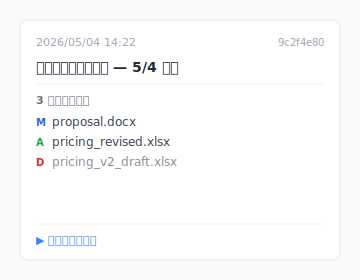

木曜日の夜 11:47、デスクトップでクライアントが今日サインしてくれたバージョンを探しています。`企画書_v*_最終.docx` が 11 個並んでいて。どれがクライアントの署名版か、どれが自分の書き込み版か、どれが LINE で受け取って手直しした版か、わからない。消すのも怖いし、残したままだと見つからない。

これは特殊なケースじゃありません。Cmd+S（または Ctrl+S）を使って働く人なら誰でも遭遇します。先になぜそうなるかを話して、それから 3 つのツール設計を見てもらいます。

## 目次

- [なぜ `_v3_最終` という名前を付けてしまうのか](#why-naming)
- [「バージョンが多すぎる」は実は 4 種類の痛み](#four-types)
- [あなたのやり方は正しい。ツールがバトンを受け取らなかった](#tool-side)
- [それを解く 3 つのツール設計](#three-designs)
- [Keeply が向かない場面](#boundaries)

## なぜ `_v3_最終` という名前を付けてしまうのか {#why-naming}

Cmd+S は永久的な動作です。押した瞬間、前のバージョンは上書きされます。「30 分前のあのバージョン」に戻すボタンはありません。デザイナーの PSD、弁護士の契約書 docx、[学生の論文](/ja/post/thesis-single-point-of-failure/)。どれも同じ。**名前を付けないと失います**。だからファイル名の末尾に `_v3`、`_最終`、`_本当の最終` を足すわけです。

そう、ここがイラつくところです。あなたがやっていることは強迫観念じゃない、OS が「30 分前のあのバージョンに戻す」道をくれないから生まれた生存反応なんです。

## 「バージョンが多すぎる」は実は 4 種類の痛み {#four-types}

「バージョンが多すぎる」を分解すると、まったく異なる 4 種類の問題が見えてきます。それぞれ解決法も違います。

| # | 痛みの種類 | 典型的な現場 |
|---|---|---|
| 1 | **ユーザーによる誤上書き** | Cmd+S を押した後で「あ、30 分前のあのバージョンが正しかった」と気づく |
| 2 | **クライアント反映ループ** | `契約書_v3_クライアント意見.docx` / `企画書_v5_部長また直し.docx` が無限往復 |
| 3 | **クラウド同期の競合** | Dropbox / OneDrive で両端から編集、`企画書 (Bill の競合コピー).docx` が生成 |
| 4 | **ソフトの自動保存残骸** | Word `.asd` / Premiere `.bak` / PSD `.psb` の自動バックアップが散らばっている |

同じ問題を解いているつもりで、実は 4 つの異なる問題を解いていたわけです。第 1 種はツールが自動で履歴を保つ必要がある。第 2 種はマイルストーンの凍結機構が要る。第 3 種は同期競合の解決が要る。第 4 種はツールの使い方の習得が要る。**自分がどれなのかをまず診断してから、解法を探しましょう**。

## あなたのやり方は正しい、ツールがバトンを受け取らなかった {#tool-side}

ファイル名末尾に `_v3_最終` を付けることは、論理的には正しい——あなたはバージョンの意味を記録する必要がある。間違っているのはあなたじゃなく、ツール層が「自動チェックポイント」「自動マイルストーン」を提供せず、責任をファイル名に丸投げしていること。だからあなたは、使える唯一の道具——ファイル名——でその問題を解いている。

整理術系の発信者は「命名規則を持ちましょう」と教えます。14 ページの命名標準 PDF を回したり、チームにプレフィックスの順番を覚えさせたり。聞こえはいい。実際にやると三日でルールが崩れます。

問題はここ：**ルールはバージョン管理の責任を人間の規律に押し付けている**。そして規律は自動化に永遠に勝てません。今日は `2026-05-04_企画書_v3_クライアント承認.docx` と覚えていられても、明日急いでいると `企画書_v3_最終.docx` になり、明後日クライアントから直しが来ると `企画書_v3_最終_v2.docx` になります。

あなたのやり方は正しい。`_v3_最終` と命名するのは合理的な生存反応です。ただ、その生存反応は本来必要なかったはずなんです。

## それを解く 3 つのツール設計 {#three-designs}

ツールができることを 3 つの設計パターンに分けます。それぞれが上の 4 種類の痛みのどれかに対応します。

### Design A：自動チェックポイント（あなたが保存したバージョンが残る）

あなたがバージョンを保存すると、ツールが前のバージョンを静かに保存しておく。命名は不要。**例**：macOS Time Machine（[Apple 内蔵で 1 時間ごとに自動スナップショット](https://support.apple.com/ja-jp/104984)）、Word AutoSave（[直近 1-2 バージョンしか戻れない](/ja/post/excel-version-history-limits/)）、[Dropbox 30 日版本史](https://help.dropbox.com/delete-restore/version-history-overview)。**Keeply** はあなたの作業フォルダのバックグラウンドでこれをやります——大事な瞬間にメモを添えて手動で保存するか、任意の自動保存で 15〜30 分ごとに取り込む。テキストファイルは変更内容だけを記録し、画像やデザインファイルは各版を完全保存——大きなファイルでもディスクを食いつぶさない設計。**第 1 種を解決**。

その静かな履歴を後から探すには？タイムラインの任意の行にマウスを置くと、Keeply がその保存で変わったファイルを浮きカードで表示します。開かなくても比較できます：

クリックすれば完全な差分が開き、右クリックでそのまま復元。`_v3_最終_v2_final.docx` のような命名でどの版がどれか印を付ける必要はもうありません。

### Design B：マイルストーンの凍結（自分で「クライアント承認」「リリース」を標す）

あなたが「このバージョンはクライアント承認」「このバージョンはリリース」と能動的にマークする。それ以降どう変わっても、その凍結点は残る。**例**：GitHub Releases（エンジニアが特定時点のコードを名前付きマイルストーンとして凍結する機能、開発者向け）。**Keeply** には「リリース」という機能が組み込まれていて、開発者の用語を覚える必要なく同じことができます：履歴から 1 バージョンを選んで「リリースとして凍結」を押せば、永久に戻せます。**第 2 種を解決**。

### Design C：単一ファイル復元（履歴から 1 ファイルだけ取り出す）

履歴上の任意のバージョンから**単一ファイル**を復元、フォルダ全体を巻き戻す必要なし。**例**：Dropbox の単一ファイル復元、Time Machine の単一ファイル復元。**Keeply** はバージョン内文検索を加えています——「先週何かを書き換えた」と記憶していれば、過去の変更内容を検索して、該当バージョンを特定し、そのファイルだけ取り戻せます。**第 1+2 種の混合シーンを解決**。

ここで気づくのは、4 種類の痛みのうち第 4 種（ソフトの自動保存残骸）だけが別ルートだということ。あれはツールの使い方を学ぶ問題（キャッシュの掃除を覚える）で、バージョン管理とは関係ありません。

## Keeply が向かない場面 {#boundaries}

Keeply はすべてのシーンを解決しません：

- **生の映像素材**：毎日数十 GB の Premiere 素材が積み上がる場合、ディスクが足りない。Keeply はコールドストレージの代替ではない。
- **100 万ファイル以上のフォルダ**：Keeply の設計範囲は数百から数千ファイルの作業フォルダ。それを超えると重くなる。
- **チーム横断の頻繁な競合マージ**：Keeply の競合解決 UI はまだ限定的。
- **契約書最終版の凍結 / クライアントへの納品物**：そのシーンは手動命名すべきで、ツールが自動化すべきではない。

## 次に Cmd+S を押す前に

次に Cmd+S を押すとき、「もしこれが間違ったバージョンだったら」と怖がらなくていい。その「もし」がもう存在しないからです。すべてのバージョンは残っていて、見つけ出せばいい。

Keeply がどうやってこれをするか見たいですか？[「ファイルバージョン管理 完全ガイド」を続きで読む。](/ja/post/file-version-management-complete-guide/)

---

> 著者について：Ting-Wei Tsao、Keeply 創業者。
> [LinkedIn](https://www.linkedin.com/in/ting-wei-tsao-b57480152/)
