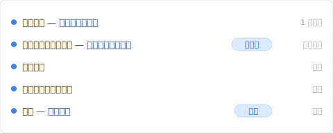
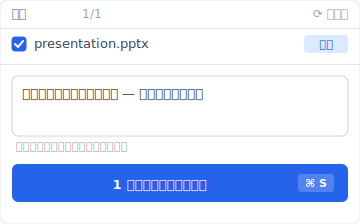
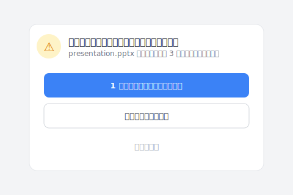

あなたは「バージョン管理」と検索しました。出てきたのは git、svn、Mercurial のチュートリアル。CLI コマンド、ターミナル画面、コミット・プッシュ・マージ。読んで 5 分で挫折。あなたは 開発者 じゃない、デザイナーや事務職や接案者です。「ファイルとして見える UI」のバージョン管理ツールが欲しいだけ。

これは特殊なケースじゃない。Google が「バージョン管理」というクエリを全部 開発者 クエリと判定する結果です。先になぜそうなるかを話して、それから非エンジニアが実際に使える 3 つの選択肢を見せます。

## 目次

- [Keeply で「バージョン管理」をやってみる（コマンドゼロ）](#keeply-timeline)
- [「バージョン管理」検索で git ばかり出てくる理由](#why-only-git)
- [非エンジニアが必要な 4 つの設計要件](#four-requirements)
- [git 仕組み を隠す UI が 鍵](#hide-git-key)
- [3 つの非エンジニア向け選択肢](#three-options)
- [Keeply が向かない場面](#boundaries)

---

## Keeply で「バージョン管理」をやってみる（コマンドゼロ） {#keeply-timeline}

まず今を見せます。同じ `presentation.pptx`、初稿からクライアント承認まで——[Keeply](https://keeply.work) ではこのプレゼン案件の時間軸はこう見えます：

「クライアント承認の最終版 — コマンド入力ゼロ」が自分の行を持ち、「最終版」tag が付いている——これは今日の午前、クライアント確認後に Keeply メインウィンドウで「バージョン保存」を押し、メモを書いて保存したもの。`git commit -m "client approved"` を打つ必要なし、`HEAD~3` が何かを知る必要なし。

操作は 2 ステップだけ：

1. **保存**——PowerPoint で Ctrl+S。Keeply はバックグラウンドで 30 分以内に変更を検知して、自動で時間軸に 1 バージョン保存。
2. **マイルストーンをタグ付け**——重要な瞬間（クライアント承認 / リリース版）は Keeply メインウィンドウで「バージョン保存」を押し、ダイアログにメモを書く：

「クライアント承認の最終版 — コマンド入力ゼロ」と一行書いて保存。3 ヶ月後に時間軸を見れば、tag ですぐに見つかる。

`git commit` なし、`branch / merge / checkout` なし、黒画面のターミナルなし。Keeply は内部で git engine を使っている（技術的には妥当）が、UI にエンジニア用語はゼロ——画面に並ぶのは「バージョン保存 / 履歴 / 復元」という日常語だけ。

エンジニアのツールが最もよく学習を強いる層 `git stash` すら、ここでは省かれます。このプロジェクトを編集しながらバージョン保存を忘れたまま別のクライアントのフォルダに切り替えようとすると、Keeply が日常語で問いかけて止めます：

「1 バージョン保存してから切替」は、エンジニアの世界で打つべき `git stash` + `git checkout` を、2 つの日本語ボタンに畳んだものです。

下では、なぜ Google が自然にこの層を見せてくれないのか、なぜ既存ツールは非エンジニアを満たさないのかを分解します。

---

## 「バージョン管理」で検索しても git ばかり出てくる理由 {#why-only-git}

「バージョン管理」というクエリの検索意図は実は **混ざっている**：半分は 開発者 (git/svn/Mercurial を比較したい)、もう半分は非エンジニア (ファイルとして見える UI が欲しい)。

しかし Google SERP は **開発者 側を 100% 表示**：Atlassian、GitHub、Stack Overflow が上位独占。非開発者の需要は invisible。

意外と知られていない：あなたが見つからないのは検索が下手だから**じゃない**。あなたが必要な工具が SERP の隅に押し出されているから。

## 非エンジニアがバージョン管理ツールに求める 4 つの設計要件 {#four-requirements}

「バージョン管理ツールに何を求めるか」を分解すると、git/svn が満たさない 4 つの要件が見えてきます：

| # | 要件 | git/svn が満たさない理由 |
|---|---|---|
| 1 | **ファイル単位で見える UI** | git は 保存ポイント/blob 単位、ファイルに直結しない |
| 2 | **CLI 不要** | git は CLI 前提（GUI ラッパーあるが学習曲線急） |
| 3 | **二進位ファイル対応** | git は テキスト 最適化、PSD/DWG/MP4 苦手（LFS 別途設定要） |
| 4 | **復元 UI が直感的** | git の checkout/reset/revert は概念が混乱 |

git は **テキストコード向けに設計** されている。デザイナー・事務職のファイル管理 使用 ケース と元々ミスマッチです。

## ソフトウェア業界は 20 年前にバージョン管理を解いた、なぜ非開発者に渡らなかったのか？ {#hide-git-key}

ソフトウェア業界は 20 年前にバージョン管理を解きました：エンジニアが一度保存すれば、コード全体の履歴がきれいに残る。問題は、その層のツールが非開発者には渡らなかったこと。

技術が応用できないわけじゃない、設計思考が渡らなかった。エンジニアツールの語彙（branch、merge、HEAD）、デフォルトの流れ（切り替える前に commit）、UI（黒い画面のターミナル）——どれも使う人がすでにエンジニアであることを前提にしています。あなたがエンジニアじゃないなら、そのツールセットはあなたには何も語りかけてこない。

非開発者が必要なのは**最初から非開発者向けに設計されたバージョン管理ツール**、エンジニアツールの色を変えたものじゃない。Keeply はこの道：あなたが git を知っていると仮定しない、git を教えない、最初からファイル層の視点でバージョン履歴を設計する。

そう、ここがイラつくところです。Atlassian も GitHub も Stack Overflow も開発者向けに話している。「非開発者向けのバージョン管理はどう見えるべきか」という当然の質問に正面から答える人がいなかった。

## 非エンジニアが使えるバージョン管理 3 つの選択肢 {#three-options}

非エンジニア向けの選択肢を 3 つ挙げます。それぞれ トレードオフ があります：

### 選択肢 A：macOS Time Machine（Mac 内蔵）

Apple が 2007 年から Mac に内蔵しているツール：外付けドライブを挿せば、システムが 1 時間ごとに自動でディスク全体のスナップショットを取り、3 ヶ月前のファイルを開くのも 2 クリック。**利点**：無料、ファイル単位の UI、コマンド不要、どんなファイルでも対応。**欠点**：Mac のみ、復元は時間軸アニメーション UI でやや不便、「マイルストーンとして凍結」機能なし。**適合**：Mac 個人ユーザー、たまに復元する用途。

### 選択肢 B：Dropbox バージョン履歴（30 日制限）

30 日以内のバージョンを Dropbox が自動保存、ファイルの右クリック→「以前のバージョン」から復元。**利点**：クロスプラットフォーム、共有便利。**欠点**：30 日後消える、セル単位の差分なし、競合コピー問題（[別記事参照](/ja/post/dropbox-conflicted-copy/)）。**適合**：30 日以内の協作場面。

### 選択肢 C：Keeply

最初から非開発者向けに設計：保存のたびに自動でバージョンを残し、バージョン履歴は「日付 + 変更内容」で表示、UI にエンジニア用語ゼロ。**利点**：ファイル単位の UI、コマンド不要、大きいファイルも扱える、時間制限なし、あるバージョンを「リリース」として凍結すれば以後の保存で上書きされない。**欠点**：デスクトップ優先（モバイルが弱い）、即時同期は得意じゃない、リアルタイム多人数編集には向かない。**適合**：デザイナー、大学院生、フリーランス、小規模チーム、長期バージョン管理ニーズや設計ファイルが多い仕事。

選び方のヒント：(1) 突発復元だけ → Time Machine、(2) チーム共有 30 日内 → Dropbox、(3) 長期 + 個人 + 設計ファイル多い → Keeply。

## Keeply が向かない場面 {#boundaries}

正直に書きます、Keeply は全員に合わない：

- **本物のエンジニア**：ターミナルを使いたい、バージョン履歴のグラフ構造を見たい——Keeply UI はわざと隠しすぎている
- **大企業**：SSO / Active Directory 統合なし
- **モバイル優先のユーザー**：Keeply はデスクトップ優先
- **リアルタイム多人数編集**：Microsoft 365 同時編集 / Google Docs のほうが強い

## 次に「バージョン管理」と検索する時

git tutorial で挫折しないで済みます。あなたは 開発者 じゃない、それでいい。非エンジニア向けのバージョン管理選択肢は存在する、ただ Google が見せてくれないだけ。

詳しく知りたい？[「ファイルバージョン管理 完全ガイド」を続きで読む](/ja/post/file-version-management-complete-guide/)。

---

> 著者について：Ting-Wei Tsao、Keeply 創業者。
> [LinkedIn](https://www.linkedin.com/in/ting-wei-tsao-b57480152/)
