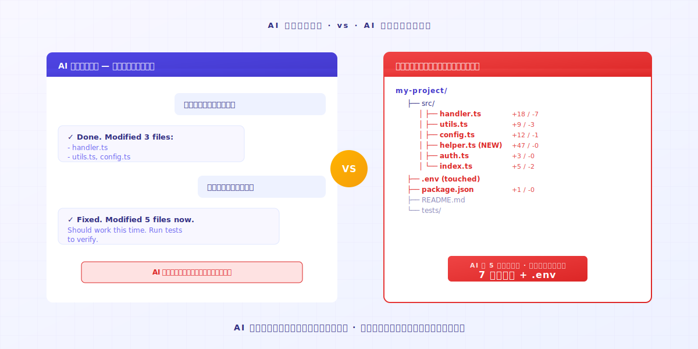
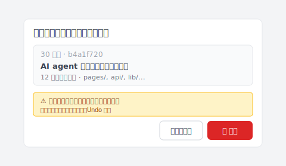

# 【2026 ファイル管理】Vibe Coding が暴走した？1アクションで動くバージョンに戻す

> AI エージェントが行き過ぎてコードが動かない。Keeply のタイムラインを開けば、最後に動いたバージョンがそのまま残っている。

## 目次

1. [AI が行き過ぎる瞬間はどんな感じか？](#ai-overshoot)
2. [1アクション：タイムラインを開いて、最後に動いたものを選ぶ](#one-action)
3. [なぜ AI は自分で引き返さないのか](#ai-doesnt-rollback)

---

Aさん（エンジニア）は Cursor を開き、AI にバグ修正を頼みます。AI が直したものの動きません。もう一度修正を依頼。AI は3つ目のファイルに手を入れます。それでもダメ。さらに5つ目を書き換えました。Aさんはもう、AI がどのファイルに触ったのか分からなくなっています。

ここであなたはこう思うはずです。いったん止めよう、せめてさっき動いていた状態に戻したい、と。

問題はここです。**さっき動いていたのは、どのバージョンだったのか？**

私自身もぶつかったことがあります。AI が 5 つ目のファイルに触れた頃には、どのバージョンが動くか分からなくなっていました。幸い、Keeply のタイムラインには、最後に手動で動かしたバージョンが残っていました。

---

## AI が行き過ぎる瞬間はどんな感じか？ {#ai-overshoot}

あなたは Vibe Coding 中。AI に目標を渡し、AI が一段書きます。

実行してみる。OK。

次のターン、「もう1つ機能を足して」と言う。AI が3つのファイルを書き換える。実行。エラーが出る。

「そのエラーを直して」と言う。AI は5つのファイルを書き換え、設定 まで触り、頼んでもいない ヘルパー 機能 を追加します。実行、エラーがさらに増える。

このとき AI はまだ自信満々に修正を続けます。**「壊してしまったかも」とは自分から言いません**。

AI の記憶は、いまの コンテキスト ウィンドウ だけ。**5つ前のプロンプトの時点であなたのコードが動いていたことを、AI は知りません**。でも、あなたのパソコン上のファイルは知っている。誰かが覚えてさえいれば。

---

## 1アクション：タイムラインを開いて、最後に動いたものを選ぶ {#one-action}

### ステップ 1：Keeply のタイムラインを開く

左サイドバーの一番上のタブです。今日のすべての変更が、時系列で並んで見えます。

### ステップ 2：最後に「動いていた」時点を探す

タイムライン上の各ポイントは、Keeply の自動保存ポイント、もしくはあなたが手動で付けた印の時点です。各ポイントを開けば変更内容が見えるので、「あのとき動作確認 OK だった」と覚えているバージョンを探します。

たいてい 30〜60 分前。AI が脱線し始める前の、最後にテストした時点です。

### ステップ 3：そのポイントを右クリックして、復元を選ぶ

Keeply は復元ダイアログを開き、影響範囲と明確な警告を表示します。クリック前に目を通せます：

フォルダ全体が30秒以内にその時点の状態へ戻ります。**すべてのファイル、すべてのディレクトリ構造、すべての 設定 が一緒に戻る**。1つのファイルだけではありません。

AI がこっそり追加した ヘルパー 機能、書き換えた 設定、触ってほしくなかった .env も全部含めて。**まとめて戻ります**。

そのあと一度実行する。動く。

ここまで1分かかりません。**AI がどのファイルに触ったか、あなたが覚えておく必要はない。Keeply が全部覚えています**。

---

## なぜ AI は自分で引き返さないのか {#ai-doesnt-rollback}

AI エージェントは、**前へ進む**ように設計されています。プロンプトを受け取り、編集を出力する。「さっきのターンでプロジェクト全体を悪くしたのでは？」と自分から振り返ることはありません。

これは AI の責任ではない。アーキテクチャ上の制約です。

責任はあなたの側。**バックグラウンドでセーフティネットを動かしておく必要がある**。AI がどれだけ行き過ぎても大丈夫。あなたが呼び戻せるから。

Keeply はあなたに代わってコードを書くものではありません。Vibe Coding しているとき、自分の記憶力で引き返そうとしないでほしい、ということです。AI がファイルを書き換える速さに、人間の記憶は勝てません。

---

## 締めくくり

今日、AI が暴走する前に、まず [Keeply](https://keeply.work/) を開いて、プロジェクトのフォルダをドラッグして入れておく。

次に AI が行き過ぎたとき、タイムラインを開いて1つ前のポイントを選ぶ。**問題は30秒で終わります**。あって良かった、と思える瞬間です。

---

## 関連記事

- [ファイルノートツール Keeply の使い方：30個の機能を覚えなくていい、2アクションで身につく](/ja/post/keeply-getting-started-from-zero/)（PILLAR 3、Keeply 全体の入門ガイド）

---

> 著者について：Ting-Wei Tsao、Keeply 創業者。
> [LinkedIn](https://www.linkedin.com/in/ting-wei-tsao-b57480152/)
