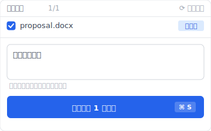
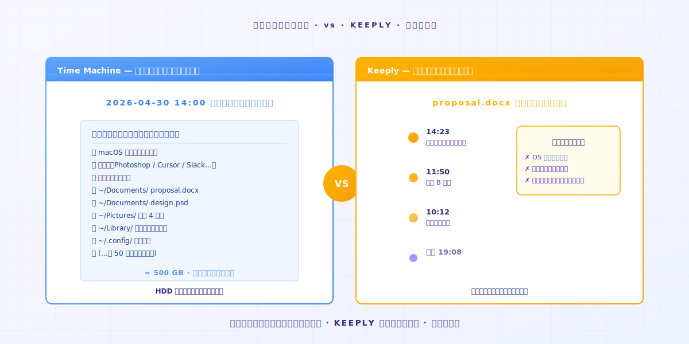
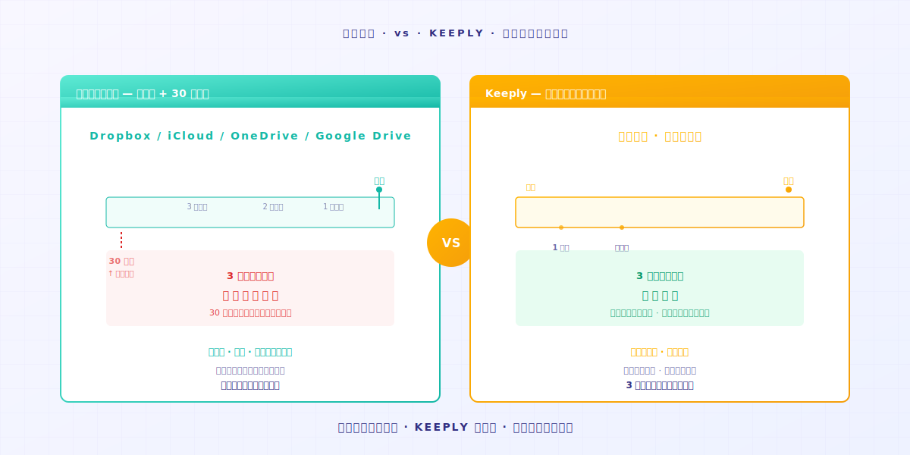
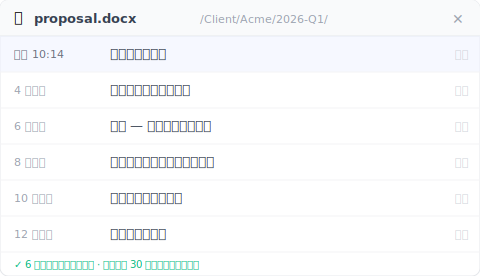

# 【2026 ファイル管理】Keeply は何を保存する？バックアップ・クラウドとの違い

> バックアップはディスク全体を守る。クラウドは最新版を守る。Keeply は変更ごとの履歴を守る。三つは別物です。

## 目次

1. [Keeply は何を保存する？](#what-keeply-saves)
2. [バックアップツールは何を保存する？](#what-backup-saves)
3. [クラウドツールは何を保存する？](#what-cloud-saves)
4. [いくつ必要？](#how-many-do-you-need)

---

A さんが Keeply をインストールしたばかり。同僚の B さんが通りかかって聞きます。「これって Mac に最初から入っている Time Machine と違うの？」

A さんは詰まります。違うのは分かっている。でも、どこが違うのか言葉にできない。

違いはこうです。**バックアップ、クラウド、Keeply は三つの別物**。仕事が重ならないから、名前が三つに分かれています。

---

## Keeply は何を保存する？ {#what-keeply-saves}

Keeply が保存するのは**ファイル一つ一つの、あなたが残したバージョンの内容**です。

今日 `proposal.docx` のバージョンを 2 回保存したら、2 回分が記録されます。タイムラインに 2 件のファイルノートが並ぶ。最初に保存した版に戻したいときは、その 1 件をクリック。30 秒で戻ります。

「版を保存」を手動で押すと、ダイアログが開いて 1 行メモを添えられます。「会議後に追加」「クライアント確認版」など、半年後の自分が読んで分かる言葉で残せます：

他人の Google Doc は保存しません。パソコンのアプリ設定も保存しません。**あなたのパソコンにあるファイル一つ一つが、時間とともにどう変わったか**だけを保存します。

「先週の木曜に修正する前の版に戻したい」というのが目的なら、これがその仕事です。

---

## バックアップツールは何を保存する？ {#what-backup-saves}

Time Machine、Acronis True Image、Backblaze、こうしたツールが保存するのは**ある時点のディスク全体のスナップショット**です。

仕事は 1 ファイルを救うことではありません。保存しているのは「**その日、私のパソコン全体がどんな状態だったか**」。OS、アプリ、設定、すべてのフォルダ、まとめて全部です。

ハードディスクが壊れた、パソコンが丸ごと無くなった、そんなときバックアップは全部を復元できます。**これが本当の存在理由です**。

ただし `proposal.docx` の木曜 10:23 の修正前の版だけを取り出したいなら、バックアップでもできますが、まずスナップショット全体を復元してからその 1 ファイルを探すことになります。**それは設計上の想定外です**。

---

## クラウドツールは何を保存する？ {#what-cloud-saves}

Dropbox、iCloud、OneDrive、Google Drive、こうしたツールが保存するのは**ファイルの最新版と、マルチデバイス同期**です。

A のパソコンでファイルを修正したら、B のパソコンが自動で最新版を取りに行く。**仕事は「最新版」をすべての端末に同期させること**です。

バージョン履歴もあります。でもたいてい**保持は 30 日だけ**。Dropbox の標準プラン、Google Drive、OneDrive、すべてこのルールです。それを過ぎたら消えます。

「どのパソコンでも最新版が取れる」が目的なら、これがその仕事です。でも 3 ヶ月前の版は、クラウドには大抵もう残っていません。

Keeply には残っています。3 ヶ月前のあの版は、ファイル履歴パネルにそのまま並んでいて、保存したときに書いたメモも一緒に見えます：

---

## いくつ必要？ {#how-many-do-you-need}

| あなたのシーン | 主に使うツール |
|---|---|
| あるファイルの古い版に戻したい | **Keeply**（履歴タイムラインからクリックで復元） |
| パソコンが壊れてデータを救いたい | **バックアップ**（Time Machine / Acronis / Backblaze） |
| 複数の端末で最新版を同期したい | **クラウド**（Dropbox / iCloud / OneDrive） |

実際には**三つとも使うのが一番揃います**。

Keeply はファイル一つ一つの履歴を守る。バックアップはパソコン全体のスナップショットを守る。クラウドはマルチデバイス同期を守る。三つは補い合うもので、奪い合うものではありません。

数ヶ月にわたる 1 ファイルのタイムラインはこんな見え方になります。手書きメモ付きの版が、自動保存された版と並んで残っています：

一つだけ選ぶなら、**自分が一番よく出会うシーンで決める**。古い版を探すことが多い？Keeply。ハードディスクが壊れるのが怖い？バックアップ。複数のパソコンで作業する？クラウド。

---

## 締め

A さんが B さんに返した答えに戻ります。

「Time Machine とは違う。Time Machine はパソコン全体のスナップショットを守ってる。Keeply はファイル一つ一つの履歴を守ってる。**自分は両方使ってるよ**。」

あなたもその履歴タイムラインを Keeply に守らせてみたいなら、フォルダを [Keeply](https://keeply.work/) にドラッグして入れるだけ。あとは自分で記録します。

---

## 関連記事

- [ファイルノートツール Keeply の使い方：30 個の機能を覚えなくても、2 つの動作で身につく](/ja/post/keeply-getting-started-from-zero/)（PILLAR 3、Keeply 全体の入門ガイド）
- [ファイルバージョン管理 完全ガイド](/ja/post/file-version-management-complete-guide/)（PILLAR 1、バージョン管理がなぜ大切か）

---

> 著者について：Ting-Wei Tsao、Keeply 創業者。
> [LinkedIn](https://www.linkedin.com/in/ting-wei-tsao-b57480152/)
