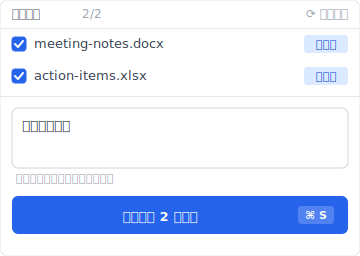
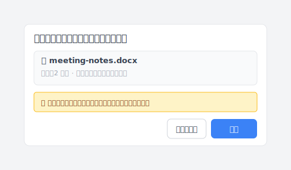

# 【2026 ファイル管理】バックアップしてる、と思ってる。「バックアップ」は Windows では 3 種類ある

> Windows の「バックアップ」と呼ばれる機能は 3 つある。互換性はない。あなたはたぶん 1 つだけ動かしている。

ノート PC を手に入れた時、ファイル履歴を設定した。守られているように感じた。3 か月後、文書を間違えた版で上書きしてしまい、昨日の版を探す。

ダイアログが開く。先週火曜日の版を提示してくる。欲しかったのはそれじゃない。

「バックアップ」を 1 つのものだと思っていた。実は 3 つで、動かしていたのはこの状況に合わない方だった。

## Windows が「バックアップ」と言うとき何を意味しているか

Microsoft が Windows に搭載している「バックアップ」と呼ばれる機能は 3 つある。同じものではない。

| 機能 | 実体 | 何のための仕事 |
|---|---|---|
| **ファイル履歴** | ユーザーフォルダをスケジュールで外部ドライブに同期 | 文書の古い版を取り戻す(時間単位) |
| **Windows バックアップ**(バックアップと復元) | 特定時点のシステムイメージ | ディスク障害・システム破損後の全機復旧 |
| **バージョン履歴**(OneDrive / クラウド同期) | クラウドのファイル別保存履歴 | 保持期間内に個別ファイルの変更を遡る |

3 つの違う形、3 つの違う仕事。共通するのは「バックアップ」という単語だけ——だから 1 つ動かして他もカバーされていると勘違いする人が多い。

## 3 つの違う保護軸

3 つの保護軸として見ると分かりやすい。

**第 1 軸：ディスク / システムレベル**。ドライブが死んだり Windows が起動しない時、必要なのはシステムイメージ——既知の良好な状態に復元できる全機。Windows バックアップがこれをする。ファイル履歴はしない。OneDrive もしない。

**第 2 軸：フォルダレベル × 時間軸**。フォルダはまだあって、今月のある日のコピーが欲しい時、必要なのはスケジュールフォルダスナップショット。ファイル履歴がこれをする。Windows バックアップは粗すぎる(全機イメージで、フォルダの版ではない)。OneDrive は同期されたファイルに対してできるが、プラン保持期間に上限がある。

**第 3 軸：保存ごとのイベント**。昨日 14:47 に Cmd+S を押したそのバージョン——式を壊す前のあれ——が欲しい時、必要なのは per-save 保存イベント版。ファイル履歴、Windows バックアップ、OneDrive のどれもこれをきれいにやらない。ファイル履歴は最も近いスケジュールスナップショットを返す(数時間ずれ、ドライブが切断されていれば数日ずれることも)。OneDrive バージョン履歴はクラウド同期ファイルに対しては可能だが、保持ウィンドウに限定。Windows には既定で general per-save レイヤーがない。

パターン:各ツールは 1 つの軸に答え、他の 2 つで苦戦し、第 3 軸は Microsoft 内蔵の何でも基本的に対処していない。

## それぞれが具体的に救うもの

具体的なシナリオを 3 つの Windows ツールにマッピング:

| シナリオ | ファイル履歴 | Windows バックアップ | OneDrive バージョン履歴 |
|---|---|---|---|
| SSD が物理的に壊れる | ❌ | ✅ | ✅ 同期済みファイル |
| Windows が起動しない | ❌ | ✅ | ❌ システム状態なし |
| ランサムウェアが全ディスク暗号化 | ⚠️ ドライブオフラインなら救える | ✅ イメージオフラインなら救える | ⚠️ 同期タイミングによる |
| Word を上書きして昨日の版が欲しい | ⚠️ [直近のスケジュールスナップ](https://support.microsoft.com/ja-jp/windows/backup-and-restore-with-file-history-7bf065bf-f1ea-0a78-c1cf-7dcf51cc8bfc)(ドライブ接続時) | ❌ 粗すぎる | ✅ クラウドファイルで[保持期間内](https://learn.microsoft.com/ja-jp/sharepoint/document-library-version-history-limits)なら |
| 3 か月前の版が欲しい | ⚠️ その日ファイル履歴稼働 + ドライブ接続中の時のみ | ❌ イメージはファイル版ではない | ❌ 通常保持期間外 |
| 2 週間前にうっかり削除 | ✅ watched フォルダにあれば | ✅ イメージにあれば | ✅ [30 日のごみ箱](https://learn.microsoft.com/ja-jp/sharepoint/retention-and-deletion) |

1 つだけ知っていると見えないこと:

- **ファイル履歴のみ稼働**:「昨日の下書き」シナリオはカバー(大体)、ドライブ故障と Windows 破損は無防備。
- **Windows バックアップのみ稼働**:大災害級故障はカバー、日常の上書きと編集ミスは無防備。
- **OneDrive のみ**:同期されたファイル + 保持期間内はカバー、ローカルのみのファイル、保持期間切れ、全機復元は全て無防備。

クラウド retention の側面は [iCloud vs Dropbox のバージョン履歴の崖](/ja/post/cloud-version-history-cliff/) で詳しく扱っている;本記事は Windows ネイティブ側。

## Windows が既定で出荷しない第 4 軸

表をもう一度見ると、右下の「意図的に保存したその版」のセルにきれいなチェックマークがない。

ファイル履歴はスケジュールスナップショットを返す——あなたの保存ではない。Windows バックアップはディスクを返す——ファイルではない。OneDrive はクラウド履歴を返す——でもクラウド同期ファイルと保持ウィンドウ内のみ。

**保存ごとに 1 つの独立した取り戻せる点、ローカル、時間 上限 なしのバージョン履歴レイヤー**——これが欠けている軸。

[Keeply](https://keeply.work) はこの層の 1 つの実装。指定したフォルダを watch し、保存ごとを 1 つのバージョンとして捕捉、スケジュールなし、保持期間 上限 なし。昨日 14:47 の下書きを取り戻す——最も近いスケジュールスナップショットではなく。

会議のあと「版を保存」を押すと、ダイアログが開いて「会議後に結論を追加」のような 1 行メモを添えて保存できます：

半年後にタイムラインを開くと、1 つ 1 つの保存が独立した行として並んでいます——背景の自動保存と、保存時に書いたメモ付きの手動版が一緒に：

特定の版を復元するときも、Windows エクスプローラーの「以前のバージョン」タブよりずっと直接的——メモのプレビュー、ソースのタイムスタンプ、入れ替え前の自動スナップショット保険：

ファイル履歴や Windows バックアップの代替ではない——それらは引き続き各自の軸をカバー。Keeply は Windows が出荷しない軸を追加する層。

Cluster sibling:[Windows ファイル履歴に昨日の下書きを頼んだら、2019 年のファイルが返ってきた](/ja/post/windows-file-history-wrong-version/) はこの第 4 軸メカニズムギャップの具体シナリオ版。

## この記事が当てはまらない時

3-axis フレームが効かない場面いくつか:

**企業 IT 管理環境にいる場合**。IT が SCCM、Veeam、または他の中央集中バックアップを走らせている。3 軸は policy で決まる、あなたではない。個人レイヤーを足す前に IT に確認。

**Windows Home ユーザー + 外部ドライブなし**。ファイル履歴は外部ドライブまたはネットワーク場所を要求。なければ動いているのは OneDrive(ログインしていれば)のみ。外部ドライブを買うか、1 軸だけと受け入れる。

**コンプライアンス対応の不変アーカイブが必要な場合**。本記事のバックアップはコンプライアンスアーカイブではない。SOX / HIPAA / GDPR retention には正規のアーカイブツール(Veeam / Acronis / 業界特化)が必要。3 軸フレームは日常 ワークフロー 保護で、規制対応ではない。

## 関連記事

ピラー [ファイルバージョン管理 完全ガイド](/ja/post/file-version-management-complete-guide/) はツールがファイル履歴を保持するように設計されていない 4 つの構造的理由を扱う——本記事の Windows 3 機能がこのように分かれている背景。

Sibling 記事:[Windows ファイル履歴に昨日の下書きを頼んだら、2019 年のファイルが返ってきた](/ja/post/windows-file-history-wrong-version/) は 1 つの具体的失敗シナリオを詳しく。

Mac 対応:[Time Machine vs Dropbox:backup、sync、そしてどちらでもない第三の軸](/ja/post/time-machine-vs-dropbox/) 同じ 3 軸フレーム、OS だけ違う。

---

「バックアップ」という言葉は 3 つの物事を 1 つのバケツに押し込む。1 つを設定して守られていると感じ、他の 2 つは静かに欠けている。3 か月後、見ていなかった軸で何かが故障する。

各軸で何を動かすか選ぶ。そして、どの軸を持っていないかを知る。

---

> 著者について:Ting-Wei Tsao、Keeply 創業者.
> [LinkedIn](https://www.linkedin.com/in/ting-wei-tsao-b57480152/)
