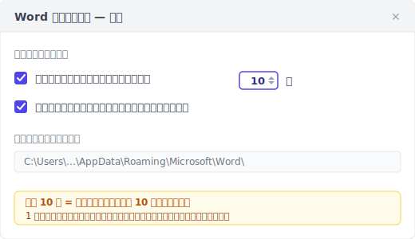
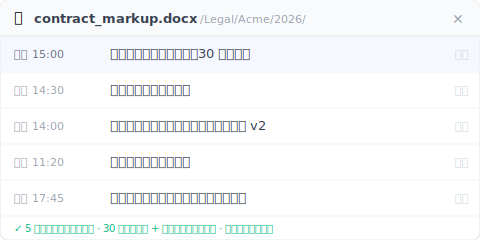

自動回復はクラッシュ救援であって、バージョン履歴ではありません。Word に入っているのは、クラッシュした一本を救う仕組みだけです。

> 金曜の午後 3 時。5 時の打ち合わせ用に、契約書のコメントを 90 分書いた。Word が固まり、3 分待って強制終了した。
>
> 開き直すと「ドキュメントの回復」作業ウィンドウが出てきた。期待してクリック。**中は空白だった**。
>
> 90 分の作業が消えた。クライアントは 5 時に読む。

運が悪かったのではありません。自動回復は、そもそもこのファイルを救うようには設計されていないのです。

以下の 5 つのケースは、Microsoft の公式ドキュメント、自動回復に裏切られた人たちの救援投稿、そして実際の仕組みから逆算したものです。どれも、あなたの直感とは違っています。

---

## ケース 1：一度も Ctrl+S を押していない {#case-1-never-saved}

新しい Word を開き、「白紙の文書」を選んで打ち始め、30 分後にクラッシュ。開き直すと「ドキュメントの回復」は空っぽ。

これはバグではありません。**自動回復が文書を追跡するには、その文書にファイル名とパスがある必要があります。** 一度も Ctrl+S を押していない = 名前がない = パスがない = 自動回復は一時ファイルをどこに書けばいいか分からない。

Microsoft の[公式説明](https://support.microsoft.com/ja-jp/office/office-%E3%83%95%E3%82%A1%E3%82%A4%E3%83%AB%E3%82%92%E5%9B%9E%E5%BE%A9%E3%81%99%E3%82%8B-dc01156a-be1c-43e6-b3f1-bd4a01a93cf9)にもはっきり書かれています。自動回復が .asd の一時保存を始めるには、そのファイルを一度は保存している必要があります。

新規作成 → 30 分書く → クラッシュ。この順番では、自動回復は一度も呼び出されていません。

> **身につけたい習慣**：新しい文書で最初にする操作は、いつも Ctrl+S → 名前を付ける → それから書き始める。30 秒の手間で、このカテゴリーまるごとを避けられます。

---

## ケース 2：Word が固まって、強制終了した {#case-2-force-quit}

冒頭の契約書コメントの場面です。Word は本当にクラッシュして回復ダイアログを出したわけではなく。固まって反応しなくなり、あなたが**自分で**強制終了した。

Word の自動回復は**既定で 10 分ごと**に .asd の一時ファイルを書きます。その 10 分の間、打った文字はメモリの中にあります。強制終了 = メモリの内容が .asd に書かれていない = .asd から救えるのは、最後にディスクに書かれた時点まで。

その「最後に書かれた時点」は 9 分前かもしれないし 1 分前かもしれない。10 分周期のどの位置にいたか次第です。最悪の場合：9:59 に大きな段落を書いて、10:00 に Word が固まると、その段落は .asd に入っていません。

この 10 分という既定値は、Microsoft が「ディスク書き込みの負担」と「データ損失のリスク」の間で取った妥協です。あなたにとっては、この 10 分の遅延 = 常に最大 10 分の作業がリスクにさらされているということ。

短くできます：ファイル → オプション → 保存 → 「次の間隔で自動回復用データを保存する」を 1 に。代償はディスク書き込みが増えること。古いノート PC では体感できるかもしれません。

> 自動回復が救うのは「たった今打った 8 分」ではなく「8 分前にディスクへ書かれた版」です。差は小さいけれど、生き残れるかどうかを分けます。

---

## ケース 3：「ドキュメントの回復」は出た。でも中は空白 {#case-3-blank-recovery}

これが一番こたえる種類です。Word は確かに「ドキュメントの回復」作業ウィンドウを出し、期待してクリックすると。**ファイルの中身が空**か文字化け。

仕組みのうえで何が起きたか：自動回復は現在の状態を .asd ファイルにまとめてディスクに書きますが、この処理には時間がかかります。途中で電源が切れたり、まとめている最中にプログラムが落ちたりすると。半分だけ書かれた .asd がディスクに残り、解析できません。Word は .asd の存在を見て回復ウィンドウを出しますが、開いたときに解析に失敗して、空白や文字化けになります。

Microsoft 自身のフォーラムにも同じ質問スレッドがあります：[「My recovered unsaved word document is entirely blank（回復した未保存の Word 文書が真っ白）」](https://learn.microsoft.com/en-us/answers/questions/5285105/my-recovered-unsaved-word-document-is-entirely-bla)。Microsoft の公式コミュニティでも質問が出ているのです。これは例外的な事故ではなく、よくあることです。

> 回復ウィンドウが出た = 救えた、ではありません。自動回復が約束しているのは「試みること」であって「保証」ではありません。

---

## ケース 4：別のパソコンで開いた {#case-4-cross-machine}

昨日オフィスのデスクトップで Word を書いた。今日は家のノート PC で開くと、先週土曜に手動保存した版までしか戻れない。**昨日の 8 時間ぶんの修正が消えている。**

自動回復の .asd ファイルはそのパソコンの中にあります：

- **Windows**：`%LocalAppData%\Microsoft\Office\UnsavedFiles` と `%AppData%\Microsoft\Word`
- **macOS**：`~/Library/Containers/com.microsoft.Word/Data/Library/Preferences/AutoRecovery`

**これらのパスは OneDrive にも Dropbox にも iCloud Drive にも自動同期されません。** 設計上、ローカルのキャッシュです。

「私の Word は OneDrive につないでいるのでは？」と思うかもしれません。そのとおりですが、OneDrive が同期するのは「ファイル本体」であって「自動回復の .asd 一時ファイル」ではありません。AutoSave を有効にしていても（Microsoft 365 のサブスクリプションと、OneDrive に置いたファイルが必要）、AutoSave はファイル本体をクラウドへ、自動回復はローカルに .asd を書く。**二つは並んで存在し、互いにやり取りしません。**

別のパソコンで開けば、新しいパソコンは古いパソコンの .asd を読めません。

> .asd は、自動回復がそのパソコン用に作ったローカルのメモです。海を渡りません。

---

## ケース 5：「保存しない」を押した {#case-5-dont-save}

Word を閉じるとき「変更を保存しますか?」のダイアログが出て、あなたは何も考えずに「保存しない」を押した。もう保存済みだと思い込んでいたから。3 秒後に、さっき大事な段落を直して保存していなかったことを思い出す。

「保存しない」を押すのはユーザーの能動的な操作です。Word は「ユーザーがこのセッションの変更を破棄すると明示的に選んだ」と判断します。**自動回復はそのファイルの .asd バッファをすぐに消すよう設計されています**。残せばユーザーの意思に反するからです。

英語の検索結果でこの件を 8 位に出しているのは、ドメインの評価が 41 しかない小さなサイト [integrisit.com/accidentally-clicked-dont-save](https://integrisit.com/accidentally-clicked-dont-save/) です。なぜそれほど評価の低いサイトが上位 10 に入るのか？それは、このケースが **Microsoft の公式ドキュメントでは触れられない**ものだから。「保存しないを押したのでバッファを即消した」と認めるのは、製品自身の説明とぶつかるのです。

> 「保存しない」は打ち間違いではありません。Word 内部の「破棄を確認 + バッファを即削除」という二重の指示です。

---

## もう一つの層：消えないバージョン履歴 {#keeply-fills-gap}

5 つのケースを通すと、自動回復は特定の設計でできた網だと分かります。「打っている最中 + 書き込みの合間 + Word が本当にクラッシュ」は受け止めるけれど、残りの 5 つは取りこぼす。共通点は、自動回復の一時保存が**使ったら消える**こと。正常終了で消え、保存しないで消え、強制終了では書き終わってすらいないかもしれない。

これを補うのは、**消されない層**です：どの版も完全に保存されたファイルで、永続的に残り、強制終了にも「保存しない」にも左右されない。それは二つの源から来ます。**バックグラウンドで 30 分ごとの自動スナップショット**と、**自分で押す「バージョン保存」ボタン + 一言メモ**でマイルストーンを刻む（たとえば「これがクライアント承認版」）。

5 つのケースをこの層に当ててみます：

| ケース | 自動回復 | 永続バージョン履歴（30 分自動 + 手動保存）|
|---|---|---|
| 1. 一度も保存していない | 基点なし = 記録なし | これも救えない。ファイルがディスクに無く、この層からは見えない（下記の限界へ）|
| 2. 強制終了 | バッファが空白か途中書き | 直近の自動スナップショットか手動保存版が完全に開ける（最大 30 分は失うが、戻るのは空白でなく完全なファイル）|
| 3. 回復ウィンドウが空白 | バッファ途中書きで破損 | どの版も完全な保存スナップショットで、半分バッファではない |
| 4. 別のパソコン | ローカル .asd が同期しない | 版はクラウドに同期、別マシンでも開ける |
| 5. 保存しないを押した | バッファ即消し | 直近の自動スナップショット/手動保存は書き込み済み。保存しないはその後の未保存分だけを捨てる |

Keeply はこの層の一つの実装です。インストールすると Word のフォルダーを監視し、バックグラウンドで 30 分ごとに 1 版を記録します。いつでも「バージョン保存」を押せば、メモを添えてその場で 1 版を記録できます。バージョンサイドバーで各版のタイムスタンプを見て、どれでもワンクリックで戻せます。

**ポイントは「より頻繁」ではありません**。30 分は自動回復の 10 分より粗い。ポイントは**永続 + 完全に開ける + 強制終了にも保存しないにも左右されない**こと。自動回復は「打っている最中 + 次の記録の前 + 突然クラッシュ」という狭い窓ではより新しい内容を保持しているかもしれないので、Keeply は自動回復を**置き換えません**。その下にもう一層、足すものです。

---

## Keeply でも救えない 3 つのケース {#limits}

限界をはっきりさせておきます：

**1. 一度もディスクに保存していないファイルは、Keeply も救えません。** Keeply が監視するのはディスク上のフォルダー。ファイルは一度保存され、そのフォルダーに書かれていて初めて、Keeply に見え、版を記録できます。一度も保存していない新規文書は、自動回復と同じく Keeply にも見えません。だから先ほどの習慣。新規文書で最初に保存して名前を付ける。は両方に効きます。

**2. 破損した .docx は、Keeply も直前の健全な版までしか戻せません。** スナップショットや手動保存が記録した時点でファイル自体がすでに破損していたら（まれですが起こります）、Keeply が記録したのはその破損版です。履歴だけで健全な状態には戻れず、もっと前の無事な版に戻す必要があります。

**3. 同期していない別マシンのファイルは、そのマシンに残ります。** Keeply は版をローカルの保管庫に書き、クラウド同期は別の段階です。ノート PC でネットが切れたまま 8 時間書いて同期しなかったら、デスクトップではその 8 時間は見えません。Keeply の不具合ではなく、同期がまだ完了していないだけです。

この 3 つは、自動回復の 5 つのケースより明快で、検証できます。「保存したか」「ファイルが壊れていないか」「ネットが切れていないか」は、仕組みを逆算しなくても分かります。

---

## Keeply が要らない 3 つの Word の場面 {#when-not-needed}

誰もがこの層を必要とするわけではありません。

**1. 短い作業（10 分未満の返信やメモ）。** 自動回復の 10 分間隔も来ていないし、Keeply の次のスナップショットも来ていない。軽い作業なら内蔵機能で十分です。

**2. すでに 5 分ごとに保存する習慣 + ファイルは OneDrive。** OneDrive の 25 版 / 30 日保持に、あなたの高頻度の保存が加われば、もうバージョン履歴の層に近い。Keeply が効くのは 30 日より前にさかのぼりたいとき。たとえば 3 か月後にクライアントが「あの v2 はまだある?」と聞いてきたとき。

**3. 会社が SharePoint + バージョン履歴を導入済み。** SharePoint は版を長く保持し、管理者の統制と監査証跡があります。個人向けの Keeply は置き換えではなく補完。あなたは SharePoint を使い続けます。

Keeply は、5 つのケースのどれかに噛まれて、もう噛まれたくない個人のためのものです。噛まれたことがない人や、会社がすでに手を打っている人は、今のままで問題ありません。

---

## よくある質問 {#faq}

**Q1. Keeply を Word のフォルダーに入れたら、自動回復とぶつかりますか？**

ぶつかりません。別の層です。Keeply が見るのはディスク上の .docx（あなたがそのフォルダーに一度保存した後）で、30 分ごとにスナップショットを取ります。自動回復は `%LocalAppData%` に自分の .asd を書きます。互いの保存先には触れません。

**Q2. Word の自動回復の間隔を 1 分にできますか？**

できます。ファイル → オプション → 保存 → 「次の間隔で自動回復用データを保存する」を 1 に。間隔が短いほどクラッシュ後に救える内容は新しくなりますが、ディスク書き込みが増え、古いノート PC では体感するかもしれません。ただしこれはクラッシュ救援のまま。正常終了や保存しないでは消えます。クラッシュにも保存しないにも残る永続バージョン履歴が欲しいなら、それは別の道です：Keeply のように、バックグラウンドで 30 分ごとのスナップショット + 手動のバージョン保存ボタン、自動回復の間隔とは独立に動くもの。

**Q3. Word を正常に閉じると、なぜ「ドキュメントの回復」が出ないのですか？**

正常終了 = クラッシュなし = 自動回復は「ユーザーは保存済み」と判断 = .asd バッファを消すからです。次に開いたとき、回復するものは残っていません。これは設計：自動回復は「異常終了」の場面でのみ .asd を保持します。

**Q4. OneDrive の AutoSave は自動回復の代わりになりますか？**

なりません。AutoSave はファイル本体をクラウドへ同期し（Microsoft 365 のサブスクリプションと OneDrive 上のファイルが必要）、自動回復はローカルに .asd バッファを書きます。AutoSave が解くのは「端末をまたいだリアルタイム同期」、自動回復が解くのは「クラッシュ直前の数分」。二つは並存して、やり取りしません。その下にさらに第三の層を足せます：永続バージョン履歴（Keeply など）、バックグラウンドで 30 分ごとの自動 + 手動保存、クラウド同期の状態とは独立。

**Q5. 一度も保存していない、削除した Word ファイルを Keeply は救えますか？**

救えません。Keeply の起点は、ファイルがディスクに最初に保存されたとき（あなたが保存して名前を付ける）。習慣にしましょう：新規文書 → まず保存して名前を付ける → それから書く。ファイルが Keeply の監視フォルダーに入れば、バックグラウンドで 30 分ごとに記録し、いつでも手動で「バージョン保存」を押せます。

---

## 関連記事

- [Excel のバージョン履歴が 1〜2 版しか戻らないのは Microsoft の設計、バグではない](/ja/post/excel-version-history-limits/)
- [上書き保存してしまった Word/Excel/PPT 。 復元の仕組みの断層](/ja/post/recover-overwritten-file/)
- [Photoshop の自動保存はクラッシュを救うが、上書きした版は救えない](/ja/post/photoshop-autosave-not-version-history/)
- [ファイルバージョン管理の完全ガイド](/ja/post/file-version-management-complete-guide/)

---

*文：[Ting-Wei Tsao](https://www.linkedin.com/in/ting-wei-tsao-b57480152/)。Keeply 創業者。エンジニアでない人のためのファイルバージョン管理ツールを作っています。*
