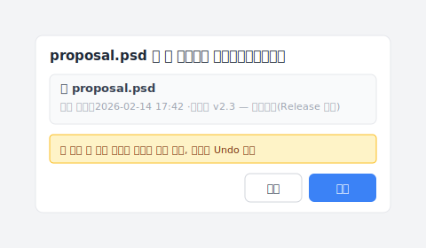

# 【2026 파일 관리】2026년, 3-2-1 백업이 다루지 못하는 것

> 3-2-1 규칙은 20 년 동안 변하지 않았습니다. 하지만 당신이 두려워하는 것은 변했습니다.

2005 년, 사진가 **Peter Krogh** 는 자신을 위해 백업 규칙을 만들었습니다. 사본 3 개, 미디어 2 종, 1 개는 다른 장소. 그가 막으려 한 것은 테이프 부식, 떨어뜨린 하드 디스크, 서버실 화재였습니다.

20 년이 지난 지금, 당신이 두려워하는 것은 **⌘+S 를 한 번 더 누르는 것** 입니다.

3-2-1 규칙은 그대로입니다 — 하지만 당신의 고민은 바뀌었습니다.

## 핵심 정리

**3-2-1 백업 원칙** 은 필요합니다. 사본 3 개, 미디어 2 종, 오프사이트 1 개. 하드웨어 고장, 화재, 랜섬웨어 같은 재해는 막을 수 있습니다. 하지만 설계상 **조작 실수**는 처리하지 못합니다. 본인이 덮어쓰거나, 동료가 잘못된 버전을 편집하거나, 클라우드 동기화가 잘못된 버전을 세 곳에 복제하면 3-2-1 은 구할 수 없습니다. 이 글은 3-2-1 이 무엇을 막고, 무엇을 못 막는지, 그리고 그 빈틈은 무엇으로 메우는지 정리합니다.

## 목차

1. [3-2-1 규칙은 정확히 무엇인가?](#3-2-1-규칙은-정확히-무엇인가)
2. [3-2-1 이 막는 것과 못 막는 것](#3-2-1-이-막는-것과-못-막는-것)
3. [3-2-1 을 해도 왜 파일을 잃을까?](#3-2-1-을-해도-왜-파일을-잃을까)
4. [3-2-1 + 버전 기록, 한 도구로 가능할까?](#3-2-1--버전-기록-한-도구로-가능할까)
5. [자주 묻는 질문](#자주-묻는-질문)

---

## 3-2-1 규칙은 정확히 무엇인가?

**3-2-1 백업 규칙** 은 사본 3 개, 미디어 2 종, 오프사이트 1 개를 두는 백업 원칙입니다. 이 규칙은 Peter Krogh 가 2005 년 [《The DAM Book》](https://www.oreilly.com/library/view/the-dam-book/9780596008550/)（O'Reilly Media）에서 정했습니다([CISA 도 지금까지 3-2-1 을 표준 백업 권고로 제시합니다](https://www.cisa.gov/audiences/small-and-medium-businesses/secure-your-business/back-up-business-data)).

- **사본 3 개**: 원본과 백업 2 개
- **2 종의 저장 매체**: 예를 들어 로컬 드라이브 + 클라우드, 또는 NAS + 외장 SSD
- **1 개는 다른 위치**: 물리적으로 분리된 장소에 1 개

2005 년 당시 주류 매체는 테이프, CD/DVD, 기계식 HDD 였습니다. 고장률이 높고 매체 노화가 빠른 시대였죠. 규칙의 설계 의도는 분명합니다. **단일 하드웨어 고장, 매체 노화, 시설 재해 어느 것으로도 파일이 사라지지 않게 한다.**

{{IMAGE-1: 3-2-1 시각화 — 사본 3 개, 매체 2 종 아이콘, 1 개 오프사이트 화살표.}}

## 3-2-1 이 막는 것과 못 막는 것

3-2-1 이 막는 건 파일이 *사라지는* 시나리오 — 하드 디스크 고장, 사무실 화재, 랜섬웨어 암호화（[Sophos의 2024년 14개국 IT 리더 5,000명 조사에 따르면 지난 1년간 조직의 59%가 랜섬웨어 공격을 받았다](https://www.sophos.com/en-us/blog/the-state-of-ransomware-2024)） 같은 재해. 못 막는 건 파일은 있는데 내용이 틀린 시나리오 — 본인이 덮어씀, 동료가 공유 폴더에서 잘못 편집, 3 개월 전 그 버전을 다시 찾아야 함. 한눈에 펼쳐 보면:

그리고 이 두 번째 시나리오는 예외적인 경우가 아닙니다. [Handy Recovery의 2024년 데이터 손실 조사](https://www.handyrecovery.com/data-loss-statistics/)에서 컴퓨터 사용자 약 4 명 중 3 명이 중요한 데이터를 실수로 삭제한 적이 있다고 답했고, 실수로 인한 삭제가 하드웨어 고장을 제치고 데이터 손실의 가장 흔한 원인으로 꼽혔습니다. 3-2-1 은 그 모든 순간에 대해 아무 말도 하지 않습니다.

3-2-1 이 통하는지 보려면 「파일을 잃는」 시나리오를 펼쳐 봅니다.

| 시나리오 | 3-2-1 이 살리는가? | 이유 |
| --- | :---: | --- |
| 하드 디스크 고장 | ✅ | 사본 3 개가 다른 매체 |
| 사무실 화재 | ✅ | 1 개가 오프사이트 |
| 랜섬웨어 암호화 | ✅（오프사이트 분 무사） | 오프사이트 격리 |
| **본인이 덮어씀** | ❌ | 사본 3 개 전부가 새 버전으로 동기화 |
| **동료가 공유 폴더에서 잘못 편집** | ❌ | 위와 동일 |
| **3 개월 전 버전 필요** | ❌ | 3-2-1 은 버전 기록이 아님 |

그래요, 바로 여기가 답답한 부분입니다. 3-2-1 이 막는 건 「파일이 사라졌다」 입니다. 「파일은 있는데 내용이 틀렸다」 는 다루지 않습니다.

## 3-2-1 을 해도 왜 파일을 잃을까?

20 년 동안 아무도 분명히 말하지 않은 사각지대가 있습니다. **「사본 3 개」의 「3」은 공간 중복성이지, 시간 중복성이 아닙니다.**

2005 년에는 HDD 수명이 짧고 매체가 약했습니다. 여러 사본은 물리적 부식과 싸우기 위한 것. 「3」은 그 문제에 대한 합리적 답이었습니다.

2026 년에는 HDD 가 안정적이고（[Backblaze의 2024년 드라이브 보고서는 30 만 대 이상의 드라이브에서 연간 고장률을 1.57%로 집계했고, 이는 1 년 전 1.70%에서 떨어진 수치입니다](https://www.backblaze.com/blog/backblaze-drive-stats-for-2024/)） 클라우드 동기화도 즉시입니다. 그러면 「3」은 무엇이 될까요? 같은 실수가 실시간으로 3 곳에 복제되는 결과가 됩니다.

가장 자주 보이는 시나리오입니다.

A 씨는 디자이너입니다. 월요일 오전 10:32, 클라이언트가 3 개월 전에 승인한 제안 버전을 요청합니다. A 씨가 NAS 를 열어 보니 버전이 12 개, 클라우드 사본 3 개가 모두 「최신」을 가리킵니다.

그런데 A 씨가 원하는 건 최신이 아닙니다. 3 개월 전 그 버전입니다.

여기서 가장 힘든 점은, 백업이 끝난 뒤에야 「최신」이 원하는 게 아니라는 사실을 깨닫는다는 것입니다. 3-2-1 이 잘못된 버전을 충실히 세 번 보호해 준 셈입니다.

## 3-2-1 + 버전 기록, 한 도구로 가능할까?

가능합니다. [Keeply](https://keeply.work) 는 3-2-1 을 위치 계층으로 내장합니다.

- **로컬 워크 카피**: 당신 PC 의 작업 버전（3-2-1 의 「1 개」 에 해당）
- **정본（프로젝트 위치）**: NAS 또는 클라우드의 정본 보관처（「2 종 매체」 중 하나）
- **백업 위치**: 프로젝트 전체를 다른 물리 위치에 동기화（「1 개 오프사이트」）

여기에 저장할 때마다 자동으로 버전을 남기는 기록 기능과, 「릴리스」 동결 기능 — 어느 버전을 「이 버전을 클라이언트에게 보냈다」고 표시해 두면 이후 저장으로 덮어쓰이지 않는 스냅샷 — 이 더해집니다. 한 도구, 세 층의 보호입니다.

3 개월 뒤 클라이언트가 "2 월 14 일에 승인한 그 버전을 다시 보내 달라" 고 연락하면, 타임라인에서 그 버전을 골라 "복원" 을 누르기만 하면 됩니다:

"복원" 을 누르기 전에 Keeply 가 현재 버전을 새 스냅샷으로 자동 저장합니다 — 그래서 다른 버전을 잘못 골라도 바로 되돌릴 수 있습니다. "복원 자체가 버전화된다" 는 이 설계 덕분에 여러 번 확인할 필요가 없습니다. 3-2-1 의 어느 위치에서든 복원할 수 있습니다.

Keeply 는 백업 위치를 어디 둘지 정해 주지 않습니다. 로컬과 백업을 같은 사무실에 두면 화재 한 번으로 둘 다 잃습니다. 어떤 도구도 막지 못합니다. 「오프사이트」 원칙은 여전히 당신이 결정해야 합니다.

다만, 공간 중복성을 위한 도구와 시간 중복성을 위한 도구를 따로 두 개 쓸 필요는 없습니다. 한 Keeply 로 로컬에서 백업까지, 이 순간에서 지난주까지, 모두 보이고 모두 되찾을 수 있습니다.

{{IMAGE-2: 3 층 보호 시각화 — 위치 층（로컬 + 정본 + 백업）、시간 층（버전 기록）、동결 층（릴리스 용도 분류）.}}

## 자주 묻는 질문

**Q1: 3-2-1 백업 원칙이 정확히 무엇인가요?**

3-2-1 은 Peter Krogh 가 2005 년에 정한 백업 규칙입니다. 사본 3 개, 저장 매체 2 종, 오프사이트 1 개. 단일 하드웨어 고장, 매체 노화, 시설 재해 어느 것으로도 파일이 완전히 사라지지 않도록 설계되었습니다. 단, 이것은 공간 이중화입니다 — 잘못된 버전 하나가 있으면 3-2-1 이 그 잘못된 버전을 충실히 3 곳에 복사합니다.

**Q2: 3-2-1 백업 원칙이 막는 것과 못 막는 것은?**

3-2-1 은 하드 디스크 손상, 사무실 화재, 랜섬웨어 암호화를 막습니다. 하지만 조작 실수는 막지 못합니다. 본인이 버전을 덮어쓰거나, 동료가 공유 폴더에서 잘못 편집하거나, 클라우드 동기화가 잘못된 버전을 세 곳에 전파해도 3-2-1 은 구할 수 없습니다. 이 계층을 구하려면 Keeply 같은 버전 히스토리 도구가 필요합니다.

**Q3: 3-2-1 백업을 해도 왜 파일을 잃는 건가요?**

3-2-1 의 「사본 3 개」는 공간 이중화이지 시간 이중화가 아닙니다. 2026 년 클라우드 실시간 동기화 환경에서는 「3」이 동일한 오류가 3 곳에 즉시 복제되는 것으로 바뀝니다. 사본 여러 개 이상으로, 시간 기준으로 되돌아갈 수 있는 버전 히스토리가 필요합니다.

**Q4: 클라우드 백업은 3-2-1 의 「오프사이트」에 해당하나요?**

해당합니다. 다만 iCloud、OneDrive、Google Drive 는 동기화이지 백업이 아닙니다. 로컬에서 삭제하거나 덮어쓰면 클라우드에도 즉시 같은 변경이 반영되어 조작 실수를 막지 못합니다. 오프사이트 요건은 물리적 격리 문제를 해결할 뿐, 버전 히스토리는 별도의 계층 요구사항입니다.

**Q5: NAS 는 2 종 매체에 들어가나요?**

NAS 와 로컬 HDD 로 2 종 매체로 셀 수 있습니다. 다만 RAID 는 백업이 아닙니다. RAID 는 HDD 고장을 막지, 잘못 지운 파일을 막지는 않습니다.

**Q6: 3-2-1 규칙과 4-2-1-1-0 규칙의 차이는?**

4-2-1-1-0 은 3-2-1 의 확장입니다. 변경 불가 백업 1 개를 더하고, 검증 오류 0 개를 목표로 합니다. 본질은 여전히 공간 중복성이며, 버전 기록 문제는 해결하지 못합니다.

**Q7: 개인 작업자도 3-2-1 백업 원칙이 필요한가요?**

파일의 중요도에 따라 다릅니다. 판단 기준은 하나뿐입니다. 잃으면 아픈가요? 개인인지 기업인지는 무관합니다. 아프다면 필요합니다. 3-2-1 은 필요하지만 충분하지 않은 기반이며, 조작 실수 시나리오에 대응하려면 버전 히스토리와 함께 써야 합니다.

**Q8: Keeply 는 이미 3-2-1 인가요?**

네. Keeply 는 3-2-1 을 위치 계층（로컬 워크 카피 + 정본 + 백업 위치）으로 내장하고, 버전 기록과 「릴리스」 동결 기능（어느 버전을 마일스톤으로 표시해 이후 저장으로 덮어쓰지 못하게 함）을 더했습니다. 한 도구로 세 층을 동시에 처리합니다. ([비교: Keeply는 실제로 무엇을 백업 · 클라우드와 다르게 보관하는가.](/ko/post/what-keeply-saves-vs-backup-cloud/))

## 더 읽기

전체 그림은 [파일 버전 관리 완전 가이드](/ko/post/file-version-management-complete-guide/)에서 4 가지 구조적 이유로 풀어냅니다.

---

2005 년에 Peter Krogh 가 3-2-1 을 정했을 때, 그가 막으려 한 것은 바닥에 떨어지는 HDD 였습니다.

당신은 2005 년의 Peter Krogh 가 아닙니다. 당신이 두려워하는 건 ⌘+S 를 한 번 더 누르는 것입니다.

도구 두 개는 필요 없습니다 — 세 층을 동시에 다루는 하나면 충분합니다.

---

> 저자 소개: Ting-Wei Tsao, Keeply 창업자.
> [LinkedIn](https://www.linkedin.com/in/ting-wei-tsao-b57480152/)
