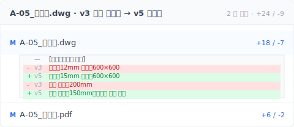

> 오전 9 시 40 분, 사무실에 들렀더니 소장이 지난주 목요일자 수정 도면을 꺼낸다. 뚜껑 규격이 바뀌었단다. 현장소장을 위한 도면 버전 관리 4 단계 실전: 작업자 습관을 바꾸지 않고, 작업 흐름도 바꾸지 않는다.

오전 9시 40분, 오랜만에 본사에 들른 김에 어제 현장에서 찍은 사진을 뒤에 있던 소장에게 넘겨 보여줍니다. 배수로 그 구간은 콘크리트가 이미 타설됐고, 뚜껑을 받칠 프레임도 전부 매립 위치까지 잡아뒀습니다.

소장은 말없이 책상 위의 `A-05_측구_0422_정식.dwg` 파일을 엽니다.

"뚜껑이 이 규격이 아닌데요. 설계에서 지난주 목요일에 또 바꿨어요."

가슴이 철렁합니다. 지난주 목요일 그 버전은 설계사무소가 본사로 보낸 파일이었고, 받은 사람은 이 대리였습니다. NAS에 잘 넣어두기만 했을 뿐 당신에게는 아무 말도 없었죠. 당신은 매일 현장에 있고 매번 본사로 돌아오지도 않으니, 이번 주 내내 버전이 바뀐 줄 아무도 알려준 적이 없었습니다.

현장 그 구간은 이미 양생이 끝났습니다. 뚜껑 치수가 바뀌면 매립된 구 프레임을 콘크리트 깨기로 뽑아내고, 신 규격 프레임을 새로 매립하고, 마감을 다시 치고, 다시 양생을 기다려야 합니다. 공기는 이틀 더 밀립니다.

당신이 작업자에게 엉뚱한 파일을 넘긴 게 아닙니다. **파일이 바뀌었다는 걸 몰랐을 뿐**입니다.

그리고 잘못된 버전으로 시공하는 일은 한 번으로 끝나는 경우가 드뭅니다. 여러 연구를 종합하면 [재시공 비용은 프로젝트 총원가의 약 5–10%에 달하고 — PlanRadar의 2023년 데이터는 이를 7.9%로 집계했습니다](https://www.planradar.com/us/cost-of-rework-construction/) — 그중에서도 「아무도 짚어주지 않은 개정본으로 지어버린 것」이 가장 피하기 쉬운 원인 중 하나입니다.

## 목차

- ["그거 지난주 목요일 새 버전 맞아요?"](#h2-1)
- [정식 버전 나오기 전에 수많은 안이 쌓이고, 설계가 다시 예전 안으로 돌아갑니다](#h2-2)
- [사무실은 알고 현장은 모릅니다](#h2-3)
- [도면 버전 관리 4 단계 실전: 사무실 + 현장 정렬](#h2-4)
- [필요 없는 사람은 딱 하나: 도면대로 시공하는 작업자뿐](#h2-5)

---

## "그거 지난주 목요일 새 버전 맞아요?" {#h2-1}

소장이 뭔가 이상하다 싶을 때 제일 자주 던지는 질문입니다.

노트북을 엽니다. NAS 프로젝트 폴더에는 `A-05_측구_0418.dwg`, `A-05_측구_0422_정식.dwg`, `A-05_측구_0422_정식_뚜껑수정.dwg`가 있습니다. 카카오톡 단톡방에 누가 올렸던 `A-05_측구_0420_우수관회피.dwg`도 있고요. 3월 초에 설계가 처음 넘긴 `A-05_측구_0315.dwg`도 지우지 않았습니다. 설계가 이것저것 고치다가 초기 안으로 다시 돌아가는 일이 종종 있거든요.

파일명 다섯 개. 이 중 하나가 지금 현장이 따라야 할 버전이라는 건 압니다. 그런데 **그게 어느 건지는 기억나지 않습니다**. 지난주에 현장에 꼬박 사흘을 붙어 있었고, 이번 주에 새 버전이 NAS에 들어올 때 당신은 자리에 없었습니다. 아무도 알려주지 않았죠. 본사의 이 대리는 "잘 넣어두기만 하면 되는 거 아닌가" 하는 마음이었던 겁니다.

당신이 게으른 것도, 이 대리가 악의가 있는 것도 아닙니다. **새 도면이 사무실에 들어오는 순간과 현장이 그 사실을 아는 순간 사이를, 누구도 잇지 않고 있는 것**뿐입니다. 그 끊어진 선 양쪽에 한 발씩 걸친 사람이 마침 당신입니다.

저 자신이 현장에 있던 그 몇 년 동안, 이 상황을 너무 많이 봤습니다. 새 버전이 사무실에 들어오고, 현장은 모릅니다. 늘 이어지지 않은 두 줄입니다.

---

## 정식 버전 나오기 전에 수많은 안이 쌓이고, 설계가 다시 예전 안으로 돌아갑니다 {#h2-2}

"그럼 본사 들를 때마다 매번 다시 대조하면 되지 않나요?" 이런 생각 드실 겁니다.

이론적으로는 맞습니다. 실무에서 어려운 이유는 **정식 버전이 확정되기 전까지 수정본이 계속 쌓이기 때문**입니다.

한 디테일이 초안부터 정식 승인까지 가는 동안 수많은 수정을 거칩니다. 발주처가 의견 한 번 내면 한 번 고치고, 현장 답사에서 장애물 발견되면 또 고치고, 기술사 검토에서 또 고칩니다. **그러다 설계가 5차까지 갔는데 발주처가 "사실 2차 때 마감이 더 나았네요" 하면 다시 돌아갑니다**. NAS에 파일 여섯 개가 보이는데 그중 두 개는 내용이 거의 같습니다. 하지만 지금 기준이 되는 게 어느 쪽인지는 알 수 없죠.

설계가 "완전히 확정"될 때까지 착공을 미루면 시공사는 공기에 깔려 죽습니다. 이 구간 뒤에 세 개 공종이 줄줄이 대기 중이라, 하루를 멈추면 인력, 장비, 여유 공기가 전부 타들어 갑니다. 그래서 시공사는 감수하고 **최신으로 받은 버전 기준으로 먼저 착수**합니다. 뒤에 더 큰 변경이 없기를 베팅하면서요.

대부분은 베팅이 맞습니다. 가끔 빗나가는 게 이번 주 이 측구 구간입니다.

---

## 사무실은 알고 현장은 모릅니다 {#h2-3}

진짜 끊어지는 지점은 여기입니다. **새 도면이 사무실에 도착해도, 현장은 듣지 못하고, 그 메시지를 끊어진 선 너머로 나르는 사람이 없습니다**.

사무실 쪽에서 메일을 받는 사람이 행정, 비서, 다른 소장일 수 있습니다. 파일이 들어오면 제일 먼저 하는 일은 "잘 정리해서 넣기"입니다. 폴더, 파일명, 보관. 이 사람은 현장이 이번 주 어디까지 진행했는지 정확히는 모르고, 이 수정이 지금 당장 알려야 할 수준인지 한눈에 판단할 수도 없습니다. 본인 기준으로는 **잘 넣어두면 끝**입니다.

현장 쪽에서 당신은 매일 현장에 있습니다. 매주 금요일 본사에 들러 대조를 한다 해도, 지난번 확인과 이번 확인 사이에 설계가 두 번 수정하고 한 번 예전으로 돌아왔을 수 있습니다. 찾으려면 찾을 수 있죠. 다만 **당신이 적극적으로, 매번 빠짐없이 확인하러 와야 합니다**. 모든 현장소장이 매번 그렇게 할 수 있는 건 아닙니다.

작업자 쪽에서는 당신이 마지막으로 넘긴 도면대로 시공합니다. 사무실에 새 버전이 있는지 없는지 모르고, 알 필요도 없습니다. 그분들의 책임은 도면대로 시공하는 것이지 버전을 추적하는 게 아닙니다.

이 세 개 선 가운데 **사무실과 현장 사이가 제일 자주 끊어집니다**. 누가 태만해서가 아니라 이 선이 반드시 열려 있어야 한다고 강제하는 장치가 없어서입니다. 카카오톡 단톡방에 올라간 "새 버전 업로드됐어요" 한 줄, 못 보고 지나가면 그걸로 끝입니다.

여기서 Keeply 가 할 수 있는 일은 두 도면을 바로 비교하는 것입니다 — AutoCAD 두 창을 열어 레이어를 눈으로 훑을 필요가 없습니다:



v3 와 v5 를 선택하면 Keeply 가 어느 레이어가 바뀌었고 어느 치수가 달라졌는지 나란히 보여줍니다. 덮개는 12mm 주철에서 15mm 로, 철근 간격은 200mm 에서 150mm 로 — 구조 기술사 재검토 후의 수정입니다. 30 초만에 현장에서 무엇을 바꿔야 할지 알 수 있고, 사무실에 다시 전화할 필요도 없습니다.

---

## 도면 버전 관리 4 단계 실전: 사무실 + 현장 정렬 {#h2-4}

할 일이 많지는 않습니다. 네 가지입니다. 내가 Keeply 를 만들기 전에도 설계사무소에서 같은 시나리오를 여러 번 봤습니다. 새 버전이 사무실로 들어오고, 현장은 모르고, 콘크리트는 잘못 타설됩니다. 아래 네 단계는 「아무도 넘겨주지 않은」그 끊긴 선을 메우는 최소한의 세트입니다.

**첫째, 새 버전이 사무실에 도착하는 그 순간 현장에 알리고, "받았습니다" 답을 받아내세요.** "잘 넣어뒀으니 됐다"가 아닙니다. **현장 담당자가 명확하게 "확인했습니다" 하고 답해야 핸드셰이크가 완성됩니다**. 카카오톡이든, 전화든, 문자든 상관없습니다. 규칙은 딱 하나. 현장이 글이나 말로 확인을 줘야 합니다. 확인이 없으면 인수인계가 끝난 게 아닙니다.

**둘째, 새 버전이 이전 버전을 덮어쓰기 전에 이전 버전을 따로 남겨두세요.** 파일명을 `A-05_측구_0418_설계_v3.dwg`, `A-05_측구_0422_설계_v4.dwg` 식으로 짓습니다. 이건 **설계가 예전 안으로 돌아가는 그 순간을 위해서**입니다. 나중에 3차가 원래 어떻게 생겼었는지 다시 꺼내볼 수 있어야 합니다.

**셋째, 도구가 모든 버전을 자동으로 기록하게 하고, 모두가 같이 볼 수 있게 해주세요.** 앞의 두 단계를 의지만으로는 다 해낼 수 없는 부분을 도구가 메워줍니다. [Keeply](https://keeply.work)가 딱 이 목적으로 만들어졌습니다. 저장할 때마다 버전 하나가 자동으로 기록되고, 파일은 원래 프로젝트 폴더에 그대로 있습니다. **같은 보관소(보통은 회사 NAS)를 모두가 열기만 하면, 모두가 같은 시간선을 봅니다**. 사무실이 새 파일을 넣는 그 순간, 현장에서 당신이 Keeply를 열면 시간선 맨 위에 "오늘 15:30 설계에서 또 수정함" 줄 하나가 올라와 있습니다.

실제 화면은 대략 이렇게 생겼습니다.

```text
A-05_측구.dwg
보관소: Z:\현장_XX로_외부구조\
─────────────────────────────────────────────

 버전 설명                            태그      시간
─────────────────────────────────────────────
 ●  뚜껑 규격 수정                              오늘
 ●  노후 우수관 회피                           04/20
 ●  발주처 검토 후 정식본              ⭐정식본  04/18
 ●  단면 조정                                   04/15

─────────────────────────────────────────────
 보관소 구성원 (공유 NAS)
   이 대리 (본사)  ·  당신 (현장)  ·  진 반장

   모두가 같은 폴더를 열면, 모두가 같은 시간선을 봅니다.
   새 버전이 들어오는 그 순간, 모두의 Keeply에 한 줄이 추가됩니다.
   버전 줄에 마우스를 올리면 → 한 번 클릭으로 그 버전으로 복원.
```

**호환성**: Keeply 는 바닥 층에서 기록하며, 회사가 이미 쓰고 있는 NAS, SharePoint, OneDrive Business, Synology, QNAP, 공유 네트워크 드라이브와 호환됩니다. 파일은 이사하지 않고, AutoCAD 는 바꾸지 않고, 작업자 작업 흐름도 바꾸지 않습니다.

내가 솔직히 말씀드리면, `.dwg` 도면 두 장의 선 하나하나를 비교하려면 여전히 AutoCAD를 열고 직접 대조해야 합니다. Keeply는 CAD 도면 차이 비교를 하지 않습니다. 다만 "새 버전이 들어왔는가, 누가 올렸는가, 언제인가, 당신이 봤는가" 이 네 가지는 더 이상 놓치지 않습니다. 소장이 "지난주 목요일 버전 봤어요?" 물을 때 시간선이 바로 답을 줍니다.

**넷째, 본사에도 있지 않고 현장 NAS에도 있지 않은 사본 한 부.** 외장 하드, 클라우드, 백업 디스크 뭐든 좋습니다. 핵심은 **오프사이트 사본이 최소 한 부**라는 것입니다([CISA 의 3-2-1 백업 원칙](https://www.cisa.gov/audiences/small-and-medium-businesses/secure-your-business/back-up-business-data): 3 부·2 매체·1 부 오프사이트). 회사 NAS는 고장 나고, 누가 싹 밀기도 하고, 다음 프로젝트 담당자가 덮어쓰기도 합니다. 오프사이트 백업은 당신이 자기 자신에게 사주는 가장 싼 보험입니다.

첫 단계까지는 규율만으로 버틸 수 있지만 솔직히 석 달만 지나면 절반은 빠집니다. 셋째 단계가 도구로 그 나머지 절반을 받아주는 자리입니다.

---

## 필요 없는 사람은 딱 하나: 도면대로 시공하는 작업자뿐 {#h2-5}

솔직하게 짚겠습니다. 이 글은 건설업 전체를 위한 글은 아닙니다. 다만 제외 명단은 여러분이 생각하는 것보다 훨씬 짧습니다.

**완전히 필요 없는 사람은 현장에서 도면대로 시공하는 작업자뿐입니다.** 그분들의 책임은 받은 도면대로 작업하는 것이지, 버전을 추적하는 게 아닙니다. 버전 추적은 당신 몫입니다.

**관급 공사일수록 오히려 더 필요합니다.** 대형 공공 프로젝트나 관급 공사는 "BIM 협업 플랫폼이 있으니 안 필요하겠지" 생각하실 수 있습니다. 반대입니다. 관급 공사는 민간 공사보다 문서량이 몇 배 많고, 설계 변경 신청이 몇 달에 걸쳐 오가고, 관리층 인사이동이 민간보다 잦고, 파일이 더 빨리 쌓이고, 기억이 더 쉽게 끊어집니다. BIM 플랫폼은 최종 납품물을 해결해 주지만, 계획서, 공용 파일, 설계도가 **과정 중에** 쌓아 올리는 변경 메모는 해결하지 못합니다. 그리고 매일 진짜로 자라나는 건 바로 그 과정 중의 파일들입니다.

**혼자 하는 소규모 프로젝트도 필요합니다.** "프로젝트 처음부터 끝까지 나 혼자 도맡는데 버전 관리가 필요한가?" 싶을 수 있습니다. 필요합니다. 석 달 뒤에 같은 파일을 다시 열면, **본인이 왜 그렇게 설계를 바꿨는지 본인이 까먹습니다**. 시간선에 남는 건 도면만이 아니라 매번 수정했을 그 순간의 이유입니다. 미래의 당신이 지금의 당신에게 고마워할 기록입니다.

그 밖의 모든 사람 — 중소규모 주거, 단독주택, 외부구조, 배수, 조경, 도로, 학교, 상업시설, 인테리어, 관급 공사, BIM 프로젝트, 프리랜서 설계, 설계사무소 — **본인 업무가 "이 파일이 고쳐지고, 나중에 다른 사람이나 미래의 당신이 다시 열어본다"에 해당한다면, 시간선이 필요합니다.** 그 선이 한 번 끊어질 때마다 시간과 돈이 당신 주머니에서 빠져나갑니다.

---

`.dwg` 한 장은 단순한 도면이 아닙니다. 설계의 결정, 사무실의 보관, 현장의 시공 — 이 세 가지가 **같은 버전 위에서 맞아야** 비로소 의미가 생기는 스냅샷입니다. 그런데 그 스냅샷은 계속 바뀌고, 계속 건네지고, 결국 엉뚱한 버전 위에서 시공되기 일쑤입니다.

모든 프로젝트에 자기만의 시간선 하나를 줄 가치가 있지 않을까요?

## 더 읽기

전체 그림은 [파일 버전 관리 완전 가이드](/ko/post/file-version-management-complete-guide/)에서 4 가지 구조적 이유로 풀어냅니다.

---

오전 9시 40분, 소장이 새 버전을 꺼냈고 당신의 가슴이 철렁 내려앉았던 그 순간이 기억나시나요? 더 이상 당신이 파일 관리자가 될 필요 없습니다. **Keeply, 당신의 파일 관리 수호신**. 매번의 수정, 매번의 정식본, 구 버전이 덮어쓰이기 직전의 그 모습까지 대신 기억해 드립니다. 버전 이력이 기존 프로젝트 폴더 안에서 살고, 도구를 바꿀 필요도, 작업자의 습관을 바꿀 필요도 없습니다. 건설 현장에 특히 잘 맞습니다. 사무실과 현장 사이의 그 끊어진 선은 모든 프로젝트마다 여러 번 끊어지거든요.

[Keeply 제대로 살펴보기 →](https://keeply.work)

---

> 저자 소개: Ting-Wei Tsao, Keeply 창업자.
> [LinkedIn](https://www.linkedin.com/in/ting-wei-tsao-b57480152/)
