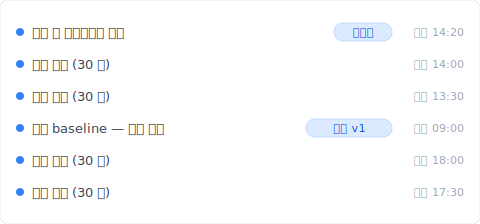
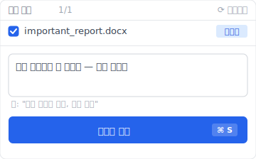

파일을 삭제하고 휴지통을 열었더니——'없다'.

"어? 분명 오른쪽 클릭으로 삭제했는데" 하고 당황하면서, Shift 키를 누르지는 않았는지, 용량을 초과하지 않았는지 떠올려 본다. 가슴이 천천히 가라앉는 느낌.

진정하시기 바랍니다. 대부분의 경우, 파일은 아직 디스크 위에 있습니다. '휴지통에서 사라졌다'와 '완전히 사라졌다'는 다른 이야기입니다. 문제는 Windows와 macOS와 OneDrive가 각각 다른 사양으로 '휴지통을 거치지 않는 삭제'를 일으킨다는 것. 원인만 짚어내면 되돌릴 확률은 꽤 높습니다.

다만 그 전에——절대로 해서는 안 되는 일이 4가지 있습니다. 먼저 아래 5가지 원인 중 어느 쪽에 해당하는지 확인한 다음, 복구 방법으로 진행해 주세요. 순서가 중요합니다.

## 삭제한 파일이 휴지통에 없는 5가지 원인

휴지통에 파일이 없는 이유는 대략 다음 5가지로 분류할 수 있습니다. 각각 다른 메커니즘으로 일어나니, 먼저 자신의 케이스를 특정하는 것이 복구의 첫걸음입니다.

만약 Keeply 같은 상시 버전 히스토리 도구가 백그라운드에서 돌고 있다면, 이 5가지 원인 중 어떤 것이 일어나도 파일의 과거 버전은 Keeply 타임라인에 그대로 남아 있습니다. 그래도 원인을 이해해 두면 다음 대처가 빠르게 결정됩니다.

### 1. Shift+Delete로 삭제했다 (Windows 표준 동작)

Windows에서는 `Shift` 키를 누르면서 `Delete`를 누르면 휴지통을 거치지 않고 파일이 바로 삭제됩니다. 실수로 Shift 키를 눌렀을 뿐이어도, 휴지통에는 흔적이 남지 않습니다.

이 경우에도 파일 본체는 디스크의 미할당 영역에 남아 있는 경우가 많아 복구 소프트웨어로 살릴 가능성이 있습니다. 다만 새 데이터가 그곳에 쓰이면 덮어써져 사라지므로, 후술하는 '복구 전에 해서는 안 되는 일'을 반드시 먼저 확인하세요.

### 2. 휴지통의 최대 용량을 초과해서 자동 삭제됐다

Windows 휴지통에는 '최대 용량' 설정이 있고, 기본값은 각 드라이브 용량의 약 5%가 할당되어 있습니다. 용량을 초과하면 오래된 것부터 자동으로 영구 삭제되므로, 큰 파일을 삭제한 직후에 다른 파일도 삭제하면 모르는 사이에 처음의 큰 파일이 영구 삭제될 수 있습니다.

휴지통의 최대 용량은 바탕화면에서 휴지통 오른쪽 클릭 → 속성에서 확인할 수 있습니다.

### 3. 네트워크 공유 드라이브나 USB에서 삭제했다

파일 서버, NAS, USB 메모리, SD 카드처럼 '로컬 C 드라이브 이외'에서 삭제한 파일은 Windows 휴지통에 들어가지 않습니다. 이건 Windows의 사양으로, 로컬 NTFS 드라이브 이외에서의 삭제는 '즉시 영구 삭제'가 됩니다.

이걸 모르고 사내 파일 서버에서 잘못 삭제한 다음 날 '휴지통을 봤는데 없다'고 알아차리는 경우는, 기업 IT 지원에서 가장 자주 받는 문의 중 하나입니다.

### 4. OneDrive·SharePoint에서 동기화 삭제됐다

OneDrive 또는 SharePoint로 동기화된 폴더에서 삭제한 파일은 로컬 휴지통에 들어가지 않고, OneDrive 클라우드 쪽 '휴지통'으로 이동합니다. 로컬 휴지통을 열어도 보이지 않는 것은 삭제가 클라우드 쪽으로 동기화됐기 때문입니다.

OneDrive 개인 버전의 휴지통 보존 기간은 30일, 비즈니스 버전(SharePoint)은 93일([Microsoft 공식 문서](https://learn.microsoft.com/ko-kr/sharepoint/retention-and-deletion)). 기간을 넘기면 자동으로 영구 삭제됩니다.

### 5. 휴지통의 보존 기간이 지났다

Windows 10 / 11의 '저장 공간 센스' 기능을 켜면, 휴지통 안의 파일이 30일 경과한 시점에 자동으로 영구 삭제됩니다. [Microsoft 공식 설명](https://support.microsoft.com/ko-kr/windows/manage-drive-space-with-storage-sense-654f6ada-7bfc-45e5-966b-e24aded96ad5)에 따르면 이 기능은 기본적으로는 꺼져 있지만, OEM 초기 설정이나 과거에 저장 공간을 정리하면서 켜 둔 PC도 적지 않습니다.

켜져 있는 경우, '1개월 전에 삭제한 파일'이 조용히 사라지게 됩니다. 켜져 있는지 확인하거나 끄려면 설정 앱 → 시스템 → 저장 공간 → 저장 공간 센스에서 할 수 있습니다.

## 【중요】 복구를 시도하기 전에 하면 안 되는 4가지

파일이 사라진 직후, 복구 소프트웨어를 바로 다운로드하고 싶은 마음은 압니다. 하지만 그 행동 자체가 복구 성공률을 떨어뜨릴 가능성이 있습니다. 다음 4가지는 원인을 특정하고 나서 대처 방법으로 진행하기 전에, 절대로 피하세요.

이 4가지 금지 사항은 '사전 백업이 전혀 없는' 전제로 만든 것입니다. Keeply 같은 상시 스냅샷이 돌고 있다면 삭제 전 버전이 이미 타임라인에 있으므로, 이 4가지가 주는 압박은 거의 느끼지 않습니다. 그래도 복구 소프트웨어에 의존해야 하는 상황을 대비해 알아 두세요.

### 1. 삭제 원본 드라이브에 새 데이터를 쓰지 않는다

파일 본체는 삭제 직후에 디스크의 미할당 영역에 남아 있습니다. 하지만 그 영역에 새 데이터가 쓰이면 덮어써져 완전히 사라집니다.

즉, 삭제 후 브라우저를 열고, 파일을 다운로드하고, 메일을 보내는 조작은 모두 어떤 새 쓰기를 발생시켜 복구하고 싶은 파일을 덮어쓸 가능성이 있습니다. 원인 확인 외에는 PC 조작을 최소한으로 줄이세요.

### 2. SSD에서는 TRIM으로 흔적이 사라졌을 수 있다

SSD에는 'TRIM'이라는 기능이 있어, 파일 삭제 시 OS가 '이 영역은 더 이상 쓰지 않는다'고 SSD에 통지해 내부에서 데이터를 물리적으로 정리하는 구조입니다. HDD에서는 삭제된 데이터의 본체가 남기 쉽지만, SSD에서는 TRIM이 실행된 후에는 복구 소프트웨어로도 살리기 어려운 경우가 많습니다.

SSD에서 Shift+Delete한 경우, 수 초~수 분 이내에 TRIM이 실행되는 경우가 많아 복구 난이도는 HDD보다 훨씬 높아집니다.

### 3. 복구 소프트웨어를 삭제 원본과 같은 드라이브에 설치하지 않는다

이건 초보자가 가장 자주 하는 실수입니다. 당황해서 복구 소프트웨어를 다운로드하고, 기본 설정 그대로 C 드라이브에 설치하면, 복구하고 싶었던 파일의 미할당 영역에 복구 소프트웨어 자체가 쓰여 덮어써져 버립니다.

복구 소프트웨어를 사용할 경우, 반드시 다른 USB 메모리나 휴대용 버전을 사용하거나 다른 드라이브에 설치하세요.

### 4. PC의 재부팅·초기화를 서두르지 않는다

'재부팅하면 고쳐질지도', '초기화하면 원래대로 돌아갈지도'라고 생각하기 쉽지만, 삭제된 파일에는 완전히 역효과입니다. 재부팅은 OS의 시스템 파일 쓰기를 발생시키고, 초기화는 해당 드라이브 전체에 새 데이터가 쓰입니다.

복구하고 싶은 파일이 있다면, 우선 PC를 최소한의 조작에 두고, 원인을 특정하고, 적절한 복구 방법을 선택한 다음에 움직이세요.

## 스스로 복구하는 4가지 방법

원인을 특정하고 위의 금지 사항을 이해한 위에서, 복구 방법으로 진행합니다. 당신의 상황에 따라 다음 4가지에서 순서대로 시도해 주세요.

아래 4가지는 모두 '사후에 되찾는' 접근으로, 사전에 해당 기능을 활성화해 두었다는 전제가 있습니다. 아무것도 설정하지 않았다면, 다음 섹션의 Keeply 사전 저장 접근이 더 현실적인 답일 수 있습니다.

### 1. Windows 파일 히스토리 (Windows 10 / 11)

Windows에는 '파일 히스토리'라는 표준 백업 기능이 있어, 사전에 활성화해 두었다면 특정 폴더(문서, 바탕화면, 사진 등)의 과거 버전을 복원할 수 있습니다.

파일 탐색기에서 해당 폴더를 열고, 리본 메뉴에서 '히스토리'를 클릭. 사전에 파일 히스토리가 활성화되어 있다면 과거 특정 시점의 폴더 상태로 되돌릴 수 있습니다.

주의점은 '사전에 활성화되어 있다면'입니다. 기본값은 비활성화되어 있어, 많은 사용자는 삭제하고 나서야 그 존재를 알게 됩니다. 앞으로의 예방으로 활성화해 두는 것을 추천합니다.

### 2. macOS Time Machine

Mac에는 'Time Machine'이라는 시계열 백업 기능이 있어, 외장 SSD나 네트워크 스토리지를 연결해 두면 자동으로 스냅샷이 만들어집니다.

메뉴 바에서 Time Machine 아이콘을 클릭 → 'Time Machine 시작'을 선택. 과거 시점의 폴더로 돌아가, 원하는 파일을 선택하고 '복원'을 클릭하면 현재 폴더로 복원됩니다.

Time Machine은 사전 설정과 스토리지 연결이 필요하므로, 바탕화면 작업만으로 외장 드라이브를 연결하지 않은 경우는 사용할 수 없습니다.

### 3. OneDrive 휴지통·버전 히스토리

파일이 OneDrive 또는 SharePoint 동기화 폴더에 있었던 경우, OneDrive 웹 버전에서 '휴지통'을 확인할 수 있습니다. OneDrive 개인 버전에서 30일 이내, SharePoint에서 93일 이내([Microsoft 공식 문서](https://learn.microsoft.com/ko-kr/sharepoint/retention-and-deletion))라면 삭제된 파일이 남아 있을 가능성이 높습니다.

OneDrive Web → 왼쪽 메뉴의 휴지통 → 해당 파일을 선택 → '복원'으로 원래 폴더로 돌아갑니다.

또한 파일 자체는 존재하지만 '내용이 손상된' 경우는 OneDrive의 '버전 히스토리'에서 과거 버전으로 되돌릴 수도 있습니다. 이건 [Microsoft Learn](https://learn.microsoft.com/ko-kr/sharepoint/document-library-version-history-limits)에 따르면 기본적으로 최대 500개 버전이 저장됩니다.

### 4. 복구 소프트웨어 (Recuva, Disk Drill 등)

위 3가지에 해당하지 않으면, 전용 복구 소프트웨어를 시도하게 됩니다. 대표적인 것은 [Recuva](https://www.ccleaner.com/recuva)(무료)와 [Disk Drill](https://www.cleverfiles.com/recover-deleted-files.html)(무료 체험판 있음).

다만 복구 소프트웨어의 성공률은 조건에 따라 크게 달라집니다:

- HDD에서 삭제 직후 → 70-90% 성공률
- SSD에서 TRIM 후 → 10-30%로 저하
- 파일 단편화된 경우 → 더욱 저하

복구 소프트웨어는 '최후의 수단'이며, 근본적으로 사라짐을 막는 구조는 아닙니다.

## 애초에 사라지지 않는 설계: 상시 버전 히스토리라는 선택지

여기까지 읽으면서 알아차렸을지도 모릅니다——복구 소프트웨어를 부르거나, 업체에 의뢰하거나, 복구 성공률을 올리기 위해 PC 조작을 멈추거나, 모두 '사후 대응'의 이야기입니다.

하지만 정말로 필요한 것은 '사전에 복사본이 만들어져 있는' 설계가 아닐까요.

Windows 파일 히스토리도 Time Machine도, 그 사상 자체는 옳습니다. 문제는 대부분의 사용자가 그것들의 존재를 알아차리지 못하고 있고, 알아차렸을 때는 삭제한 후라는 것입니다.

Keeply는 그 '알아차리지 못할 때 이미 복사본이 만들어져 있다'는 설계로 끝까지 밀어붙인 도구입니다.

구조는 단순합니다:

- 30분마다(15 / 60분에서 선택 가능), 선택한 폴더의 모든 파일을 자동으로 스냅샷 저장
- 임의의 시점에 수동으로 '저장' 버튼을 누르면, 그 순간의 스냅샷에 이름을 붙여 기록
- 삭제·덮어쓰기·손상이 일어나도, 과거의 타임라인에서 되돌릴 수 있음

'이 시점은 꼭 남겨두고 싶다' 싶을 때는 수동으로 스냅샷을 찍을 수도 있습니다.

즉, 휴지통에서 사라져도, Shift+Delete돼도, OneDrive 동기화로 삭제돼도——Keeply가 독립적으로 저장했던 버전은 무사합니다. 이건 '사후 복구'가 아닌 '사전 저장'의 사고방식입니다.

다만 Keeply로 해결할 수 없는 것도 있습니다:

- 물리적 손상(HDD의 자기 헤드 고장, SSD의 칩 고장)에는 대응하지 않습니다
- 그 경우에는 [a1d](https://www.a1d.co.jp/) 같은 데이터 복구 전문 업체가 필요합니다

Keeply는 '사용자 조작 기인(실수 삭제·실수 덮어쓰기·손상 저장)'의 사고를 커버하는 도구이며, '하드웨어 고장'은 사정거리 밖입니다. 이 선 긋기는 명확하게 해 둡니다.

## 자주 묻는 질문

### Q1. Keeply의 자동 저장으로 삭제된 파일도 되돌릴 수 있나요?

네, 가능합니다. Keeply는 30분(또는 15 / 60분)마다 지정한 폴더 안의 모든 파일을 타임라인에 저장합니다. 삭제된 파일은 '가장 최근 스냅샷'에서 복구 가능하며, 휴지통에 의존하지 않습니다. Windows·macOS 모두 동작합니다.

### Q2. Shift+Delete로 영구 삭제한 파일은 복구할 수 있나요?

Windows 설계상 휴지통을 거치지 않으므로 OS 기본 기능으로는 복구할 수 없습니다. File History나 Time Machine을 미리 활성화해 두었다면 과거 버전에서 복원 가능합니다. 그 외에는 복구 소프트웨어에 의존해야 하며, SSD는 TRIM 영향으로 성공률이 크게 떨어집니다. 사전에 Keeply 같은 상시 히스토리 도구를 가동해 두는 것이 안전합니다.

### Q3. 복구 소프트웨어는 안전한가요?

Recuva(CCleaner 계열)와 Disk Drill은 전 세계에서 널리 쓰이는 주요 도구로, 소프트웨어 자체는 안전합니다. 다만 삭제된 파일과 같은 드라이브에 설치하면 복구하고 싶은 파일을 덮어쓰는 문제가 생기므로 반드시 다른 드라이브나 USB 휴대용 버전에서 실행하세요.

### Q4. SSD가 HDD보다 복구 성공률이 낮다는 게 사실인가요?

사실입니다. SSD에는 TRIM이라는 기능이 있어, 파일 삭제 시 OS가 '이 영역은 더 이상 필요 없다'고 통지하면 SSD 내부에서 데이터를 물리적으로 정리합니다. HDD는 삭제된 데이터가 미할당 영역에 남기 쉬운 반면, SSD는 TRIM 후 복구가 거의 불가능합니다.

### Q5. 전문 업체에 의뢰하면 비용이 얼마인가요?

논리적 손상(실수 삭제 등)은 약 30만~100만 원, 물리적 손상(HDD 고장 등)은 약 100만~500만 원이 시세입니다. 완전 성공 보수제를 채택한 업체라면 복구하지 못한 경우 비용이 발생하지 않으니, 우선 무료 진단을 요청하는 것이 안전한 첫걸음입니다.

---

**작성자**: Ting-Wei Tsao｜Keeply 창업자
[LinkedIn](https://www.linkedin.com/in/ting-wei-tsao/)｜[Keeply](https://keeply.work/)

Keeply는 '파일 히스토리를 항상 남겨 두기 위한' 데스크탑 도구를 만들고 있습니다. 휴지통에 의존하지 않아도, Cmd+Z에 의존하지 않아도, 과거의 어떤 시점으로도 돌아갈 수 있는——그런 평범한 경험을, 모든 파일 작업자에게 전하고 싶습니다.

관련 글:

- [삭제된 파일이 보이지 않을 때: iOS와 Outlook에는 있고 Finder와 탐색기에는 없는 '최근 삭제된 항목' 목록](/ko/post/deleted-files-recovery-list/)
- [파일 버전 관리 완전 가이드: Mac, Windows, 클라우드의 차이부터 Keeply까지](/ko/post/file-version-management-complete-guide/)
