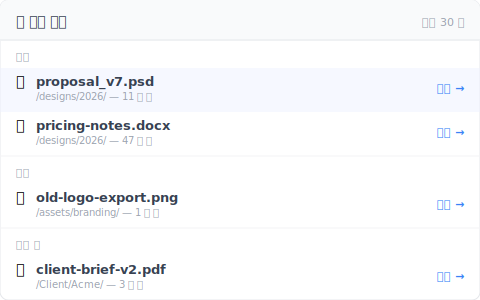

# 【2026 파일 관리】복구 소프트웨어가 아니라 「최근 삭제됨」 목록이 필요하다

> iOS 는 당신이 삭제한 것을 보여준다、Finder 는 보여주지 않는다. 정작 필요한 도구에서 빠진 패턴.

수요일 오전 11:14, 잘못된 중복 파일이라 생각하고 Delete 를 누른다. 2 분 뒤, 지운 것이 정작 맞는 파일이었음을 깨닫는다.

휴지통을 연다. 비어 있다. 지난 금요일에 비웠기 때문.

Google 에 「Mac 삭제한 파일 복구」 라고 검색. 첫 번째 결과: Disk Drill, $89 미화 일회성、SSD 포렌식 스캔 필요. 이미 「SSD 에서 포렌식 복구는 안전한가」 를 Google 하고 있다.

포렌식 도구가 필요한 게 아니다. 목록이 필요하다.

## 이미 이걸 하는 도구、안 하는 도구

iOS 사진에는 「최근 삭제됨」 앨범이 있다. iCloud Drive 에도. 메모에도. Outlook 에는 「삭제된 항목 복구」 가 있다. Gmail 에는 30 일 휴지통. Slack 조차 관리자가 복원할 수 있도록 삭제된 메시지를 90 일 보관한다.

그리고 표의 아래쪽 절반 — 당신이 실제로 작업하는 곳.

| 도구 | 「최근 삭제됨」 목록? |
|---|---|
| iOS 사진 | ✅ 30 일 앨범 |
| iCloud Drive | ✅ 「최근 삭제됨」 폴더 |
| 메모(iOS / macOS) | ✅ 30 일 폴더 |
| Outlook | ✅ 삭제된 항목 복구 |
| Gmail | ✅ 30 일 휴지통 |
| Slack | ✅ 90 일 관리자 복원 |
| **macOS Finder** | ⚠️ 휴지통 30 일、그러나 폴더별 목록 없음 |
| **Windows 파일 탐색기** | ⚠️ 휴지통만、비우면 사라짐 |
| **Dropbox 로컬 폴더** | ❌ 삭제 파일이 로컬 화면에서 사라짐 |
| **Google Drive 로컬 동기화** | ❌ Dropbox 와 동일 |
| **일반 버전 관리 도구** | ❌ 「기록 보기」를 거쳐야 함 |

아래쪽 절반의 도구가 정확히 당신의 진짜 작업이 저장되는 곳입니다. 위쪽 절반은 오히려 이 기능이 없어도 괜찮은 곳.

## 왜 이 패턴이 가장 필요한 곳에 빠져 있을까?

「최근 삭제됨」 affordance 는 **큐레이션된 콘텐츠 모델**을 가진 앱(사진、메모、이메일)에 존재합니다. 파일을 「파일시스템의 투명한 미러」로 다루는 도구에는 빠져 있습니다.

**큐레이션된 앱**(iOS 사진、Outlook、메모): 당신은 「파일을 관리」 하는 게 아니라 「콘텐츠와 상호작용」 하고 있습니다. 「최근 삭제됨」 은 콘텐츠 관리의 기본 요소 — 멘탈 모델이 그것을 요구하고、디자이너는 당연히 만들었습니다.

**파일시스템 미러**(Finder、파일 탐색기、Dropbox 로컬 동기화): 이것들은 **디스크 내용을 투명하게 반영**하도록 만들어졌습니다. 「최근 삭제됨」 보기를 추가하면 이 투명성 계약을 어깁니다 — 파일이 디스크에 없는데 왜 폴더가 표시할까요?

그 투명성의 대가: OS 수준 휴지통만 상속합니다. 비운 뒤、파일은 어디서든 사라진 것처럼 보입니다 — 버전 관리나 클라우드 동기화에 사본이 남아 있더라도. 복구 경로는 「타임라인 열기 → 날짜 찾기 → 파일 찾기 → 복원」 이 됩니다. 마찰이 크고、건너뛰기 쉽고、기본값으로 포렌식 도구에 의존하게 됩니다.

그래서 Disk Drill 의 가격 페이지에 도착합니다 — 포렌식 복구가 옳은 도구라서가 아니라、옳은 도구(그 목록)가 도구에 노출되지 않았기 때문.

## UI 가 노출하지 않은 그 30 초 복구 경로

도구가 「최근 삭제됨」 목록을 노출할 때、복구는 약 5 초. 노출하지 않을 때、복구는 5 분의 타임라인 파헤치기 또는 $89 미화와 2 시간의 포렌식 스캔 — 게다가 SSD 에서는 복구 보장 없음.

이 패턴을 잘 구현한 도구의 모습:

- **최상위에 노출** — 사이드바 입구나 메인 탭、3 번 클릭 깊이에 묻지 말 것
- **시간으로 그룹화** — 「오늘 / 어제 / 이번 주 / 그 이전」, 200 건의 평면 목록이 아니라
- **원래 경로 표시** — 이 파일은 어느 폴더에서 삭제됐나요? 「맞아、이거」 라고 확인하는 데 핵심
- **원클릭 복원** — 버전 선택 없음、3 단계 「정말입니까」 마법사 없음. 클릭 → 원래 경로로 복원
- **포렌식 불필요** — 이건 자신이 의도적으로 저장한 기록에서의 복구이지、raw 디스크 섹터에서의 복구가 아닙니다

[Keeply](https://keeply.work) 는 이것을 「🗑️ 삭제 목록」 패널로 구현: 추가한 프로젝트 안、지난 30 일 동안 삭제된 파일 목록、시간으로 그룹화、원래 폴더로 원클릭 복원. 복원이라는 동작 자체가 새 저장 시점을 만듭니다 — 그래서 undo 도 버전화되고、다시 undo 할 수 있습니다.

```
Keeply — 최근 삭제됨

오늘
─────────────────────────
🗑️ proposal_v7.psd       ◀ 11 분 전     /designs/2026/
🗑️ pricing-notes.docx    ◀ 47 분 전     /designs/2026/

어제
─────────────────────────
🗑️ old-logo-export.png   ◀ 1 일 전      /assets/branding/
```

실제 패널의 모습은 이렇습니다. 각 파일마다 원래 경로와 복원 버튼이 바로 옆에 함께 보입니다.



포렌식 도구가 아닙니다. 복원 버튼이 달린 목록입니다.

Keeply 에 추가한 어떤 폴더 안에서도 동작합니다 — 당신의 Dropbox 로컬 폴더、iCloud Drive 폴더、Synology NAS 의 프로젝트 디렉터리、노트북의 일반 폴더. 시스템을 바꾸는 게 아니라 목록을 한 계층으로 기존 시스템 위에 올리는 것입니다.

## 이 목록이 부족한 장면

이 패턴은 모든 삭제 상황을 해결하지 않습니다. 3 가지 경계를 분명히 합시다:

**6 개월 전에 휴지통을 비웠고 당시 버전 관리를 돌리지 않았다**: 이 글의 패턴은 적용되지 않습니다 — 진짜 포렌식 영역에 들어왔습니다. Disk Drill 이나 Recuva 가 도움이 될 수 있지만、[왜 이런 도구조차 자주 실패하는지](/ko/post/restore-without-panic/) 에 별도 글이 있습니다(SSD TRIM 이 짧은 답변).

**삭제가 당신이 통제하지 않는 원격 공유에서 발생**: IT 관리자나 팀장이 SharePoint 휴지통을 93 일 윈도우 너머로 비웠다면、그 목록은 처음부터 당신 쪽에 존재하지 않았습니다. 해결은 관리자 정책 대화이지 소프트웨어 설치가 아닙니다.

**파일 전체가 아니라 파일 내부 편집을 복구하려는 경우**: Excel 단일 셀 롤백、Word 의 특정 문단 취소 — 다른 문제이고、[Excel 글](/ko/post/excel-version-history-limits/) 과 [Word 글](/ko/post/client-asked-which-version/) 에서 각각 다룹니다.

## 더 읽기

전체 그림은 [파일 버전 관리 완전 가이드](/ko/post/file-version-management-complete-guide/) 에서 4 가지 구조적 이유로 풀어냅니다.

[삭제된 파일 복구의 한계: 복구 프로그램이 손대지 못하는 4 가지 상황](/ko/post/restore-without-panic/) — 본 글의 포렌식 각도 대조판: 「목록 복구」가 늦었을 때、그 대안이 왜 실패하는지.

[덮어쓴 파일 복구의 한계: 자동 복구 로는 닿지 못하는 곳](/ko/post/recover-overwritten-file/) — 다른 복구 시나리오(삭제가 아닌 덮어쓰기), 같은 주제: 도구는 「무엇을 위해 만들어졌나」 로 분류됩니다.

---

파일 복구의 마찰은 기술적 한계가 아니라、UI 설계 선택입니다 — 삭제한 것을 보여줄지 말지.

보여주는 도구(iOS、Outlook、iCloud)는 그 공황 나선에서 당신을 구합니다. 보여주지 않는 도구(Finder、파일 탐색기、일반 동기화 클라이언트)는 당신을 들어갈 필요 없었던 포렌식 영역으로 밀어 넣습니다.

이 패턴을 노출하는 도구를 고르세요. 또는 그것을 하는 계층을 추가하세요. 수요일 아침、잘못된 Delete 2 분 뒤、답은 「클릭、클릭、복원」 — 「Disk Drill 가격을 Google 해 볼게」 가 아니라.

---

> 저자 소개: Ting-Wei Tsao、Keeply 창업자.
> [LinkedIn](https://www.linkedin.com/in/ting-wei-tsao-b57480152/)
