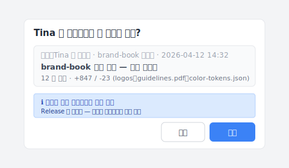

# 【2026 파일 관리】퇴사 직원이 회사 파일을 다 지웠다? '동기화'를 '백업'으로 착각했기 때문이다

> 퇴사 전 토요일 밤, 직원이 brand-book 폴더를 비웠다. Dropbox는 그대로 동기화했을 뿐. 법률도 DLP도 아닌 "동기화는 백업이 아니다"가 진짜 교훈.

## 목차

- [그 토요일 밤 11시 03분](#hook)
- [변호사는 불을 끄지 못하고, DLP는 너무 늦다](#alternatives)
- [왜 그녀는 이렇게 쉽게 지울 수 있었을까](#why)
- [Keeply로 갈아타기: 되돌릴 수 없는 기록](#keeply)
- [Keeply가 해결하지 않는 것](#limits)

---

## 그 토요일 밤 11시 03분 {#hook}

그 토요일 밤 11시 03분, Tina는 집에서 `brand-book` 폴더 전체를 휴지통으로 끌어 넣은 다음, 그대로 비우기까지 했다.

1분도 채 지나지 않아, Dropbox는 그 동작을 충실하게 클라우드까지 동기화했다.

월요일, 클라이언트가 원본 파일을 요청해 폴더를 열었다. 비어 있었다. 아직 살릴 수 있을 거라 생각했지만, 그녀가 수동으로 휴지통을 비운 행위는 Dropbox의 버전 복원 메커니즘을 통째로 우회한 것이었다.

(Dropbox 개인 버전은 30일, 비즈니스 버전은 180일 보관한다. 하지만 어느 쪽도 "사용자가 직접 휴지통을 비우는" 행위는 막지 못한다. 자세히는 [Dropbox 공식 안내](https://help.dropbox.com/delete-restore/recover-deleted-files)를 참고.)

그녀가 파일을 복사해 갔는지조차 확인할 수 없다. 클라이언트에게 아무것도 납품할 수 없다.

---

## 변호사는 불을 끄지 못하고, DLP는 너무 늦다 {#alternatives}

이런 일이 닥치면, 인터넷에서 답을 찾는다.

법적 절차? 변호사는 영업비밀 이야기부터 꺼낼 것이다. 하지만 현실은, 지금 당신은 증거조차 제출하지 못한다. 1~2년 끌어서 소송에서 이겼다 한들, 그 `brand-book`은 이미 너무 낡아서 아무도 쓰지 않는다.

법이 불을 끄지 못하니, 기업용 보안 소프트웨어(DLP)로 눈을 돌린다. 거기는 더 깊은 구덩이다. DLP가 복사를 막는 건 사실이다. 하지만 12명 팀에게 월 사용료는 도무지 맞지 않고, 시스템을 돌봐줄 전담 엔지니어도 따로 필요하다. 가장 치명적인 건, DLP가 막아주는 건 미래뿐이라는 것이다. Tina가 주말에 이미 끝낸 일은, 지금 당장 아무리 비싼 DLP를 결제해도 되돌릴 수 없다.

두 길 다 "일이 벌어진 다음 어떻게 할 것인가"를 풀고 있다. 아무도 가장 근본적인 질문을 묻지 않는다.

---

## 왜 그녀는 이렇게 쉽게 지울 수 있었을까 {#why}

**왜 그녀는 이렇게 쉽게 지울 수 있었을까?**

당신이 도구를 잘못 골랐기 때문이다.

Dropbox, Google Drive, OneDrive 모두 고장 난 게 아니다. 이들의 핵심 설계는 "양 끝의 일치"다. 당신이 지우면 클라우드도 지운다. 당신이 수정하면 클라우드도 덮어쓴다. 그들의 일은 당신의 동작을 비추는 것이지, 당신의 자산을 지키는 것이 아니다.

동기화 도구를 파일 보관소로 쓰는 건, 회사의 명줄 전체를 보험 없는 벌거벗은 창고에 맡기는 것과 같다.

내가 Keeply를 만든 이유는 바로 이 메커니즘의 빈자리를 메우기 위해서다.

---

## Keeply로 갈아타기: 되돌릴 수 없는 기록 {#keeply}

그래서 진짜 파일 버전 관리 도구가 필요한 것이다. 그 밑바닥 논리는 동기화가 아니라, 되돌릴 수 없는 기록이다.

Keeply로 갈아타면, Tina가 파일을 지워도, 휴지통을 뒤질 필요가 없다. 타임라인을 열어서 이전 버전을 그대로 되돌리면 끝이다. 그녀에게 관리자 권한이 있어도, Release로 표시된 중요 마일스톤은 지울 수 없다. 그녀가 무엇을 만졌는지는, 기록이 그대로 박혀 있다. 사후에 탐정처럼 짜맞출 필요가 없다.

인수받은 사람이 Tina의 노트북에 있던 버전을 어떻게 자기 컴퓨터로 가져올까요. Keeply에는 "cherry-pick"이라는 대화 상자가 있어서, 다른 컴퓨터나 다른 보관함에서 특정 버전만 골라 가져올 수 있습니다.

인수자가 Keeply를 열고, Tina 노트북의 brand-book 보관함을 선택하고, 4월 12일 클라이언트 납품 행을 보고, 메모란에 "brand-book 클라이언트 납품 — 완전 승인 버전"이라 적은 뒤 "적용"을 누른다. logos, guidelines.pdf, color-tokens.json 같은 12개 파일이 새 컴퓨터의 작업 폴더에 한 번에 들어온다. Release 동결 속성도 그대로 따라오기 때문에, 나중에 누가 실수로 지울 수도 없다.

---

## Keeply가 해결하지 않는 것 {#limits}

솔직히 말한다. Keeply는 만능 약이 아니다.

"실시간으로 감시해서 직원의 USB 메모리를 잠그는 것"이 필요하다면, 그건 DLP의 일이다. Slack이나 Figma 권한을 박탈해야 한다면, 그건 일반 계정 인수인계의 영역이다. 법률 자문이 필요하다면, 변호사를 찾아가야 한다.

먼저 한 가지를 정해야 한다: 당신이 원하는 건, 큰돈을 들여 직원의 실수를 막는 것인가, 아니면 **"직원이 무엇을 했든, 1초 안에 복구할 수 있다"**는 것인가?

내가 Keeply를 만든 건 후자를 풀기 위해서다.

다음 직원이 퇴사를 통보하는 날, 월요일 아침 9시 14분에 시스템을 열어보면, 그 사람이 지난 6개월간 다룬 모든 파일, 의미 있는 모든 변경이, 타임라인 위에 안정적으로 놓여 있다.

그가 퇴사 전 마지막 주말에 무엇을 했는지 걱정할 필요가 없다. 기록은 이미 진작부터 박혀 있었으니까.

---

> 저자: Ting-Wei Tsao, Keeply 창업자.
> [LinkedIn](https://www.linkedin.com/in/ting-wei-tsao-b57480152/)
