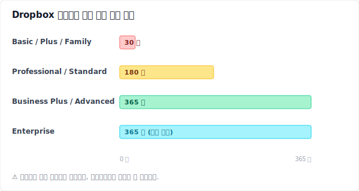
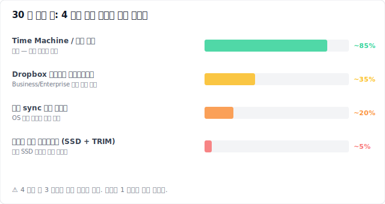
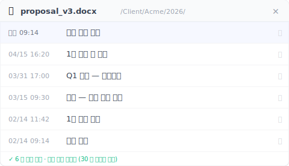
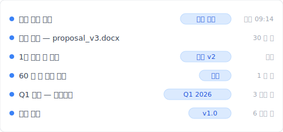

# 【2026 파일 관리】Dropbox 는 어제의 실수만 복구한다 — 30 일 뒤는 사라진다

> Dropbox 의 30 일 창은 어제의 실수만 구합니다. 클라이언트가 60 일 뒤에 묻는 버전은 구하지 못합니다. 31 일째 이후에 남은 길과, 다음번에는 시계에 의존하지 않는 방법.

이것은 복구 가이드가 아닙니다. Dropbox 30 일 시계의 서로 다른 지점에 있는 세 사람, 그리고 각자가 아직 할 수 있는 일에 대한 이야기입니다.

이름은 만든 것입니다. 상황은 합성 사례로, [Dropbox Community](https://community.dropbox.com/) 의 삭제 파일 복구 관련 스레드에 반복적으로 나타나는 패턴에서 끌어왔습니다. 세 사람이 발견하는 기술적 원리는 모두 실제입니다.

## Sarah — 5 분 전

> **【합성 사례】** Sarah 는 프리랜서 디자이너입니다. 수요일 오전 11 시 14 분. 그녀는 `proposal_v3_FINAL.docx` 의 삭제 버튼을 막 눌렀습니다. 오래된 중복 파일이라고 생각했기 때문입니다. 더 최신 버전은 `proposal_v3_FINAL_FINAL.docx` 였습니다. 그녀는 잠시 멈췄습니다. 잠깐 — 정말 그게 맞나?

그녀는 dropbox.com 을 열고 왼쪽 사이드바의 **삭제된 파일** 을 클릭합니다. 11 시 14 분에 삭제된 그녀의 파일이 거기 있습니다. 세 번의 클릭: **⋯** → **복원**. 끝났습니다. 파일이 원래 경로에 다시 나타납니다. 그녀의 노트북이 곧 동기화합니다. 휴대폰은 2 분 뒤에 따라잡습니다.

Sarah 의 복구가 쉬웠던 이유는 그녀가 보관 기간 안에 있었기 때문입니다. Basic, Plus, Family 요금제에서 Dropbox 는 삭제된 파일을 30 일간 보관합니다. 출처: [help.dropbox.com 의 삭제 파일 복구 안내](https://help.dropbox.com/delete-restore/recover-deleted-files-folders). 그 30 일 안에서는 웹 클라이언트에서 세 번 클릭하면 끝나는 작업입니다.

Sarah 가 깨닫지 못하는 것이 있습니다. 그녀의 복구가 성공한 이유는 우연히 세 가지를 옳게 했기 때문입니다.

먼저 그녀는 데스크톱 파일 관리자가 아니라 dropbox.com 을 사용했습니다. 만약 `proposal_v3_FINAL.docx` 가 [선택적 동기화 (Selective Sync)](https://help.dropbox.com/sync/selective-sync-overview) 로 제외된 폴더에 있었다면 — 디스크 공간 절약을 위해 특정 폴더를 로컬에 두지 않는 Dropbox 옵션 — 삭제는 로컬 휴지통을 거치지 않고 클라우드 쪽에서만 일어납니다. 매일 이 부분에서 사람들이 막힙니다. 로컬을 먼저 뒤지고, 아무것도 보이지 않자, 처음부터 거기에 없었다고 단정합니다.

그녀는 또한 특정 버전이 아니라 파일을 복원했습니다. 만약 Sarah 가 오늘 버전이 아니라 3 주 전 화요일의 `proposal_v3` 를 원했다면, 버전 기록이 필요했을 것입니다. 그것은 삭제 기록과는 별개의 나무입니다. 복원은 삭제된 순간의 모습으로 파일을 되돌립니다. 어제 그녀가 만든 세 번의 이전 저장은 그 안에 굳어 있습니다.

그리고 그녀는 이 폴더에서 충돌 사본을 본 적이 없습니다. 만약 본 적이 있다면 — `proposal (Marco's conflicted copy 2026-04-15).docx`, [동기화 충돌](../dropbox-conflicted-copy/) 때 Dropbox 가 만드는 표시 — 그리고 동료가 그것을 중복이라 생각해 지웠다면, 그녀는 「삭제된 파일」 에서 잘못된 이름을 찾고 있을 것입니다.

Sarah 는 이런 것들을 생각하지 않습니다. 파일을 받아냅니다. 점심을 먹습니다. 그녀의 오후는 평온합니다.

## Marco — 35 일 전

> **【합성 사례】** Marco 는 Dropbox Plus 를 쓰는 B2B 컨설턴트입니다. 오늘 클라이언트가 메일을 보냈습니다. 「가격을 바꾸기 전 — 한 달쯤 전의 — 그 제안서가 필요해요.」 Marco 는 「삭제된 파일」 을 엽니다. 비어 있습니다. 날짜순으로 정렬합니다. 지난 한 달 사이에도 아무것도 없습니다. 보낸편지함, 메일 초안, 데스크톱을 확인합니다. 그러다 기억이 납니다. 5 주 전에 이 폴더를 정리했었습니다. 그가 지금 필요한 것을 그때 지웠을 겁니다.

Marco 는 지원 티켓을 엽니다. 48 시간 뒤에 답이 옵니다. Plus 계정에서는 30 일 보관 기간을 넘어선 파일을 Dropbox 가 복구할 수 없습니다. 상담원은 앞으로 180 일 창을 쓰려면 Professional 로 업그레이드하라고 제안합니다. Marco 는 그래도 업그레이드합니다. 희망을 안고. 확인해 봅니다. 파일은 여전히 사라진 채입니다.

이것이 Dropbox 보관 정책에서 마케팅이 앞세우지 않는 부분입니다. 요금제의 보관 기간은 **삭제가 일어난 시점** 에 사용 중이던 요금제에 적용됩니다. Plus 에서 삭제 = 30 일 창. 일주일 뒤에 어떤 요금제로 옮겨도 마찬가지입니다. 삭제 시점에 시작된 시계는 이후의 업그레이드를 무시합니다. 이 패턴에 대한 사용자 보고는 [Dropbox Community 스레드](https://community.dropbox.com/en/discussion/477149/can-i-recover-files-deleted-more-than-30-days-ago-if-i-upgrade-my-account) 에 반복적으로 나타납니다.

Marco 에게 실제로 남은 세 가지 선택지가 있습니다.

첫째는 Dropbox 지원 에스컬레이션. Business 와 Enterprise 고객이 보관 기간을 며칠 넘긴 경우, 지원팀이 가끔 길을 찾아 줍니다. Dropbox 공식 정책에 따르면 이는 사례별이고 보장되지 않습니다. Marco 는 Plus 입니다. 티켓은 정중하게 닫힙니다.

둘째는 오래된 노트북에 파일이 동기화돼 있었는지 확인하는 것. OS 동기화 캐시에 로컬 사본이 여전히 남아 있고 — OS 가 캐시 공간을 회수하지 않았다면 — 그 안에서 그림자를 찾을 수도 있습니다. 그는 `~/Dropbox/.dropbox.cache/` 와 `~/Library/Application Support/` 를 뒤집니다. 쓸 만한 것은 없습니다. 재부팅 때 캐시가 비워졌습니다.

셋째는 Marco 가 실제로 하는 일입니다. 그 주에 보낸 메일과 기억을 바탕으로 가격 수정 섹션을 다시 씁니다. 같은 제안서가 아닙니다. 클라이언트가 알아챕니다. 사인오프가 3 일 늦어집니다.

아래는 모든 Dropbox 요금제의 보관 정책을 요약한 표입니다.

숫자는 같은 출처 문서에서 가져왔습니다. [버전 기록](https://help.dropbox.com/files-folders/restore-delete/version-history-overview) 과 [데이터 보관 정책](https://help.dropbox.com/account-settings/data-retention-policy). Marco 의 복구 창은 30 일이었습니다. 삭제했을 때 그의 요금제가 Plus 였기 때문입니다. 그 뒤의 어떤 업그레이드도 과거를 바꾸지 못합니다.

## Linh — 75 일 전

> **【합성 사례】** Linh 는 학위 논문을 쓰고 있는 박사 과정 연구자입니다. 지도교수가 메일을 보냅니다. 「2 월 중순에 보내준 그 버전, 코호트를 좁히기 전 — 그 방법론 섹션을 다시 보고 싶습니다.」 두 달 반 전입니다. Linh 는 4 장을 마무리하면서 6 주 전에 그 초안을 지웠습니다. 그녀는 파트너와 함께 쓰는 Dropbox Family 요금제를 사용합니다. 30 일 창. 한참 지났습니다.

Linh 에게 Dropbox 쪽 선택지는 더 이상 없습니다. 남은 것은 로컬입니다.

그녀는 Windows 노트북에서 [Recuva](https://www.ccleaner.com/recuva) (무료) 를 열고 SSD 를 스캔합니다. 수백 개의 파일 조각이 나옵니다. 필요한 날짜와 일치하는 것은 없습니다. 더 깊은 포렌식 스캔을 위해 [Disk Drill](https://www.cleverfiles.com/) (89 USD 체험판) 을 시도합니다. 결과는 같습니다. 이유는 소프트웨어가 아닙니다. TRIM 입니다.

TRIM 은 최신 SSD 의 기능입니다. 운영체제가 SSD 컨트롤러에 어떤 블록이 삭제되었는지 미리 알려 주고, SSD 는 새 쓰기에 앞서 그 블록을 사전 소거합니다. [Microsoft Learn 이 API 를 문서화](https://learn.microsoft.com/en-us/windows/win32/w8cookbook/new-api-allows-apps-to-send--trim-and-unmap--hints-to-storage-media) 합니다. 「TRIM 힌트는 이전에 할당되었던 특정 섹터가 더 이상 앱에 필요 없으며 정리할 수 있음을 드라이브에 알려 줍니다.」 macOS 는 OS X 10.10.4 부터 Apple SSD 에서 TRIM 을 기본으로 켜 둡니다. 서드파티 SSD 는 `sudo trimforce enable` 로 활성화합니다. 결과: 한 섹터에서 TRIM 이 실행되면 — 보통 삭제 후 몇 분 안에 — 복구 소프트웨어가 찾을 것이 없습니다. Linh 의 논문 초안은 6 주 전에 실리콘 수준에서 지워졌습니다. 어떤 도구도 거기에 닿지 못합니다.

아래 도표는 Linh 가 조사한 네 가지 길을 현실적인 성공률로 정렬한 것입니다.

네 가지 중 세 가지는 삭제 **이전** 에 설정이 존재해야 합니다. 네 번째 — 사후에 Recuva 나 Disk Drill 을 돌리는 것 — 은 모두가 먼저 시도하는 길이고, 최신 노트북에서는 거의 통하지 않는 길입니다.

Linh 는 지도교수에게 메일을 씁니다. 자신의 메모와 이전 초안에서 방법론 섹션을 재구성하겠다고. 잃을 계획이 없었던 토요일 하나가 그렇게 사라집니다.

## 왜 세 사람 모두 같은 함정에 빠졌는가

Sarah, Marco, Linh 는 직업이 달랐고, 파일이 달랐고, 시점이 달랐습니다. 공통점은 Dropbox 의 삭제 복구를 버전 기록 레이어처럼 다루었다는 것입니다. 그것은 버전 기록 레이어가 아닙니다. 어제 잘못된 중복본을 버린 사람을 잡아내도록 설계된 **마지막 안전망** 입니다.

마지막 안전망은 만료되어야 합니다. 저장 공간에는 비용이 듭니다. 모든 삭제를 영원히 보관하는 클라우드는 가격을 다르게 매기거나 조용히 계정에 상한을 걸 것입니다. 30 일 창은 결함이 아닙니다. 설계대로 동작하는 제품입니다. 마케팅은 잡히는 것을 강조합니다. 잡히지 않는 것은 강조하지 않습니다.

마지막 안전망이 잡지 못하는 것을 잡는 것은 다른 곳에 사는 버전 기록 레이어입니다 — 동기화 엔진이 되려고 하지 않고, 싸지려고 하지 않고, 한 번에 열두 가지를 하려고 하지 않는 곳. 한 가지 일만 하는 레이어. 자신의 드라이브에 모든 저장을 무기한 보관하는 일. 저장이 싸고, 시간이 적이 아닌 곳.

## 평행 우주

> 시간을 되감아 봅시다. 같은 Sarah, 같은 Marco, 같은 Linh. 세 사람 모두 Dropbox 에 가입한 날에 Keeply 를 설치했다고 합시다.

Sarah 는 잘못된 중복본의 삭제를 누릅니다. 그녀의 복구는 같습니다 — Dropbox 가 30 일 안에 잡아내고, 세 번 클릭, 끝. Keeply 는 백그라운드에서 돌고 있었습니다. 이번에는 필요하지 않았습니다.

Marco 의 클라이언트가 가격 수정 초안이 Dropbox 에서 사라진 지 35 일 뒤에 메일을 보냅니다. Marco 는 그 제안서의 Keeply 파일 기록 패널을 엽니다. 5 주 전의 버전이 거기 앉아 있고, 당시 그가 쓴 메모도 함께 있습니다. 「가격 수정 적용.」 그는 그것을 복사해 내옵니다. 11 초.

Linh 의 지도교수가 좁히기 전 코호트 버전에 대해 메일을 보냅니다. Linh 는 Keeply 의 프로젝트 단위 타임라인을 엽니다. 2 월 중순에 「초기 방법론 — 전체 코호트」 로 태그된 항목을 찾습니다. 복원. 끝. 토요일이 그녀의 것으로 돌아옵니다.

세 경우 모두 원리는 같습니다. Keeply 는 Dropbox 의 상류에서 동작합니다 — 모든 로컬 저장이 영구 기록에 남고, 그때 적은 메모가 검색 가능한 라벨이 됩니다. 기기 간 동기화, 공유 링크, 원격지 사본은 여전히 Dropbox 가 담당합니다. 그쪽은 아무것도 바뀌지 않습니다. 바뀌는 것은 30 일 시계가 더 이상 「필요한 버전이 아직 있는지 없는지」 를 결정하지 않는다는 점입니다. 그 버전은 당신의 드라이브에 있습니다. 항상 거기에 있습니다.

**기존 클라우드와 함께 동작합니다.** Keeply 는 Dropbox, OneDrive, Google Drive, iCloud, 또는 동기화하는 어떤 폴더의 상류에 있습니다. 이전할 필요가 없습니다. 어느 한쪽을 고를 필요가 없습니다. 로컬 레이어는 기록을 지키고, 클라우드는 동기화를 지킵니다. 도구 비교를 고민하는 모든 사람의 [절벽](../cloud-version-history-cliff/) 에서 같은 이야기입니다.

## Keeply 가 못 하는 것 (그리고 오늘 할 수 있는 한 가지)

Keeply 가 해결하지 않는 것의 솔직한 목록입니다.

- **실시간 기기 간 동기화** 는 Dropbox 의 일이지 Keeply 의 일이 아닙니다.
- **모바일에서 과거 버전 열람** 은 Keeply 의 기능이 아닙니다. 데스크톱 앱입니다.
- **외부 공유 링크** 로 클라이언트에 최신본을 보내는 일은 — Dropbox.
- **팀 관리자 대시보드와 감사 로그** — Dropbox Business.
- **드라이브가 죽었을 때의 원격지 이중화** — 그 일은 Dropbox 를 계속 돌게 두십시오.

Keeply 는 Dropbox 의 대체재가 아닙니다. Dropbox 아래 깔리는 레이어입니다. 모든 로컬 저장이 영구히 보관되어, 30 일 시계가 「60 일 뒤에 필요할 제안서가 살아남는지」 를 결정하지 않게 하는 일입니다.

지금 30 일째를 넘긴 상태라면, 당신의 선택지는 Linh 가 시도한 것들입니다. 어느 것도 잘 통하지는 않습니다. 아직 구할 수 있는 버전은 다음 한 번의 저장입니다. 로컬 기록 레이어를 설치할 가장 좋은 날은 그것이 필요해지기 전날입니다. 지금부터 2 분 뒤도 괜찮습니다.

---

**저자**: Ting-Wei Tsao 는 [Keeply](https://keeply.work) 의 창업자입니다. Git 을 배우고 싶지 않은 사람을 위한 로컬 버전 기록 레이어를 만듭니다. [LinkedIn](https://www.linkedin.com/in/ting-wei-tsao/)
