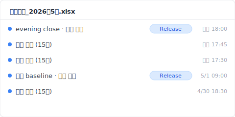
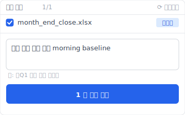

> 화요일 오전 9시 14분. 회계팀 김지영 과장(**가공 사례**)이 Ctrl+S를 눌렀다. 월말 결산 파일 「월말결산_2026년5월.xlsx」은 그 한 번의 덮어쓰기로 사라졌다. 본인은 모른다. OneDrive 동기화 표시는 여전히 초록색. Excel은 아무 창도 띄우지 않았다. 9시 16분에 파일을 닫으려다 깨달았다 — Ctrl+Z는 안 먹힌다. 방금 한 번 닫았기 때문이다. 자동 복구 폴더는 비어 있었다.

「엑셀 덮어쓴 파일 복구」를 검색하면 글이 잔뜩 나온다. Microsoft는 기능을 설명하고, 복구 소프트웨어는 자기 홍보를 하고, 조작 블로그는 「방법 1 / 2 / 3」을 나열한다. 그런데 아무도 사고가 일어난 그 1초부터 30일 후까지 분 단위로 따라가며 「각 계층의 구조 창이 언제, 왜 닫히는가」를 알려주지 않는다. 이 글은 내가 정리한 그 기록이다.

## 9:14: 그 1초에 일어난 일 {#h2-1-the-incident}

9시 14분 03초, 김 과장이 Ctrl+S를 눌렀다. Excel이 새 내용을 `xlsx` 파일에 썼다. 전날 오후 6시에 저장한 「올바른 매출 집계 시트」는 사라졌다. 자동 복구는 사본을 남기지 않는다. OneDrive 동기화 아이콘은 계속 초록색이다. Excel은 「덮어쓰시겠습니까?」라고 묻지 않는다.

그 뒤로 일어난 일:

- **9:14:03**：Excel이 새 내용을 디스크에 쓴다.
- **몇 초 후**：OneDrive 동기화 엔진이 변경을 감지해서 클라우드로 보낸다.
- **약 15초 후**：클라우드의 어제 오후 6시 버전도 새 버전으로 덮어쓰인다.
- **9:16**：김 과장이 파일을 닫는다. 그 순간 자동 복구 임시 파일(있었다면)이 자동으로 삭제된다.
- **9:23**：다음 주 시트를 열어보니 어떤 탭의 수식이 빈칸으로 나온다.

왜 Excel은 경고하지 않을까? Microsoft 설계상 「저장」은 늘 「지금 상태를 확정」이다. 「이전 상태를 대체」로 취급하지 않는다. 사양이지 버그가 아니다.

그다음 이런 일이 이어졌다.

## T+0 ~ 15초: OneDrive 자동 저장의 경쟁 조건 {#h2-2-onedrive-autosave}

OneDrive 자동 저장이 켜져 있을 때, 로컬에서 저장한 변경이 클라우드까지 가는 데 몇 초에서 십몇 초의 창이 있다. 이 몇 초 안에 다른 기기에서 같은 파일이 열려 있거나, 네트워크가 마침 끊기면 이전 버전을 건질 가능성이 있다. 김 과장은 이걸 모른다. 십몇 초 뒤, 클라우드 사본도 새 버전으로 덮였다.

OneDrive 동기화 속도는 네트워크와 파일 크기에 따라 달라진다([Microsoft Learn: Sync files with OneDrive in Windows](https://support.microsoft.com/en-us/office/sync-files-with-onedrive-in-windows-615391c4-2bd3-4aae-a42a-858262e42a49)). SharePoint Online 버전 기록은 주요 버전을 최대 500개까지 자동 보존한다([SharePoint version history limits](https://learn.microsoft.com/en-us/sharepoint/document-library-version-history-limits)). 단, 이건 「동기화 끝난 버전이 기록에 들어간다」는 뜻이지 「사고 직전 그 버전이 반드시 있다」는 뜻이 아니다.

분수령은 9시 13분이다. SharePoint가 그걸 독립 버전으로 잡았으면 되돌릴 수 있다. 못 잡았으면 이 길은 끊긴다. 하지만 이건 시작에 불과하다.

## T+15분: 「이전 버전」이 비어 있던 이유 {#h2-3-previous-versions-empty}

9시 29분, 김 과장이 Excel의 「파일 → 정보 → 버전 기록」을 열었다. 화면에 「사용 가능한 버전이 없습니다」라고 떴다. 동기화는 분명히 돌아가고 있었다. 자동 저장도 분명히 켜져 있었다. 그런데 비어 있다.

이유는 단순하다. Windows의 「이전 버전」과 SharePoint 버전 기록은 완전히 다른 것이다.

- **「이전 버전」**(Windows 탐색기에서 우클릭하면 나오는 그것)은 Windows 섀도 복사본(Shadow Copy)에 의존한다. Microsoft 365 개인용과 Business 기본 설정은 섀도 복사본을 항상 켜두지 않는다. 파일이 OneDrive 폴더에 있어도, 이건 Windows가 결정한다. OneDrive는 관여하지 않는다.
- **Excel의 「버전 기록」 버튼**은 SharePoint를 호출한다. 자동 저장으로 연속 쓴 작은 버전은 SharePoint가 매번 정식 버전으로 등록하지 않는다.
- **로컬 Excel 파일**(OneDrive에 없는 것)은 두 경로 다 없다. SharePoint는 그 파일을 모른다.

김 과장 회사는 OneDrive for Business를 쓴다. Excel 화면을 건너뛰고 SharePoint를 직접 열어 버전 기록을 봤다 — 9시 14분 이전 버전이 없다. 자동 저장이 작은 버전들을 연속으로 썼고, 9시 13분, 「저장됐다」고 그가 생각한 그 순간은 독립 버전으로 남지 않았다.

## T+24시간: Time Machine의 1시간 간격 {#h2-4-time-machine-gap}

다음 날 9시 14분, IT팀 동료가 김 과장에게 말했다. 「Time Machine이면 어제 거 복구할 수 있지 않나?」

그런데 Apple Time Machine은 기본적으로 1시간에 한 번 스냅숏을 찍는다([Apple Support: Back up your files with Time Machine on Mac](https://support.apple.com/en-us/104984)). 9:14에 사고, 9:15에 동기화 완료, 10:00에 Time Machine이 찍었다. 그 스냅숏에 잡힌 건 이미 덮어쓰인 파일이다. 10시 스냅숏은 사고 46분 뒤 찍힌 사후 사진이다.

왜 이 3개 계층이 같은 사고에서 동시에 무너질까? 각 계층이 「수십 분 이상」의 시간 간격을 가지고 있기 때문이다.

- **자동 복구**는 충돌 복구용, 기본 10분에 한 번.
- **OneDrive 동기화**는 클라우드를 로컬과 맞추는 용도, 간격은 네트워크에 따라 다름.
- **Time Machine**은 주기적 되돌리기용, 기본 1시간에 한 번.

설계 목적이 각자 다르다. 셋 다 9시 14분에서 9시 16분 사이 2분의 창을 놓쳤다.

여기까지 잃은 시간: 14시간 46분.

## T+30일: 복구 소프트웨어가 아무것도 못 가져온 이유 {#h2-5-recovery-software}

30일 후, 김 과장은 복구 소프트웨어 연간 구독을 샀다. SSD 전체를 스캔했지만 9시 14분 이전 비트는 하나도 못 찾았다.

왜? Windows와 macOS는 SSD에서 TRIM 명령을 실행한다. 삭제되거나 덮어쓰인 섹터는 즉시 물리적으로 0으로 지워진다([NIST SP 800-88r1: Guidelines for Media Sanitization](https://nvlpubs.nist.gov/nistpubs/SpecialPublications/NIST.SP.800-88r1.pdf)). 「덮어쓰기 직후 디스크 섹터 스캔」이 통하던 건 HDD 시대 얘기다. SSD에서는 덮어쓰인 비트가 물리적으로 존재하지 않는다.

복구 소프트웨어 업체가 광고하는 높은 성공률은 「방금 삭제 + HDD + 파일 시스템 미덮어쓰기」 세 조건이 동시에 맞을 때다. 회사 업무 PC는 주로 SSD다. 덮어쓰기가 일어난 그 순간, SSD는 이미 옛 비트를 지웠다. EaseUS, Recoverit, iMyFone, AOMEI 모두 같은 물리적 한계다. 소프트웨어 선택의 문제가 아니다.

김 과장이 구독료를 내고 산 것은 확인 한 줄이었다. 그 파일은 정말 안 돌아온다.

## 평행 우주: 그 PC에 Keeply가 깔려 있었다면 9:14에 무슨 일이 일어났을까 {#h2-6-keeply-counterfactual}

김 과장 PC에 Keeply가 깔려 있었다면, 9:14 사고 시점에 Keeply 보관소에는 이미 「2026/05/17 18:00 evening close」라는 이름의 스냅숏이 있었다.

Keeply는 두 가지 일을 한다.

1. 백그라운드에서 자동 저장 (간격은 15 / 30 / 60분 중 선택, 기본 30분; 김 과장 PC는 15분 설정)
2. Excel을 닫기 전에 사용자가 직접 「버전 저장」 버튼을 눌러 스냅숏을 남길 수 있다.

각 스냅숏은 보관소에 따로 저장된다. 덮어쓰지 않는다. 9시 14분의 Ctrl+S는 Excel 내부 일이다. Keeply는 옆에서 지켜본다. 영향을 받지 않는다.

9시 14분 16초, 「아, 덮어썼다」고 깨달은 그 순간:

1. Keeply를 연다.
2. 왼쪽 타임라인에서 「월말결산_2026년5월.xlsx」 어제 오후 6시 evening close 버전을 클릭한다.
3. 「이 버전으로 복원」을 누른다.

Keeply는 현재 파일을 바로 덮어쓰지 않는다. 새 파일명(`월말결산_2026년5월_RESTORED_5-17.xlsx`)으로 보관소에서 사본을 꺼낸다. 열어서 내용이 맞는지 확인하고, 원본을 교체할지 직접 정한다. 전체 30초.

화면에는 git 용어가 하나도 안 나온다. 두 가지만 기억하면 된다. 백그라운드에서 15-60분 간격으로 자동 저장이 된다, 중요한 순간엔 직접 「버전 저장」을 눌러도 된다.

## 한계: Keeply도 못 잡는 3가지 덮어쓰기 {#h2-7-limits}

Keeply도 만능은 아니다. 다음 세 가지 상황에서는 Keeply도 못 건진다.

1. **Keeply 설치 후 첫 자동 저장이 돌기 전에 사고 발생** (간격은 설정에 따라 15-60분). 설치 당일은 일 시작 전에 「버전 저장」을 한 번 눌러 기준선을 잡으면 이 사각지대가 메워진다.
2. **공유 네트워크 드라이브 위의 Excel 파일**. Keeply는 개인 PC에 설치된다. 공유 드라이브에서 남이 뭘 했는지는 안 본다. 공유 드라이브를 감시하려면 팀이 별도 Keeply 미러 보관소를 만들어야 한다.
3. **Excel을 켜둔 채 다른 사람이 다른 PC에서 클라우드 사본을 덮어씀** — Keeply는 내 PC의 로컬 변경을 잡는다. 동료가 다른 PC에서 같은 SharePoint 파일을 덮어쓴 경우는 SharePoint 자체 버전 기록에 의존해야 한다.

사고 보고서는 여기서 끝난다. 다음에 이 일이 안 일어나게 하는 얘기는, 내가 다른 글에서 이어 쓸 것이다.

---

**작성자**: [Ting-Wei Tsao](https://www.linkedin.com/in/ting-wei-tsao-b57480152)、Keeply 창업자. 당신의 파일 관리 수호신을 만드는 사람.

## 자주 묻는 질문 {#faq}

**Q. Keeply는 이 4개 계층 복구의 빈틈을 어떻게 메우나요?**

A. 버전 기록 계층을 사고 발생 전에 둔다. Keeply는 백그라운드 자동 저장(15 / 30 / 60분 중 선택) + 중요 순간에 「버전 저장」 버튼 수동 누름 + 각 스냅숏을 독립 보관소에 서로 덮어쓰지 않고 저장. 사고 시 Keeply를 열고, 이전 버전을 선택하고, 「이 버전으로 복원」을 누른다, 30초면 끝. 앞의 4개 계층(자동 복구 / OneDrive 버전 기록 / Time Machine / 복구 소프트웨어)은 모두 사후 구조이고, 본질적으로 어딘가의 간격 창에서 실패한다; Keeply는 사전 방어이지, 또 하나의 사후 선택지가 아니다.

**Q. Excel을 덮어쓴 후 이전 버전을 복구할 수 있나요?**

A. 상황에 따라 다릅니다. OneDrive for Business 동기화 파일이고 사고 전에 명확한 저장 시점이 남아 있으면, SharePoint 버전 기록에서 복구할 수 있습니다. 로컬 Excel 파일(OneDrive에 없는 것)은 Windows 섀도 복사본이 켜져 있고 SSD가 아닌 환경에서만 일부 가능합니다. 늦게 발견할수록 성공률이 낮습니다.

**Q. 자동 복구로 덮어쓴 이전 버전을 복원할 수 있나요?**

A. 안 됩니다. 자동 복구는 「Excel이 실행 중 충돌」 상황을 위한 것입니다. 파일이 정상 종료되는 그 순간 자동 복구 임시 파일이 자동 삭제됩니다. 덮어쓴 후 닫은 파일은 자동 복구로 복구할 수 없습니다. 덮어쓰기 전 버전을 살리려면, 사고 발생 전에 독립된 버전 보관소가 필요합니다; Keeply가 바로 이 계층을 메우는 도구입니다.

**Q. Excel 복구 소프트웨어로 덮어쓴 파일을 복구할 수 있나요?**

A. SSD + TRIM 환경에서는 물리적으로 매우 어렵습니다(NIST SP 800-88r1 참조). 「HDD + 덮어쓰기 직후 + 파일 시스템 미덮어쓰기」 세 조건이 동시에 맞아야 가능성이 있습니다. 회사 업무 PC는 주로 SSD라 현실적으로 기대하기 어렵습니다. Keeply는 버전 계층을 SSD 쓰기 이전의 응용 계층에 두어 TRIM 물리적 한계를 피합니다 — 이전 버전의 비트가 보관소에 그대로 남아 있습니다.

**Q. OneDrive 동기화한 Excel 파일의 옛 버전은 어떻게 보나요?**

A. 브라우저로 OneDrive를 열고 파일에서 우클릭, 「버전 기록」을 선택합니다. Excel 화면 안의 「버전 기록」 버튼보다 SharePoint 쪽에서 직접 보는 게 더 완전한 기록을 보여줍니다.

**Q. Time Machine으로 1시간 이내의 Excel 덮어쓰기를 복구할 수 있나요?**

A. 기본 1시간 간격으로는 안 됩니다. 사고와 다음 스냅숏 사이의 덮어쓰기는 이미 덮인 파일이 잡힙니다. Time Machine을 로컬 스냅숏 고빈도 설정으로 바꾸거나 수동으로 찍는 습관이 있어야 가능합니다. 회사에서 지급한 Mac은 대부분 기본 설정입니다. Keeply 자동 저장 간격은 최소 15분, Time Machine 기본 1시간보다 훨씬 세밀합니다 — 9:14에 사고, 9:00 스냅숏이 그대로 있어서 Keeply가 잡습니다.

## 관련 글

- 📚 Pillar: [파일 버전 관리 완전 가이드: 대부분의 도구가 못 막는 5가지 이유](/ko/post/file-version-management-complete-guide/)
- 🔁 Sibling: [덮어쓴 파일 복구의 한계: 자동 복구로는 닿지 못하는 곳](/ko/post/recover-overwritten-file/)
- 📊 Sibling: [Excel 버전 기록 버튼이 회색인 4가지 조건](/ko/post/excel-version-history-limits/)

## 출처

1. [Microsoft Learn: Sync files with OneDrive in Windows](https://support.microsoft.com/en-us/office/sync-files-with-onedrive-in-windows-615391c4-2bd3-4aae-a42a-858262e42a49)
2. [SharePoint version history limits: Microsoft Learn](https://learn.microsoft.com/en-us/sharepoint/document-library-version-history-limits)
3. [Apple Support: Back up your files with Time Machine on Mac](https://support.apple.com/en-us/104984)
4. [NIST SP 800-88r1: Guidelines for Media Sanitization (SSD TRIM behavior)](https://nvlpubs.nist.gov/nistpubs/SpecialPublications/NIST.SP.800-88r1.pdf)
