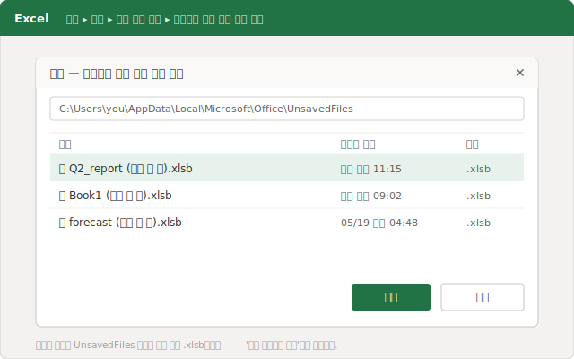
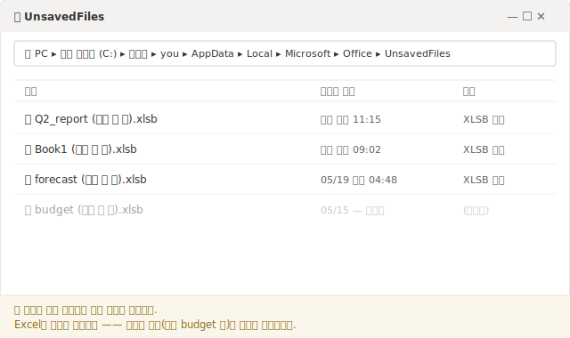
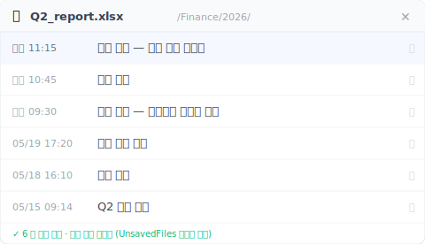

# 【2026 파일 관리】엑셀 저장 안한 파일 복구 방법, 그리고 방금 살린 파일이 다시 사라지는 이유

*엑셀의 '저장되지 않은 통합 문서 복구'는 숨은 `UnsavedFiles` 캐시에서 한 번도 저장 안 한 파일을 꺼냅니다. 임시 `.xlsb`로 저장돼 있다가 엑셀이 알아서 비우는 곳이죠. 그래서 방금 살린 파일도 며칠 뒤면 사라질 수 있습니다. 답은 '더 빠른 복구'가 아니라, 그 캐시에 아예 들어 있지 않은 버전 층입니다.*

화요일에 저장 안 한 시트를 복구하고 한숨 돌렸습니다. 그런데 주말이 되니 사라졌습니다. 엑셀이 잃어버린 게 아닙니다. 그 복구 캐시는 처음부터 시한이 정해져 있었습니다.

엑셀을 저장 없이 막 닫아버려 가슴이 철렁했다면, 여기서 시작하세요. 복구는 진짜 됩니다. 30 초면 됩니다. 다만 지금 살리려는 파일이 *어디에* 있는지는 알아둘 값이 있습니다. 그게 바로 그 파일이 다시 사라질 수 있는 이유이기도 하니까요.

## 지금 바로 되살리기: 저장되지 않은 통합 문서 복구 {#h2-1}

다른 건 건드리기 전에 이것부터 하세요.

- **파일 → 정보 → 통합 문서 관리 → 저장되지 않은 통합 문서 복구.** (또는 **파일 → 열기 → 저장되지 않은 통합 문서 복구**, 최근 파일 목록 맨 아래 버튼.)
- 폴더가 열립니다. `.xlsb`로 끝나는 알 수 없는 이름의 파일들이 보입니다. 그게 저장 안 한 통합 문서입니다.
- 시간이 맞는 걸 열고, 곧바로 **다른 이름으로 저장**해 제대로 된 이름과 위치를 줍니다.

그 `.xlsb` 목록은 어떤 복구 마법사에서 나오는 게 아닙니다. 엑셀이 당신 드라이브의 폴더 하나를 읽고 있는 겁니다. `%LocalAppData%\Microsoft\Office\UnsavedFiles`. 저장하지 않은 작업의 사본을 엑셀이 조용히 여기 넣어 둡니다. 당신이 저장 없이 닫거나 엑셀이 멈췄을 때 돌려줄 게 있도록요.

파일 찾았나요? 좋습니다. 이제 아무도 안 알려주는 부분입니다.

## 방금 살린 파일이 주말이면 사라질 수 있는 이유 {#h2-2}

그 `UnsavedFiles` 폴더는 잠깐 맡아두는 곳이지 금고가 아닙니다. 엑셀이 알아서 관리해 준다는 건, 엑셀이 알아서 비워 버린다는 뜻이기도 합니다. 당신에게 묻지 않고, 자기 일정대로요.

**Microsoft 는 저장 안 한 파일이 거기 얼마나 남는지 공식적으로 밝히지 않습니다.** 흔히 도는 '4 일'이라는 숫자도 Microsoft 문서에 적힌 게 아닙니다. [공식 안내](https://support.microsoft.com/ko-kr/office/office-%ED%8C%8C%EC%9D%BC%EC%9D%98-%EC%9D%B4%EC%A0%84-%EB%B2%84%EC%A0%84-%EB%B3%B5%EA%B5%AC-169cb166-e7e2-438e-8f39-9a8927828121)는 저장되지 않은 통합 문서 복구를 여는 법까지만 보여주고 거기서 끝납니다. 내일도 그 파일이 남아 있을 거라고는 약속하지 않습니다. 실제로는 이 캐시가 며칠 안에, 또는 재부팅 후, 또는 더 새 항목이 쌓이면 비워졌다는 보고가 많습니다.

그러니까 "복구했다"와 "보관했다"는 서로 다른 일입니다. 복구한 통합 문서를 열어 슬쩍 보고는 제대로 된 폴더에 **다른 이름으로 저장**하지 않은 채 다시 닫았다면, 저장한 게 아닙니다. 아직 시한이 도는 임시 사본을 잠깐 본 것뿐입니다. 금요일에 돌아오면 사라져 있을 수 있고, 이번엔 폴더에 되살릴 것조차 없습니다.

복구 단계는 다음 10 분을 구해 줍니다. 다음 주는 못 구합니다.

## 엑셀이 캐시 하나로 떠안는, 서로 다른 두 가지 '미저장' 사고 {#h2-3}

사람들이 여기서 헷갈리는 이유가 있습니다. "엑셀 파일 저장 안 하고 날렸어"는 사실 같은 말을 쓴 서로 다른 두 문제인데, 엑셀이 둘 다 똑같은 '저장되지 않은 통합 문서 복구' 문 하나로 몰아넣기 때문입니다.

**문제 A ,  한 번도 저장한 적이 없다.** 새 통합 문서, 세 시간 동안 수식 작업, 그러다 멈추거나 '저장 안 함'을 잘못 눌렀다. 디스크에 진짜 파일이 한 번도 없었으니, `UnsavedFiles` 캐시가 정말로 최선이자 유일한 패입니다. 캐시는 바로 이걸 위해 있고, 위의 1 단계로 대개 되찾습니다.

**문제 B ,  전에 저장해 둔 파일인데, 그 뒤 작업한 변경분을 잃었다.** 백 번도 더 열어 본 월말 보고서입니다. 아침 내내 작업하고 저장 안 한 채 닫았습니다. 파일은 그대로 있습니다. *마지막 몇 시간* 작업분만 사라진 거죠. 여기선 캐시에 쓸 만한 게 없는 경우가 많습니다. 엑셀이 당신의 수정을 '되살릴 수 있는 세션'으로 추적했을 뿐, '파일의 영구 버전'으로 둔 게 아니기 때문입니다.

> **【합성 예시】** 회계 담당 K 씨는 월말 결산 통합 문서를 아침 9 시 14 분부터 만졌습니다. 점심 무렵 수식이 꼬여 정리하다 실수로 닫았고, 무심코 '저장 안 함'을 눌렀습니다. 저장되지 않은 통합 문서 복구를 열었지만 목록엔 이 파일이 없었습니다. 이미 한 달 전에 저장해 둔 파일이라, 캐시가 추적 대상으로 보지 않았던 겁니다. 사라진 건 파일이 아니라 그날 오전이었습니다.

문제 B 에는 사촌이 몇 있는데, 캐시는 그 어느 것에도 닿지 못합니다. 파일을 **다른 컴퓨터**에서 열었다면 그 로컬 캐시가 거기엔 없습니다. 또는 OneDrive AutoSave 가 동기화된 사본 위에 조용히 덮어썼다면(이건 별도의 함정이고 해법도 따로 있습니다 ,  [공동 편집 중 엑셀 데이터가 사라질 때](/ko/post/excel-data-vanished-postmortem/) 참고). 겉모습은 달라도 뿌리는 같습니다. 당신을 구해 줄 거라던 그것이 임시였거나, 로컬이었거나, 둘 다였던 겁니다.

멈춤을 견디려고 만든 캐시는 애초에 파일의 역사가 되도록 만들어진 게 아닙니다.

## 임시 캐시에 들어 있지 않은 층 {#h2-4}

문제 B 의 답은 `UnsavedFiles`를 더 빨리 뒤지는 방법이 아닙니다. 파일 자신의 역사를, 엑셀이 쓸어버릴 수 없는 곳에 두는 겁니다. 스프레드시트가 실제로 사는 폴더를 지켜보면서, 작업하는 동안 시간 도장이 찍힌 사본을 모아 두는 버전 층 말이죠. 엑셀이 재활용하는 버퍼가 아니라요.

[Keeply](https://keeply.work)가 메우려는 게 바로 이 틈입니다. 스프레드시트가 사는 폴더를 가리켜 두면, 정해 둔 간격으로 백그라운드에서 한 버전씩 자동 저장합니다. 15 분, 30 분, 60 분 중에 고르고 기본은 30 분입니다. 거기에 직접 누르는 **버전 저장** 버튼이 있어서, 한 줄 메모로 중요한 시점을 표시해 둘 수 있습니다. 오늘 아침 작업이 날아갔을 때, 이미 비워졌을지 모르는 캐시를 뒤지는 게 아니라, 파일의 타임라인을 열어 11 시 15 분 버전을 고르면 됩니다.

`UnsavedFiles` 캐시는 작업 중인 파일을 위한 엑셀의 단기 안전망입니다. 버전 타임라인은 그 파일의 장기 기억입니다. 하나는 만료되고, 하나는 만료되지 않습니다. 이 층들이 각각 어디까지 잡아 주고 어디서 끊기는지 전체 그림은 [파일 버전 관리 완전 가이드](/ko/post/file-version-management-complete-guide/)에서 정리합니다.

## 버전 층도 못 구하는 경우 {#h2-5}

전부 다 막아 주는 척하면 정직하지 못하겠죠. 못 막는 곳은 이렇습니다.

- **추적 폴더에 한 번도 저장한 적 없는 새 통합 문서.** 지켜보는 폴더에 파일이 한 번도 써진 적 없다면, 보관할 버전 자체가 없습니다. 이건 여전히 엑셀의 `UnsavedFiles` 캐시 몫이고(문제 A), 여전히 짧은 시한 위에 있습니다.
- **조용한 손상.** 파일이 소리 없이 망가진 채 멀쩡해 보이는 버전이 정상본 위에 저장되면, 타임라인은 그 망가진 사본도 충실히 보관합니다.
- **지켜보는 폴더 밖에 있는 파일.** 버전 층은 당신이 가리킨 폴더만 압니다. 추가한 적 없는 USB 메모리 속 스프레드시트는 포함되지 않습니다.

버전 타임라인은 "갖고 있었는데 변경분을 잃었다"를 풉니다. 어디에도 저장된 적 없는 파일을 없던 데서 만들어 내지는 못합니다.

## 엑셀 기본 기능만으로 충분할 때 {#h2-6}

언제나 한 층을 더 둘 필요는 없습니다. 다음이라면 건너뛰세요.

- 다시 만들어도 그만인 한 번 쓰고 버릴 계산.
- **파일이 OneDrive 나 SharePoint 에 있고 AutoSave 가 켜져 있을 때.** 이건 꽤 많은 걸 막아 줍니다. 클라우드 버전 기록이 작업 중 일어나는 대부분의 덮어쓰기를 잡아 줍니다. 다만 못 하는 것도 알아 두세요. 동기화된 사본에 묶여 있고, 보관되는 기록에는 상한이 있으며, AutoSave 는 묻지 않고 작업하는 대로 덮어씁니다. 이 한계를 읽고도 당신에겐 걸리는 게 없다면, 다른 층은 필요 없습니다.
- 오전 작업 한 번 잃는 게 마감을 놓칠 일이 아니라 그냥 짜증나는 일 정도일 때.

여기 해당한다면, 저장되지 않은 통합 문서 복구 경로만 익혀 두고, 일찍 저장해 파일이 존재하게 만든 다음, 하던 일을 하세요. 추가 층은 그 스프레드시트 속 작업이 흔쾌히 다시 만들 수 없는 종류일 때에만 제값을 합니다.

## 자주 묻는 질문 {#faq}

**엑셀 파일을 전에 저장해 뒀고 아침 내내 저장 없이 작업하다 닫았는데, 그 오전 작업을 되찾을 수 있나요?**

엑셀 캐시에선 안 되는 경우가 많습니다. 저장되지 않은 통합 문서 복구는 한 번도 저장 안 한 파일용이라, 일단 저장된 파일이면 저장 안 한 세션 변경분은 거기 안정적으로 남지 않습니다. '이미 있는 파일의 마지막 몇 시간'을 되찾는 건 영구 버전 층(예: Keeply)이 하는 일입니다. 파일 자체의 버전을 시간 도장과 함께 보관하므로, 타임라인을 열어 오전 늦은 시각의 사본을 고르면 됩니다.

**엑셀은 저장 안 한 파일을 얼마나 보관하나요?**

Microsoft 는 고정된 보관 기간을 공식적으로 밝히지 않습니다. 저장 안 한 사본은 엑셀이 알아서 비우는 임시 캐시에 들어 있고, 며칠 안에, 재부팅 후, 또는 더 새 항목이 쌓이면 사라졌다는 보고가 많습니다. 복구한 파일은 제대로 된 폴더에 다른 이름으로 저장하기 전까지는 임시본으로 여기세요.

**저장 안 한 엑셀 파일은 어디에 저장되나요?**

엑셀의 UnsavedFiles 캐시, 즉 %LocalAppData%\Microsoft\Office\UnsavedFiles 안에 .xlsb 로 끝나는 파일로 저장됩니다. 파일 → 정보 → 통합 문서 관리 → 저장되지 않은 통합 문서 복구로 들어갑니다.

**파일을 복구했는데 며칠 뒤 사라졌어요. 왜죠?**

저장되지 않은 통합 문서 복구가 읽는 건 영구 사본이 아니라 임시 캐시이기 때문입니다. 복구한 파일을 제대로 된 위치에 다른 이름으로 저장하지 않았다면, 그 파일은 캐시에 그대로 있다가 나중에 비워진 겁니다. 복구한 직후엔 반드시 다른 이름으로 저장하세요.

**AutoSave 를 켜면 이 문제가 해결되나요?**

AutoSave(OneDrive/SharePoint)는 클라우드에 둔 파일엔 도움이 되지만, 작업하는 대로 덮어쓰고 버전 기록에도 나름의 한계가 있습니다. 로컬에 두는 파일은 포함하지 못하고, 둘러볼 수 있게 보관되는 파일의 버전 타임라인과는 다릅니다.

## 더 읽기 {#related}
- [파일 버전 관리 완전 가이드](/ko/post/file-version-management-complete-guide/) (pillar)
- [저장 안 한 워드 문서 복구, 그리고 자동 복구가 못 살리는 5 가지 경우](/ko/post/word-unsaved-recovery/)
- [엑셀 버전 기록: 아무도 말 안 하는 Microsoft 의 제한](/ko/post/excel-version-history-limits/)
- [공동 편집 중 엑셀 데이터가 사라질 때](/ko/post/excel-data-vanished-postmortem/)

---
*글: Ting-Wei Tsao, Keeply 창업자 ,  [LinkedIn](https://www.linkedin.com/in/ting-wei-tsao-b57480152)*
