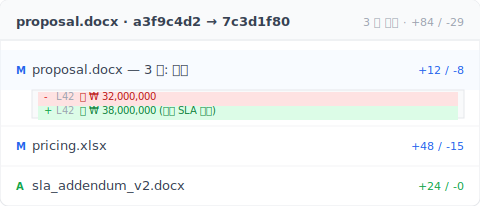

> 당신의 문제가 아니에요. 도구가 원래 그렇게 설계된 거예요.

A 씨는 프리랜서 디자이너예요. 바탕화면에 `_v3_final_FINAL.psd`가 있어요.
B 씨는 법무법인에서 일해요. 하드 드라이브에 `계약서_v7_고객사본_2025-04-15.docx`가 있어요.
그리고 화면 앞의 당신, 지금 `논문_3장_지도교수피드백후_진짜최종v2.docx`를 열어놓고 있지 않나요?

직업은 달라요. 파일명도 달라요. **증상은 똑같아요**.

강박증이 있어서가 아니에요.
이렇게 하지 않으면 **파일 구조가 난장판**이 되니까요. NAS에 저장했다가 삭제하면 복구도 안 되고요. 그래서 결국 `old/` 폴더를 만들어서 예전 버전을 다 거기 쌓아두게 돼요.

그리고 운 나쁜 세 사람 이야기가 아니에요. [M-Files가 2019년에 지식 노동자를 대상으로 한 조사에서, 96%가 파일의 최신 버전을 찾는 데 어려움을 겪은 적이 있다고 답했어요](https://idm.net.au/article/0012311-8-10-workers-forced-recreate-existing-documents). 거의 모두가 조용히 같은 문제와 싸우고 있는 거예요.


---

> **TL;DR** —  공유 폴더, Dropbox, NAS는 **애초에 파일 이력을 관리하기 위해 설계된 게 아니에요**. 4가지 구조적 결함이 있고, 그 결함마다 도구가 해야 할 일을 당신에게 떠넘겨요. 이 글에서 하나씩 뜯어보고, Keeply가 어떤 부분을 해결하고 어떤 부분은 해결하지 못하는지도 솔직하게 말할게요.

## 글 목차

1. [「이전 버전」 버튼은 처음부터 없었어요](#reason-1)
2. [30일 버전 이력은 거짓말이에요](#reason-2)
3. [버전 이력은 「언제」만 알려줄 뿐, 왜 「왜」는 알려주지 않을까요?](#reason-3)
4. [명명 규칙은 조직의 기억을 사람의 규율에 떠넘겨요](#reason-4)
5. [Keeply가 파일 버전 관리의 정답이 아닌 경우는 언제일까요?](#limitations)

---

## 1. 「이전 버전」 버튼은 처음부터 없었어요 {#reason-1}

Dropbox, Google Drive, 회사 NAS를 열어봐도 「이전 버전」 버튼은 없어요 — 이 도구들은 처음부터 그 기능을 만들지 않았어요. 신경 쓰는 건 세 대의 기기에서 같은 파일이 보이게 하는 거지, 어제 작업한 버전으로 돌아가게 해주는 게 아니에요.

어제 작업한 디자인 파일을 찾고 싶어요.

Dropbox나 Google Drive를 열면 — 전부 최신 파일만 보여요. 버전 이력은 세 단계 메뉴 안에 숨어 있어요. 누가 알려주기 전까지는 모르죠.


회사 NAS를 열면 — 거기 쌓여있는 그 뒤죽박죽 버전 번호들이 당신의 버전 이력이에요.


**이런 종류의 도구는 애초에 파일 이력을 관리하기 위해 설계된 게 아니에요**.

클라우드 드라이브가 가장 신경 쓰는 건 세 대의 기기에서 같은 파일을 볼 수 있게 하는 거예요.
그 목표와 「모든 이전 버전을 보존하는 것」은 충돌해요.

그래서 도구는 동기화를 선택했어요. **변경 이력을 보여주지 않는 방향으로요**.

> 2015년, UCSD 언어학 박사과정의 Will Styler가 논문 파일을 잃어버렸어요. 7가지 백업 방안이 있었는데 하나도 작동하지 않았어요. 그는 미래의 대학원생들을 위해 사후 분석 글을 남겼어요. 마지막 문장은 이랬어요: "Redundancy doesn't prevent stupidity" (백업을 여러 개 만들어도 멍청함은 막지 못한다).
> [사고 전문](https://wstyler.ucsd.edu/posts/lost_dissertation_files.html)

→ 관련 글: [한 대의 노트북에 논문을 올인하는 것의 위험성](/ko/post/thesis-single-point-of-failure/)

---

## 2. 30일 버전 이력은 거짓말이에요 {#reason-2}

Dropbox가 주는 건 30일 버전 이력뿐이에요. 그 이전은 더 이상 존재하지 않아요. 30일은 기술적 한계가 아니라 사업적 결정이에요 — 어제 실수는 복구할 수 있지만, 지난 분기 제안서는 복구할 수 없게, 딱 그 선에 그어둔 거예요.

기술적으로 가능할까요? 가능해요. Apple은 2007년부터 모든 Mac에 Time Machine이라는 기능을 내장하고 있어요: 1시간마다 자동으로 스냅샷을 찍어서, 3개월 전 파일을 다시 열고 싶으면 두 번 클릭이면 되고, 전부 무료예요. 기술은 이미 성숙해 있어요. Dropbox는 일부러 30일 이전을 숨겨놓고, 보고 싶으면 업그레이드 요금을 내라고 하는 거예요.

좋아요. Dropbox에 버전 이력 기능이 있다는 걸 발견했어요. 안도감이 드나요?

잠깐, 다음 나쁜 소식이 기다리고 있어요: **30일 상한선**.


일상으로 환산하면 이래요: 지난 분기 고객 브리핑을 찾고 싶다고요? 유료 플랜이 아니라면 **이미 사라졌어요**.

파일 이력은 업그레이드 이유가 되어버린 거죠.
(Keeply는 파일 이력을 영원히, 무료로 제공해요.)

> 2026년 4월, Hacker News. 사용자 julianozen이 글을 올렸어요: 아버지가 2년 동안 건드리지 않았던 파일을 덮어써버렸고, 이틀 후에 복구하려 했지만 실패했어요. Dropbox의 설명은 30일 보존 기간이 지났다는 거였어요. julianozen의 반응: "그게 30일 이력의 정의가 아니잖아요." lazide의 댓글: "Which is bonkers." [전체 스레드](https://news.ycombinator.com/item?id=47772260)

30일 창은 「어제 실수로 덮어쓴」 상황을 위해 설계된 거예요.
「다음 주에 고객이 지난 분기 제안서를 다시 보고 싶어 한다」는 상황에선 — **잘못된 도구를 쓰면 원하는 결과를 얻기 어려워요**.

→ 관련 글: [공유 폴더의 숨겨진 비용](/ko/post/hidden-cost-shared-folders/)

---

## 3. 버전 이력은 「언제」만 알려줄 뿐, 왜 「왜」는 알려주지 않을까요? {#reason-3}

버전 이력이 기록하는 건 「누가, 언제 바꿨는지」뿐이에요. 「무엇을 의도해서 바꿨는지」는 기록하지 않아요. 디자이너가 레이어 투명도를 30%로 바꿔요. 변호사가 계약서 조항에서 「해야 한다」를 「할 수 있다」로 바꿔요. 대학원생이 「이 주장은 한계가 있다」를 「이 주장은 명확히 성립된다」로 다시 써요. 이력엔 세 경우 모두 「수정」만 보여요. 의미가 뒤집힌 건 보이지 않아요.

앞의 두 문제를 해결했다고 가정해요: 버전 이력도 켜져 있고, 30일도 충분하고요.
그런데 더 깊은 문제가 기다리고 있어요.

버전 이력이 알려주는 건 「2025-04-15 14:23 수정」이에요.
**14:23에 무엇이 바뀌었는지는 알려주지 않아요. 왜 바뀌었는지도요.**


어떤 업무에서는 괜찮아요. 어떤 업무에서는 치명적이에요:

- **디자이너**가 레이어 투명도를 30%로 바꿨어요. 이력엔 「수정」만 보여요. 어느 레이어인지는 안 보여요.
- **변호사**가 계약서 조항에서 「해야 한다」를 「할 수 있다」로 바꿨어요. 한 단어 차이예요. 이력엔 「수정」만 보여요. 어느 단어인지는 안 보여요.
- **대학원생**이 「이 주장은 한계가 있다」를 「이 주장은 명확히 성립된다」로 바꿨어요. 신중함이 단정으로 바뀐 거예요. 이력엔 「수정」만 보여요. 의미가 뒤집혔다는 건 안 보여요.

그쵸? 이게 사람들이 착각하는 지점이에요.

> 2025년 1월, Legal Cheek가 익명 변호사의 이야기를 실었어요: 「수습 때 잘못된 유언장을 잘못된 고인 가족에게 첨부 파일로 보냈다.」 재앙은 「버전이 저장되지 않아서」가 아니었어요. 「어느 버전이 현재 것인지 몰라서」였어요. [전문 보기](https://www.legalcheek.com/2025/01/courtroom-etiquette-email-blunders-and-document-mix-ups-lawyers-share-their-most-embarrassing-mistakes/)

잠깐, 이게 끝이 아니에요.

**백업은 파일을 남겨두는 것**이에요.
**버전 관리는 파일을 남겨두면서, 무엇을 왜 바꿨는지도 기록하는 것**이에요.

**백업은 전자를 줘요. 관리는 후자를 줘요.**

구체적인 예를 들어볼게요. 버전 기록에 「proposal.docx 변경됨」이라고만 적혀 있으면, 타임스탬프만 봐서는 의미를 알 수 없어요. 두 버전을 나란히 놓고 비교해 보세요.



L42 연 단가 720,000 → 855,000, 옆에 「고객이 SLA 요구」 메모, 같은 타이밍에 `sla_addendum_v2.docx`가 새로 생겼어요 — 3초 만에 왜 이 버전에서 단가가 뛰었는지 알 수 있어요. 버전 관리는 사후 대조가 아니라, 결정한 그 순간에 결정을 적어두는 거예요.

그래서 파일명에 의도를 욱여넣기 시작해요: `계약서_v7_고객요청3조수정.docx`.
파일명이 꽉 차면 스프레드시트를 열어요. 스프레드시트가 감당 못 하면 Slack 채널을 만들어요.
**결국 당신의 「버전 관리 시스템」은 파일명 + 스프레드시트 + Slack + 기억**이 돼요. 하나라도 무너지면 전체가 흔들려요.
3개월 후에 기록을 열어보면, 과거의 내 습관이 지금의 내 습관과 달라져 있어요.

---

## 4. 명명 규칙은 조직의 기억을 사람의 규율에 떠넘겨요 {#reason-4}

회사가 만든 명명 규칙 PDF는 보통 6개월 후에 아무도 안 지켜요. 동료가 게을러서가 아니에요 — 이 규칙은 모두가, 매번 저장할 때마다, 규칙을 기억하고, 지키려 하고, 그럴 시간이 있어서 규칙대로 파일명을 입력하는 걸 요구해요. 세 조건 중 하나라도 빠지면 무너져요. 마감에 쫓기는 와중에 누가 파일명 생각할 시간을 내겠어요? 결국 남는 건 `FINAL`, `FINAL_v2`, `진짜최종`.

위의 세 가지 문제에 부딪히면, 어느 회사나 같은 방법을 써요 — **명명 규칙 PDF를 만드는 거예요**.

보통 이렇게 생겼어요:

```text
[YYYY-MM-DD]_[프로젝트코드]_[문서유형]_[상태]_[작성자].ext
```

깔끔하죠.


그리고 6개월 후에는 아무도 안 지켜요.

당신 직장 동료가 게으른 게 아니에요.
**통제할 수 없는 생물들의 집단을 규칙으로 통제하려는 시도 — 그 결말은 처음부터 보여요.**

> Asana 포럼, 2023년 6월, 「최고의 파일명 실패담」 스레드. Becky_Caday: 「같은 파일의 여러 버전이 생겼어요. 누군가 원본 파일을 열어서 편집할 수 있다는 걸 몰라서, 단어 하나를 대문자로 바꿨을 뿐인데 — `List 2.0`이 `LIST 2.0`이 됐어요.」 Arndt_Dienstbier: 「공백 문자로 버전 관리를 했어요」 (`Document.docx` 파일 여러 개인데, 파일명 끝에 붙은 공백 수만 달라요). [전체 스레드](https://forum.asana.com/t/share-your-epic-file-naming-fails-and-lets-laugh-together/462366)

팀원 각자가, 저장할 때마다, 규칙을 기억하고 + 지키려 하고 + 그럴 시간이 있어야 해요. 하나라도 어긋나면 — **축하해요, 또 난장판이에요**.

그리고 난장판이 이기면, 옛 버전을 찾는 게 아니라 처음부터 다시 만들게 돼요. 같은 [M-Files 조사에서 전 세계 노동자의 83%가 이미 어딘가에 존재하는 문서를 다시 만들 수밖에 없었다고 답했어요](https://idm.net.au/article/0012311-8-10-workers-forced-recreate-existing-documents). 버전은 내내 거기 있었어요. 아무도 찾지 못했을 뿐이에요.

당신 잘못이 아니에요. 명명 규칙을 기억하는 건 **도구가 그냥 알아서 해야 할 일이에요**.
사람의 규율에 떠넘길 게 아니라요.

→ 관련 글: [AutoCAD 팀이 잘못된 버전을 불러온 이야기](/ko/post/autocad-wrong-version-crew/)

---

## 5. Keeply가 파일 버전 관리의 정답이 아닌 경우는 언제일까요? {#limitations}

Keeply를 쓰면 안 되는 경우가 네 가지 있어요: 회의 중 실시간 공동 메모, 50GB 이상의 동영상 소재, 외부 법무법인과 주고받는 계약서, 그리고 엄격한 접근 권한 통제가 필요한 대기업 IT. 각각 더 적합한 도구가 있고, 아래에서 하나씩 설명할게요. Keeply가 잘 맞는 건 당신(혹은 작은 팀)이 몇 주, 몇 달에 걸쳐 같은 파일로 계속 돌아오는 상황이에요.

저희가 Keeply를 만든 건 이 4가지 구조적 결함을 채우기 위해서예요.
하지만 **Keeply가 답이 아닌 경우**도 있어요:

- **실시간 협업 회의 메모** → Notion / Google 문서를 쓰세요. Keeply는 개인 + 소팀의 장기 버전 기억을 위한 도구예요. 실시간 협업 도구가 아니에요.
- **동영상 소재 50GB 이상** → Frame.io / PostHaste를 쓰세요. Keeply의 버전 관리 방식(저장할 때마다 변경 차이만 기록)은 대용량 바이너리 파일에는 경제적이지 않아요.
- **외부 법무 서명** → DocuSign / Adobe Sign을 쓰세요. 계약서를 10개 법무법인에 보내야 한다면, Keeply는 그 규정 준수 프레임워크 안에 있지 않아요.

나머지 80%의 지식 노동자 상황 — **디자이너, 법무법인 내부 직원, 회계사, 대학원생, PM 팀, 프리랜서** — 에서는 위의 4가지 결함이 매일 닥쳐와요.
그 4가지 결함이 바로 Keeply가 해결하려는 부분이에요.

---

처음 질문으로 돌아가요: 공유 폴더를 써본 사람마다 왜 자기만의 명명 규칙을 만드는 걸까요?

**원했던 건 깔끔한 구조였어요. 잘못된 정보로 결정하지 않으려고요.**
그래서 버전을 파일명에 넣고, 스프레드시트에 넣고, 기억에 넣었어요.

조직의 기억을 사람의 규율에 떠넘기는 건, **처음부터 망하게 설계된 구조예요**.

**문제는 명명 규칙을 더 잘 지키게 하는 방법이 아니에요.
당신의 도구가 그 일을 대신해 주는지예요.**

## 관련 글

- **[공유 폴더의 파일 버전 문제: 매일 내는 마이크로 패닉 세금 (연 83시간)](/ko/post/hidden-cost-shared-folders/)** , — 공유 폴더의 진짜 비용은 파일을 잃는 게 아니라, 모두가 매일 내는 방어적 이름 짓기 세금입니다.
- **[석사 논문 버전 관리: 당신이 잊어버린 그 변경 내용](/ko/post/thesis-single-point-of-failure/)** , — 논문이 하드 디스크 하나의 고장으로 사라집니다 — 사본이 하나뿐이라면.
- **[왜 현장은 자꾸 지난주 AutoCAD 도면을 펼치는가](/ko/post/autocad-wrong-version-crew/)** , — 현장이 계속 옛날 CAD 를 받는 것은 사무실이 새 버전을 받고 현장에 알리지 않았기 때문입니다.
- **[2026년, 3-2-1 백업이 다루지 못하는 것](/ko/post/3-2-1-backup-rule/)** , — 3-2-1 은 하드웨어 고장을 막지만 조작 실수 는 막지 않습니다. Keeply 는 3-2-1 과 버전 기록을 한 도구에 통합합니다.

---

> 저자 소개: Ting-Wei Tsao, Keeply 창업자.
> [LinkedIn](https://www.linkedin.com/in/ting-wei-tsao-b57480152/)
