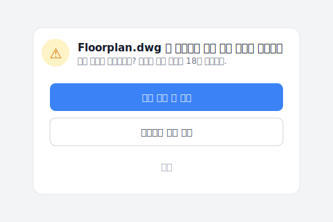

# 【2026 파일 관리】공유 폴더의 파일 버전 관리: _v8 이 팀의 연 83 시간 방어 세금을 훔치게 두지 마라

> 목요일 오후 5 시 30 분, 도면은 다 그렸는데, 손은 파일명 위에서 멈춰 있다. 공유 폴더 + 수동 명명 v1/v7/FINAL 의 대가: 연 83 시간 방어 세금. 왜 명명 규칙은 반드시 무너지는가, 그리고 자동 버전 관리가 어떻게 그 자리를 잇는가.

목요일 오후 5 시 30 분, 사무실이 점점 조용해진다. 사실 중정 평면도는 다 그렸다. 정시 퇴근해서 제대로 된 저녁을 먹을 수도 있었다. 하지만 손은 마우스 위에서 멈춰 있고, 화면 속 폴더를 노려본다.

안에는 `Floorplan_v6.dwg`, `Floorplan_v7_Client.dwg`, 그리고 `Floorplan_v7_FINAL_절대건드리지마.dwg` 가 누워 있다.

깊게 숨을 들이쉬고, 방금 저장한 파일을 우클릭, 조심스럽게 파일명을 `Floorplan_v8_제출본_0423.dwg` 로 바꾼다. 그리고 카카오톡을 열어 맞은편 동료에게 메시지: 「저기… 방금 v8 저장했어요. 입면도 수정하시려면 이 버전 받으세요, 제 거 덮어쓰지 마시고요.」

당신은 저장하는 게 아니라 보험을 사고 있다. 그 보험의 대가는 매일 조금씩 깎여 나가는 집중력과 퇴근 시간이다.

## 목차

- [보이지 않는 청구서는 불안으로 지불한다](#anxious-bill)
- [왜 공유 폴더의 명명 규칙은 반드시 무너지는가](#naming-failure)
- [공유 폴더 자동 버전 관리: _v8 을 사라지게 하라](#auto-버전-관리)
- [당신은 설계를 하고 있는가, 파일을 지키고 있는가?](#designer-or-guard)

---

## 보이지 않는 청구서는 불안으로 지불한다 {#anxious-bill}

Asana《[Anatomy of Work](https://asana.com/resources/why-work-about-work-is-bad)》연구에 따르면, 지식 근로자는 1 년에 83 시간을 「일에 관한 일」(work about work) 에 쓴다: 확인, 재확인, 진척 쫓기, 최신 버전 찾기. 더 넓게 계산하면 청구서는 더 커진다 — [McKinsey 의 Social Economy 연구는 직원들이 하루 약 1.8 시간, 한 주 근무 시간의 거의 5 분의 1 을 정보를 검색하고 모으는 데만 쓴다는 사실을 밝혀냈다](https://www.mckinsey.com/industries/technology-media-and-telecommunications/our-insights/the-social-economy). 하지만 이 숫자들은 차가운 숫자일 뿐, 그 감각을 묘사하지 못한다.

진짜 비용은 그 **사라지지 않는 마이크로 패닉**이다.

도면을 시공사에 보낸 뒤 갑자기 등에 식은땀이 흐른다. 폴더를 다시 열어 확인한다: 「잠깐, 방금 보낸 게 `v7_FINAL` 이었나, `v7_진짜_최종` 이었나?」. 상사가 「이게 최신 버전이지?」 물으면 즉시 끄덕이지 못한다. 「확인해 보겠습니다」 라고 한 뒤 접미사 더미 속에서 퀴즈 게임을 시작한다.

관리 문제가 아니다. 당신이나 팀이 산만한 것도 아니다. 당신들이 쓰는 도구가, 노력을 지키는 책임을 당신들의 연약한 기억에 통째로 떠넘겼기 때문이다.

---

## 왜 공유 폴더의 명명 규칙은 반드시 무너지는가 {#naming-failure}

도면이 덮어쓰이는 비극이 일어날 때마다 회사는 「폴더 정리 캠페인」을 시작한다. 모두 `날짜_프로젝트_버전_이름` 의 군대식 명명 규칙을 엄격히 따르라고 한다.

저도 예전 사무실에서 이 길을 시도해 봤어요. 처음 2 주는 전 부서가 얌전합니다. 6 주째가 되면 누군가 마감에 쫓겨 `_NEW` 를 저장하고, 하류 동료가 잘못된 버전으로 출도해 한 저녁을 다시 작업합니다. 3 개월 후 폴더는 다시 쓰레기 산이 됩니다. 어수선한 파일명들을 보고 있으면, 자신이 팀을 잘 관리하지 못한 게 아닌가 죄책감마저 듭니다.

자책하지 마세요. 이건 인간 본성에 반합니다. 머리에 배관 배치, 법규 검토, 설계 변경이 가득 차 있을 때, 손은 「덮어쓰일 거 같다」는 두려움에 본능적으로 `_FINAL` 을 칩니다. 명명 규칙은 **메커니즘 문제**를 **규율 문제**로 옷 입힌 것입니다: 규율은 마감에 부서지고, 메커니즘은 부서지지 않습니다.

두 번째 층의 문제도 있어요: 팀 중 한 명이 게을러서 `_NEW` 를 저장하면, 하류의 참조 체인이 연쇄 붕괴합니다. `.dwg`, `.psd`, `.indd`, `.xlsx`, 파일 간 reference 가 다 잘못 가리킵니다. 한 사람이 풀어지면, 팀 전체가 다시 작업합니다.

---

## 공유 폴더 자동 버전 관리: _v8 을 사라지게 하라 {#auto-버전-관리}

내일 아침 폴더를 열면 깨끗한 `Floorplan.dwg`, `Brand_Brief.psd`, `Budget.xlsx` 만 있어요. `_v7_FINAL_절대건드리지마` 접미사는 없습니다.

파일을 열고 수정하고 저장하고 닫습니다. 망설임 없음, 이름 변경 없음, 바탕화면 백업 없음, 단톡방 공지 없음. 시스템이 밑단에서 모든 변경을 조용히 기억해 줬으니까요. 하청이 어제 설계를 실수로 덮어써도 멘붕할 필요가 없어요. 타임라인을 열어서 3 초 안에 버전을 원래대로 끌어옵니다.

저장하지 않은 채 다른 프로젝트 폴더로 넘어가려 하면 Keeply가 한마디 알려줍니다 — 오후 내내 작업한 게 18분 전 자동 저장 하나에 매달리지 않도록:

「버전 저장 후 전환」을 누르면, 오후의 수정분이 다음 자동 저장에 휘둘리지 않고 이름 붙은 버전으로 그대로 고정됩니다.

지금 팀에서 쓰고 있는 방법들을 나란히 놓으면, 각자 다루는 층이 완전히 다르다는 게 보입니다:

| 방법 | 무엇을 푸는가 | 무엇을 안 푸는가 | 팀에 맞는가 |
|---|---|---|---|
| 엄격한 명명 규칙 (`날짜_프로젝트_v1_이름.dwg`) | 형식상 버전 보존 | 인간 본성에 반함, 4 주 뒤 누군가 풀어짐 | 단기 가능, 장기 불가 |
| 동기화 도구 (Dropbox / OneDrive / Google Drive) | 다인 실시간 공유, 로컬 파일 분실 방지 | 동료가 당신 버전을 덮어써도 알림 없음 | 절반 |
| 클라우드 Office 변경 기록 (Word / Google Docs) | 텍스트 파일에서 누가 어떤 문장을 바꿨나 | 설계 파일 (.dwg / .psd / .indd) 완전 미지원 | 텍스트는 OK, 설계는 불가 |
| 도구 층 자동 버전 ([Keeply](https://keeply.work)) | 저장마다 자동 기록, 누가-언제-무엇을 변경했나 한눈에 | 디스크 전체의 물리적 파손 ([3-2-1 백업 원칙](/ko/post/3-2-1-backup-rule/) 과 병용) | 대응 |

각 도구는 제 맥락에서 맞아요. 문제는 팀 협업이라는 전장이 **동시에** 「저장마다 자동으로 버전을 남긴다」 + 「파일 간 참조가 끊기지 않는다」 층을 필요로 하는데, 이 층을 전문으로 하는 전통 도구가 없다는 거예요.

- ✅ **신뢰 신호**: Keeply 설치 1 주일 후, 폴더에는 `Floorplan.dwg`, `Brand_Brief.psd`, `Budget.xlsx` 만. `_v8_FINAL_진짜_최종` 접미사 없음. 지난주 버전이 필요하면 타임라인 클릭 한 번.
- ❌ **실패 지점**: 1 주 지나도 `_v6 _v7 _final` 접미사 파일을 지울 용기가 안 남. Keeply 가 「되찾을 수 있다」는 신뢰를 만들지 못한 거고, 도구나 워크플로가 안 맞는다는 뜻.

소프트웨어 업계는 십수 년 전에 「도구가 매 버전을 자동으로 기억하게 한다」를 워크플로에 넣었습니다. 하지만 이 층은 건설, 건축, 설계, 연구 산업에는 이식되지 않았어요. 우리는 여전히 수동으로 `_v7` 을 붙여 재난과 싸우고 있습니다. 제가 Keeply 로 메우려 한 게 바로 이 gap 입니다.

다만 솔직히 말하자면, Keeply 는 [3-2-1 백업 원칙](/ko/post/3-2-1-backup-rule/) 을 대체하지 않습니다. SSD 전체 고장, 사무실 화재, 클라우드 계정 잠김, 이런 상황은 백업 도구의 영역이지 버전 기록 도구의 영역이 아닙니다. Keeply 는 「일상 작업 중의 버전 수호」이지 「재난 복구」가 아닙니다.

---

## 당신은 설계를 하고 있는가, 파일을 지키고 있는가? {#designer-or-guard}

이 1 년 83 시간의 방어 세금, 충분히 오래 내 왔어요. 다음에 손이 무의식적으로 `_v8` 을 향할 때, 잠시 멈추고 자신에게 물어 보세요:

**나는 설계를 하고 있는가, 파일을 지키고 있는가?**

---

목요일 오후 5 시 30 분, 파일명 위에 멈춘 손의 그 순간을 기억하세요? 더는 파일의 수호자 노릇을 안 해도 됩니다. **Keeply: 당신의 파일 관리 수호자**, 한 번 한 번의 변경을 대신 기억해 줘요. 버전 기록은 지금의 폴더 안에 살아요. 이사도 도구 교체도 없어요.

[Keeply 제대로 알아보기 →](https://keeply.work)

## 더 읽을 거리

메인 글 [파일 버전 관리 완전 가이드](/ko/post/file-version-management-complete-guide/) 가 4 가지 구조적 이유를 풀어요. 왜 도구가 당신이 정말 필요한 것을 위해 설계되지 않았는가.

---

## 출처

- [Asana, Anatomy of Work — Why Work About Work Is Bad](https://asana.com/resources/why-work-about-work-is-bad)
- 관련 참고: [IDC, The High Cost of Not Finding Information (2012)](https://computhink.com/wp-content/uploads/2015/10/IDC20on20The20High20Cost20Of20Not20Finding20Information.pdf)・[McKinsey Global Institute, The Social Economy (2012)](https://www.mckinsey.com/industries/technology-media-and-telecommunications/our-insights/the-social-economy)

---

> 저자: Ting-Wei Tsao, Keeply 창업자.
> [LinkedIn](https://www.linkedin.com/in/ting-wei-tsao-b57480152/)
