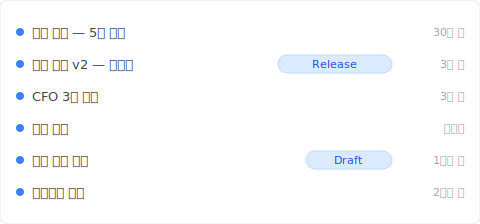
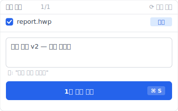

# 【2026 파일 관리】한글 파일 복구: HWP 3가지 복구 메커니즘 + Keeply가 채우는 시간 축

> 한컴 한글에는 3가지 복구 메커니즘이 내장되어 있습니다. 그런데 사용자들은 이 셋을 하나로 혼동합니다 — 각각 다른 문제만 해결합니다.

"논문 마감 전날, 한글이 갑자기 종료되어 저장하지 않았습니다 — 한글을 열면 '자동 복구' 팝업이 뜨고 3시간 작업의 80%가 돌아왔습니다. 그런데 3주 전 그 제안 버전을 봐야 합니다 — ~AutoSave/ 폴더를 뒤져도 없습니다."

이것이 한글 내장 3가지 복구 메커니즘(자동 저장 / 임시 저장 / 백업파일)의 실제 한계입니다: **비정상 종료 + 직전 버전만 해결하고, 시간 기록은 해결하지 못합니다**. 이 글은 3가지 메커니즘의 차이를 분해하고 [Keeply](https://keeply.work) 외부 도구 타임라인으로 보완하는 방법을 보여줍니다.

## 목차

1. [Keeply가 HWP 파일을 "3주 전 버전도 찾을 수 있게" 만드는 방법](#keeply-timeline)
2. [HWP 3가지 복구 메커니즘: 자동 저장 / 임시 저장 / 백업파일의 차이](#three-mechanisms)
3. [자동 저장: 비정상 종료 복구용, 버전 기록 아님](#autosave)
4. [임시 저장 .bak: 1개 직전 버전 백업, 다음 저장으로 덮어쓰임](#bak)
5. [백업파일: 환경 설정으로 활성화 가능, 여전히 1-2 버전 제한](#backup-file)
6. [3가지 메커니즘이 모두 실패하는 실제 시나리오](#failure-scenario)
7. [Keeply 보완: 외부 도구 타임라인 + Release 잠금](#keeply-fills)
8. [HWP에서 Keeply가 필요 없는 3가지 시나리오](#when-not-needed)
9. [자주 묻는 질문](#faq)

---

## Keeply가 HWP 파일을 "3주 전 버전도 찾을 수 있게" 만드는 방법 {#keeply-timeline}

실제 상황을 봅시다. 지영은 공무원으로 한글로 월간 보고서 `report.hwp`를 작성합니다. 반년 동안 100번 이상 저장이 누적되었습니다. 오늘 상사가 갑자기 "3주 전에 보낸 그 버전의 그 부분을 다시 보여주세요"라고 묻습니다. 한글의 "최근 문서"를 열어도 가장 오래된 것은 지난주뿐. `~AutoSave/`를 열어도 비정상 종료 임시 파일만 남아 있습니다. `report.hwp.bak`을 열어도 최근 1버전만 있습니다. **3가지 복구 메커니즘이 모두 3주 전 버전을 살릴 수 없습니다**.

[Keeply](https://keeply.work)로 전환하면 그렇지 않습니다. 같은 `report.hwp`의 Keeply 타임라인은 이렇게 보입니다:

"상사 제출 v2 — 월간 보고서"가 자체 행과 Release 태그를 가집니다 — 지영이 3주 전 상사에게 보낼 때 Keeply 메인 창에서 "버전 저장"을 누르고 메모를 작성한 것입니다:

"상사 제출 v2 — 월간 보고서"를 한 줄 작성하고 버전을 저장. 3주 후 Keeply 타임라인에서 태그를 보면 바로 — **한글 내장의 제한된 임시 폴더에 묶이지 않습니다**.

2가지 동작만:

1. **저장** — 한글에서 Ctrl+S(평소대로). 한글이 `.hwp`를 폴더에 작성. Keeply가 백그라운드에서 30분 내에 변경을 감지하고 **자체 타임라인**에 한 버전을 자동 저장.
2. **마일스톤 태그** — 중요 순간(상사 제출 / 고객 확인 / 월말 봉인)에 Keeply 메인 창에서 "버전 저장"을 누르고 메모 작성.

아래에서 한글 자체 3가지 메커니즘을 분해 — 왜 3가지가 모두 부족한지.

## HWP 3가지 복구 메커니즘 {#three-mechanisms}

한글의 "파일 복구"는 실제로 3가지 다른 것이 하나로 혼합된 것입니다:

| 메커니즘 | 내용 | 한도 | 트리거 |
|---|---|---|---|
| **자동 저장** | 비정상 종료 임시 파일 | 기본 10분마다 1개 사본을 `~AutoSave/`에 저장 | 한글이 능동적으로 작성, 비정상 종료/강제 종료 시에만 유용 |
| **임시 저장 .bak** | 직전 버전 백업 | **1개 버전**(다음 저장으로 덮어쓰임) | 저장할 때마다 자동 생성 |
| **백업파일** | 환경 설정으로 활성화 가능 | 보통 1-2 버전 | 저장 시마다(설정 시) |

3가지 다른 것 — 하나로 혼동하면 잘못된 계층을 찾게 됩니다. "3주 전 버전 찾기"는 자동 저장 임시가 이미 삭제됐을 수도, .bak이 새 저장으로 덮어쓰였을 수도, 백업파일이 활성화되지 않았을 수도 있습니다. **각 메커니즘은 한 가지 시나리오만 해결합니다**.

## 자동 저장: 비정상 종료 복구용, 버전 기록 아님 {#autosave}

한글 [환경 설정 → 자동 저장](https://help.hancom.com/hoffice/multi/ko_kr/hwp/file/options/options(autosave).htm)은 기본 10분마다 1개 사본을 `~AutoSave/`에 저장합니다(경로 변경 가능).

**다음 경우에만 유용**:

- 한글 비정상 종료(응용 프로그램 오류)
- 강제 종료(작업 관리자에서 종료)
- 시스템 정전 / 강제 재부팅
- 저장하지 않고 창을 닫음, 다음에 열 때 "복구하시겠습니까?" 알림

"버전 기록"과는 **완전히 다른 계층**: 자동 저장은 여러 버전을 보관하지 않으며(가장 최근 1개 임시만), "3주 전 그 버전"을 찾을 수 없습니다.

자세한 메커니즘은 [Photoshop 자동 저장도 버전 기록이 아님](/ko/post/photoshop-autosave-not-version-history/)을 참조 — Adobe의 동일한 혼동 메커니즘.

## 임시 저장 .bak: 1개 직전 버전 백업 {#bak}

HWP 파일을 저장할 때마다 같은 폴더에 `<filename>.bak` 사본이 자동 생성됩니다 — 이전 저장 직전 버전.

**중요한 제한**:

- **1개 버전만**: 저장마다 이전 `.bak`을 덮어씁니다, 버전 누적 없음
- **"이번 버전 잘못 저장" 시나리오 해결**: 더 이전 버전은 복구 불가
- **숨김 파일 옵션**: 환경 설정에서 이 기능을 끌 수 있음(기본은 켜져 있음)

사용자 오해: ".bak은 버전 기록이다" ❌. 실제로는 "가장 최근 1개 버전"만 기록.

## 백업파일: 환경 설정으로 활성화 가능 {#backup-file}

한글 환경 설정 → 백업파일 / 임시저장에서 자동 .bak 생성을 활성화할 수 있습니다. 활성화한 사람에게는 위의 .bak과 같은 메커니즘입니다(설정 위치만 다를 뿐).

**여전히 1-2 버전 제한**이며, 진정한 버전 기록이 아닙니다. "3주 전 버전" 요구사항에는 도움되지 않습니다.

## 3가지 메커니즘이 모두 실패하는 실제 시나리오 {#failure-scenario}

지영의 시나리오 분석:

| 시나리오 | 자동 저장이 해결? | .bak이 해결? | 백업파일이 해결? |
|---|:---:|:---:|:---:|
| 한글 비정상 종료, 저장 안 함 | ✅ | ❌ | ❌ |
| 이번 버전 잘못 저장, 직전 버전으로 | ❌ | ✅ | ⚠ 설정에 따라 |
| **3주 전 상사 제출 그 버전 찾기** | ❌ | ❌ | ❌ |
| **지난달 초안 제안 그 버전 찾기** | ❌ | ❌ | ❌ |
| 고객이 "2월 14일 확인한 그 버전" 요청 | ❌ | ❌ | ❌ |

아래 3개 ❌는 "시간 차원" 요구사항 — HWP 내장 3가지 메커니즘에 이 계층이 없습니다.

## Keeply 보완: 외부 도구 타임라인 + Release 잠금 {#keeply-fills}

지영은 "3주 전 그 버전"을 어떻게 해결할까요? [Keeply](https://keeply.work)로 전환. 3가지를 하나의 도구로:

- **외부 도구 타임라인**: Keeply는 폴더를 감시하고 Ctrl+S마다 1개 버전을 **자체 타임라인**에 저장 — 한글 내장의 제한된 `~AutoSave/`에 의존하지 않음, 반년 동안 반년 버전 기록 보관(1-2 버전 아님)
- **Release 잠금**: 3주 전 상사에게 보낼 때 Keeply "버전 저장"을 누르고 "상사 제출 v2" 태그 — 이 버전은 독립 스냅샷으로 동결, **이후 저장으로 덮어쓰이지 않음**, 영구 보존
- **파일별 노트**: 각 버전에 1-2줄 노트 작성 가능("상사 제출 v2", "고객이 3장 수정 요청"), 3주 후 타임라인에서 태그를 보면 즉시 찾기

HWP 자체 자동 저장 / .bak과 병행 작동, 충돌 없음. 한글이 비정상 종료 + 직전 버전을 해결, Keeply가 시간 기록 + 중요 버전 잠금을 보완.

## HWP에서 Keeply가 필요 없는 3가지 시나리오 {#when-not-needed}

솔직히 말하자면:

**잠금 환경 / 정부 / 교육 기관**. 공무원이나 교사이고 IT가 통일적으로 배포한 잠금 PC(외부 소프트웨어 설치 불가)를 사용한다면 — 이 계층은 강요하지 마세요, IT 부서의 중앙 백업 정책(Veeam / Acronis)을 따르세요. Keeply는 개인 PC / 중소기업 / SOHO 용 도구이며 컴플라이언스 아카이브가 아닙니다.

**한글 viewer로 받은 파일만 보는 경우**. 능동적으로 편집하지 않고 한글 viewer로 다른 사람의 `.hwp`만 본다면 — 버전 관리 요구가 없으므로 Keeply 설치 불필요.

**단일 파일을 1-2회 저장 후 제출**. 일회성 짧은 문서(공문 회신 / 1쪽 통지)는 1-2회만 저장하므로 타임라인이 필요 없음 — HWP 내장 .bak으로 충분.

## 자주 묻는 질문 {#faq}

**Q1: HWP 자동 저장은 어디에 저장되나요?**

기본 `~AutoSave/`(한글 환경 설정 → 자동 저장에서 경로 변경 가능). 기본 10분마다 1개 사본 저장, 비정상 종료 / 강제 종료 시에만 유용, 다음에 열 때 알림. 버전 기록이 아니며 3주 전 버전을 찾을 수 없음.

**Q2: HWP .bak과 자동 저장의 차이?**

.bak은 직전 버전 백업(매 저장마다 자동 덮어쓰기 갱신), 1개 버전만 보관. 자동 저장은 비정상 종료 임시, 버전 기록과 완전히 다른 계층.

**Q3: HWP 백업파일은 신뢰할 수 있나요?**

여전히 1-2 버전 제한, 진정한 버전 기록이 아님. "3주 전 버전" 요구사항에 부족.

**Q4: 3가지 메커니즘이 모두 실패하면 3주 전 버전을 어떻게 찾나요?**

HWP 내장으로는 복구 불가. 외부 도구로 버전을 지속 백업 — 예: [Keeply](https://keeply.work) 외부 도구 타임라인.

**Q5: Keeply는 한컴오피스와 충돌하나요?**

충돌하지 않음, 병행 운영. 한글은 비정상 종료 / 직전 버전 해결, Keeply는 무제한 타임라인 보완.

**Q6: 공무원 / 교사, 외부 소프트웨어를 설치할 수 없으면?**

잠금 환경은 IT 중앙 백업 정책(Veeam / Acronis) 따르기, Keeply 개인 도구로 적합하지 않음.

## 더 보기

메인 [파일 버전 관리 완전 가이드](/ko/post/file-version-management-complete-guide/).

병행 읽기:
- [Photoshop 자동 저장은 버전 기록이 아님](/ko/post/photoshop-autosave-not-version-history/) — Adobe의 동일한 자동 저장 ≠ 버전 기록 혼동
- [Excel 버전 기록의 한계](/ko/post/excel-version-history-limits/) — Office의 동일한 메커니즘 갭 패턴
- [Keeply가 백업 및 클라우드 도구와 다른 점](/ko/post/what-keeply-saves-vs-backup-cloud/)

---

지영은 월말에 월간 보고서를 제출합니다. 한글이 3번 비정상 종료, 자동 저장이 매번 오늘의 작업을 살려줍니다.

그러나 상사가 갑자기 "3주 전 그 버전"을 묻습니다 — 자동 저장 / .bak / 백업파일 3가지 모두 건져낼 수 없습니다.

한컴은 이미 3가지 메커니즘을 문서에 적어두었습니다. 한글이 변하지 않는 것이 아니라, 한글이 시간 기록까지 살리지 못할 때 받쳐줄 도구가 필요합니다.

---

> 저자 소개: Ting-Wei Tsao, [Keeply](https://keeply.work) 창립자.
> [LinkedIn](https://www.linkedin.com/in/ting-wei-tsao-b57480152/)
