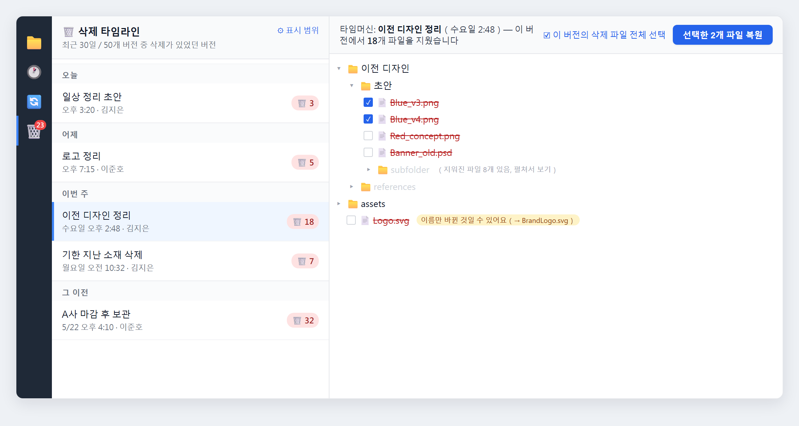
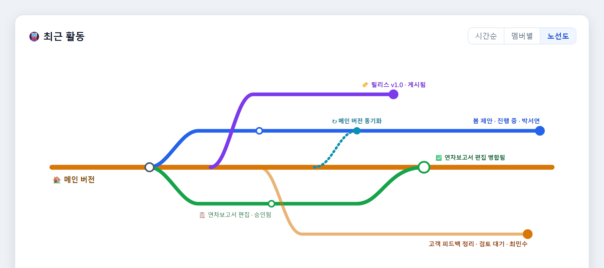

1.0.12에서 1.0.13로 넘어오면서 우리가 가장 공을 들인 일은 하나였습니다. 바로 "실수로 지운 파일을 되찾는 일"을 여러분이 믿고 쓸 수 있는 화면으로 만드는 것이었죠. 그리고 오랫동안 준비해 온 팀 협업도 완성에 가까워졌습니다. 이번 버전에서 먼저 한눈에 보여 드립니다.

Keeply를 열면 익숙한 폴더 화면이 펼쳐집니다. 칸칸이 놓인 파일과 폴더, 그리고 왼쪽에는 여러분이 저장한 매 버전을 기록한 타임라인이 있죠. 이번에 추가된 기능도 같은 흐름을 따릅니다. 파일 하나를 누르면 그 이력을 보고, 실수로 지웠다면 타임라인에서 되찾는 식입니다.

## 🆕 새 기능

### 삭제 타임머신: 실수로 지운 파일 되찾기

예전에는 파일을 잘못 지워서 휴지통에도 남아 있지 않으면 대개 포기할 수밖에 없었습니다. 이번에는 이를 위한 전용 화면을 만들었습니다. 왼쪽 도구 모음의 🗑️ 를 누르면 "삭제 타임라인"이 나타나고, 오늘 / 어제 / 이번 주 / 그 이전으로 묶여 보입니다. 각 항목 오른쪽에는 "🗑️ N"이 붙어 있어, 그 시점에 파일을 몇 개 지웠는지 알려 줍니다.

항목 하나를 누르면 오른쪽에 그 시점의 파일 트리가 타임머신처럼 펼쳐지고, 지워진 파일이 있던 위치로 자동으로 이동합니다. 실제로 지워진 파일은 빨간 취소선으로 표시됩니다. 알고 보니 이름만 바뀐 경우라면 옆에 "이름만 바뀐 것일 수 있어요"라는 작은 안내가 붙어, 괜한 헛수고를 덜어 줍니다.

원하는 파일을 골라(그 버전에서 지운 파일을 한 번에 모두 선택할 수도 있습니다) "선택한 N개 파일 복원"을 누르고 저장할 폴더(기본값은 바탕화면)를 정하면, 원래 폴더 구조 그대로 되살려 줍니다. 파일 이름이 겹치면 기본적으로 `_restored` 접미사를 자동으로 붙여, 지금 있는 파일을 덮어쓰지 않습니다.

### 파일 하나만 골라, 그 버전 이력만 보기

타임라인은 그동안 폴더 전체의 버전을 보여 줬습니다. 하지만 정작 "이 파일 하나가 대체 몇 번 바뀌었나"만 알고 싶을 때가 많죠. 이제는 그 파일을 한 번 누르기만 하면, 왼쪽 메인 타임라인이 그 파일의 이력만 남깁니다. 다 보고 나서 "전체 버전으로 돌아가기"를 누르면 원래 타임라인으로 돌아옵니다.

### 파일 탐색기, 더 보기 좋고 더 쓰기 편하게

- **어떤 파일이 바뀌었는지 한눈에**: "변경" 탭에서 손대지 않은 파일은 흐리게, 바뀐 파일은 도드라지게 표시되어 일일이 비교할 필요가 없습니다.
- **폴더 카드화 + 선택 상태**: 폴더를 카드형 아이콘으로 바꿨고, 누르면 선택된 모습이 분명하게 보입니다.
- **마우스 오른쪽 메뉴 통일**: 어떤 화면에서든, 파일이든 폴더든 오른쪽 버튼을 누르면 메뉴가 똑같습니다.
- **F5로 한 번에 새로 고침**: 익숙한 그대로, F5를 누르면 지금 화면을 새로 고칩니다.

## 🔭 곧 공개: 팀 협업 (미리보기)

먼저 분명히 해 둘게요. 팀 협업은 **이번 버전에서는 아직 정식 공개하지 않았습니다**. 다만 앞으로의 방향을 먼저 한 번 보여 드리고 싶었습니다. 1.0.13에서 내부적으로 가장 많은 힘을 쏟은 영역으로, 협업 과정 전체를 하나의 완결된 흐름으로 다듬어 두었습니다. 다듬기가 끝나면 모두에게 열어 드리겠습니다.

앞으로 공개될 내용은 다음과 같습니다.

- **검토 요청부터 병합까지 한 흐름으로**: 팀원이 작업 사본을 관리자에게 설명과 함께 검토 요청하면, 관리자는 파일마다 의견을 남기고 승인하거나 반려합니다(반려할 때는 이유를 적습니다). 승인되면 병합하고, 팀원 쪽에서 한 번에 마무리합니다. 검토 기록은 기기 간에 동기화되어 어느 한 컴퓨터에만 남지 않습니다.
- **업무 지정과 추적**: 관리자가 업무를 배정하면 팀원이 한 번에 시작합니다. 업무는 하위 항목으로 나눠 체크하며 진행 상황을 볼 수 있고, 검토 요청 / 승인 / 반려가 업무 상태에 자동으로 반영됩니다.
- **팀 활동 "노선도"**: 지하철 노선도처럼 생긴 그림으로, 본줄기는 메인 버전이고 팀원 각자의 작업 사본은 갈라져 나온 지선입니다. 누가 작업 중인지, 어느 줄기가 병합됐는지, 어느 줄기가 아직 검토 중인지 한눈에 들어옵니다.
- **기존 폴더를 "팀 원본"으로 전환**: 이미 Keeply로 관리하던 폴더를 곧바로 팀 원본으로 설정할 수 있고, 팀원이 합류하면 권한을 그대로 이어받아 각자 따로 구매하지 않아도 됩니다.

공개 시점은 아직 정해지지 않았으며, 준비되는 대로 알려 드리겠습니다. 팀 협업을 기다리고 계셨다면 "문제 신고"에서 어느 부분을 가장 먼저 받고 싶은지 알려 주세요.

## ✨ 사용성 개선

- 버전 저장, 동기화, 복원이 모두 백그라운드에서 진행되도록 바뀌어, 작업하는 순간에 화면이 멈추지 않습니다.
- 알림성 메시지는 오른쪽 아래 떠 있는 형태로 옮겨, 더 이상 메인 화면을 가리지 않습니다.
- 타임라인의 필터 문구에서 기술 용어를 덜어내고, 누구나 알아볼 수 있는 표현으로 바꿨습니다.
- 문제를 신고할 때 Keeply가 올바른 버전 번호를 자동으로 함께 보내, 어느 버전의 상황인지 더 빠르게 파악할 수 있습니다.

## 🛡️ 수정 및 안정성

- 삭제 기능 공개 후 실제 사용에서 발견된 문제들을 한 무더기 바로잡았습니다.
- 백업 위치: 드라이브 문자를 네트워크 경로로 바꿀 때 "상한에 걸려 멈추는" 문제와 "옛 위치가 이미 없는데도 잘못 빨간 오류를 띄우는" 문제를 고쳤습니다.
- 안전한 버전 저장의 점검을 더 꼼꼼하게 했습니다. 사전 스냅샷이 실제로 실패하면, 무리하게 진행하지 않고 위험한 작업을 중단합니다.
- 기반 구성 요소를 정기적으로 갱신하고, 알려진 보안 취약점을 한 무더기 보완했습니다.

## 🔒 개인정보 관련

이번 버전에 "익명 사용 통계" 동의 설정을 추가했습니다. 여러분이 동의한 경우에만 개인정보가 담기지 않은 사용 신호를 보내, 어떤 기능이 쓰이고 있는지 우리가 파악하는 데 도움을 줍니다. 기본적으로 언제든 설정에서 끌 수 있으며, 게다가 이 기능은 **2026년 7월 15일이 되어서야 실제로 켜집니다**. 그 전에 App 안에서 30일 전 미리 공지하므로, 소리 없이 시작되는 일은 없습니다.

## ⬇️ 다운로드 및 업그레이드

[keeply.work](https://keeply.work)에서 1.0.13을 내려받을 수 있습니다. 이미 설치하셨다면 업데이트가 자동으로 전달됩니다.

이번 버전에는 **Intel Mac**도 추가했습니다. Apple Silicon뿐 아니라, Intel 프로세서를 쓰는 Mac에서도 이제 알맞은 설치 파일을 받을 수 있습니다.

삭제 복구, 파일별 타임라인은 이미 여러분 손에 들어갔고, 팀 협업도 머지않았습니다. 다음에 무엇을 만들지는 여러분의 의견에 크게 달려 있습니다. 써 보시고 떠오르는 생각이 있다면 Keeply 안의 "문제 신고"로 바로 알려 주세요. 제가 직접 보겠습니다.

---

> 글쓴이 소개: Ting-Wei Tsao, [Keeply](https://keeply.work) 창업자. [LinkedIn](https://www.linkedin.com/in/ting-wei-tsao-b57480152/)
