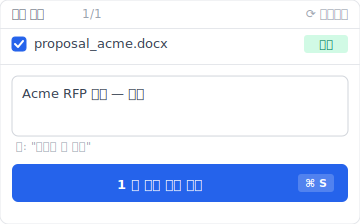
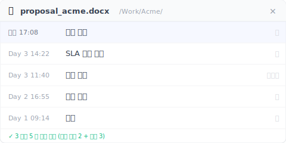
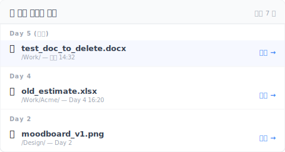
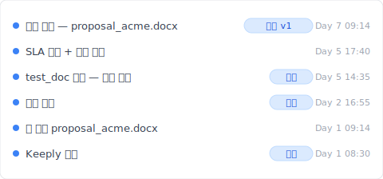

# 【2026 파일 관리】Keeply 튜토리얼: 첫째 주 아무것도 하지 말 것, Day 1·3·5 에서 3 가지 진짜 신호를 본다

> Keeply 설치 후 설정 마법사로 달려가지 마세요. 첫째 주 실제 업무일을 시금석으로 자동 버전 추적, 수정 리듬, 삭제 복원 3 가지 신호를 검증합니다. 마음에 안 들면 Day 7 에 바로 제거, 부담 없는 평가.

## 목차

- [왜 다단계 설정 마법사가 신규 사용자를 Day 1 에 이탈시키는가](#setup-fatigue)
- [Keeply 의 베팅: 7 일 동안 진짜 워크플로가 증거를 만들게 한다](#core-bet)
- [Day 1: 파일을 추가하고 Keeply 가 어떻게 기록하는지 본다](#day-1)
- [Day 3: 파일을 수정하고 Keeply 가 몇 개 버전을 남기는지 본다](#day-3)
- [Day 5: 파일을 삭제하고 다시 살릴 수 있는지 본다](#day-5)
- [Day 7 판정: 세 가지가 모두 보였는가?](#day-7)
- [솔직한 경계: 이 세 가지 상황에서는 Keeply 를 쓰지 마라](#limits)
- [Day 7 이후](#next-week)

---

설치를 마치고 설정 체크리스트를 돌리거나, 아무것도 하지 않고 평소의 한 주를 보내거나.

두 번째 길이 Keeply 가 당신을 위해 설계한 길이다. 다운로드를 마친 대부분의 소프트웨어는 첫 화면에서 "환영합니다! 5 단계 설정을 시작합시다"라고 들이댄다. Keeply 는 다르다: 열어도 거의 아무것도 묻지 않는다. 안내 마법사도 없고, "작업 모드를 선택하세요"도 없고, 체크리스트도 없다.

내가 Keeply 를 만들기 전에도 여러 도구를 시험해 봤다. 첫째 주의 고통은 늘 같다: 열면 튜토리얼 영상, 통합 옵션, 설정 단계가 한 겹씩 쌓인다. 쓰기도 전에 이미 지치고, 도구가 가장 필요한 순간에 사람은 지쳐 있다.

그래서 Keeply 의 베팅은 이렇다: 첫째 주, 평소의 업무 일상이 자연스럽게 흘러가게 둔다. 2-3 일에 한 번 Keeply 를 열어서 뒤에서 무엇이 기록되었는지 확인한다. Day 7 에는 7 일치 진짜 증거가 손에 있다.

구체적으로 어느 날? 당신이 할 세 가지:

- **Day 1**: 파일을 **추가**한다
- **Day 3**: 파일을 **수정**한다
- **Day 5**: 파일을 **삭제**한다

이 세 가지는 버전 관리 도구가 다뤄야 할 대상이다. 도구가 이것들을 보지 못하면 두는 의미가 없다. 자연스럽게 보고 자연스럽게 처리하면, Day 7 에 당신은 답을 얻는다.

---

## 왜 다단계 설정 마법사가 신규 사용자를 Day 1 에 이탈시키는가 {#setup-fatigue}

내가 Keeply 첫 버전을 만들 때도 5 단계 설정 마법사를 내장하려고 했다. 신규 사용자와 세 차례 테스트한 뒤, 마법사를 통째로 뜯어냈다.

문제는 "마법사를 잘못 썼다"가 아니다. 문제는 신규 사용자가 Day 1 에 마법사의 질문에 답할 **context 를 아직 갖지 못했다**는 점이다:

- "작업 모드를 선택하세요": 내가 어느 모드인지 어떻게 아나, 방금 설치했다
- "추적할 폴더를 선택하세요": 어느 게 중요한지 어떻게 아나, 이 도구에 아직 아무것도 안 넣었다
- "매일 / 매주 / 저장마다의 스냅샷 빈도를 설정하세요": 합리적인지 판단할 baseline 이 없다
- "제외 목록을 설정하세요": 앞으로 어떤 쓰레기 파일을 실수로 저장할지 모른다
- "클라우드 계정을 연결하세요": 방금 설치했는데, 왜 계정을 넘겨야 하나

5 단계 마법사, 5 개의 context 없는 결정. 대부분의 신규 사용자는 1 단계에서 창을 닫고, 24 시간 안에 이 app 은 또 하나의 설치가 끝나지 않은 아이콘이 된다.

수동 관찰 경로는 정반대다: 당신은 아무것도 답하지 않는다. Keeply 가 7 일 동안 당신이 한 일을 본다. Day 7 에는 **당신이 context 를 가지고 있다**. 그때 계속할지, 설정을 열지 결정한다.

---

## Keeply 의 베팅: 7 일 동안 진짜 워크플로가 증거를 만들게 한다 {#core-bet}

구체적으로 어느 날? 당신이 할 세 가지: 추가, 수정, 삭제. 각각이 하나의 관찰일에 대응되고, 2 일 간격이라 매일 Keeply 를 열 필요가 없다.

각 이벤트 뒤에 나는 체크리스트 두 줄을 준다: "✅ 신뢰 신호"는 "X 가 보이면 도구 합격", "❌ 실패 지점"은 "Y 가 보이면 이 도구는 당신에게 안 맞는다". 둘 다 중요하다: 앞쪽은 광고고, 뒤쪽이 깔끔한 이탈 조건을 준다.

---

## Day 1: 파일을 추가하고 Keeply 가 어떻게 기록하는지 본다 {#day-1}

Keeply 설치 후 첫 번째 업무일, 적어도 한 파일은 추가한다. 새로 연 Word 보고서, 새로 저장한 PDF, 새로 만든 디자인 파일일 수도 있다. 버전 관리 도구의 첫 시금석이다.

당신은 아무것도 안 해도 된다. 평소 저장하던 곳에 저장하면 된다. 바탕화면, Documents, 공유 폴더, 클라우드 동기화 폴더 — Keeply 는 다 본다.

점심 먹기 전에 Keeply 를 한 번 열어 본다. 그 파일이 Keeply 화면에 나타나고, 옆에 타임스탬프가 있어야 한다. 복잡한 메뉴 없고, "이 파일을 추적하시겠습니까?" 팝업 없다. 자동으로 보였다.

한 단계 더 해 보고 싶다면 "버전 저장" 버튼을 누르고 한 줄짜리 메모를 적는다. Keeply 가 사이드 패널을 띄워 메모란을 보여 줍니다:

메모란에는 무엇을 적어도 좋다 — "kickoff 후 첫 버전" "고객 방문 후 수정" 같은 일상 언어가 가장 쓸모 있다. 6 개월 뒤 버전 기록을 스크롤할 때, 그 한 줄이 기억의 닻이 됩니다.

- ✅ **신뢰 신호**: 추가한 파일을 Keeply 에 "추가할" 필요가 없다. 자동으로 화면에 나오고 타임스탬프가 붙는다.
- ❌ **실패 지점**: 추가한 파일이 Keeply 화면에서 찾을 수 없다. 이 도구가 당신 환경에 맞지 않는다는 뜻. Day 1 에 답이 나오는 게 Day 30 에 깨닫는 것보다 낫다.

---

## Day 3: 파일을 수정하고 Keeply 가 몇 개 버전을 남기는지 본다 {#day-3}

Day 3 의 관찰은 Day 1 보다 조금 더 어렵다: 어제 그 파일을 수정한다.

파일이 수정되는 방식은 보통 이렇다: 아침에 열어서 조금 고치고 Cmd+S, 계속 고치고 다시 Cmd+S, 점심에 한 번 저장, 오후 퇴근 전에 마지막 저장. 한 업무일 동안 같은 파일을 10-20 번 저장할 수 있다.

문제: 버전 관리 도구가 몇 개 버전을 남겨야 할까? 너무 많이 (Cmd+S 마다 하나) 남기면 밤에 17 개의 거의 똑같은 버전을 보게 되고, 무용지물이다. 너무 적게 (하루에 마지막 한 개만) 남기면 아침의 수정이 사라지고, 버전 관리 없는 것과 같다. Keeply 의 설계는 "의미 있는 저장"이 어느 것인지 스스로 판단한다. 점심 먹기 전 저장이 한 버전, 퇴근 전 저장이 한 버전. 중간의 작은 수정들은 각각 따로 남지 않는다.

Day 3 저녁, 그 파일의 버전 패널을 열면 17 개가 아니라 2-4 개가 보여야 한다. 각각 타임스탬프가 있다. 어느 것을 클릭하든 그 상태로 돌아간다.

실제로 열어 보면 이런 모습 — `proposal_acme.docx` 가 Day 1 초안부터 오늘 고객 사인오프까지 3 일 동안 5 개 버전이 쌓였습니다 (당신이 손으로 메모를 적은 2 개 + 자동 저장 3 개):

"자동" 행은 Keeply 가 백그라운드에서 조용히 남긴 것이고, "당신" 행은 결정을 내린 순간에 능동적으로 표시한 것이다. 6 개월 뒤에는 메모 열만 읽으면 어느 버전이 무엇인지 안다 — 기억력에 기대지 않아도 됩니다.

- ✅ **신뢰 신호**: 버전 패널에 2-4 개의 타임스탬프 붙은 핵심 버전, 각각 클릭으로 복원 가능, 17 개 잡다한 기록 아님.
- ❌ **실패 지점**: 17 개 거의 똑같은 버전, 또는 1 개만 남았다. 당신의 수정 리듬에 맞지 않는다는 뜻.

버전 기록 설계의 더 깊은 이론은 [Pillar: 파일 버전 관리 완전 가이드](/ko/post/file-version-management-complete-guide/) 참조.

---

## Day 5: 파일을 삭제하고 다시 살릴 수 있는지 본다 {#day-5}

Day 5 의 관찰이 가장 잔혹하다: 파일을 삭제한다.

삭제는 피할 수 없다. 바탕화면 정리할 때, 휴지통 비울 때, 실수로 휴지통에 끌어넣을 때, 폴더 정리할 때. 한 주 동안 적어도 한 번은 삭제한다. 나는 Mac 에서 휴지통을 비운 뒤 중요한 파일이 같이 사라진 걸 깨달은 디자이너를 여러 명 봤다. 오후 한나절이 통째로 날아간다.

Keeply 의 설계는 삭제 목록을 시스템 휴지통과 분리한다. Finder 나 파일 탐색기에서 삭제한 파일이라도 Keeply 는 그 기록 버전을 기억한다. 시스템 휴지통이 비워져도 상관없다.

Day 5 에 일부러 중요하지 않은 테스트 파일을 삭제해 본다. 그리고 Keeply 를 열어 "삭제된 파일" 위치를 찾는다 (OS 마다 UI 위치는 조금 다르다). 그 파일이 거기에 있고, "복원"을 누르면 다시 가져온다.

목록은 시간 버킷으로 정렬되어, 방금 삭제한 항목이 맨 위에 옵니다:

각 항목은 최소 30 일 동안 보존됩니다 — Mac 휴지통처럼 비우면 사라지지 않습니다. "복원" 을 클릭하면 파일이 원래 폴더로 돌아갑니다.

평소 도구와 비교해 보자: Mac 휴지통 비우면 끝, Windows 휴지통 비우면 끝, OneDrive 30 일 보관 기한 지나면 끝, Time Machine 이 그 순간 백업 안 했으면 끝. Keeply 는 이런 하층 보존에 의존하지 않는다. 도구 층의 버전 기록, 독립된 기록이다.

- ✅ **신뢰 신호**: 삭제한 테스트 파일이 Keeply 의 "삭제된 파일" 목록에 있고, "복원" 클릭으로 가져온다.
- ❌ **실패 지점**: 목록에서 방금 삭제한 파일을 찾을 수 없다. Keeply 가 당신 작업 폴더를 감시하지 못했거나 삭제 이벤트가 빠졌다는 뜻.

---

## Day 7 판정: 세 가지가 모두 보였는가? {#day-7}

Day 7 이 판정일이다. Keeply 를 열고 이번 주를 떠올린다:

- 나는 몇 개 파일을 추가했나. Keeply 가 봤나?
- 어떤 파일을 수정했나. Keeply 가 합리적인 수의 버전을 남겼나?
- 어떤 파일을 삭제했나. Keeply 가 다시 살릴 수 있나?

Keeply 메인 타임라인을 열면 이 7 일이 이렇게 보입니다:

각 항목에 메모가 붙고, 각 항목은 클릭으로 복원할 수 있습니다. 돌아볼 때 날짜나 파일명을 기억할 필요 없이 타임라인만 보면 이번 주에 무엇을 했는지 알 수 있습니다.

세 답이 다 "네"라면 Keeply 를 백그라운드에서 계속 돌려도 좋다. 첫째 주의 시험을 통과했다. 진짜 일이 7 일 동안 그것이 일을 할 수 있는지의 증거를 만들었다. 30 항짜리 설정 체크리스트보다 많은 것을 알려준다.

한 답이 애매하다면, Day 7 이 떠나기 좋은 순간이다. 설정을 더 쌓는 것보다 솔직하게 놓는 게 낫다. 수동 관찰 경로의 좋은 점: 7 일 전, 당신은 이 도구에 아직 아무것도 투자하지 않았다.

---

## 솔직한 경계: 이 세 가지 상황에서는 Keeply 를 쓰지 마라 {#limits}

솔직하게 말한다. Keeply 가 첫째 주에 도움이 안 되는 경우:

- **전체 디스크 이미지 백업**: Keeply 는 버전 기록 도구지 디스크 이미지 백업이 아니다. Time Machine, Carbon Copy, 외장 드라이브 + [3-2-1 백업 원칙](/ko/post/3-2-1-backup-rule/) 이 필요하다.
- **50GB 이상 영상 소재**: 단일 파일의 초대형 미디어 처리는 Keeply 에서 아직 계획 단계다. 영상 스튜디오는 LFS 도구나 전용 NAS 를 함께 써라.
- **강한 컴플라이언스 감사 (금융, 의료)**: Keeply 는 개인이나 소규모 팀용 버전 기록이지, SOX 나 HIPAA 급의 변경 불가 감사 기록이 아니다.

---

## Day 7 이후 {#next-week}

남기로 했다면, 다음 주의 일은 Keeply 를 기존 작업 습관에 점차 통합하는 것이다. 이 글에서는 펼치지 않는다. [Pillar: Keeply 처음부터 시작하기](/ko/post/keeply-getting-started-from-zero/) 의 "둘째 주" 챕터를 참조.

남지 않기로 했다면, Keeply 를 제거해도 중간 파일이 컴퓨터에 남지 않는다. 처음부터 끝까지 수동적이었다.

---

> 저자: Ting-Wei Tsao, Keeply 공동 창업자.
> [LinkedIn](https://www.linkedin.com/in/ting-wei-tsao-b57480152/) 에서 찾아 주세요.
