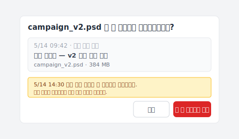

Cmd+S를 눌렀다. 커서가 한 번 깜빡였다.

그리고 깨달았다 — 방금 덮어쓴 그 버전이, 클라이언트가 원했던 것이었다는 걸.

브리프에는 "v2, 단 색상은 v3에서"라고 쓰여 있었다. 너는 v2를 열어 두고 있었다. v3의 색상을 골랐다. 저장했다.

망했다.

덮어쓴 그 레이어가, 지금 손에 남아 있는 유일한 v2다. 너는 다급하게 "photoshop 자동 저장 location"을 구글링한다 — 어딘가에 Photoshop이 몰래 사본을 두고 있을 거라고 믿으면서, 자동 저장 폴더를 연다. 지난주 화요일 파일이 하나 있다. 오늘 것은 아무것도 없다.

폴더는 제대로 열었다. 문제는, 그 폴더가 하는 일이 네가 생각한 것과 다르다는 것뿐이다.

## 폴더를 열어도, 아무것도 없다

자동 저장 폴더가 네 파일을 숨겨 둔 게 아니다 — 애초에 받아 본 적이 없을 뿐이다.

빈 폴더 앞에서 디자이너들은 보통 두 가지를 한다. "photoshop 자동 저장 어디"를 한 번 더 구글링하고, 그다음 폴더를 십 분간 멍하니 바라본다. 둘 다 헛수고다. 자동 저장은 처음부터 다른 메커니즘이기 때문이다 — Photoshop이 자기 자신을 위해 준비한 비상 낙하산이고, 낙하산이 펴지는 건 "프로그램이나 시스템이 갑자기 죽는 순간"이며, 낙하산 아래에 서 있는 건 Photoshop 자신이지 너의 버전 기록이 아니다.

이 비상 낙하산은 실제로 무엇을 하는가? Photoshop은 "비정상 종료"라는 사건을 감시한다 — 크래시, 강제 종료, 시스템 kernel panic. 이런 일이 일어나면, 메모리상의 작업 상태를 `.psb` 복구 파일로 써낸다. 다음에 Photoshop을 열면 그 파일을 복원할지 묻는 대화상자가 뜬다.

그게 끝이다. Cmd+S로 자신의 직전 버전을 덮어쓴 것은 Photoshop 내부에서는 전혀 다른 사건이다 — 프로그램은 정상 작동 중이고, 사용자가 자발적으로 저장 명령을 실행한 상황이라, 자동 저장 메커니즘은 발동조차 하지 않는다. 크래시가 없으니 살릴 것이 없고, 그래서 복구 폴더에도 아무것도 쓰이지 않는다.

직접 폴더를 뒤져 확인하고 싶다면? 실제 경로는 Mac은 `~/Library/Application Support/Adobe/Adobe Photoshop {version}/AutoRecover/`, Windows는 `%AppData%/Adobe/Adobe Photoshop {version}/AutoRecover/` (폴더 이름은 영문 `AutoRecover`). 이전 세션의 오래된 `.psb` 파일이 아직 남아 있을 수도 있다. 하지만 오늘의 작업은 거기에 한 번도 쓰인 적이 없어서, 복원할 수가 없다.

그렇다면 왜 아직도 "자동 저장 폴더는 어디"를 가르치는 글이 수천 편이나 존재하는가?

## Photoshop 자동 저장은 크래시를 위해 만들어졌다 — 오직 크래시만을 위해

솔직히 말하면, 이게 구글 첫 페이지에서 아무도 명확히 구분하지 않는 차이다:

| 메커니즘 | 발동 조건 | 무엇을 살리나 | Photoshop 내장? |
|---|---|---|---|
| **자동 저장** | Photoshop이 비정상 종료를 감지 | 크래시 시점의 메모리 상 작업 상태 | ✅ |
| **버전 기록** | Cmd+S마다 | 저장된 모든 버전의 완전한 스냅샷, 영구 보존 | ❌ |

**크래시 복구**는 자동 저장의 일이다 — 프로그램이 죽고, 파일은 저장되지 않았으니, 그 순간으로 데려다 달라. 하나의 일, 하나의 자리. Adobe `환경설정 > 파일 처리`에서 간격을 고를 수 있지만 (5, 10, 15, 30분), 어떤 값을 골라도 저장되는 곳은 같은 "덮어써지는 한 자리"다 — 새것이 옛것을 덮어쓰고, 기록은 없고, "가장 최근 복구 지점" 하나만 남는다.

**덮어쓰기 복구**는 다른 메커니즘에 속한다 — 바로 Photoshop이 만들지 않은 것, 버전 기록이다. Cmd+S는 직전 버전을 바로 덮어쓴다. "다른 이름으로 저장…"은 새 파일을 하나 만들지만, 원본 파일도 이미 네가 마지막에 저장한 상태가 되어 있어서 옛 내용은 같은 식으로 사라진다. 히스토리 패널은? 잠시 후에 보겠지만, 똑같은 일을 못 한다.

"수천 편의 글" 이야기로 돌아오면 — 그것들이 답하는 건 더 답하기 쉬운 다른 질문이다. "자동 저장 폴더는 어디"는 기술 FAQ, "덮어쓴 직전 버전을 어떻게 살리지"는 디자인 문제. 전자는 답이 있다. 후자는 Photoshop 안에 답이 없다.

가장 흥미로운 건 Adobe 본인은 숨기지 않는다는 점이다. 이 기능의 공식 명칭은 "**Background Save and Auto-Recovery**" — *복구*이지 *기록*이 아니다. Adobe는 "복구"라고 부른다. 우리가 마음대로 "기록"으로 읽었던 데서 어긋남이 시작된다.

## 그리고 히스토리 패널도 너를 못 살린다

자동 저장이 기록이 아니라면, 디자이너가 다음으로 시도하는 건 보통 히스토리 패널이다 — 이름이 버전 기록과 가장 비슷하니까.

히스토리 패널을 열고, 스크롤하고, 오늘 아침의 20개 스텝이 보인다. 어제 것은 아무것도 없다.

히스토리 패널은 "단일 세션의 undo 메모리"다. 동작 중인 Photoshop 프로세스의 메모리 안에 살고, 파일을 닫는 순간 (또는 Photoshop이 종료되는 순간) 전체 기록이 증발한다. 다음 날 아침 같은 PSD를 다시 열면, 히스토리 패널에는 "열기" 한 줄만 남아 있다. 어제의 모든 붓 자국, 모든 레이어 조정, 모든 작업이 — 기록에서 사라졌다. 픽셀은 파일에 남아 있다. 거기까지 가는 경로는 남아 있지 않다.

"히스토리 패널 있잖아!" 이게 직관적인 반응이다. 작업 중에는 분명 문제없지만, 어제의 작업은 파일을 닫으면 사라진다. 세션이 끝나면 전부 리셋된다. 기록보다는 메모지에 가깝다 — 한 번 쓰고 버리는 것.

Photoshop은 기본으로 50개 스텝을 보존한다. `환경설정 > 성능`에서 늘릴 수 있지만, 이 숫자는 네 문제에 도움이 안 된다 — 이 기록은 파일이 닫히면 죽기 때문이다. 얼마로 설정하든 결과는 같다.

히스토리 패널은 엄밀히는 "조작 로그"다 — "네가 이런 순서로 이런 일들을 했다". 기록하는 건 동작의 연속이지 파일의 상태가 아니다. Cmd+S는 이 위에 어떤 표시도 남기지 않는다. 그러도록 설계되지 않았다.

그래서 너의 손에는 너를 살려 줄 것처럼 보이는 세 가지가 있다: 자동 저장 (크래시를 위한), 복구 폴더 (자동 저장이 크래시 때 덤프를 두는 곳), 히스토리 패널 (세션 내 undo, 파일을 닫으면 증발).

네 번째는 없다. **파일 단위의 버전 기록은 Photoshop에 내장되어 있지 않다**. 이 빠진 층이 너를 이 글로 데려왔다.

## 너에게 정말 필요한 것은 파일 단위의 버전 기록

빠진 층은 Photoshop 바깥에 산다 — 별도의 프로세스가 Cmd+S마다 지켜보는, 애플리케이션보다 한 단계 위의 층이다.

필요한 것을 정확히 정의하자. 네가 PSD를 저장할 때마다, 무엇인가가 그 완전한 바이트 단위 스냅샷을 조용히 보존하고, 덮어쓰지 않는다. 오늘 20번 저장하면 20개의 스냅샷이 쌓인다. 내일 클라이언트가 원했던 v2를 덮어썼다? 30분 전 스냅샷으로 돌아간다 — 현재 파일은 그대로 두고, 과거 버전이 옆에 복원되어 나타난다.

Photoshop은 왜 이 층을 안 만들까? Adobe는 자신을 그림 도구로 자리매김한다. "이 파일이 디스크 위에서 어떻게 변천해 왔는가"는 파일 시스템 층, 운영 체제, 또는 제삼자 도구의 책임이라, Adobe는 그 층을 다른 도구에 맡긴다.

이 빈자리를 메우려는 도구는 하나가 아니다. Apple Time Machine도 시도한다 — 하지만 Time Machine은 매시간 시스템 스냅샷이지 저장 단위의 스냅샷이 아니다. 한 시간 전에 저장한 v2를 잡았을 수도 있고, 이미 네가 다 수정해 버린 상태를 잡았을 수도 있다. 타이밍 운이다. OneDrive와 SharePoint는 버전 기록을 제공한다 — 기본 [500개 메이저 버전 보존](https://learn.microsoft.com/ko-kr/sharepoint/document-library-version-history-limits), 한도를 넘으면 오래된 순으로 자동 삭제 (개인 Microsoft 계정은 25개로 더 적다). Google Drive는 더 좁다: 파일당 [최대 100개 revision](https://developers.google.com/workspace/drive/api/guides/manage-revisions), 30일 지난 오래된 revision은 수동으로 "Keep Forever" 표시하지 않는 한 자동 정리된다 (이것도 200개 한도). [3개월 후 납품물 추적에 닿지 않는 이유를 다른 글에서 자세히 풀었다](/post/client-asked-which-version/). 모두 부분적인 답이다.

남은 빈자리를 Keeply가 메우려 한다. 로직은 단순하다: Keeply 폴더 안의 PSD를 Cmd+S로 저장하면, Keeply가 그 순간의 완전한 버전을 백그라운드에서 한 부 보존한다 — 원본과 분리해서, 현재 작업에는 손대지 않고. 무거운 PSD (500MB 한 장 같은 것)도 백그라운드에서 우아하게 처리된다 — Keeply는 대용량 파일용 메커니즘을 써서 디스크가 부풀지 않게 한다. 저장 간격 설정도 없고, "지금 스냅샷" 버튼도 없다 — 너는 평소대로 Photoshop에서 작업하고, 그것이 백그라운드에서 매번의 저장을 기록한다.

클라이언트가 원했던 v2를 덮어썼다는 걸 깨달은 순간, Keeply를 열고 "고객 확인 버전" 줄까지 스크롤한 다음 복원을 누른다. 뜨는 대화 상자는 이런 모양이다:

빨간 "이 버전으로 복원" 버튼 아래의 한 줄을 보자 — 5/14 14:30 이후에 편집한 내용은 사라지지 않고 새 버전으로 저장된다. 옛 버전과 새 버전이 모두 타임라인에 남아 잃어버리는 게 없다. 두 버전을 시각적으로 비교하면서 v3의 색상을 복원해 온 v2에 복사한다 — 원래 한 시간이 걸렸을 레이어 작업이 30초의 클릭으로 줄어든다.

덧붙이면: Keeply는 네가 이미 쓰는 Adobe Creative Cloud, Time Machine, 어떤 클라우드 동기화와도 나란히 작동한다. 어느 것도 대체하지 않는다. 다른 도구들이 다루지 못하는 한 가지 빈자리만 메운다 — 이진 크리에이티브 파일에 대한, 저장마다 지켜보는 영구적인 파일 단위 버전 기록.

이건 [더 넓은 파일 버전 관리 문제](/post/file-version-management-complete-guide/) 안에서, 디자이너가 가장 강하게 느끼는 부분이기도 하다. PSD는 크고, 편집은 파괴적이며, 클라이언트는 어느 v2를 가리켰는지 자주 바뀐다.

## Keeply가 해결하지 않는 것

기능 쪽을 다 이야기했으니, 경계도 분명히 해 두자. Keeply는 이미 존재하지 않는 것을 되살릴 수 없다. 정직한 제약 몇 가지.

**하드디스크 고장 — 그건 우리 영역이 아니다**. 디스크가 망가졌거나, 섹터가 손상됐거나, `.psd` 확장자가 깨진 경우, 그것은 EaseUS, Disk Drill, Stellar Phoenix 같은 도구들의 영역이다. Keeply는 네 파일이 디스크 위에 남아 있고, 단지 내용이 원하지 않는 그 버전일 뿐이라고 전제한다. 파일 자체가 사라진 경우 필요한 도구는 디스크 복구이지, 버전 기록이 아니다.

**Keeply 설치 이전에 덮어쓴 파일**도 살릴 수 없다. Keeply는 타임머신이 아니라, 설치한 그 순간부터 버전을 기록하기 시작한다. 어제 덮어쓴 v2, 오늘 Keeply를 설치 — 되돌릴 기록이 없다. 이게 어처구니없게 들린다는 건 인정하지만, 버전 기록 도구의 본질이 그렇다 — 기록하는 건 지금부터 앞으로 향하는 시간축이고, 그 이전 시간대는 모른다.

**Photoshop 자동 저장이 담당하는 크래시**도 Keeply 영역이 아니다. Photoshop이 편집 중 크래시를 일으키고 네가 20분 동안 Cmd+S를 누르지 않았다 — 그 미저장 작업 상태는 여전히 Photoshop의 복구 대화상자가 받아 줘야 한다.

Keeply가 기록하는 건 시간축에서 "Cmd+S를 누른 다음" 쪽 — 한 번 누를 때마다 하나의 복원 지점을 남긴다. "Cmd+S를 누르기 전" 그 순간은 Photoshop 내장 자동 저장이 담당한다. 두 메커니즘이 각각의 구간을 나란히 맡고 있다.

## 다음 Cmd+S 전에 할 수 있는 일

처음 그 장면으로 돌아가자. 클라이언트는 v2, 색상은 v3에서, 라고 했다. 너는 v2 위에 있었고, v3의 스와치를 골랐고, Cmd+S를 눌렀다. 백그라운드에서 파일 단위 버전 기록이 돌고 있다면, 그걸 열어서 30분 전의 v2 (색상을 만지기 전)를 찾아 별도 파일로 복원한다. 지금 두 가지가 모두 네 앞에 있다: 클라이언트가 참조하던 색 없는 v2와, 네가 방금 v3 색상을 칠한 v2. 비교하고, 결정하고, 납품한다.

panic 전체가 풀린다.

자동 저장은 나쁜 설계가 아니다. 그것이 설계된 일 — 크래시에서 너를 데리고 오는 — 에서는 제대로 작동한다. 처음부터 풀려고 만들어지지 않은 문제를 풀어 주리라고 기대받으면 곤란할 뿐이다. 버전 기록은 다른 층의 일이다 — 다른 도구의 담당.

다음 Cmd+S 전에 이 층을 PSD에 더하려면, [Mac이나 Windows에 Keeply 설치](/post/install-keeply-windows-mac/).

---

*저자: [Ting-Wei Tsao](https://www.linkedin.com/in/ting-wei-tsao-b57480152), Keeply 창업자. Keeply는 디자이너, 건축가, 지식 노동자를 위한 파일 버전 기록 도구 — Git을 배우지 않고도 개별 파일을 어느 과거 버전으로든 되돌릴 수 있다.*
