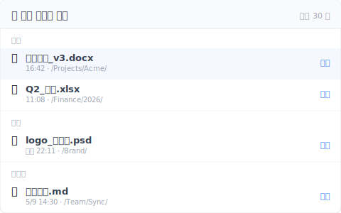

# 【2026 파일 관리】삭제된 파일 복구의 한계: 복구 프로그램이 손대지 못하는 4 가지 상황

> Delete를 눌렀더니 휴지통이 비어 있었나요? SSD TRIM 메커니즘과 복구 프로그램의 사각지대를 파헤치고, 왜 사전 방어가 사후 포렌식보다 더 믿을 만한지 보여드립니다.

## 목차

- [복구 프로그램이 말하지 않는 치명상: SSD + TRIM](#trim)
- [애초에 휴지통에 들어가지 않은 4 가지 케이스](#scenarios)
- [진짜 믿을 만한 복구는 파일 층에 있다](#file-layer)
- [솔직한 경계: Keeply가 하지 않는 것](#limits)

---

Delete를 눌렀다. 휴지통을 열었다. 비어 있다.

이어서 "파일 복구"로 Google 검색을 한다. 첫 페이지 광고가 Recoverit이나 Disk Drill을 다운로드하라고 권한다. 잠깐 멈춰라. 내가 Keeply를 만들기 전에도 Recoverit을 한 번 사 봤다. 실수로 지운 가족 사진을 살리려는 시도였다. 결론부터 말하면: 대부분의 상황에서, 그 5만 원짜리 라이센스로는 파일이 돌아오지 않는다.

대부분의 경우, OS에는 복구할 흔적이 전혀 남아 있지 않다.

---

## 복구 프로그램이 말하지 않는 치명상: SSD + TRIM {#trim}

복구 프로그램이 하는 일은 "섹터 스캔(Sector Scanning)"이다 — 디스크에서 아직 덮어쓰이지 않은 바이트를 찾아 파일을 재조립하려는 시도다. 10년 전 HDD 시대라면 이치에 맞는 이야기였지만, 현대 컴퓨터에서는 그 길이 거의 막혀 있다.

현대 컴퓨터의 대부분은 SSD(솔리드 스테이트 드라이브)를 쓰고, Windows 7 이후로는 TRIM이 기본으로 활성화되어 있다. 당신이 파일을 삭제하면, OS는 즉시 TRIM 명령을 보내 그 블록을 "재사용 가능"으로 SSD에 알린다.

그러니까 복구 프로그램이 스캔해도 보이는 건 0의 나열뿐이다. 데이터 복구 회사 Hetman은 솔직하게 이렇게 적었다. "TRIM이 활성화된 SSD에서 삭제된 파일을 복구할 수 있다고 주장하는 복구 회사는, 무능하거나 고객을 속이고 있는 것이다." ([Hetman 공식 글](https://hetmanrecovery.com/recovery_news/data-recovery-is-impossible-ssd-cloud-and-online-services.htm)) 나도 나중에 데이터 복구 엔지니어 몇 명과 직접 이야기해 봤는데, 답은 다 같았다.

여기에 Windows Update, 클라우드 동기화, 브라우저 캐시가 매분 새 데이터를 섹터에 쓰고 있다. 삭제 후 한 시간이 지날 때마다 섹터가 덮어쓰일 확률은 가파르게 올라간다. 디스크에 BitLocker 암호화까지 걸려 있다면 복구 확률은 사실상 0이다.

---

## 애초에 휴지통에 들어가지 않은 4 가지 케이스 {#scenarios}

하드웨어의 한계 말고도, 파일이 휴지통을 완전히 우회해서 그 자리에서 사라지는 4 가지 일상적인 시나리오가 있다:

1. **공유 드라이브의 함정**: NAS, SharePoint, 회사 네트워크 드라이브에서 파일을 지웠다. 시스템은 그대로 지워 버리고, 당신의 로컬 휴지통에는 들어가지 않는다([Microsoft 공식 문서](https://learn.microsoft.com/en-us/windows/win32/shell/recycle-bin)). 팀에서 흔히 일어나는 비극: "휴지통에서 주워 올 수 있을 줄 알았는데, IT가 NAS에서 바로 사라졌다고 알려줬다."
2. **손이 미끄러져 Shift+Del**: OS의 기본 설계다. 이 단축키를 누르면 흔적 없는 물리 삭제가 된다.
3. **클라우드 휴지통 만료**: OneDrive 기본 30일, Google Drive 30일, Dropbox Basic 30일. 기한이 지나면 클라우드 쪽에서도 자동으로 비워진다([OneDrive 공식 안내](https://support.microsoft.com/en-us/office/restore-deleted-files-or-folders-in-onedrive-949ada80-0026-4db3-a953-c99083e6a84f)).
4. **어제 휴지통을 비웠다**: OS 입장에서 청소 명령은 끝났고, 그 파일은 완전히 추적 대상에서 벗어났다.

요약하면: 시중의 복구 프로그램은 "구형 HDD + 방금 삭제 + 새 쓰기 없음"이라는 극도로 좁은 완벽한 조건에서만 효과가 있다. 사무실에서 실제로 마주치는 건 거의 그 조건이 아니다.

---

## 진짜 믿을 만한 복구는 파일 층에 있다 {#file-layer}

사후 "디스크 포렌식"에 매달리지 말자. 진짜 답은 파일 시스템 위에 조용한 "버전 기록 층"을 한 겹 깔아 두는 것이다.

이게 Keeply의 자리다. 클라우드도 외장 드라이브도 의존하지 않는다. 저장을 누를 때마다 자동으로 백그라운드에서 버전 하나를 남긴다.

- **공유 드라이브에 강하다**: NAS나 SharePoint에서 작업해도 기록이 남는다.
- **Offline-first**: 상시 온라인 동기화가 필요 없다.
- **30일 절벽이 없다**: 클라우드의 가혹한 보존 기간 상한이 없다. 3개월 전 버전도 타임라인에 그대로 있다.

버전 기록뿐만이 아닙니다. Keeply 에는 별도의 "최근 삭제" 패널이 있어, 지난 30 일 동안 당신이 직접 지운 파일들을 삭제 시기별로 묶어 보여줍니다:

"내가 언제 지웠지" 를 먼저 떠올릴 필요가 없습니다. 패널을 열고 이름을 훑어보면 바로 보이고, 오른쪽 "복원" 을 누르면 원래 자리로 돌아갑니다. 시스템 휴지통을 뒤지는 것보다, 이 경로는 당신이 다급히 Cmd+S 로 다른 파일을 덮어쓰기 전에 먼저 받아 줍니다.

버전 기록 설계의 더 깊은 이론은 [Pillar: 파일 버전 관리 완전 가이드](/ko/post/file-version-management-complete-guide/) 참조.

---

## 솔직한 경계: Keeply가 하지 않는 것 {#limits}

평소처럼, Keeply의 한계도 솔직하게 적는다:

- **SD 카드나 휴대폰 사진은 못 살린다**: 그건 다른 영역의 도구다. 전용 앱을 찾아라.
- **디스크 전체의 물리적 손상은 막지 못한다**: 그건 백업 도구의 일이다. 외장 드라이브를 사서 [3-2-1 백업 원칙](/ko/post/3-2-1-backup-rule/)을 따르라.
- **"설치 전"에 지운 파일은 못 살린다**: Keeply는 사전 방어 도구지 사후 포렌식 소프트웨어가 아니다. 설치하기 전에 지워진 건 어떻게 할 수 없다.

다음 Delete가 재앙을 부르기 전에, [오늘 Keeply를 설치](/ko/post/install-keeply-windows-mac/)해 두자.

---

> 저자: Ting-Wei Tsao, Keeply 창업자.
> [LinkedIn](https://www.linkedin.com/in/ting-wei-tsao-b57480152/)
