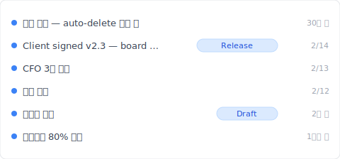
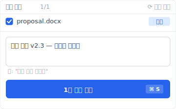
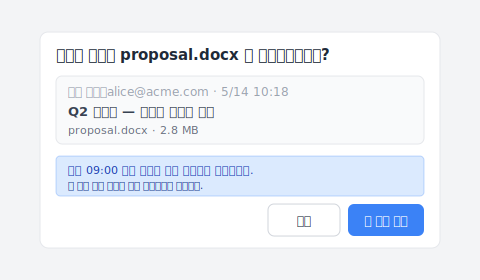

# 【2026 파일 관리】SharePoint 버전 기록: 500개 상한 + 자동 삭제 설정의 숨겨진 비용

> Microsoft가 2024년에 IT 관리자에게 스토리지 절약 버튼을 제공했습니다. 누르기 전에 무엇을 잃는지 알아야 합니다.

"어제 SharePoint에 자동 삭제 100을 설정했습니다. 오늘 고객이 '3개월 전 그 버전'을 묻습니다. 기록을 엽니다 — 최근 100개만 남았고, 그 전 250개는 Microsoft가 이미 삭제했습니다."

이것은 버그가 아닙니다. [Microsoft Learn 공식](https://learn.microsoft.com/en-us/sharepoint/document-library-version-history-limits) 메커니즘입니다 — 500 주요 버전 상한 + 2024년 말 출시된 자동 삭제 설정(500 / 100 / 50 / 만료일 컷오프 4단계). 이 글은 SharePoint 버전 기록의 3가지 메커니즘 + 자동 삭제 후 **무엇을 잃는지**를 분해하고, [Keeply](https://keeply.work)가 상한 초과 시나리오를 어떻게 받쳐주는지 보여줍니다.

## 목차

1. [Keeply가 SharePoint 기록을 자동 삭제로 잃지 않게 하는 방법](#keeply-timeline)
2. [SharePoint 버전 기록 3가지 메커니즘](#three-mechanisms)
3. [500 주요 버전 상한: Microsoft 공식 숫자](#500-cap)
4. [자동 삭제 4단계: 500 / 100 / 50 / 만료일 컷오프 실제 비용](#자동 삭제)
5. [SharePoint 스토리지 할당량: 100으로 줄이면 얼마나 절약?](#스토리지-quota)
6. [Keeply 보완: SP 스토리지 계층을 가로지르는 Release 잠금 + 파일별 노트](#keeply-fills)
7. [SharePoint에서 Keeply가 필요 없는 3가지 시나리오](#when-not-needed)
8. [자주 묻는 질문](#faq)

---

## Keeply가 SharePoint 기록을 자동 삭제로 잃지 않게 하는 방법 {#keeply-timeline}

James는 중소기업의 IT 겸직 관리자입니다. 5인 팀이 SharePoint Online에서 `proposal.docx`를 공동 편집. 6개월 동안 200개 이상의 버전이 축적되었고, SharePoint 스토리지 할당량은 80%, 그는 방금 관리 센터에서 자동 삭제 100을 설정했습니다 — 다음 달 할당량이 안전 범위로 돌아갈 예정.

그러나 오늘 고객이 갑자기 "2월 14일 이사회가 승인한 그 버전"을 묻습니다. SP 버전 기록을 엽니다. 최근 100개만 남아있고, 2월 14일 버전은 이미 자동 삭제되었습니다.

[Keeply](https://keeply.work)에서는 이렇게 되지 않습니다. 같은 `proposal.docx`의 Keeply 타임라인:

"Client signed v2.3 — 이사회 승인"가 자체 행과 Release 태그를 가집니다 — James가 2월 14일 이사회 승인 후 Keeply 메인 창에서 "버전 저장"을 누르고 노트를 작성한 것:

"Client signed v2.3 — 이사회 승인"를 한 줄 작성하고 버전을 저장. 6개월 후 Keeply 타임라인에서 태그를 보면 바로 — **SP 자동 삭제의 영향을 받지 않고, 자동 삭제되지 않습니다**.

2가지 동작만:

1. **저장** — Word에서 Ctrl+S, SharePoint가 클라우드에 동기화(평소대로), Keeply는 백그라운드에서 30분 내에 변경을 감지하고 **자체 타임라인**에 버전을 자동 저장.
2. **마일스톤 태그** — 중요 순간(이사회 승인 / 고객 서명 / 출시)에 Keeply 메인 창에서 "버전 저장"을 누르고 노트 작성.

아래에서 SharePoint의 3가지 메커니즘을 분해 — 왜 자동 삭제 100 설정 후 250개 버전이 사라지는지.

## SharePoint 버전 기록 3가지 메커니즘 {#three-mechanisms}

SharePoint의 "버전 기록"은 실제로는 3가지가 하나의 용어에 혼합:

| 메커니즘 | 내용 | 한도 | 트리거 |
|---|---|---|---|
| **주요 버전** | 저장마다 완전 버전 | **500개** ([MS Learn](https://learn.microsoft.com/en-us/sharepoint/document-library-version-history-limits)) | 저장마다 자동(기본) |
| **부 버전** | 초안 상태 | 511개(추가 풀) | 초안 저장 |
| **자동 삭제 설정** | IT 관리자가 더 엄격한 상한 설정 | 500 / 100 / 50 / 만료일 컷오프 | 관리 센터에서 설정 |

3가지 서로 다른 것 — 혼동하면 잘못된 계층을 검색하게 됩니다.

## 500 주요 버전 상한 {#500-cap}

[Microsoft Learn](https://learn.microsoft.com/en-us/sharepoint/document-library-version-history-limits): SharePoint Online 문서 라이브러리는 파일당 최대 **500 주요 버전**을 유지. 주요/부 버전 관리 활성화 시 부 버전 511개 추가.

**상한에 도달하는 사람**:

- 5인 팀이 제안서를 교대 편집, 하루 3회 저장 = 월 ~66 버전 → **약 7-8개월**에 상한 도달
- IT 관리자가 정리를 위해 상한을 100으로 압축 = 상한 도달 속도 × 5

## 자동 삭제 4단계 {#auto-delete}

Microsoft가 2024년 말에 [버전 기록 자동 삭제 설정](https://learn.microsoft.com/en-us/sharepoint/document-library-version-history-limits) 출시. IT 관리자 선택:

| 단계 | 유지 버전 | 적합 시나리오 | 잃는 것 |
|---|---|---|---|
| **500(기본값)** | 최근 500개 | 스토리지 여유, 완전 기록 | 501번째 저장 후 가장 오래된 1개 |
| **100** | 최근 100개 | 스토리지 빠듯 | 101번째 이후 가장 오래된 자동 삭제 |
| **50** | 최근 50개 | 스토리지 부족 | 대량 기록 손실 |
| **만료일 컷오프** | N일 이후 영구 삭제 | 법규 보존 시나리오 | 컷오프 이전 버전 복구 불가 |

**아무도 쓰지 않는 핵심 리스크**: 자동 삭제는 site-collection 레벨 설정. IT 관리자가 설정한 후 end user는 보지 못하고 알림도 없음. 3개월 후 어떤 버전을 찾을 수 없을 때 end user는 SP가 고장난 줄로 압니다.

## SharePoint 스토리지 할당량: 100으로 줄이면 얼마나 절약? {#storage-quota}

`proposal.docx` 평균 1.5 MB × 500 주요 버전 = 750 MB / 1 파일. 500 활성 문서 × 750 MB = 375 GB → 1 TB tenant 상한에 근접.

**자동 삭제 100 후**: 1.5 MB × 100 = 150 MB / 파일 → 500 파일 × 150 MB = 75 GB → tenant 사용률 7.5%. 5배 스토리지 절약.

**하지만**: 기록의 80%를 잃습니다. 고객이 3개월 후 묻는 버전이 삭제된 400개 안에 있을 수 있습니다.

## Keeply 보완: SP 스토리지 계층을 가로지르는 Release 잠금 {#keeply-fills}

James의 상황: 5인 팀 + SP 스토리지 빠듯 + 정리하고 싶지만 중요 버전 잃을까 두려움.

[Keeply](https://keeply.work)는 3가지를 하나의 도구로:

- **Release 잠금**: 이사회 승인일에 James가 Keeply "버전 저장"을 눌러 "Client signed v2.3" 태그 — 이 버전은 **로컬 + Keeply 자체 백업 위치**에 동결, SP 자동 삭제 영향 없음, 영구 보존
- **파일별 노트**: 각 버전에 1-2줄 노트. 3개월 후 타임라인에서 "CFO 3차 수정", "이사회 승인" 태그를 보면 SP 100개 중 어느 것이 어느 것인지 추측할 필요 없음
- **크로스 도구 이식성**: Keeply는 SP에 의존하지 않음. James가 Dropbox / NAS로 전환해도 타임라인은 로컬 + Keeply 백업 위치에 남음

SP는 팀 협업 동기화 + 스토리지 100 압축 계속, Keeply는 무제한 파일별 버전 기록 + 중요 버전 잠금 제공.

5 인 협업에서 자주 마주치는 또 하나의 동작: 동료가 SP 위에서 같은 `proposal.docx` 를 수정해 두었고, 당신은 그 버전을 자기 로컬 편집본 위에 덮어 적용하고 싶다. Keeply 의 "동료 버전 적용" 대화창은 이렇게 뜹니다:

파란색 안내 줄을 주목해 주십시오 — 09:00 이후 당신이 로컬에서 한 편집은 덮어쓰지 않고 별도 버전으로 저장되며, 두 버전 모두 버전 기록에 남습니다. "최신_버전.docx" 를 메일로 주고받을 필요도 없고, 잘못된 버전을 덮어 자기 편집을 잃을 걱정도 없습니다.

## SharePoint에서 Keeply가 필요 없는 3가지 시나리오 {#when-not-needed}

**엔터프라이즈 컴플라이언스 아카이브**. SOX, HIPAA, GDPR — [Microsoft 365 Backup](https://www.microsoft.com/en-us/microsoft-365/business/microsoft-365-backup) / Veeam / Acronis 사용.

**500 버전 이내 + 자동 삭제 불필요한 개인 / 소규모 팀**. 스토리지 할당량이 절반도 안 차면 자동 삭제 불필요 — SP 기본값 500으로 충분, Keeply 과잉.

**100% 모바일 전용 워크플로**. Keeply는 데스크톱 우선, 모바일 경량.

## 자주 묻는 질문 {#faq}

**Q1: SharePoint는 파일당 몇 개?** 500 주요 버전 + 511 부(주요/부 활성화 시).

**Q2: 자동 삭제란?** 2024년 말 Microsoft 기능, 4단계 IT 관리자 설정.

**Q3: OneDrive와 같나?** 기본 스토리지/메커니즘 동일, 사용 시나리오 차이.

**Q4: 자동 삭제 후 6개월 전 버전?** 외부 도구로 핵심 버전 보존 — [Keeply](https://keeply.work) Release 잠금.

**Q5: 자동 삭제 사용하지 않으려면?** 스토리지 구매 / 외부 도구.

**Q6: Keeply와 충돌?** 충돌하지 않습니다, 병행 실행.

## 더 보기

[파일 버전 관리 완전 가이드](/ko/post/file-version-management-complete-guide/) /
[OneDrive 버전 기록](/ko/post/onedrive-version-history/) /
[Excel 버전 기록 한계](/ko/post/excel-version-history-limits/)

---

James는 SP 관리 센터에서 자동 삭제 100을 설정했습니다. 다음 달 스토리지는 안전 범위로 돌아갑니다.

그러나 오늘 고객이 이사회 승인 버전을 묻습니다 — SP가 이미 그를 위해 삭제했습니다.

Microsoft는 트레이드오프를 문서에 적어두었습니다. SharePoint가 변하지 않는 것이 아니라, SP가 스토리지를 압축할 때 기록을 받쳐줄 도구가 필요합니다.

---

> 저자 소개: Ting-Wei Tsao, [Keeply](https://keeply.work) 창립자.
> [LinkedIn](https://www.linkedin.com/in/ting-wei-tsao-b57480152/)
