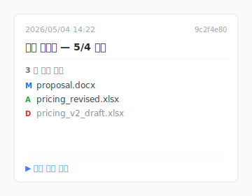

목요일 밤 11:47, 데스크톱에서 오늘 클라이언트가 사인한 버전을 찾고 있습니다. `제안서_v*_최종.docx` 가 11 개 놓여 있는데, 어느 게 클라이언트가 사인한 것이고, 어느 게 자기가 메모한 것이고, 어느 게 카톡으로 받아 다시 수정한 것인지. 지우기는 무섭고, 남겨두면 못 찾습니다.

이건 특수한 케이스가 아닙니다. Cmd+S（또는 Ctrl+S）로 일하는 사람이라면 누구나 마주치는 일입니다. 먼저 왜 이렇게 되는지 얘기하고, 그 다음 3 가지 도구 설계를 보여드릴게요.

## 목차

- [왜 `_v3_최종` 같은 이름을 붙이게 되는가](#why-naming)
- ["버전이 너무 많아"는 사실 4 가지 다른 통증](#four-types)
- [당신이 하는 일은 옳다, 도구가 바통을 못 받았을 뿐](#tool-side)
- [이걸 해결하는 3 가지 도구 설계](#three-designs)
- [Keeply 가 맞지 않는 경우](#boundaries)

## 왜 `_v3_최종` 같은 이름을 붙이게 되는가 {#why-naming}

Cmd+S 는 영구적인 동작입니다. 누르는 순간, 이전 버전은 덮어써집니다. "30 분 전 그 버전" 으로 돌아갈 버튼은 없습니다. 디자이너의 PSD, 변호사의 계약서 docx, 학생의 논문, 전부 똑같습니다. **이름을 안 붙이면 잃어버립니다.** 그래서 파일명 끝에 `_v3`, `_최종`, `_진짜최종` 을 붙이는 거죠.

맞아요, 이게 짜증나는 부분입니다. 당신이 하는 일은 강박이 아니라, OS 가 「30 분 전 그 버전으로 되돌리기」 라는 길을 안 줘서 생긴 생존 반응입니다.

## "버전이 너무 많아"는 사실 4 가지 다른 통증 {#four-types}

"버전이 너무 많아" 를 풀어보면, 완전히 다른 4 가지 문제가 보입니다. 각각 다른 해결법이 필요합니다.

| # | 통증 유형 | 전형적인 현장 |
|---|---|---|
| 1 | **사용자 잘못 덮어쓰기** | Cmd+S 누른 후 "아, 30 분 전 그 버전이 맞았는데" 깨달음 |
| 2 | **클라이언트 피드백 루프** | `계약서_v3_클라이언트의견.docx` / `제안서_v5_상사재요청.docx` 무한 핑퐁 |
| 3 | **클라우드 동기화 충돌** | Dropbox / OneDrive 양쪽에서 편집, `제안서 (Bill 의 충돌 사본).docx` 생성 |
| 4 | **소프트웨어 자동 저장 잔재** | Word `.asd` / Premiere `.bak` / PSD `.psb` 자동 백업이 곳곳에 흩어짐 |

같은 일을 풀고 있다고 생각하지만, 사실 4 가지 다른 일입니다. 1 유형은 도구가 자동으로 히스토리를 보존해야 합니다. 2 유형은 마일스톤 동결 메커니즘이 필요합니다. 3 유형은 동기화 충돌 해결이 필요합니다. 4 유형은 도구 사용법 학습이 필요합니다. **자기가 어느 것인지 먼저 진단하고 해결법을 찾으세요.**

## 당신이 하는 일은 옳다, 도구가 바통을 못 받았을 뿐 {#tool-side}

파일명 끝에 `_v3_최종` 을 붙이는 것은 논리적으로 맞습니다 — 당신은 버전의 의미를 표시해야 하니까요. 잘못된 건 당신이 아니라, 도구 계층이 「자동 체크포인트」 「자동 마일스톤」 같은 메커니즘을 제공하지 않고 책임을 파일명에 떠넘긴 점입니다. 그래서 당신은 사용할 수 있는 유일한 도구 — 파일명 — 으로 그 문제를 풀고 있는 거예요.

정리 전문가들은 "명명 규칙을 가지세요" 라고 가르칩니다. 14 페이지 명명 표준 PDF 를 돌리거나, 팀에게 접두사 순서를 외우게 하거나. 듣기엔 합리적입니다. 실제로 하면 사흘이면 무너집니다.

문제는 여기에 있습니다: **규칙은 버전 관리 책임을 인간 규율에 떠넘긴다**. 그리고 규율은 자동화를 절대 이기지 못합니다. 오늘은 `2026-05-04_제안서_v3_클라이언트승인.docx` 라고 기억하지만, 내일 바쁘면 `제안서_v3_최종.docx` 가 되고, 모레 클라이언트가 또 수정 요청하면 `제안서_v3_최종_v2.docx` 가 됩니다.

당신이 하는 일은 옳습니다. `_v3_최종` 으로 명명하는 건 합리적인 생존 반응이에요. 다만 이 생존 반응은 원래 필요하지 않았어야 합니다.

## 이걸 해결하는 3 가지 도구 설계 {#three-designs}

도구가 할 수 있는 일을 3 가지 설계 패턴으로 나눕니다. 각각이 위 4 가지 통증 중 하나에 대응합니다.

### Design A: 자동 체크포인트 (당신이 저장한 버전을 보존)

당신이 Cmd+S 를 누르면, 도구가 이전 버전을 조용히 보존합니다. 명명할 필요 없습니다. **예**: macOS Time Machine ([Apple 내장으로 1 시간마다 자동 스냅샷](https://support.apple.com/ko-kr/104984)), Word AutoSave (최근 1-2 버전만 돌아갈 수 있음), [Dropbox 30 일 버전 히스토리](https://help.dropbox.com/delete-restore/version-history-overview). **Keeply** 는 당신의 작업 폴더를 백그라운드로 이렇게 처리합니다: 텍스트 파일은 변경 내용만 기록하고, 이미지와 디자인 파일은 매 버전을 완전 보존 — 큰 파일이 디스크를 다 차지하지 않도록 설계되어 있습니다. **1 유형 해결.**

조용히 쌓인 그 버전들을 나중에 어떻게 찾을까요? 타임라인의 어느 행이든 마우스를 올리면 Keeply 가 그 저장에서 어떤 파일이 바뀌었는지 떠 있는 카드로 보여줍니다. 파일을 열지 않아도 비교할 수 있습니다:

클릭하면 전체 비교가 열리고, 우클릭으로 바로 복원할 수 있습니다. 어느 버전이 어느 버전인지 표시하려고 `_v3_최종_v2_final.docx` 같은 파일명을 더 이상 만들 필요가 없습니다.

### Design B: 마일스톤 동결 (당신이 직접 "클라이언트 승인" "릴리스" 표시)

당신이 능동적으로 "이 버전은 클라이언트가 승인했어" "이 버전은 릴리스됐어" 를 표시합니다. 그 이후로 어떻게 바뀌든 동결점은 그대로 남습니다. **예**: GitHub Releases (엔지니어가 특정 시점의 코드를 마일스톤으로 동결하는 기능, 개발자 전용). **Keeply** 에는 「릴리스」 라는 기능이 내장되어 있어, 개발자 용어를 배울 필요 없이 같은 일을 합니다: 히스토리에서 한 버전을 골라 「릴리스로 동결」 을 누르면, 그 버전은 영원히 되돌아갈 수 있게 남습니다. **2 유형 해결.**

### Design C: 단일 파일 복원 (히스토리에서 한 파일만 끌어내기)

히스토리의 어떤 버전에서든 **단일 파일** 을 복원, 폴더 전체를 되돌릴 필요 없음. **예**: Dropbox 단일 파일 restore, Time Machine 단일 파일 복원. **Keeply** 는 버전 내용 검색을 추가합니다 — 「지난주에 뭔가 바꿨다」 라고 기억한다면, 과거 변경 내용을 검색해서 해당 버전을 찾아 그 파일만 끌어낼 수 있습니다. **1+2 유형 혼합 시나리오 해결.**

이때 알게 될 겁니다. 4 가지 통증 중 4 유형 (소프트웨어 자동 저장 잔재) 만 다른 길을 갑니다: 그건 도구 사용법 학습 문제 (캐시 정리 배우기) 이고, 버전 관리와는 관계없습니다.

## Keeply 가 맞지 않는 경우 {#boundaries}

Keeply 가 모든 시나리오를 해결하진 않습니다:

- **원본 영상 소재**: 매일 수십 GB Premiere 소재가 쌓이는 경우, 디스크가 부족합니다. Keeply 는 콜드 스토리지 대안이 아닙니다.
- **100 만 파일 이상 폴더**: Keeply 의 설계 범위는 수백에서 수천 파일의 작업 폴더입니다. 그것을 넘으면 느려집니다.
- **팀 간 빈번한 충돌 머지**: Keeply 의 충돌 해결 UI 는 아직 제한적입니다.
- **계약 최종본 동결 / 클라이언트 납품물**: 그런 시나리오는 수동으로 명명해야 하고, 도구가 자동화해선 안 됩니다.

## 다음에 Cmd+S 누르기 전에

다음에 Cmd+S 를 누를 때, "혹시 이게 잘못된 버전일까봐" 두려워하지 않아도 됩니다, "혹시" 가 더 이상 존재하지 않으니까요. 모든 버전이 남아 있고, 찾기만 하면 됩니다.

Keeply 가 어떻게 이걸 하는지 보고 싶나요? [「파일 버전 관리 완전 가이드」 계속 읽기.](/ko/post/file-version-management-complete-guide/)

---

> 저자 소개: Ting-Wei Tsao, Keeply 창업자.
> [LinkedIn](https://www.linkedin.com/in/ting-wei-tsao-b57480152/)
