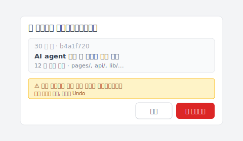

# 【2026 파일 관리】Vibe 코딩이 궤도를 이탈했나요? 동작 한 번으로 작동하던 버전으로 복원

> AI 에이전트가 앞서 달려나가서 코드가 안 돌아가요. Keeply 타임라인을 여세요. 마지막으로 작동하던 버전이 그대로 거기 있어요.

## 글 목차

1. [AI 오버슛의 순간은 어떻게 보일까?](#ai-overshoot)
2. [동작 한 번: 타임라인을 열고, 마지막 작동 지점을 클릭](#one-action)
3. [AI는 왜 스스로 되돌리지 않을까](#ai-doesnt-rollback)

---

엔지니어 A가 Cursor를 열고 AI에게 버그를 고치라고 해요. AI가 끝내요. 코드가 안 돌아가요. 다시 고치라고 해요. AI가 세 번째 파일을 건드려요. 여전히 깨져 있어요. 다섯 번째를 편집해요. 이쯤 되면 엔지니어 A는 AI가 어떤 파일들을 바꿨는지 더 이상 확신이 없어요.

이때 아마 이런 생각을 할 거예요: 멈추고, 적어도 조금 전에는 돌아가던 상태로 돌아가자.

문제는 이거예요: **어느 버전이 그 돌아가던 거였는지 어떻게 알죠?**

저도 직접 겪었습니다. AI 가 다섯 번째 파일을 건드렸을 때쯤엔 어느 버전이 돌아가는지 알 수 없었습니다. 다행히 Keeply 의 타임라인에는 제가 마지막으로 수동으로 돌렸던 버전이 남아 있었습니다.

---

## AI 오버슛의 순간은 어떻게 보일까? {#ai-overshoot}

vibe coding 중이에요. AI에게 목표를 줘요. AI가 한 덩어리를 짜요.

실행. OK.

다음 라운드, 「기능 하나 더 추가해」라고 해요. AI가 파일 3개를 건드려요. 실행 ,  오류.

「그 오류 고쳐」라고 해요. AI가 파일 5개를 건드리고, 설정을 편집하고, 부탁한 적도 없는 헬퍼 함수를 추가해요. 실행 ,  오류 더 많아져요.

AI는 아직도 자신 있게 고치는 중이에요. **「제가 여길 망쳤을 수도 있어요」라고 자진해서 말해주지 않아요.**

그 기억은 현재 컨텍스트 윈도우뿐이에요. **5개 프롬프트 전에 코드가 멀쩡했다는 걸 모르고 있어요.** 하지만 컴퓨터 위의 파일들은 알아요. 누군가 기억하고 있는 한.

---

## 동작 한 번: 타임라인을 열고, 마지막 작동 지점을 클릭 {#one-action}

### 1단계: Keeply 타임라인 열기

왼쪽 사이드바의 첫 번째 탭. 오늘의 모든 변경이 시간순으로 보여요.

### 2단계: 코드가 「아직 돌아가던」 마지막 지점 찾기

타임라인의 각 항목은 Keeply의 자동 저장점이거나, 직접 표시한 순간이에요. 각 지점을 열어 안의 변경을 보고, 「그때는 테스트 OK였다」고 기억하는 버전을 찾으세요.

보통 30~60분 전이에요. AI가 옆길로 빠지기 시작하기 직전의 마지막 테스트.

### 3단계: 그 항목 우클릭, 복원 선택

Keeply 가 복원 다이얼로그를 띄워 영향 범위와 명확한 경고를 보여 줘요. 클릭 전에 한번 읽을 수 있어요:

폴더 전체가 30초 안에 그 시점으로 돌아가요. **모든 파일, 전체 디렉터리 트리, 모든 설정 ,  함께 돌아가요.** 파일 하나만이 아니에요.

AI가 몰래 끼워 넣은 헬퍼 함수도, 편집한 설정도, 건드리면 안 됐던 .env도. **전부 돌아가요.**

그리고 실행해요. 작동해요.

전체 과정이 1분이 안 걸려요. **AI가 어떤 파일을 건드렸는지 기억할 필요 없어요. Keeply가 다 기억해 뒀어요.**

---

## AI는 왜 스스로 되돌리지 않을까 {#ai-doesnt-rollback}

AI 에이전트는 **앞으로 가도록** 설계됐어요. 프롬프트를 받고, 편집을 만들어요. 멈춰서 뒤를 돌아보고 「방금 라운드가 프로젝트를 더 망친 건 아닐까」라고 묻지 않아요.

그 책임은 AI에게 있지 않아요. 구조적인 한계예요.

책임은 당신에게 있어요: **백그라운드에서 도는 안전망 하나가 필요해요.** AI가 원하는 만큼 달리게 두세요. 끌어올 수 있으니까요.

Keeply는 당신이 코드를 쓰는 부분을 대체하려고 있는 게 아니에요. vibe coding 중에 되돌아갈 때 기억에 의존하지 않아도 되도록 있는 거예요. 기억은 AI가 파일 편집하는 속도를 못 이겨요.

---

## 마무리

오늘의 AI 세션이 궤도를 이탈하기 전에, [Keeply](https://keeply.work/)를 열고 프로젝트 폴더를 끌어다 놓으세요.

다음에 오버슛이 나면, 타임라인을 열고 마지막 항목을 클릭하세요. **30초면 문제 종결.**

---

## 더 읽어보기

- [파일 노트 앱 Keeply 사용법: 30가지 기능 투어는 건너뛰고, 2가지 동작으로 시작](/ko/post/keeply-getting-started-from-zero/) (PILLAR 3, Keeply 온보딩 종합 가이드)

---

> 저자 소개: Ting-Wei Tsao, Keeply 창업자.
> [LinkedIn](https://www.linkedin.com/in/ting-wei-tsao-b57480152/)
