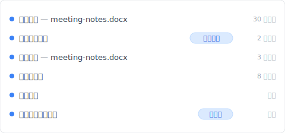
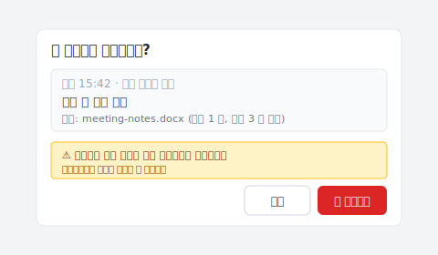

# 【2026 파일 관리】Windows 파일 히스토리에 어제 작성한 초안을 요청했더니, 2019 년 파일을 돌려받았다

> 파일 히스토리는 고장 안 났다. 그것이 가진 걸 돌려줬다. 질문이 도구에 맞는 형태가 아니었다.

화요일 저녁. Word 문서의 어제 초안——회의 중에 쓴 결론이 있는 버전、오늘 밤 수정하기 전(그 수정이 마음에 드는지 모르겠다)——이 필요했다.

오른쪽 클릭 → 이전 버전 복원. 대화창이 열린다.

사용 가능한 가장 최근 버전은 2019 년 것.

눈치 못 챈 1 년 반의 갭이 있었다. 파일 히스토리 스냅샷을 보관하는 외장 드라이브는 작년 여름 노트북 출장 이후 연결된 적이 없었다. 파일 히스토리는 어제 것을 줄 게 없었다. 가진 걸 줬다——드라이브가 마지막으로 연결됐을 때 버전. 드라이브가 마지막으로 연결된 건 새 노트북 사기 직전.

고장 안 났다. 내가 답할 수 없는 질문을 한 것.

## 왜 파일 히스토리가 2019 를 줬나

파일 히스토리는 일정에 따라 스냅샷을 찍는다. 기본:매시간. 스냅샷은 외장 드라이브(또는 네트워크 위치)에 닿을 수 있을 때만 일어난다.

드라이브가 빠진 동안(노트북 출장、드라이브가 다른 기기에 빌려줌、드라이브를 잊음)——새 스냅샷이 안 쓰여진다. 파일 히스토리는 내부적으로 계속 돌지만 쓸 곳이 없다. 버전 카탈로그가 성장을 멈춘다.

드라이브가 돌아오면 파일 히스토리는 멈춘 곳에서 재개한다. 새 스냅샷이 현재 running queue 에 들어간다. 하지만 드라이브가 빠져 있던 날들에 대한 backfill 은 없다.

그래서 「어제」를 물었을 때、파일 히스토리는 카탈로그를 거슬러 올라가 가진 가장 최근 스냅샷을 제시했다:드라이브가 오프라인되기 전 것. 18 개월 전.

이건 버그가 아니다. 이게 정확히 메커니즘이 설계대로 하는 일. 버그는 「어제」가 파일 히스토리가 답할 수 있는 질문이라는 내 가정.

## 일정 기반 vs 의도 기반

파일 히스토리를 설정할 때 아무도 설명 안 해준 차이:

**일정 기반** — 시스템이 언제 잡을지 결정. 파일 히스토리는 일정 기반. Mac 의 Time Machine 은 일정 기반. N 분마다 도는 클라우드 동기화는 일정 기반. 시스템이 「매시간」「10 분마다」「변경 감지 시」 라고 말하지만、단위는 시간이나 변경 감지——당신의 의도가 아니다.

**의도 기반** — 당신의 행동(Cmd+S 누르기)이 잡기를 트리거. 저장된 버전은 당신이 커밋을 결정한 순간의 파일. Git 은 의도 기반(명시적 세이브 포인트). 클라우드 동기화 버전 기록은 절반 의도 기반(각 저장이 버전을 만들고、보관 기간 상한). Keeply 같은 도구는 설계상 의도 기반.

불일치 지점:「어제 초안」 이라고 할 때、의미는 「결론 추가 후 어제 의도적으로 저장한 그 버전」. 그건 의도 기반 질문. 파일 히스토리는 일정 기반. 줄 수 있는 가장 가까운 일치는 「다음 스냅샷 시점의 디스크 상태」——타이밍과 드라이브 가용성에 따라、내 의도적 저장을 포함할 수도 안 할 수도.

정상이면 파일 히스토리는 어제의 근사값을 준다——모든 게 잘 됐을 때. 잘 안 됐을 때(드라이브 오프라인)、가진 가장 최근 스냅샷으로 fallback、임의로 오래된 것일 수 있다.

## 파일 히스토리가 본래 잘하는 것

파일 히스토리에 공정하게——그건 진짜 일이 있고、그걸 해낸다.

외장 드라이브로의 연속 폴더 수준 백업. 노트북 SSD 가 죽으면、파일 히스토리는 Documents、Pictures、Desktop、다른 watched 폴더를 가장 최근 스냅샷으로 복원해서 돌려준다. 완전하고 유용한 일.

잘 되는 상황:

- 원본이 손상되거나 분실된 후 최근(시간 단위) 사본이 필요
- watched 폴더가 신경 쓰는 것들을 커버
- 외장 드라이브가 안정적으로 연결됨(데스크톱、상시 온 독、NAS 공유)
- 정확한 per-save 버전이 필요 없고、그저 「가장 최근 좋은 사본」 만 필요

힘들어하는 상황:

- 노트북으로 출장하는데 드라이브가 안 따라옴
- 특정 시각에 저장한 특정 버전이 필요
- 「매 저장」 이 잡힐 거라고 기대(아니다——매 스냅샷이다)
- 정확도 있는 수년 깊이 보관 기대

이 글은 파일 히스토리에 대한 불평이 아니다. 그것이 실제로 답하는 질문의 형태를 분명히 하는 것.

## 의도 기반 계층 추가

흔한 손실 시나리오가 「어제 오후 2:47 에 저장한 그 버전이 필요해」 라면、파일 히스토리는 안정적으로 안 돌려준다. 다른 계층이 필요하다.

[Keeply](https://keeply.work) 는 로컬에서 돌고、매 Cmd+S 를 독자적인 버전으로 잡는다、일정이나 드라이브 연결 상태와 무관하게. 캡처는 프로젝트와 함께 산다、오프라인일 수 있는 별도 외장 드라이브가 아니라. 「어제 초안」 을 요청하면、Keeply 는 일정 스냅샷이 아니라 저장을 거슬러 올라가 당신이 실제로 만든 것을 돌려준다.

「버전 저장」을 직접 누르면 대화상자가 열려 한 줄 메모를 함께 남길 수 있어요——「회의 후」 「클라이언트 확인본」처럼、몇 달 뒤 자신이 봐도 알 수 있는 말로:


그때 타임라인은 이렇게 보여요——메모가 붙은 수동 저장이 자기 행에、자동 배경 버전과 나란히、이틀에 걸쳐 남아 있어요:



```
Keeply 타임라인 — meeting-notes.docx

5 월 13 일 — 화요일
─────────────────────────────────
● 19:42   meeting-notes.docx   (오늘 밤 수정)
● 14:47   meeting-notes.docx   ★「회의 후」 — 결론 추가
● 09:30   meeting-notes.docx   (아침 초안)

5 월 12 일 — 월요일
─────────────────────────────────
● 17:15   meeting-notes.docx
● 14:22   meeting-notes.docx
```

각 저장이 자신의 행. 「어제 초안」 은 특정 행에 매핑된다、불안정한 스냅샷에 대한 달력 조회가 아니라.

되돌리기로 결정했을 때、타임스탬프를 다시 추측하지 않고 적어둔 메모가 붙은 행을 클릭해서 바로 되돌려요. Keeply 는 되돌리기 전에 현재 상태를 자동 스냅샷으로 저장해두니、잘못 눌러도 복원할 수 있어요:



Keeply 는 파일 히스토리의 대체가 아니다. 파일 히스토리는 그것이 하는 것(외장 드라이브로 연속 폴더 백업)을 계속 한다. Keeply 는 저장 수준 입자도를 추가. 두 개는 다른 질문 형태에 답한다.

Cluster sibling:[백업되어 있다고 생각하지만, Windows 에서 「백업」은 3 가지 의미다](/ko/post/windows-file-history-vs-backup/) 는 완전한 3 축 비교 프레임을 다룬다.

## 파일 히스토리로 충분한 때

per-save 계층 추가가 과잉 인 몇 가지 상황:

**일이 단기 사이클**. 몇 시간 이전 저장을 복원할 필요 없다면、파일 히스토리의 시간당 빈도는 필요한 것 대부분을 잡는다. 업그레이드 불필요.

**드라이브가 안정적으로 연결됨**. 상시 온 독、NAS 공유、책상에서 떠나지 않는 전용 백업 드라이브——이 셋업에서 파일 히스토리는 갭이 거의 없고、일정 스냅샷이 저장에 가깝게 맞춰진다.

**클라우드 동기화가 중요 파일을 커버**. 중요한 것 모두가 OneDrive / Dropbox / Google Drive 에 있고 보관 기간 내라면、이미 클라우드 버전 기록에 일종의 의도 기반 계층이 있다(다만 상한——[버전 기록의 절벽](/ko/post/cloud-version-history-cliff/) 참조).

어느 것도 적용 안 된다면——노트북 사용자、드라이브 가끔 오프라인、30 일 넘은 일도 쓸 데가 있음——그때 의도 기반 계층 추가가 값어치를 한다.

## 더 읽기

필러 [파일 버전 관리 완전 가이드](/ko/post/file-version-management-complete-guide/) 는 도구가 파일 기록을 보존하도록 설계되지 않은 4 가지 구조적 이유를 다룬다.

Sibling 글:[백업되어 있다고 생각하지만, Windows 에서 「백업」은 3 가지 의미다](/ko/post/windows-file-history-vs-backup/) — 3 축 비교 프레임.

Mac 대응:[Time Machine vs Dropbox:backup、sync、그리고 둘 다 아닌 세 번째 축](/ko/post/time-machine-vs-dropbox/) — Mac 에서의 일정 vs 의도 같은 구분.

---

파일 히스토리는 나를 배신 안 했다. 그것이 가진 걸 돌려줬다. 2019 년 파일은 내 드라이브 연결 기록에 대한 사실이지、결함이 아니다.

교훈은 각 도구가 답하는 질문의 형태를 아는 것. 「연결됐을 때 외장 드라이브로의 시간당 스냅샷」 은 한 형태. 「내가 어제 오후 2:47 에 만든 저장」 은 다른 형태. 후자에 답하는 도구는 Windows 에 기본으로 출하 안 된다.

파일 히스토리는 계속 써도 된다. 다만、그것이 못 보는 질문은 묻지 말 것.

---

> 저자 소개:Ting-Wei Tsao、Keeply 창업자.
> [LinkedIn](https://www.linkedin.com/in/ting-wei-tsao-b57480152/)
