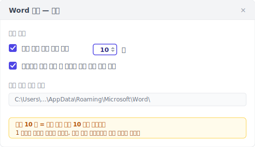
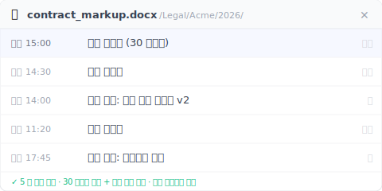

자동 복구는 충돌 구조용이지 버전 기록이 아닙니다. 워드에 들어 있는 건 충돌난 그 한 부를 살리는 장치뿐입니다.

> 금요일 오후 3 시. 5 시 회의용으로 계약서 검토 메모를 90 분 동안 썼다. 워드가 멈췄고, 3 분 기다리다 강제 종료했다.
>
> 다시 여니 '문서 복구' 작업창이 떴다. 기대하며 클릭 ,  **안은 비어 있었다**.
>
> 90 분 작업이 사라졌다. 고객은 5 시에 본다.

운이 나쁜 게 아닙니다. 자동 복구는 애초에 이 파일을 살리도록 설계되지 않았습니다.

아래 5 가지 경우는 Microsoft 공식 문서, 자동 복구에 배신당한 사람들의 구조 요청 글, 그리고 실제 작동 방식에서 거꾸로 짚어낸 것입니다. 하나하나 당신의 직감과 다릅니다.

---

## 경우 1: Ctrl+S 를 한 번도 안 눌렀다 {#case-1-never-saved}

새 워드를 열고 '새 문서'를 눌러 타이핑을 시작한 뒤 30 분 만에 충돌. 다시 열면 '문서 복구' 작업창은 비어 있습니다.

이건 버그가 아닙니다. **자동 복구가 문서를 추적하려면, 그 문서에 파일 이름과 경로가 있어야 합니다.** Ctrl+S 를 한 번도 안 눌렀다 = 이름 없음 = 경로 없음 = 자동 복구는 임시 파일을 어디에 써야 할지 모릅니다.

Microsoft 공식 [안내](https://support.microsoft.com/ko-kr/office/office-%ED%8C%8C%EC%9D%BC-%EB%B3%B5%EA%B5%AC-dc01156a-be1c-43e6-b3f1-bd4a01a93cf9)도 분명히 적습니다. 자동 복구가 .asd 임시 저장을 시작하려면, 그 파일이 적어도 한 번은 저장돼 있어야 합니다.

새로 만들기 → 30 분 작성 → 충돌. 이 순서에서 자동 복구는 한 번도 불려 나오지 않았습니다.

> **들일 만한 습관**: 새 문서에서 가장 먼저 하는 동작은 늘 Ctrl+S → 이름 붙이기 → 그다음 쓰기 시작. 30 초면 이 부류 전체를 피합니다.

---

## 경우 2: 워드가 멈춰서 강제 종료했다 {#case-2-force-quit}

서두의 계약서 메모 장면입니다. 워드가 실제로 충돌해서 복구 대화상자를 띄운 게 아니라 ,  멈춰서 반응이 없었고, 당신이 **직접** 강제 종료했습니다.

워드 자동 복구는 **기본 10 분마다** .asd 임시 파일을 씁니다. 그 10 분 사이에 친 글자는 메모리에 있습니다. 강제 종료 = 메모리 내용이 .asd 에 안 써짐 = .asd 에서 살릴 수 있는 건 마지막으로 디스크에 써진 시점까지뿐.

그 '마지막 시점'은 9 분 전일 수도 1 분 전일 수도 있습니다 ,  10 분 주기의 어디에 있었는지에 달렸죠. 최악의 경우: 9:59 에 큰 단락을 쓰고 10:00 에 워드가 멈추면, 그 단락은 .asd 에 안 들어갑니다.

이 10 분 기본값은 Microsoft 가 '디스크 쓰기 부담'과 '데이터 손실 위험' 사이에서 잡은 절충입니다. 당신에겐 이 10 분의 지연 = 늘 최대 10 분 작업이 위험에 노출돼 있다는 뜻.

줄일 수 있습니다: 파일 → 옵션 → 저장 → '자동 복구 정보 저장 간격'을 1 로. 대가는 디스크 쓰기가 늘어나는 것. 오래된 노트북은 체감할 수 있습니다.

> 자동 복구가 살리는 건 '방금 친 8 분'이 아니라 '8 분 전에 디스크에 써진 버전'입니다. 차이는 작아도 누가 살아남는지를 가릅니다.

---

## 경우 3: '문서 복구'가 떴다 ,  그런데 안이 비어 있다 {#case-3-blank-recovery}

가장 맥 빠지는 종류입니다. 워드가 실제로 '문서 복구' 작업창을 띄우고, 기대하며 클릭하면 ,  **파일 내용이 비었거나** 깨진 글자.

작동 방식에서 무슨 일이 일어났나: 자동 복구는 현재 상태를 .asd 파일로 묶어 디스크에 쓰는데, 이 작업엔 시간이 걸립니다. 중간에 전원이 끊기거나, 묶는 도중 프로그램이 죽으면 ,  절반만 써진 .asd 가 디스크에 남아 파싱이 안 됩니다. 워드는 .asd 존재를 보고 복구창을 띄우지만, 열 때 파싱에 실패해 공백이나 깨진 글자가 됩니다.

Microsoft 자체 포럼에도 같은 질문 스레드가 있습니다: [「My recovered unsaved word document is entirely blank(복구한 미저장 워드 문서가 완전히 백지)」](https://learn.microsoft.com/en-us/answers/questions/5285105/my-recovered-unsaved-word-document-is-entirely-bla). Microsoft 공식 커뮤니티에서도 질문이 올라옵니다. 드문 사고가 아니라 흔한 일입니다.

> 복구창이 떴다 = 살렸다, 가 아닙니다. 자동 복구가 약속하는 건 '시도'이지 '보장'이 아닙니다.

---

## 경우 4: 다른 컴퓨터에서 열었다 {#case-4-cross-machine}

어제 사무실 데스크톱에서 워드를 썼다. 오늘 집 노트북에서 열면 지난 토요일 수동 저장한 버전까지만 돌아갑니다. **어제 8 시간 분량의 수정이 사라졌습니다.**

자동 복구의 .asd 파일은 그 컴퓨터 안에 있습니다:

- **Windows**: `%LocalAppData%\Microsoft\Office\UnsavedFiles` 와 `%AppData%\Microsoft\Word`
- **macOS**: `~/Library/Containers/com.microsoft.Word/Data/Library/Preferences/AutoRecovery`

**이 경로들은 OneDrive 에도 Dropbox 에도 iCloud Drive 에도 자동 동기화되지 않습니다.** 설계상 로컬 캐시입니다.

"내 워드는 OneDrive 에 연결돼 있지 않나?"라고 물을 수 있습니다. 맞지만, OneDrive 가 동기화하는 건 '파일 본체'이지 '자동 복구의 .asd 임시 파일'이 아닙니다. AutoSave 를 켜도(Microsoft 365 구독과 OneDrive 에 둔 파일이 필요), AutoSave 는 파일 본체를 클라우드로, 자동 복구는 로컬에 .asd 를 씁니다 ,  **둘은 나란히 존재하며 서로 주고받지 않습니다.**

다른 컴퓨터에서 열면, 새 컴퓨터는 옛 컴퓨터의 .asd 를 못 읽습니다.

> .asd 는 자동 복구가 그 컴퓨터용으로 만든 로컬 메모입니다. 국경을 안 넘습니다.

---

## 경우 5: '저장 안 함'을 눌렀다 {#case-5-dont-save}

워드를 닫을 때 '변경 내용을 저장하시겠습니까?' 대화상자가 떠서, 아무 생각 없이 '저장 안 함'을 눌렀다 ,  이미 저장한 줄 알았으니까. 3 초 뒤, 방금 중요한 단락을 고치고 저장 안 한 게 떠오릅니다.

'저장 안 함'을 누르는 건 사용자의 능동적 동작입니다. 워드는 '사용자가 이 세션의 변경을 버리겠다고 명시적으로 선택했다'고 판단합니다. **자동 복구는 그 파일의 .asd 버퍼를 즉시 지우도록 설계돼 있습니다** ,  남기면 사용자의 의사에 반하니까요.

영어 검색 결과에서 이 건을 8 위에 올린 건 도메인 점수가 41 밖에 안 되는 작은 사이트 [integrisit.com/accidentally-clicked-dont-save](https://integrisit.com/accidentally-clicked-dont-save/) 입니다. 왜 그렇게 점수 낮은 사이트가 상위 10 에 들까요? 이 경우가 **Microsoft 공식 문서가 다루지 않는** 것이기 때문입니다 ,  "저장 안 함을 눌러서 버퍼를 즉시 지웠다"고 인정하는 건 제품 자체의 설명과 부딪칩니다.

> '저장 안 함'은 오타가 아닙니다. 워드 내부의 '버리기 확인 + 버퍼 즉시 삭제' 이중 명령입니다.

---

## 또 하나의 층: 지워지지 않는 버전 기록 {#keeply-fills-gap}

5 가지 경우를 지나면, 자동 복구는 특정 설계로 짠 그물임을 알 수 있습니다 ,  '치는 중 + 쓰기 사이 + 워드가 진짜 충돌'은 받아내지만 나머지 5 가지는 놓칩니다. 공통점은 자동 복구의 임시 저장이 **쓰면 지워진다**는 것 ,  정상 종료로 지워지고, 저장 안 함으로 지워지고, 강제 종료에선 다 쓰지도 못했을 수 있습니다.

이를 메우는 건 **지워지지 않는 층**입니다: 모든 버전이 완전히 저장된 파일이고, 영구히 남고, 강제 종료에도 '저장 안 함'에도 영향받지 않습니다. 두 군데에서 옵니다 ,  **백그라운드 30 분마다 자동 스냅샷**, 그리고 **직접 누르는 '버전 저장' 버튼 + 한 줄 메모**로 이정표 찍기(예: "이게 고객 승인본").

5 가지 경우를 이 층에 대보면:

| 경우 | 자동 복구 | 영구 버전 기록(30 분 자동 + 수동 저장) |
|---|---|---|
| 1. 한 번도 저장 안 함 | 기준점 없음 = 기록 없음 | 이것도 못 살림 ,  파일이 디스크에 없어 이 층에 안 보임(아래 한계로) |
| 2. 강제 종료 | 버퍼가 비었거나 절반만 씀 | 직전 자동 스냅샷이나 수동 저장본이 온전히 열림(최대 30 분은 잃지만, 돌아오는 건 공백 아닌 완전한 파일) |
| 3. 복구창 공백 | 버퍼 절반 쓰다 손상 | 모든 버전이 완전한 저장 스냅샷, 절반 버퍼가 아님 |
| 4. 다른 컴퓨터 | 로컬 .asd 가 동기화 안 됨 | 버전이 클라우드에 동기화, 다른 기기에서도 열림 |
| 5. 저장 안 함 누름 | 버퍼 즉시 삭제 | 직전 자동 스냅샷/수동 저장은 이미 써짐. 저장 안 함은 그 이후 미저장분만 버림 |

Keeply 는 이 층의 한 구현입니다. 설치하면 워드 폴더를 지켜보며 백그라운드로 30 분마다 한 버전을 기록합니다. 언제든 '버전 저장'을 누르면 메모를 붙여 즉시 한 버전을 남길 수 있습니다. 버전 사이드바에서 각 버전의 타임스탬프를 보고, 어느 것이든 한 번에 되돌립니다.

**핵심은 '더 자주'가 아닙니다** ,  30 분은 자동 복구의 10 분보다 거칩니다. 핵심은 **영구 + 온전히 열림 + 강제 종료에도 저장 안 함에도 영향받지 않음**입니다. 자동 복구는 '치는 중 + 다음 기록 전 + 갑자기 충돌'이라는 좁은 창에서 더 새 내용을 들고 있을 수 있으므로, Keeply 는 자동 복구를 **대체하지 않습니다** ,  그 아래에 한 층 더하는 것입니다.

---

## Keeply 도 못 살리는 3 가지 경우 {#limits}

한계를 분명히:

**1. 한 번도 디스크에 저장 안 한 파일은 Keeply 도 못 살립니다.** Keeply 가 지켜보는 건 디스크 위 폴더 ,  파일은 한 번 저장돼 그 폴더에 써져야 비로소 Keeply 에 보이고 버전을 기록합니다. 한 번도 저장 안 한 새 문서는 자동 복구와 똑같이 Keeply 에도 안 보입니다. 그래서 앞의 습관 ,  새 문서 첫 동작은 저장하고 이름 붙이기 ,  는 둘 다에 통합니다.

**2. 손상된 .docx 는 Keeply 도 직전 건강한 버전까지만 돌립니다.** 스냅샷이나 수동 저장이 기록한 시점에 파일 자체가 이미 손상돼 있었다면(드물지만 있음), Keeply 가 기록한 건 그 손상본입니다. 기록만으로 건강한 상태로는 못 돌아가니, 더 앞의 멀쩡한 버전으로 되돌려야 합니다.

**3. 동기화 안 된 다른 기기의 파일은 그 기기에 남습니다.** Keeply 는 버전을 로컬 보관소에 쓰고, 클라우드 동기화는 별도 단계입니다. 노트북에서 인터넷이 끊긴 채 8 시간 쓰고 동기화 안 했다면, 데스크톱에선 그 8 시간이 안 보입니다 ,  Keeply 결함이 아니라 동기화가 아직 안 끝난 것.

이 셋은 자동 복구의 5 가지 경우보다 명확하고 검증 가능합니다 ,  '저장했나' '파일이 깨졌나' '인터넷이 끊겼나'는 작동 방식을 거꾸로 짚지 않아도 압니다.

---

## Keeply 가 필요 없는 3 가지 워드 상황 {#when-not-needed}

누구나 이 층이 필요한 건 아닙니다.

**1. 짧은 작업(10 분 미만의 회신·메모).** 자동 복구의 10 분 간격도 안 왔고, Keeply 의 다음 스냅샷도 안 왔습니다. 가벼운 작업이면 내장 기능으로 충분합니다.

**2. 이미 5 분마다 저장하는 습관 + 파일은 OneDrive.** OneDrive 의 25 버전 / 30 일 보관에 당신의 잦은 저장이 더해지면 이미 버전 기록 층에 가깝습니다. Keeply 는 30 일 이전으로 거슬러 가고 싶을 때만 값을 합니다 ,  예를 들어 3 개월 뒤 고객이 "그 v2 아직 있어요?"라고 물을 때.

**3. 회사가 SharePoint + 버전 기록을 도입했다.** SharePoint 는 버전을 더 오래 보관하고, 관리자 통제와 감사 추적이 있습니다. 개인용 Keeply 는 대체가 아닌 보완 ,  당신은 SharePoint 를 계속 씁니다.

Keeply 는 5 가지 경우 중 하나에 물려본 적 있고, 다시 물리고 싶지 않은 개인을 위한 것입니다. 물린 적 없거나 회사가 이미 손써둔 사람은 지금 그대로 괜찮습니다.

---

## 자주 묻는 질문 {#faq}

**Q1. Keeply 를 워드 폴더에 깔면 자동 복구와 충돌하나요?**

안 합니다, 다른 층입니다. Keeply 가 보는 건 디스크 위 .docx(그 폴더에 한 번 저장한 뒤)이고 30 분마다 스냅샷을 찍습니다. 자동 복구는 `%LocalAppData%` 에 자기 .asd 를 씁니다. 서로의 저장 위치엔 안 닿습니다.

**Q2. 워드 자동 복구 간격을 1 분으로 바꿔도 되나요?**

됩니다. 파일 → 옵션 → 저장 → '자동 복구 정보 저장 간격'을 1 로. 간격이 짧을수록 충돌 뒤 살릴 내용이 새롭지만, 디스크 쓰기가 늘어 오래된 노트북은 체감할 수 있습니다. 그래도 충돌 구조용 그대로 ,  정상 종료나 저장 안 함에선 지워집니다. 충돌에도 저장 안 함에도 남는 영구 버전 기록을 원하면 그건 다른 길입니다: Keeply 처럼 백그라운드 30 분 스냅샷 + 수동 버전 저장 버튼, 자동 복구 간격과 독립적으로 작동하는 것.

**Q3. 워드를 정상 종료하면 왜 '문서 복구' 작업창이 안 뜨나요?**

정상 종료 = 충돌 없음 = 자동 복구가 '사용자가 저장했다'고 판단 = .asd 버퍼를 지우기 때문입니다. 다음에 열면 복구할 게 안 남습니다. 설계상 자동 복구는 '비정상 종료' 상황에서만 .asd 를 보관합니다.

**Q4. OneDrive AutoSave 가 자동 복구를 대체하나요?**

아니요. AutoSave 는 파일 본체를 클라우드로 동기화하고(Microsoft 365 구독과 OneDrive 경로의 파일 필요), 자동 복구는 로컬에 .asd 버퍼를 씁니다. AutoSave 는 '기기 간 실시간 동기화'를, 자동 복구는 '충돌 직전 몇 분'을 풉니다. 둘은 나란히 있고 주고받지 않습니다. 그 아래 세 번째 층을 더할 수 있습니다: 영구 버전 기록(Keeply 등), 백그라운드 30 분 자동 + 수동 저장, 클라우드 동기화 상태와 독립.

**Q5. 한 번도 저장 안 하고 삭제한 워드 파일을 Keeply 가 살리나요?**

못 살립니다. Keeply 의 시작점은 파일이 디스크에 처음 저장될 때(당신이 저장하고 이름 붙임)입니다. 습관으로: 새 문서 → 먼저 저장하고 이름 붙이기 → 그다음 쓰기. 파일이 Keeply 감시 폴더에 들어오면 백그라운드 30 분마다 기록하고, 언제든 수동으로 '버전 저장'을 누를 수 있습니다.

---

## 더 읽기

- [엑셀 버전 기록이 1~2 개만 남는 건 Microsoft 설계, 버그가 아니다](/ko/post/excel-version-history-limits/)
- [덮어써 버린 Word/Excel/PPT ,  복구 메커니즘의 단층](/ko/post/recover-overwritten-file/)
- [포토샵 자동 저장은 충돌을 살리지만, 덮어쓴 버전은 못 살린다](/ko/post/photoshop-autosave-not-version-history/)
- [파일 버전 관리 완전 가이드](/ko/post/file-version-management-complete-guide/)

---

*글: [Ting-Wei Tsao](https://www.linkedin.com/in/ting-wei-tsao-b57480152/). Keeply 창업자. 엔지니어가 아닌 사람을 위한 파일 버전 관리 도구를 만듭니다.*
