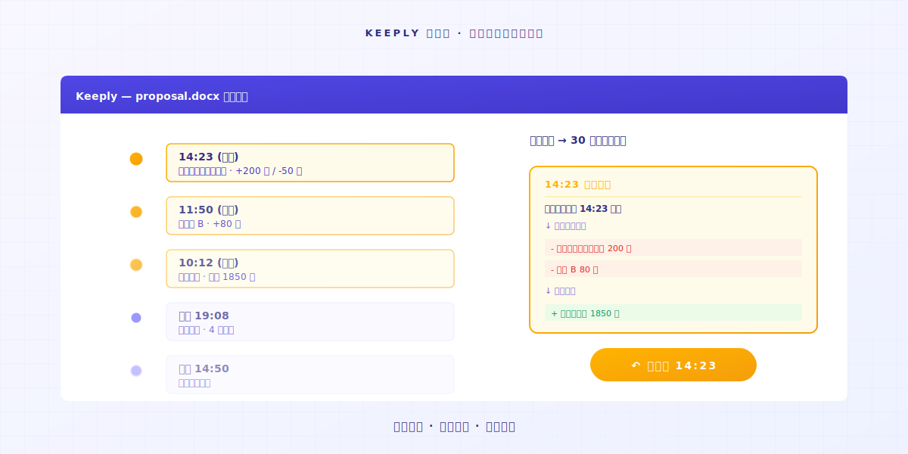

# Wat slaat Keeply eigenlijk op? Hoe het verschilt van back-up- en cloudtools

> Back-uptools dekken de hele schijf. Cloudtools dekken de meest recente kopie. Keeply dekt de geschiedenis van elke wijziging. Drie verschillende taken.

## Inhoud

1. [Wat slaat Keeply op?](#what-keeply-saves)
2. [Wat slaan back-uptools op?](#what-backup-saves)
3. [Wat slaan cloudtools op?](#what-cloud-saves)
4. [Hoeveel heb je er nodig?](#how-many-do-you-need)

---

Engineer A is net klaar met het installeren van Keeply. Zijn collega B loopt langs en vraagt: „Hoe verschilt dit van de Time Machine die bij mijn Mac zit?"

Engineer A bevriest. Hij weet dat het anders is, maar hij kan zijn vinger niet leggen op waar.

Hier is het verschil: **back-up, cloud en Keeply zijn drie verschillende taken**. Hun werk overlapt niet, daarom hebben ze drie verschillende namen.

---

## Wat slaat Keeply op? {#what-keeply-saves}

Keeply slaat **elke wijziging aan elk bestand** op.

Je bewerkt `proposal.docx` vandaag twee keer, je slaat het twee keer op. De Timeline toont twee file notes. Wil je terug naar de versie van je eerste save? Klik op die vermelding. 30 seconden en je bent er.

Het slaat niet de Google Doc van iemand anders op. Het slaat niet de app-instellingen van je computer op. Het slaat alleen op **hoe elk bestand op je computer in de loop van de tijd verandert**.

Als je behoefte is „ik wil terug naar de versie vóór de aanpassingen van donderdag", is dit zijn taak.

---

## Wat slaan back-uptools op? {#what-backup-saves}

Tools zoals Time Machine, Acronis True Image en Backblaze slaan **een momentopname van de hele schijf op een bepaald moment** op.

Hun taak is niet één bestand redden. Ze slaan op **hoe je hele computer er die dag uitzag**. OS, apps, instellingen, elke map, allemaal samen.

Als je harde schijf sterft of je hele computer kwijt is, kan een back-up alles herstellen. **Dat is de echte reden dat ze bestaan**.

Maar als je alleen de versie van `proposal.docx` van vóór de aanpassing van donderdag 10:23 wilt vinden, kan een back-up dat doen, maar je moet eerst de hele momentopname herstellen om dat ene bestand eruit te halen. **Dat is niet het probleem waar het voor ontworpen is**.

---

## Wat slaan cloudtools op? {#what-cloud-saves}

Tools zoals Dropbox, iCloud, OneDrive en Google Drive slaan **de meest recente versie van een bestand op, plus cross-device synchronisatie**.

Je bewerkt een bestand op Computer A, Computer B haalt automatisch de meest recente kopie op. **Hun taak is „de meest recente kopie" naar al je apparaten te synchroniseren**.

Ze hebben wel versiegeschiedenis. Maar ze houden meestal **alleen 30 dagen** — Dropbox' standaardplan, Google Drive en OneDrive volgen allemaal deze regel. Daarna is hij weg.

Als je behoefte is „ik wil de meest recente kopie op elke computer die ik gebruik", dat is hun taak. Maar voor de versie van 3 maanden geleden heeft de cloud die meestal niet meer.

---

## Hoeveel heb je er nodig? {#how-many-do-you-need}

| Jouw scenario | Hoofdtool |
|---|---|
| Een oude versie van een bestand willen herstellen | **Keeply** (Timeline, klik en herstel) |
| Hele computer kapot, data herstellen nodig | **Back-uptools** (Time Machine / Acronis / Backblaze) |
| De meest recente versie synchroniseren tussen meerdere apparaten | **Cloud** (Dropbox / iCloud / OneDrive) |

In de praktijk is **alle drie gebruiken de meest complete opzet**.

Keeply dekt de geschiedenis-tijdlijn van elk bestand. Back-up dekt de momentopname van de hele computer. Cloud dekt cross-device synchronisatie. Drie taken die elkaar aanvullen, niet tegen elkaar concurreren.

Als je er maar één kunt kiezen, **kijk naar welk scenario je het vaakst tegenkomt**: wil je vaak oude versies vinden? Keeply. Maak je je zorgen over een dode schijf? Back-up. Werk je tussen meerdere computers? Cloud.

---

## Afsluiten

Terug naar wat Engineer A tegen collega B zegt:

„Het verschilt van Time Machine. Time Machine dekt de momentopname van de hele computer. Keeply dekt de geschiedenis-tijdlijn van elk bestand. **Ik gebruik beide.**"

Als jij ook Keeply wilt proberen voor die geschiedenis-tijdlijn, sleep een map in [Keeply](https://keeply.work/). De rest onthoudt het zelf.

---

## Verder lezen

- [Hoe je Keeply gebruikt, de file-note app: 2 acties, geen 30-functie curriculum](/nl/post/keeply-getting-started-from-zero/) (PILLAR 3, complete Keeply-onboardinggids)
- [De complete gids voor bestandsversiebeheer](/nl/post/file-version-management-complete-guide/) (PILLAR 1, waarom versiebeheer ertoe doet)

---

*Auteur: Ting-Wei Tsao, oprichter van Keeply | [LinkedIn](https://www.linkedin.com/in/tingwei-tsao/)*
